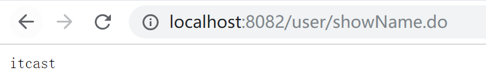
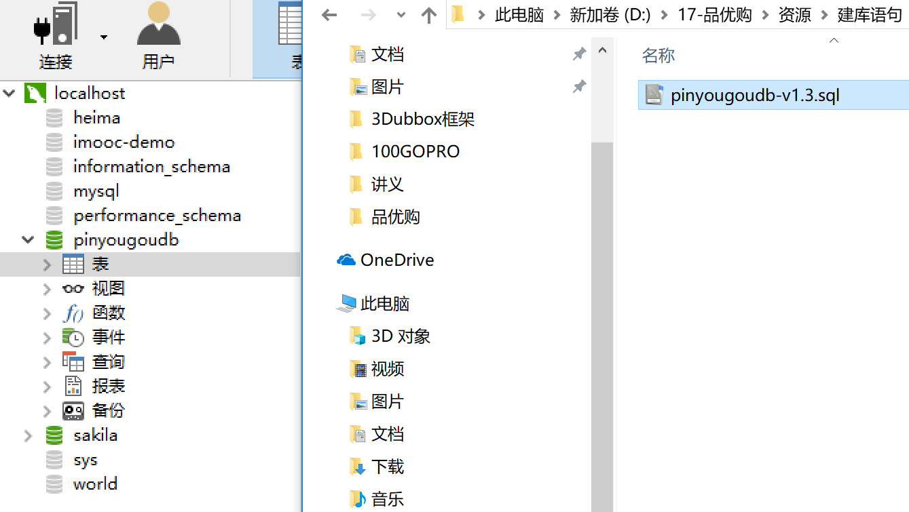
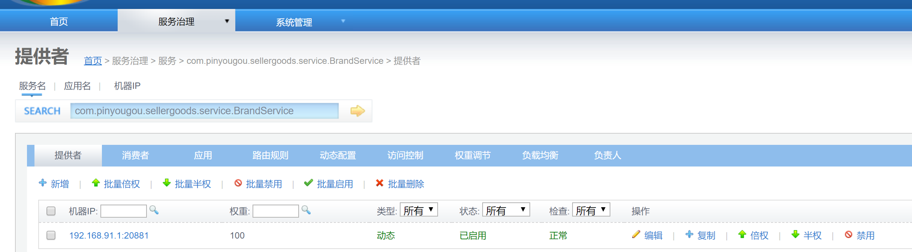

# Day 1

## Zookeeper 安装前准备


双击VMX启动虚拟机


编辑网络设置


仅主机，改成25网段。


编辑虚拟机设置


网络适配器->改为仅主机


启动虚拟机

账号root密码itcast


IP地址


## 安装Zookeeper

1. 安装JDK，镜像本身有

2. 将zookeeper-3.4.6.tar.gz传到Linux系统

   用MobaXterm连接服务器
   

3. zookeeper-3.4.6.tar.gz复制到/soft/下面
   

4. 解压
   

5. 进入zookeeper-3.4.6

6. 创建data目录用来存放数据
   

7. 进入conf，给zoo_sample.cfg改名

   

8. vim zoo.cfg。esc退出插入模式。:wq保存。
   

9. 启动。查看状态。停止。

   

10. 虚拟机挂起。zookeeper启动状态下，下次启动虚拟机就不用重新启动zookeeper。

11. zookeeper结束

## Dubbox

### 配置dubbo离线约束


## dubbo提供消費项目Demo

### 1.服务提供者

创建一个maven工程


pom.xml

```xml
<project xmlns="http://maven.apache.org/POM/4.0.0" xmlns:xsi="http://www.w3.org/2001/XMLSchema-instance" xsi:schemaLocation="http://maven.apache.org/POM/4.0.0 http://maven.apache.org/xsd/maven-4.0.0.xsd">
    <modelVersion>4.0.0</modelVersion>
    <groupId>cn.itcast.dubboxdemo</groupId>
    <artifactId>dubboxdemo-service</artifactId>
    <version>0.0.1-SNAPSHOT</version>
    <packaging>war</packaging>
    <properties>
        <spring.version>4.2.4.RELEASE</spring.version>
    </properties>
    <dependencies>
        <!-- Spring -->
        <dependency>
            <groupId>org.springframework</groupId>
            <artifactId>spring-context</artifactId>
            <version>${spring.version}</version>
        </dependency>
        <dependency>
            <groupId>org.springframework</groupId>
            <artifactId>spring-beans</artifactId>
            <version>${spring.version}</version>
        </dependency>
        <dependency>
            <groupId>org.springframework</groupId>
            <artifactId>spring-webmvc</artifactId>
            <version>${spring.version}</version>
        </dependency>
        <dependency>
            <groupId>org.springframework</groupId>
            <artifactId>spring-jdbc</artifactId>
            <version>${spring.version}</version>
        </dependency>
        <dependency>
            <groupId>org.springframework</groupId>
            <artifactId>spring-aspects</artifactId>
            <version>${spring.version}</version>
        </dependency>
        <dependency>
            <groupId>org.springframework</groupId>
            <artifactId>spring-jms</artifactId>
            <version>${spring.version}</version>
        </dependency>
        <dependency>
            <groupId>org.springframework</groupId>
            <artifactId>spring-context-support</artifactId>
            <version>${spring.version}</version>
        </dependency>
        <!-- dubbo相关 -->
        <dependency>
            <groupId>com.alibaba</groupId>
            <artifactId>dubbo</artifactId>
            <version>2.8.4</version>
        </dependency>
        <dependency>
            <groupId>org.apache.zookeeper</groupId>
            <artifactId>zookeeper</artifactId>
            <version>3.4.6</version>
        </dependency>
        <dependency>
            <groupId>com.github.sgroschupf</groupId>
            <artifactId>zkclient</artifactId>
            <version>0.1</version>
        </dependency>
        <dependency>
            <groupId>javassist</groupId>
            <artifactId>javassist</artifactId>
            <version>3.11.0.GA</version>
        </dependency>
    </dependencies>
    <build>
        <plugins>
            <plugin>
                <groupId>org.apache.maven.plugins</groupId>
                <artifactId>maven-compiler-plugin</artifactId>
                <version>2.3.2</version>
                <configuration>
                    <source>1.7</source>
                    <target>1.7</target>
                </configuration>
            </plugin>
            <plugin>
                <groupId>org.apache.tomcat.maven</groupId>
                <artifactId>tomcat7-maven-plugin</artifactId>
                <configuration>
                    <!-- 指定端口 -->
                    <port>8081</port>
                    <!-- 请求路径 -->
                    <path>/</path>
                </configuration>
            </plugin>
        </plugins>
    </build>
</project>

```

应用环境.xml

```xml
<?xml version="1.0" encoding="UTF-8"?>
<beans xmlns="http://www.springframework.org/schema/beans"
	   xmlns:xsi="http://www.w3.org/2001/XMLSchema-instance" xmlns:p="http://www.springframework.org/schema/p"
	   xmlns:context="http://www.springframework.org/schema/context"
	   xmlns:dubbo="http://code.alibabatech.com/schema/dubbo" xmlns:mvc="http://www.springframework.org/schema/mvc"
	   xsi:schemaLocation="http://www.springframework.org/schema/beans http://www.springframework.org/schema/beans/spring-beans.xsd
        http://www.springframework.org/schema/mvc http://www.springframework.org/schema/mvc/spring-mvc.xsd
        http://code.alibabatech.com/schema/dubbo http://code.alibabatech.com/schema/dubbo/dubbo.xsd
        http://www.springframework.org/schema/context http://www.springframework.org/schema/context/spring-context.xsd">

	<dubbo:application name="dubboxdemo-service"/>
	<dubbo:registry address="zookeeper://192.168.25.129:2181"/>
	<dubbo:annotation package="cn.itcast.dubbodemo.service" />
</beans>
```

web.xml

```xml
<?xml version="1.0" encoding="UTF-8"?>
<web-app xmlns:xsi="http://www.w3.org/2001/XMLSchema-instance"
         xmlns="http://java.sun.com/xml/ns/javaee"
         xsi:schemaLocation="http://java.sun.com/xml/ns/javaee http://java.sun.com/xml/ns/javaee/web-app_2_5.xsd"
         version="2.5">

    <!-- 加载spring容器 -->
    <context-param>
        <param-name>contextConfigLocation</param-name>
        <param-value>classpath:applicationContext*.xml</param-value>
    </context-param>
    <listener>
        <listener-class>org.springframework.web.context.ContextLoaderListener</listener-class>
    </listener>
</web-app>
```

接口

```java
package cn.itcast.dubbodemo.service;
/**
 * 业务接口
 * @author Administrator
 *
 */
public interface UserService {
	public String getName();
}
```

接口实现

```java
package cn.itcast.dubbodemo.service.impl;
import com.alibaba.dubbo.config.annotation.Service;
import cn.itcast.dubbodemo.service.UserService;

@Service
public class UserServiceImpl implements UserService {
	@Override
	public String getName() {
		return "itcast";
	}
}
```

### 2.服务消费者


pom.xml

```xml
<project xmlns="http://maven.apache.org/POM/4.0.0" xmlns:xsi="http://www.w3.org/2001/XMLSchema-instance" xsi:schemaLocation="http://maven.apache.org/POM/4.0.0 http://maven.apache.org/xsd/maven-4.0.0.xsd">
    <modelVersion>4.0.0</modelVersion>
    <groupId>cn.itcast.dubboxdemo</groupId>
    <artifactId>dubboxdemo-web</artifactId>
    <version>0.0.1-SNAPSHOT</version>
    <packaging>war</packaging>
    <properties>
        <spring.version>4.2.4.RELEASE</spring.version>
    </properties>
    <dependencies>
        <!-- Spring -->
        <dependency>
            <groupId>org.springframework</groupId>
            <artifactId>spring-context</artifactId>
            <version>${spring.version}</version>
        </dependency>
        <dependency>
            <groupId>org.springframework</groupId>
            <artifactId>spring-beans</artifactId>
            <version>${spring.version}</version>
        </dependency>
        <dependency>
            <groupId>org.springframework</groupId>
            <artifactId>spring-webmvc</artifactId>
            <version>${spring.version}</version>
        </dependency>
        <dependency>
            <groupId>org.springframework</groupId>
            <artifactId>spring-jdbc</artifactId>
            <version>${spring.version}</version>
        </dependency>
        <dependency>
            <groupId>org.springframework</groupId>
            <artifactId>spring-aspects</artifactId>
            <version>${spring.version}</version>
        </dependency>
        <dependency>
            <groupId>org.springframework</groupId>
            <artifactId>spring-jms</artifactId>
            <version>${spring.version}</version>
        </dependency>
        <dependency>
            <groupId>org.springframework</groupId>
            <artifactId>spring-context-support</artifactId>
            <version>${spring.version}</version>
        </dependency>
        <!-- dubbo相关 -->
        <dependency>
            <groupId>com.alibaba</groupId>
            <artifactId>dubbo</artifactId>
            <version>2.8.4</version>
        </dependency>
        <dependency>
            <groupId>org.apache.zookeeper</groupId>
            <artifactId>zookeeper</artifactId>
            <version>3.4.6</version>
        </dependency>
        <dependency>
            <groupId>com.github.sgroschupf</groupId>
            <artifactId>zkclient</artifactId>
            <version>0.1</version>
        </dependency>
        <dependency>
            <groupId>javassist</groupId>
            <artifactId>javassist</artifactId>
            <version>3.11.0.GA</version>
        </dependency>
    </dependencies>
    <build>
        <plugins>
            <plugin>
                <groupId>org.apache.maven.plugins</groupId>
                <artifactId>maven-compiler-plugin</artifactId>
                <version>2.3.2</version>
                <configuration>
                    <source>1.7</source>
                    <target>1.7</target>
                </configuration>
            </plugin>
            <plugin>
                <groupId>org.apache.tomcat.maven</groupId>
                <artifactId>tomcat7-maven-plugin</artifactId>
                <configuration>
                    <!-- 指定端口 -->
                    <port>8082</port>
                    <!-- 请求路径 -->
                    <path>/</path>
                </configuration>
            </plugin>
        </plugins>
    </build>
</project>

```

应用环境.xml

```xml
<?xml version="1.0" encoding="UTF-8"?>
<beans xmlns="http://www.springframework.org/schema/beans"
       xmlns:xsi="http://www.w3.org/2001/XMLSchema-instance" xmlns:p="http://www.springframework.org/schema/p"
       xmlns:context="http://www.springframework.org/schema/context"
       xmlns:dubbo="http://code.alibabatech.com/schema/dubbo" xmlns:mvc="http://www.springframework.org/schema/mvc"
       xsi:schemaLocation="http://www.springframework.org/schema/beans http://www.springframework.org/schema/beans/spring-beans.xsd
        http://www.springframework.org/schema/mvc http://www.springframework.org/schema/mvc/spring-mvc.xsd
        http://code.alibabatech.com/schema/dubbo http://code.alibabatech.com/schema/dubbo/dubbo.xsd
        http://www.springframework.org/schema/context http://www.springframework.org/schema/context/spring-context.xsd">

    <mvc:annotation-driven >
        <mvc:message-converters register-defaults="false">
            <bean class="org.springframework.http.converter.StringHttpMessageConverter">
                <constructor-arg value="UTF-8" />
            </bean>
        </mvc:message-converters>
    </mvc:annotation-driven>
    <!-- 引用dubbo 服务 -->
    <dubbo:application name="dubboxdemo-web" />
    <dubbo:registry address="zookeeper://192.168.25.129:2181"/>
    <dubbo:annotation package="cn.itcast.dubboxdemo.controller" />
</beans>

```

web.xml

```xml
<?xml version="1.0" encoding="UTF-8"?>
<web-app xmlns:xsi="http://www.w3.org/2001/XMLSchema-instance"
         xmlns="http://java.sun.com/xml/ns/javaee"
         xsi:schemaLocation="http://java.sun.com/xml/ns/javaee http://java.sun.com/xml/ns/javaee/web-app_2_5.xsd"
         version="2.5">
    <!-- 解决post乱码 -->
    <filter>
        <filter-name>CharacterEncodingFilter</filter-name>
        <filter-class>org.springframework.web.filter.CharacterEncodingFilter</filter-class>
        <init-param>
            <param-name>encoding</param-name>
            <param-value>utf-8</param-value>
        </init-param>
        <init-param>
            <param-name>forceEncoding</param-name>
            <param-value>true</param-value>
        </init-param>
    </filter>
    <filter-mapping>
        <filter-name>CharacterEncodingFilter</filter-name>
        <url-pattern>/*</url-pattern>
    </filter-mapping>
    <servlet>
        <servlet-name>springmvc</servlet-name>
        <servlet-class>org.springframework.web.servlet.DispatcherServlet</servlet-class>
        <!-- 指定加载的配置文件 ，通过参数contextConfigLocation加载-->
        <init-param>
            <param-name>contextConfigLocation</param-name>
            <param-value>classpath:applicationContext-web.xml</param-value>
        </init-param>
    </servlet>
    <servlet-mapping>
        <servlet-name>springmvc</servlet-name>
        <url-pattern>*.do</url-pattern>
    </servlet-mapping>
</web-app>

```

接口

```java
package cn.itcast.dubbodemo.service;
/**
 * 业务接口
 * @author Administrator
 *
 */
public interface UserService {	
	public String getName();	
}
```

接口实现

```java
package cn.itcast.dubboxdemo.controller;

import cn.itcast.dubbodemo.service.UserService;
import com.alibaba.dubbo.config.annotation.Reference;
import org.springframework.stereotype.Controller;
import org.springframework.web.bind.annotation.RequestMapping;
import org.springframework.web.bind.annotation.ResponseBody;

@Controller
@RequestMapping("/user")
public class UserController {

    @Reference
    private UserService userService;

    @RequestMapping("/showName")
    @ResponseBody
    public String showName(){
        return userService.getName();
    }
}
```

### 3.测试

启动zookeeper

启动两个项目

访问http://localhost:8082/user/showName.do



### 4.安装监控

下载

https://github.com/dangdangdotcom/dubbox


解压。


在dubbo-admin里打开命令行

输入： mvn package 

重命名生成的dubbo-admin-2.8.4.war为dubbo.admin.war


上传


解压tar -zxvf apache-tomcat-7.0.52.tar.gz

将dubbo-admin.war复制到`/soft/apache-tomcat-7.0.52/webapps/`


启动tomcat


访问

http://192.168.25.129:8080/dubbo-admin/

输入root密码root

查看服务提供者

## 项目搭建

导入数据库，将pinyougoudb-v1.3.sql拖到表



## 项目搭建后雏形

先搭建root，后搭建其他module


root包install时失败，在要打的war中pom包添加依赖

```xml
<plugin>
    <groupId>org.apache.maven.plugins</groupId>
    <artifactId>maven-war-plugin</artifactId>
    <configuration>
        <webXml>src\main\webapp\WEB-INF\web.xml</webXml>
    </configuration>
</plugin>
```

整个项目构建非常机械重复。不细说了。构建的项目放在了github上

https://github.com/woshiamiaojiang/projects/tree/master/%E5%93%81%E4%BC%98%E8%B4%AD%E6%90%AD%E5%BB%BA/%E9%A1%B9%E7%9B%AE%E9%9B%8F%E5%BD%A2/pinyougou-parent

使用反向工程添加POJO，Mapper与Mapper实现

反向工具类

https://github.com/woshiamiaojiang/projects/tree/master/%E5%8F%8D%E5%90%91%E5%B7%A5%E7%A8%8B%E5%B7%A5%E5%85%B7%E7%B1%BB/generatorSqlmapCustom

继承了POJO与Mapper的项目原型

https://github.com/woshiamiaojiang/projects/tree/master/%E5%93%81%E4%BC%98%E8%B4%AD%E6%90%AD%E5%BB%BA/%E6%B7%BB%E5%8A%A0%E4%BA%86POJO%E4%B8%8EMapper/pinyougou-parent


## 品牌列表后端代码


添加三个代码

```java
package com.pinyougou.manager.controller;

import com.alibaba.dubbo.config.annotation.Reference;
import com.pinyougou.pojo.TbBrand;
import com.pinyougou.sellergoods.service.BrandService;
import org.springframework.web.bind.annotation.RequestMapping;
import org.springframework.web.bind.annotation.RestController;

import java.util.List;

@RestController
@RequestMapping("/brand")
public class BrandController {

	@Reference
	private BrandService brandService;
	
	@RequestMapping("/findAll")
	public List<TbBrand> findAll(){
		return brandService.findAll();		
	}
	
}

```

```java
package com.pinyougou.sellergoods.service;

import com.pinyougou.pojo.TbBrand;

import java.util.List;

/**
 * 品牌接口
 * @author Administrator
 *
 */
public interface BrandService {

	public List<TbBrand> findAll();
	
}
```

```java
package com.pinyougou.sellergoods.service.impl;

import com.alibaba.dubbo.config.annotation.Service;
import com.pinyougou.mapper.TbBrandMapper;
import com.pinyougou.pojo.TbBrand;
import com.pinyougou.sellergoods.service.BrandService;
import org.springframework.beans.factory.annotation.Autowired;

import java.util.List;

@Service
public class BrandServiceImpl implements BrandService {

	@Autowired
	private TbBrandMapper brandMapper;
	
	@Override
	public List<TbBrand> findAll() {

		return brandMapper.selectByExample(null);
	}

}
```

### 测试

对项目root进行install。


重启服务器，结果ip变成了192.168.25.130

启动zookeeper与监控


启动dubbo-admin时失败。停止了tomcat，删除了dubbo-admin，重启tomcat。


访问http://192.168.25.130:8080/dubbo-admin/


启动pinyougou-sellergoods-service  

启动pinyougou-manager-web
 

地址栏输入http://localhost:9101/brand/findAll.do

查看服务注册

报了一个这个错误

```
org.springframework.web.util.NestedServletException: Request processing failed; nested exception is java.lang.RuntimeException: org.apache.ibatis.binding.BindingException: Invalid bound statement (not found): com.pinyougou.mapper.TbBrandMapper.selectByExample
org.apache.ibatis.binding.BindingException: Invalid bound statement (not found): com.pinyougou.mapper.TbBrandMapper.selectByExample
```

应该是dao层接口与实现失败。

犯的错误1：目录要一个一个新建

犯的错误2：要将mapper标为资源文件


重新打service与manager-web


结果正确

