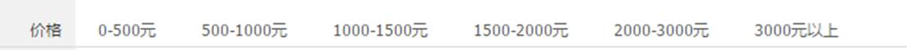
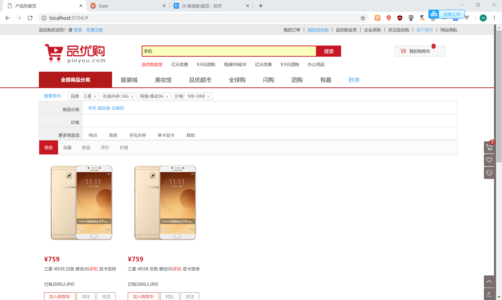
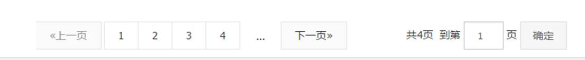
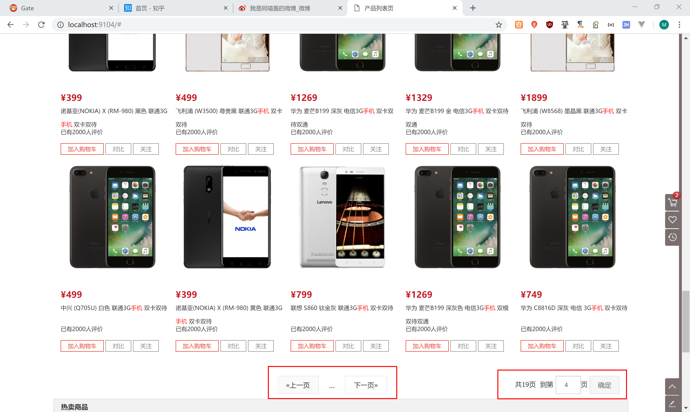
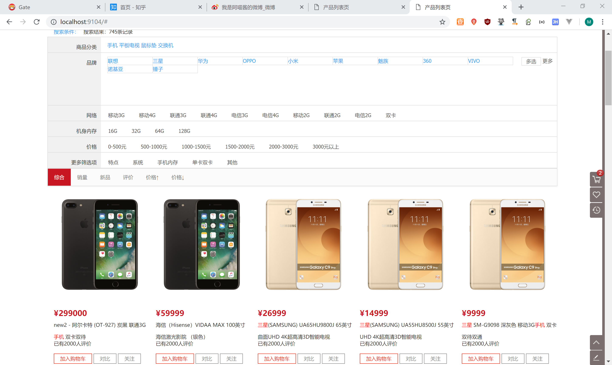
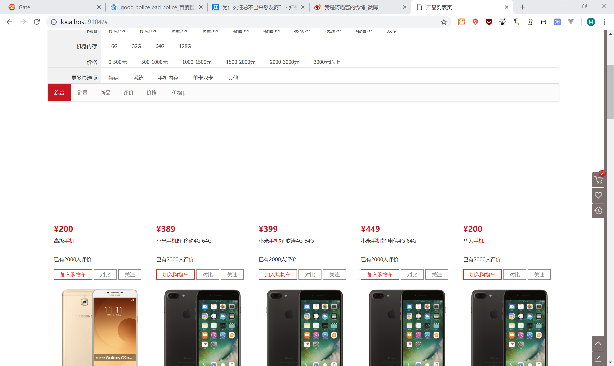
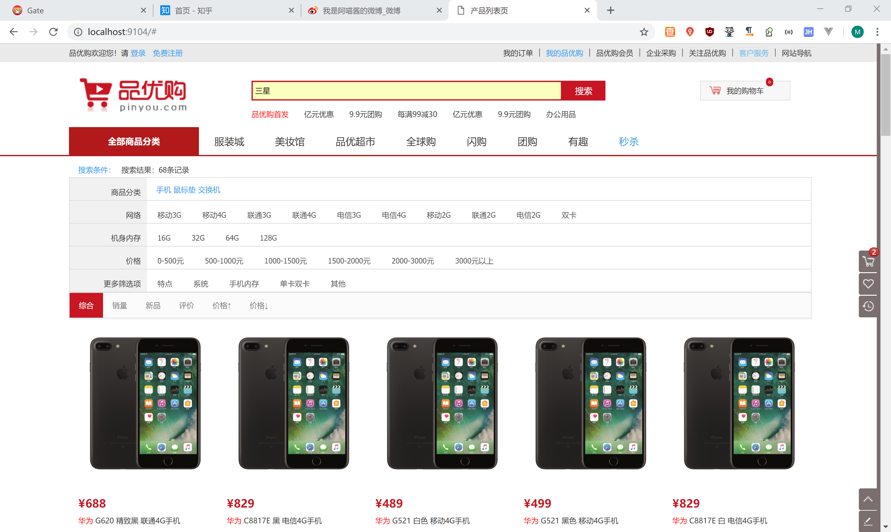
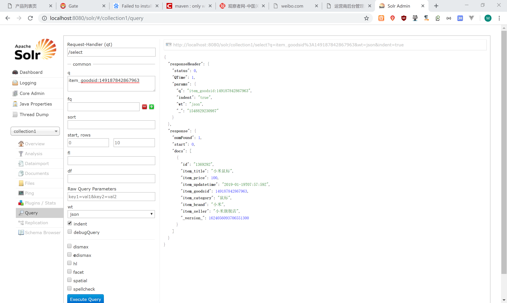
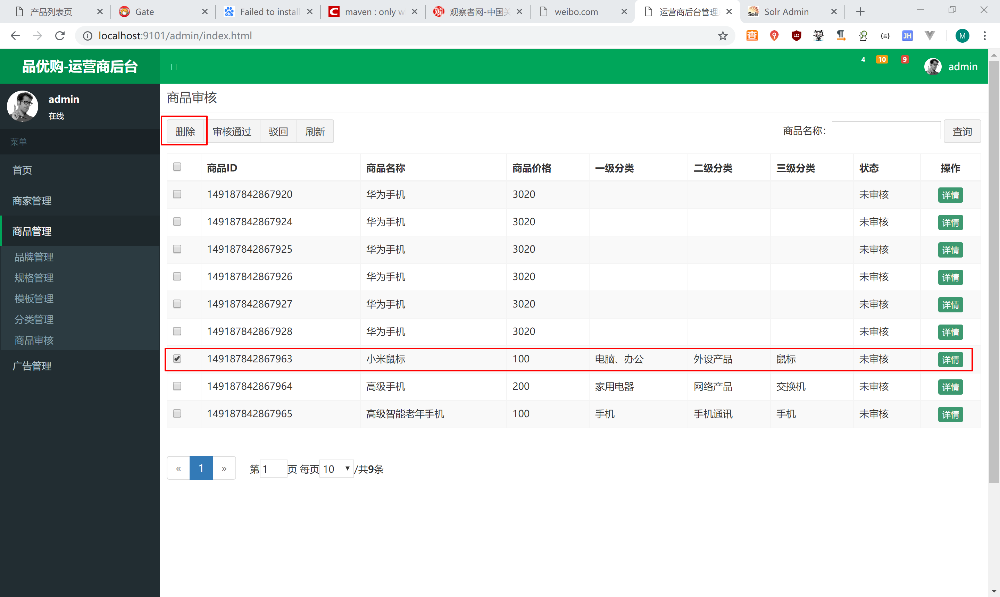
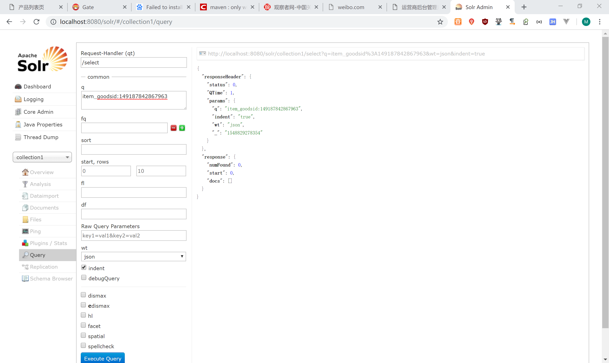

# 课程目标

目标1：实现品优购价格区间筛选功能

目标2：实现搜索结果分页功能

目标3：理解多关键字搜索

目标4：实现搜索结果排序功能

目标5：实现隐藏品牌列表功能

目标6：实现搜索页与首页对接功能

目标7：完成更新索引库的功能

# 1.按价格区间筛选

## 1.1需求分析

点击搜索面板上的价格区间，实现按价格筛选



## 1.2前端代码

### 1.2.1前端控制层

（1）修改pinyougou-search-web的searchController.js  搜索条件的定义

```js
$scope.searchMap={'keywords':'','category':'','brand':'','spec':{},'price':'' };//搜索条件封装对象
```

（1）修改pinyougou-search-web的searchController.js  添加搜索项和删除搜索项的方法

```js
//添加搜索项
$scope.addSearchItem=function(key,value){
    if(key=='category' || key=='brand' || key=='price'){//如果点击的是分类或品牌
        $scope.searchMap[key]=value;
    }else{//如果是规格
        $scope.searchMap.spec[key]=value;
    }
    $scope.search();
}
//移除复合搜索条件
$scope.removeSearchItem=function(key){
    if(key=="category" ||  key=="brand" || key=='price'){//如果是分类或品牌
        $scope.searchMap[key]="";
    }else{//否则是规格
        delete $scope.searchMap.spec[key];//移除此属性
    }
    $scope.search();
}
```

### 1.2.2页面

（1）修改页面search.html ,在标签上调用方法

```html
<div class="fl value">
   <ul class="type-list" ng-if="searchMap.price==''">
      <li>
         <a ng-click="addSearchItem('price','0-500')">0-500元</a>
      </li>
      <li>
         <a ng-click="addSearchItem('price','500-1000')">500-1000元</a>
      </li>
      <li>
         <a ng-click="addSearchItem('price','1000-1500')">1000-1500元</a>
      </li>
      <li>
         <a ng-click="addSearchItem('price','1500-2000')">1500-2000元</a>
      </li>
      <li>
         <a ng-click="addSearchItem('price','2000-3000')">2000-3000元 </a>
      </li>
      <li>
         <a ng-click="addSearchItem('price','3000-*')">3000元以上</a>
      </li>
   </ul>

</div>
```

（2）修改search.html，增加面包屑

```html
<li class="tag" ng-if="searchMap.price!=''" ng-click="removeSearchItem('price')">价格：{{searchMap.price}}<i  class="sui-icon icon-tb-close"></i></li>
```

## 1.3后端代码

修改pinyougou-search-service的ItemSearchServiceImpl.java

```java
//1.5按价格筛选.....
if(!"".equals(searchMap.get("price"))){
   String[] price = ((String) searchMap.get("price")).split("-");
   if(!price[0].equals("0")){//如果区间起点不等于0
      Criteria filterCriteria=new Criteria("item_price").greaterThanEqual(price[0]);
      FilterQuery filterQuery=new SimpleFilterQuery(filterCriteria);
      query.addFilterQuery(filterQuery);
   }
   if(!price[1].equals("*")){//如果区间终点不等于*
      Criteria filterCriteria=new  Criteria("item_price").lessThanEqual(price[1]);
      FilterQuery filterQuery=new SimpleFilterQuery(filterCriteria);
      query.addFilterQuery(filterQuery);
   }
}
```

测试



# 2.搜索结果分页

## 2.1需求分析

在上述功能基础上实现分页查询



## 2.2后端代码

修改pinyougou-search-service工程ItemSearchServiceImpl.java

```java
//1.6 分页查询     
Integer pageNo= (Integer) searchMap.get("pageNo");//提取页码
if(pageNo==null){
   pageNo=1;//默认第一页
}
Integer pageSize=(Integer) searchMap.get("pageSize");//每页记录数 
if(pageSize==null){
   pageSize=20;//默认20
}
query.setOffset((pageNo-1)*pageSize);//从第几条记录查询
query.setRows(pageSize);
```

## 2.3前端代码

### 2.3.1构建分页标签

需求：

（1）如果我们需要修改默认页码和每页记录数，可以修改searchController.js的searchMap，为搜索对象添加属性。

```js
$scope.searchMap={'keywords':'','category':'','brand':'','spec':{},'price':'', 'pageNo':1,'pageSize':40
};//搜索条件封装对象
```

（2）修改searchController.js 实现页码的构建 

```js
//构建分页标签(totalPages为总页数)
buildPageLabel=function(){
    $scope.pageLabel=[];//新增分页栏属性
    var maxPageNo= $scope.resultMap.totalPages;//得到最后页码
    var firstPage=1;//开始页码
    var lastPage=maxPageNo;//截止页码
    if($scope.resultMap.totalPages> 5){  //如果总页数大于5页,显示部分页码
        if($scope.searchMap.pageNo<=3){//如果当前页小于等于3
            lastPage=5; //前5页
        }else if( $scope.searchMap.pageNo>=lastPage-2  ){//如果当前页大于等于最大页码-2
            firstPage= maxPageNo-4;        //后5页
        }else{ //显示当前页为中心的5页
            firstPage=$scope.searchMap.pageNo-2;
            lastPage=$scope.searchMap.pageNo+2;
        }
    }
    //循环产生页码标签
    for(var i=firstPage;i<=lastPage;i++){
        $scope.pageLabel.push(i);
    }
}
```

（3）在查询后调用此方法

```js
//搜索
$scope.search=function(){
    searchService.search( $scope.searchMap ).success(
        function(response){
            $scope.resultMap=response;//搜索返回的结果
            buildPageLabel();//调用     
        }
    );
}
```

（4）修改search.html, 循环产生页码

```html
<ul>
   <li class="prev disabled">
      <a href="#">«上一页</a>
   </li>
   <li ng-repeat="p in pageLabel">
      <a href="#" >{{p}}</a>
   </li>

   <li class="next">
      <a href="#">下一页»</a>
   </li>
</ul>
<div><span>&nbsp;共{{resultMap.totalPages}}页&nbsp;</span>
```

（5）显示总条数

```html
<ul class="tags-choose">
   <li class="tag" ng-if="searchMap.category!=''" ng-click="removeSearchItem('category')">商品分类：{{searchMap.category}}<i class="sui-icon icon-tb-close"></i></li>
   <li class="tag" ng-if="searchMap.brand!=''" ng-click="removeSearchItem('brand')">品牌：{{searchMap.brand}}<i class="sui-icon icon-tb-close"></i></li>
   <li class="tag" ng-repeat="(key,value) in searchMap.spec" ng-click="removeSearchItem(key)">{{key}}:{{value}}<i class="sui-icon icon-tb-close"></i></li>
   <li class="tag" ng-if="searchMap.price!=''" ng-click="removeSearchItem('price')">价格：{{searchMap.price}}<i  class="sui-icon icon-tb-close"></i></li>
   搜索结果：{{resultMap.total}}条记录
</ul>
```

### 2.3.2提交页码查询

（1）在searchController.js增加方法，修改页码执行查询

```js
//根据页码查询
$scope.queryByPage=function(pageNo){
    //页码验证
    if(pageNo<1 || pageNo>$scope.resultMap.totalPages){
        return;
    }
    $scope.searchMap.pageNo=pageNo;
    $scope.search();
}
```

（2）修改页码调用方法

```html
<div class="sui-pagination pagination-large">
   <ul>
      <li class="prev">
         <a href="#" ng-click="queryByPage(searchMap.pageNo-1)">«</a>
      </li>
      <li ng-repeat="p in pageLabel">
         <a href="#" ng-click="queryByPage(p)">{{p}}</a>
      </li>
      <li class="next">
         <a href="#" ng-click="queryByPage(searchMap.pageNo+1)">»</a>
      </li>
   </ul>
   <div>
      <span>&nbsp;共{{resultMap.totalPages}}页&nbsp;</span>
      <span>  到第 <input type="text" class="page-num" ng-model="searchMap.pageNo">页
            <button class="page-confirm"  ng-click="queryByPage(searchMap.pageNo)" >确定</button></span>
   </div>
</div>
```

（3）修改search方法, 在执行查询前，转换为int类型，否则提交到后端有可能变成字符串

```js
//搜索
$scope.search=function(){
    $scope.searchMap.pageNo= parseInt($scope.searchMap.pageNo) ;
    searchService.search( $scope.searchMap ).success(
        function(response){
            $scope.resultMap=response;//搜索返回的结果
            buildPageLabel();//调用
        }
    );
}
```

### 2.3.3显示省略号

```js
//构建分页栏 
buildPageLabel=function(){
    //构建分页栏
    $scope.pageLabel=[];
    var firstPage=1;//开始页码
    var lastPage=$scope.resultMap.totalPages;//截止页码
    $scope.firstDot=true;//前面有点
    $scope.lastDot=true;//后边有点    
    if($scope.resultMap.totalPages>5){  //如果页码数量大于5          
        if($scope.searchMap.pageNo<=3){//如果当前页码小于等于3 ，显示前5页
            lastPage=5;
            $scope.firstDot=false;//前面没点
        }else if( $scope.searchMap.pageNo>= $scope.resultMap.totalPages-2 ){//显示后5页
            firstPage=$scope.resultMap.totalPages-4;
            $scope.lastDot=false;//后边没点
        }else{  //显示以当前页为中心的5页
            firstPage=$scope.searchMap.pageNo-2;
            lastPage=$scope.searchMap.pageNo+2;
        }
    }else{
        $scope.firstDot=false;//前面无点
        $scope.lastDot=false;//后边无点
    }
    //构建页码
    for(var i=firstPage;i<=lastPage;i++){
        $scope.pageLabel.push(i);
    }
}
```

修改页面 ：页码前的省略号

页码后的省略号

```html
<ul>
   <li class="prev">
      <a href="#" ng-click="queryByPage(searchMap.pageNo-1)">«</a>
   </li>
   <li class="dotted" ng-if="firstDot==true"><span>...</span></li>
   <li ng-repeat="p in pageLabel">
      <a href="#" ng-click="queryByPage(p)">{{p}}</a>
   </li>
   <li class="dotted" ng-if="lastDot==true"><span>...</span></li>
   <li class="next">
      <a href="#" ng-click="queryByPage(searchMap.pageNo+1)">»</a>
   </li>
</ul>
```

### 2.3.4页码不可用样式

修改searchController.js增加方法

```js
//判断当前页为第一页
$scope.isTopPage=function(){
    if($scope.searchMap.pageNo==1){
        return true;
    }else{
        return false;
    }
}

//判断当前页是否未最后一页
$scope.isEndPage=function(){
    if($scope.searchMap.pageNo==$scope.resultMap.totalPages){
        return true;
    }else{
        return false;
    }
}
```

（2）修改页面

```html
<ul>
   <li class="prev {{isTopPage()?'disabled':''}}">
      <a href="#" ng-click="queryByPage(searchMap.pageNo-1)">«上一页</a>
   </li>
   <li ng-repeat="p in resultMap.pageLabel">
      <a href="#" ng-click="queryByPage(p)">{{p}}</a>
   </li>
   <li class="dotted"><span>...</span></li>
   <li class="next {{isEndPage()?'disabled':''}}">
      <a href="#" ng-click="queryByPage(searchMap.pageNo+1)">下一页»</a>
   </li>
</ul>
```

### 2.3.5搜索起始页码处理

测试：如果我们先按照“手机”关键字进行搜索，得出的页数是19页，然后我们点击第18页进行查询，然后我们再根据“三星”关键字搜索，会发现没有结果显示。是因为当前页仍然为18，而三星的结果只有4页，所以无法显示。我们需要在每次点击查询时将页码设置为1 。

修改搜索按钮，调用搜索前将起始页码设置为1

```html
<button class="sui-btn btn-xlarge btn-danger" ng-click="searchMap.pageNo=1;search()" type="button">搜索</button>                       </div>
```

测试



# 3.多关键字搜索

## 3.1多关键字搜索规则

我们之前测试都是使用单一的词（比如手机）来进行搜索，如果我们输入的关键字是一个复合的词组（比如三星手机），那solr如何进行搜索呢？

经过测试：

我搜索“三星”是148条记录

我搜索“手机”是727条记录

我搜索“三星手机”是740条记录

经过查看，发现结果中也包含了关键字只有三星和手机的记录，由此得出结论，solr在搜索时是将搜索关键字进行分词，然后按照或的关系来进行搜索的。

你现在可能要说，为什么不是并的关系而是或的关系呢？如果你是电商网站的运营者，肯定希望给用户更多的选择，因为如果采用并的关系来进行搜索时极有可能查询到很少的记录甚至查询不到任何记录。 另外这里还有他智能的排序策略，就是按照关键字匹配度来进行排序，也就是说如果记录中同时包含了三星和手机，那么这部分数据会排列在前面显示，而只包含三星和只包含手机的记录会显示在后边。

## 3.2多关键字搜索空格处理

有些用户会在关键字中间习惯性的输入一些空格，而这个空格输入后，很有可能查询不到结果了。我们测试输入“三星 手机”结果并没有查询到任何结果。所以我们还要对空格至于做一下处理，删除关键字中的空格

修改pinyougou-search-service的ItemSearchServiceImpl.java

```java
//空格处理
String keywords= (String)searchMap.get("keywords");
searchMap.put("keywords", keywords.replace(" ", ""));//关键字去掉空格
```

# 4.排序

## 4.1按价格排序

实现价格的排序（升降序可切换）


### 4.1.1后端代码

修改pinyougou-search-service的ItemSearchServiceImpl.java  添加排序的代码

```java
//1.7 排序

String sortValue= (String)searchMap.get("sort");//升序ASC 降序DESC
String sortField=  (String)searchMap.get("sortField");//排序字段

if(sortValue!=null && !sortValue.equals("")){

   if(sortValue.equals("ASC")){
      Sort sort=new Sort(Sort.Direction.ASC, "item_"+sortField);
      query.addSort(sort);
   }
   if(sortValue.equals("DESC")){
      Sort sort=new Sort(Sort.Direction.DESC, "item_"+sortField);
      query.addSort(sort);
   }
}
```

### 4.1.2前端代码

（1）修改searchController.js的searchMap,  增加排序

```js
$scope.searchMap={'keywords':'','category':'','brand':'','spec':{},'price':'', 'pageNo':1,'pageSize':40,'sortField':'','sort':''};//搜索条件封装对象
```

（2）修改searchController.js  ，增加方法实现查询

```js
//设置排序规则
$scope.sortSearch=function(sortField,sort){
    $scope.searchMap.sortField=sortField;
    $scope.searchMap.sort=sort;
    $scope.search();
}
```

（3）修改页面search.html 

```html
<li class="active">
   <a href="#" ng-click="sortSearch('','')">综合</a>
</li>

<li>
    <a href="#" ng-click="sortSearch('price','ASC')">价格↑</a>
</li>
<li>
    <a href="#" ng-click="sortSearch('price','DESC')">价格↓</a>
</li>
```

测试



## 4.2按上架时间排序


### 4.2.1增加域定义

修改solrhome的schema.xml 添加域定义

```xml
<field name="item_updatetime" type="date" indexed="true" stored="true" />
```

### 4.2.2修改实体类

为updatetime属性添加注解

```java
@Field("item_updatetime")
private Date updateTime;
```

### 4.2.3重新运行导入程序

重新启动solr 

安装pinyougou-pojo

重新运行pinyougou-solr-util

### 4.2.4修改页面

修改search.html 

```html
<li>
   <a href="#" ng-click="sortSearch('updatetime','DESC')">新品</a>
</li>
```

测试



## 4.3按销量排序（实现思路）

（1）增加域item_salecount 用于存储每个SKU的销量数据

（2）编写定时器程序，用于更新每个SKU的销量数据（查询近1个月的销量数据，不是累计数据）

（3）定时器每天只需执行一次，可以设定为凌晨开始执行。

定时器可以使用spring task技术来实现，学员们自行百度。

## 4.4按评价排序（实现思路）

与按销量排序思路基本相同，有一个细节需要注意：

评论分为好评、中评、差评，我们不能简单地将评论数相加，而是应该根据每种评论加权进行统计。比如好评的权重是3 ，中评的权重是1，而差评的权重是 -3，这样得出的是评价的综合得分。

# 5.隐藏品牌列表

## 5.1需求分析

需求：如果用户输入的是品牌的关键字，则隐藏品牌列表

## 5.2代码实现

（1）修改searchController.js

```js
//判断关键字是不是品牌
$scope.keywordsIsBrand=function(){
    for(var i=0;i<$scope.resultMap.brandList.length;i++){
        if($scope.searchMap.keywords.indexOf($scope.resultMap.brandList[i].text)>=0){//如果包含
            return true;
        }
    }
    return false;
}
```

（2）修改页面

```html
<div class="type-wrap logo" ng-if="resultMap.brandList!=null && searchMap.brand=='' && keywordsIsBrand()==false ">
```

测试



# 6.搜索页与首页对接

## 6.1需求分析

用户在首页的搜索框输入关键字，点击搜索后自动跳转到搜索页查询

## 6.2代码实现

### 6.2.1首页传递关键字

修改pinyougou-portal-web的contentController.js

```js
//搜索跳转
$scope.search=function(){
    location.href="http://localhost:9104/search.html#?keywords="+$scope.keywords;
}
```

修改pinyougou-portal-web的index.html

```html
<div class="input-append">
   <input type="text" id="autocomplete" type="text" ng-model="keywords" class="input-error input-xxlarge" />
   <button class="sui-btn btn-xlarge btn-danger" ng-click="search()" type="button">搜索</button>
</div>
```

### 6.2.2搜索页接收关键字

修改pinyougou-search-web的searchController.js

添加location服务用于接收参数

```js
app.controller('searchController',function($scope,$location,searchService){
```

接收参数并进行查询

```js
//加载查询字符串
$scope.loadkeywords=function(){
    $scope.searchMap.keywords=  $location.search()['keywords'];
    $scope.search();
}
```

search.html

```html
<body ng-app="pinyougou" ng-controller="searchController" ng-init="loadkeywords()">
```

测试


# 7.更新索引库

## 7.1需求分析

在进行商品审核后更新到solr索引库,在商品删除后删除solr索引库中相应的记录.

## 7.2查询审核商品（SKU）列表

### 7.2.1服务接口层

修改pinyougou-sellergoods-interface的GoodsService.java，新增方法

```java
/**
 * 根据商品ID和状态查询Item表信息
 * @param goodsId
 * @param status
 * @return
 */
public List<TbItem> findItemListByGoodsIdandStatus(Long[] goodsIds, String status );
```

### 7.2.2服务实现层

修改 pinyougou-sellergoods-service工程GoodsServiceImpl.java  

```java
@Override
public List<TbItem> findItemListByGoodsIdandStatus(Long[] goodsIds, String status) {
   TbItemExample example=new TbItemExample();
   com.pinyougou.pojo.TbItemExample.Criteria criteria = example.createCriteria();
   criteria.andGoodsIdIn(Arrays.asList(goodsIds));
   criteria.andStatusEqualTo(status);
   return itemMapper.selectByExample(example);
}
```

## 7.3更新到索引库

### 7.3.1服务接口层

修改pinyougou-search-interface的ItemSearchService.java 

```java
/**
 * 导入列表
 * @param list
 */
public void importList(List list);
```

### 7.3.2服务实现层

修改pinyougou-search-service的ItemSearchServiceImpl.java

```java
@Override
public void importList(List list) {
   solrTemplate.saveBeans(list);
   solrTemplate.commit();
}
```

### 7.3.3控制层

（1）pinyougou-manager-web工程引入依赖pinyougou-search-interface

（2）修改pinyougou-manager-web工程的GoodsController.java 

```java
@Reference
private ItemSearchService itemSearchService;

@RequestMapping("/updateStatus")
public Result updateStatus(Long[] ids,String status){
   try {
      goodsService.updateStatus(ids, status);
      //按照SPU ID查询 SKU列表(状态为1)      
      if(status.equals("1")){//审核通过
         List<TbItem> itemList = goodsService.findItemListByGoodsIdandStatus(ids, status);
         //调用搜索接口实现数据批量导入
         if(itemList.size()>0){
            itemSearchService.importList(itemList);
         }else{
            System.out.println("没有明细数据");
         }
      }
      return new Result(true, "修改状态成功");
   } catch (Exception e) {
      e.printStackTrace();
      return new Result(false, "修改状态失败");
   }
}
```

## 7.4商品删除同步索引数据

### 7.4.1服务接口层

修改pinyougou-search-interface的ItemSearchService.java 

```java
/**
 * 删除商品列表
 * @param goodsIds  (SPU)
 */
public void deleteByGoodsIds(List goodsIds);
```

### 7.4.2服务实现层

```java
@Override
public void deleteByGoodsIds(List goodsIds) {

   Query query=new SimpleQuery("*:*");
   Criteria criteria=new Criteria("item_goodsid").in(goodsIds);
   query.addCriteria(criteria);
   solrTemplate.delete(query);
   solrTemplate.commit();
}
```

### 7.4.3控制层

修改pinyougou-manager-web的GoodsController.java

```java
/**
 * 批量删除
 * @param ids
 * @return
 */
@RequestMapping("/delete")
public Result delete(Long [] ids){
   try {
      goodsService.delete(ids);
      itemSearchService.deleteByGoodsIds(Arrays.asList(ids));
      return new Result(true, "删除成功");
   } catch (Exception e) {
      e.printStackTrace();
      return new Result(false, "删除失败");
   }
}
```

测试


测试删除







