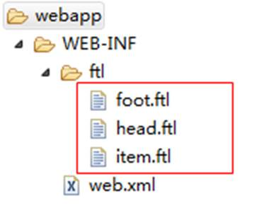
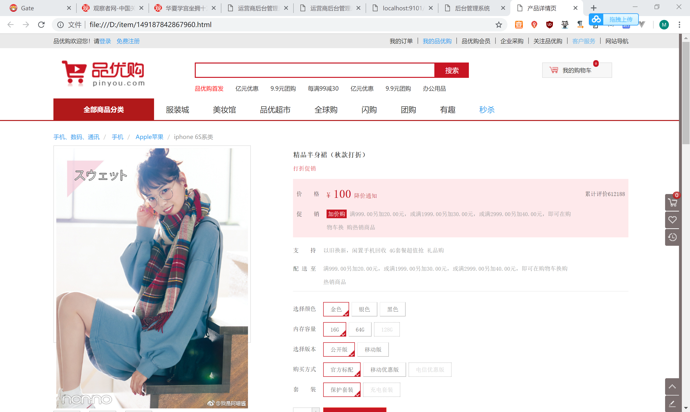

# 课程目标

目标1：掌握Freemarker常用的指令与内建函数

目标2：完成商品详细页的数据显示

目标3：完成商品详细页的动态效果

目标4：完成商品详细页读取SKU信息的业务逻辑

目标5：完成商品审核调用功能

# 1.网页静态化技术Freemarker

## 1.1为什么要使用网页静态化技术

网页静态化解决方案在实际开发中运用比较多，例如新闻网站，门户网站中的新闻频道或者是文章类的频道。


对于电商网站的商品详细页来说，至少几百万个商品，每个商品又有大量的信息，这样的情况同样也适用于使用网页静态化来解决。

网页静态化技术和缓存技术的共同点都是为了减轻数据库的访问压力，但是具体的应用场景不同，缓存比较适合小规模的数据，而网页静态化比较适合大规模且相对变化不太频繁的数据。另外网页静态化还有利于SEO。

另外我们如果将网页以纯静态化的形式展现，就可以使用Nginx这样的高性能的web服务器来部署。Nginx可以承载5万的并发，而Tomcat只有几百。关于Nginx我们在后续的课程中会详细讲解。

今天我们就研究网页静态化技术----Freemarker 。

## 1.2什么是 Freemarker

FreeMarker 是一个用 Java 语言编写的模板引擎，它基于模板来生成文本输出。FreeMarker与 Web 容器无关，即在 Web 运行时，它并不知道 Servlet 或 HTTP。它不仅可以用作表现层的实现技术，而且还可以用于生成 XML，JSP 或 Java 等。

2.商品详情页-数据显示

## 2.1需求分析

运用Freemarker技术来实现商品详细页的静态化。通过地址栏输入某地址，如下形式

<http://localhost:9101/gen_item.do?goodsId=149187842867952>

能在本地电脑某目录生成商品详细页，页面的名称为商品id.html

## 2.2工程搭建

### 2.2.1服务接口层

（1）创建war工程pinyougou-page-service 

（2）pom.xml引入依赖 参见其它服务工程, 另外添加freemarker依赖 

```xml
<dependency>
    <groupId>org.freemarker</groupId>
    <artifactId>freemarker</artifactId>
</dependency>
```

（3）添加web.xml 参见其它服务工程 

（4）spring配置文件 参见其它服务工程 ，另外配置：

```xml
<bean id="freemarkerConfig" class="org.springframework.web.servlet.view.freemarker.FreeMarkerConfigurer">
    <property name="templateLoaderPath" value="/WEB-INF/ftl/"/>
    <property name="defaultEncoding" value="UTF-8"/>
</bean>
```

（5）创建属性文件


内容为：

```properties
pagedir=d:\\item\\
```

用于配置网页生成目录

 

（6）建立com.pinyougou.page.service.impl包，包下建立类

```html
package com.pinyougou.page.service.impl;

import com.alibaba.dubbo.config.annotation.Service;
import com.pinyougou.mapper.TbGoodsDescMapper;
import com.pinyougou.mapper.TbGoodsMapper;
import com.pinyougou.page.service.ItemPageService;
import com.pinyougou.pojo.TbGoods;
import com.pinyougou.pojo.TbGoodsDesc;
import freemarker.template.Configuration;
import freemarker.template.Template;
import org.springframework.beans.factory.annotation.Autowired;
import org.springframework.beans.factory.annotation.Value;
import org.springframework.web.servlet.view.freemarker.FreeMarkerConfig;

import java.io.FileWriter;
import java.io.Writer;
import java.util.HashMap;
import java.util.Map;

@Service
public class ItemPageServiceImpl implements ItemPageService {

   @Value("${pagedir}")
   private String pagedir;
   
   @Autowired
   private FreeMarkerConfig freeMarkerConfig;
   
   @Autowired
   private TbGoodsMapper goodsMapper;
   
   @Autowired
   private TbGoodsDescMapper goodsDescMapper;
      
   @Override
   public boolean genItemHtml(Long goodsId){           
      try {
         Configuration configuration = freeMarkerConfig.getConfiguration();
         Template template = configuration.getTemplate("item.ftl");
         Map dataModel=new HashMap<>();
         //1.加载商品表数据
         TbGoods goods = goodsMapper.selectByPrimaryKey(goodsId);
         dataModel.put("goods", goods);       
         //2.加载商品扩展表数据        
         TbGoodsDesc goodsDesc = goodsDescMapper.selectByPrimaryKey(goodsId);
         dataModel.put("goodsDesc", goodsDesc);                
         Writer out=new FileWriter(pagedir+goodsId+".html");
         template.process(dataModel, out);
         out.close();
         return true;         
      } catch (Exception e) {
         e.printStackTrace();
         return false;
      }
   }
}
```

（7）将item.html拷贝至web-inf/ftl下，修改扩展名为ftl ,将商品名称用插值代替

```html
<div class="sku-name">
   <h4>${goods.goodsName}</h4>
</div>
```

（8）在D盘建立文件夹item,将必要的样式表和Js拷贝到此目录下，此目录为生成的目录

### 2.2.3运营商管理后台

（1）pinyougou-manager-web引入依赖pinyougou-page-interface 

（2）在GoodsController.java中新增方法

```java
@Reference(timeout=40000)
private ItemPageService itemPageService;
/**
 * 生成静态页（测试）
 * @param goodsId
 */
@RequestMapping("/genHtml")
public void genHtml(Long goodsId){
   itemPageService.genItemHtml(goodsId);
}
```

测试

http://localhost:9101/goods/genHtml.do?goodsId=149187842867960


## 2.3商品详情页模板构建

### 2.3.1模板模块化引入

此时我们的item.ftl内容较多，当我们编辑时不容易快速找到编辑的位置，所以我们将头部分拆分到head.ftl ,将尾部拆分到foot.ftl ,用include指令在item.ftl中引入 。

  内容详见配套代码

### 2.3.2生成基本数据

在模板中找到合适的位置，用插值替换静态文本

```html
<div class="news"><span>${goods.caption}</span></div>

<div class="fl price"><i>¥</i><em>${goods.price}</em><span>降价通知</span></div>

<div class="intro-detail"><!-- 商品详情 -->	${goodsDesc.introduction}</div>

<div id="two" class="tab-pane"><p>${goodsDesc.packageList}</p></div>
<div id="three" class="tab-pane"><p>${goodsDesc.saleService}</p></div>

```


运行控制层代码，测试生成效果

http://localhost:9101/goods/genHtml.do?goodsId=149187842867960

测试


### 2.3.3生成图片列表

编辑模板文件

```html
<#--图片列表 -->
<#assign imageList=goodsDesc.itemImages?eval />
```

这一句要转换图片列表的json字符串

图片部分的代码

```html
<!--默认第一个预览-->
<div id="preview" class="spec-preview">
   <span class="jqzoom">
         <#if (imageList?size>0)>
            
         </#if>
   </span>
</div>
<!--下方的缩略图-->
<div class="spec-scroll">
   <div class="items">
      <ul>
         <#list imageList as item>
            <li></li>
         </#list>
      </ul>
   </div>
</div>
```

测试



### 2.3.4生成扩展属性列表

修改模板   首先进行json转换

```html
<#--扩展属性列表 -->
<#assign customAttributeList=goodsDesc.customAttributeItems?eval />
```

显示扩展属性数据，如果扩展属性为空则不显示此条数据

```html
<ul class="goods-intro unstyled">
   <#list customAttributeList as item>
      <#if item.value??>
         <li>${item.text} ：${item.value}</li>
      </#if>
   </#list>
</ul>
```

测试


### 2.3.5生成规格列表

修改模板  转换规格列表

```html
<#--规格列表 -->
<#assign specificationList=goodsDesc.specificationItems?eval />
```

此时，我们需要使用嵌套循环

```html
<div class="clearfix choose">
    <div id="specification" class="summary-wrap clearfix">
        <#list specificationList as specification>
            <dl>
                <dt>
                    <div class="fl title">
                        <i>${specification.attributeName}</i>
                    </div>
                </dt>
                <#list specification.attributeValue as item>
                    <dd><a href="javascript:;">${item}</a></dd>
                </#list>
            </dl>
        </#list>
    </div>
```

测试


### 2.3.6生成商品类型面包屑

修改ItemPageServiceImpl ，读取三级商品分类名称，加入到数据模型中

```java
@Autowired
private TbItemCatMapper itemCatMapper;

//3.商品分类
String itemCat1 = itemCatMapper.selectByPrimaryKey(goods.getCategory1Id()).getName();
String itemCat2 = itemCatMapper.selectByPrimaryKey(goods.getCategory2Id()).getName();
String itemCat3 = itemCatMapper.selectByPrimaryKey(goods.getCategory3Id()).getName();
dataModel.put("itemCat1", itemCat1);
dataModel.put("itemCat2", itemCat2);
dataModel.put("itemCat3", itemCat3);
```

修改模板，展示商品分类面包屑

```html
<ul class="sui-breadcrumb">
    <li><a href="#">${itemCat1}</a></li>
    <li><a href="#">${itemCat2}</a></li>
    <li><a href="#">${itemCat3}</a></li>
</ul>
```

测试


# 3.商品详情页-前端逻辑

## 3.1购买数量加减操作

### 3.1.1加入angularJS库

将angularJS库加入d:\item下


### 3.1.2前端控制层

将base.js拷贝到js目录下

在js目录下构建controller文件夹，创建itemController.js

```js
//商品详细页（控制层）
app.controller('itemController',function($scope){
	//数量操作
	$scope.addNum=function(x){
		$scope.num=$scope.num+x;
		if($scope.num<1){
			$scope.num=1;
		}
	}		
});
```

在方法中控制数量不能小于1

### 3.1.3模板

引入js

```html
<script type="text/javascript" src="plugins/angularjs/angular.min.js">  </script>
<script type="text/javascript" src="js/base.js">  </script>
<script type="text/javascript" src="js/controller/itemController.js">  </script>
```

添加指令

```html
<body ng-app="pinyougou" ng-controller="itemController" ng-init="num=1">
```

调用操作数量的方法

```html
<div class="controls">
    <input autocomplete="off" type="text" value="{{num}}" minnum="1" class="itxt" />
    <a href="javascript:void(0)" class="increment plus" ng-click="addNum(1)" >+</a>
    <a href="javascript:void(0)" class="increment mins" ng-click="addNum(-1)">-</a>
</div>
```

测试


## 3.2规格选择

最终我们需要实现的效果：


### 3.2.1前端控制层

修改itemController.js

```js
	$scope.specificationItems={};//记录用户选择的规格
	//用户选择规格
	$scope.selectSpecification=function(name,value){	
		$scope.specificationItems[name]=value;
	}	
	//判断某规格选项是否被用户选中
	$scope.isSelected=function(name,value){
		if($scope.specificationItems[name]==value){
			return true;
		}else{
			return false;
		}		
	}
```

### 3.2.2模板

页面调用控制器的方法

```html
<#list specification.attributeValue as item>

    <dd>
        <a  class="{{isSelected('${specification.attributeName}','${item}')?'selected':''}}"
            ng-click="selectSpecification('${specification.attributeName}','${item}')">
            ${item}
            <span title="点击取消选择">&nbsp;</span>
        </a>
    </dd>


</#list>
```

测试


# 4.商品详情页-读取SKU信息

需求：当我们选择规格后，应该在页面上更新商品名称为SKU的商品标题，价格也应该为SKU的商品价格。

## 4.1页面生成SKU列表变量

### 4.1.1后端服务层

修改pinyougou-page-service的ItemPageServiceImpl.java

```java
//4.SKU列表         
TbItemExample example=new TbItemExample();
TbItemExample.Criteria criteria = example.createCriteria();
criteria.andStatusEqualTo("1");//状态为有效
criteria.andGoodsIdEqualTo(goodsId);//指定SPU ID
example.setOrderByClause("is_default desc");//按照状态降序，保证第一个为默认        
List<TbItem> itemList = itemMapper.selectByExample(example);
dataModel.put("itemList", itemList);
```

### 4.1.2模板

修改模板：

```html
<script>
    //SKU商品列表
    var skuList=[
        <#list itemList as item>
        {
            "id":${item.id?c},
            "title":"${item.title!''}",
            "price":${item.price?c},
            "spec": ${item.spec}
        } ,
        </#list>
    ];
</script>
```

测试生成，发现页面源代码中生成了变量

测试


## 4.2显示SKU标题和价格

### 4.2.1加载默认SKU信息

修改itemController.js

```js
//加载默认SKU
$scope.loadSku=function(){
	$scope.sku=skuList[0];		
	$scope.specificationItems= JSON.parse(JSON.stringify($scope.sku.spec)) ;
}
```
修改模板item.ftl

```html
<body ng-app="pinyougou" ng-controller="itemController" ng-init="num=1;loadSku()">
```

修改模板，显示标题

```html
<div class="sku-name"><h4>{{sku.title}}</h4></div>
```

显示价格

```html
<div class="fl price"><i>¥</i> <em>{{sku.price}}</em> <span>降价通知</span></div>
```

### 4.2.2选择规格更新SKU

修改itemController.js ,  编写匹配对象的方法

```js
//匹配两个对象
matchObject=function(map1,map2){		
	for(var k in map1){
		if(map1[k]!=map2[k]){
			return false;
		}			
	}
	for(var k in map2){
		if(map2[k]!=map1[k]){
			return false;
		}			
	}
	return true;		
}
```
编写方法，在SKU列表中查询当前用户选择的SKU

```js
//查询SKU
searchSku=function(){
	for(var i=0;i<skuList.length;i++ ){
		if( matchObject(skuList[i].spec ,$scope.specificationItems ) ){
			$scope.sku=skuList[i];
			return ;
		}			
	}	
	$scope.sku={id:0,title:'--------',price:0};//如果没有匹配的		
}
```
在用户选择规格后触发读取方法

```js
//用户选择规格
	$scope.selectSpecification=function(name,value){	
		$scope.specificationItems[name]=value;
		searchSku();//读取sku
	}	
```

测试


## 4.3添加商品到购物车

修改itemController.js 

```js
//添加商品到购物车
$scope.addToCart=function(){
    alert('skuid:'+$scope.sku.id);				
}
```

修改模板：

```html
<a href="#" target="_blank" class="sui-btn  btn-danger addshopcar" ng-click="addToCart()">加入购物车</a>
```

测试


# 5.系统模块对接

## 5.1运营商后台调用页面生成服务

修改pinyougou-manager-web的GoodsController.java 

```java
//静态页生成
for(Long goodsId:ids){
   itemPageService.genItemHtml(goodsId);
}
```

测试


## 5.2创建商品详细页web工程

创建war模块工程pinyougou-page-web  ，将目标目录（d:\item）的文件拷贝到此工程（生成的页面不用拷贝）


在pom.xml中添加tomcat7插件，指定端口为9105

## 5.3搜索系统与商品详细页对接

修改pinyougou-search-web 的search.html，修改点击图片的链接为http://localhost:9105/{{item.id}}.html 

说明：商品详细页是静态页，所以在开发阶段我们可以使用tomcat来进行测试。部署在生产环境是部署在Nginx中。

```html
<a href="http://localhost:9105/{{item.id}}.html" target="_blank"></a>
```


 

 