# 课程目标

目标1：理解消息中间件、JMS等概念

目标2：掌握JMS点对点与发布订阅模式的收发消息

目标3：掌握SpringJms

目标4：完成商品审核导入索引库

目标5：完成商品删除移除索引库

目标6: 完成商品审核生成商品详细页

目标7: 完成商品删除完成删除商品详细页

# 1. JMS入门

## 1.1消息中间件

### 1.1.1品优购系统模块调用关系分析

我们现在讲品优购已经完成的功能模块梳理如下：

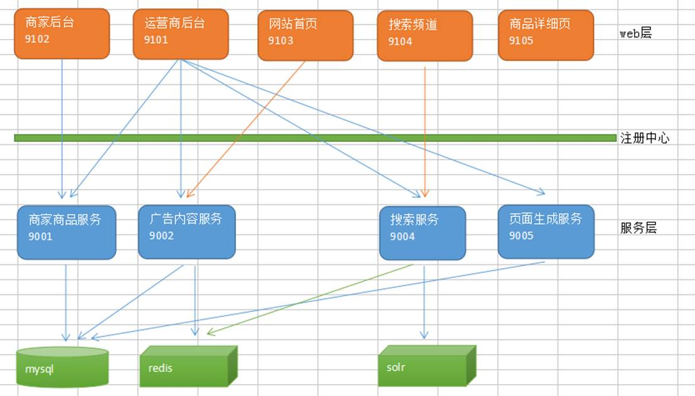

我们已经完成了5个web模块和4个服务模块。其中运营商后台的调用关系最多，用到了商家商品服务、广告内容服务、搜索服务和页面生成服务。这种模块之间的依赖也称之为耦合。而耦合越多，之后的维护工作就越困难。那么如果改善系统模块调用关系、减少模块之间的耦合呢？我们接下来就介绍一种解决方案----消息中间件。

### 1.1.2什么是消息中间件

消息中间件利用高效可靠的消息传递机制进行平台无关的数据交流，并基于数据通信来进行[分布式系统](https://baike.baidu.com/item/%E5%88%86%E5%B8%83%E5%BC%8F%E7%B3%BB%E7%BB%9F)的集成。通过提供消息传递和消息排队模型，它可以在分布式环境下扩展进程间的通信。对于消息中间件，常见的角色大致也就有Producer（生产者）、Consumer（消费者）

常见的消息中间件产品:

**（****1****）****ActiveMQ**

ActiveMQ 是Apache出品，最流行的，能力强劲的开源消息总线。ActiveMQ 是一个完全支持JMS1.1和J2EE 1.4规范的 JMS Provider实现。我们在本次课程中介绍 ActiveMQ的使用。

（2）RabbitMQ

AMQP协议的领导实现，支持多种场景。淘宝的MySQL集群内部有使用它进行通讯，OpenStack开源云平台的通信组件，最先在金融行业得到运用。

（3）ZeroMQ

史上最快的消息队列系统

（4）Kafka

Apache下的一个子项目 。特点：高吞吐，在一台普通的服务器上既可以达到10W/s的吞吐速率；完全的分布式系统。适合处理海量数据。

### 1.1.3改造系统模块调用关系

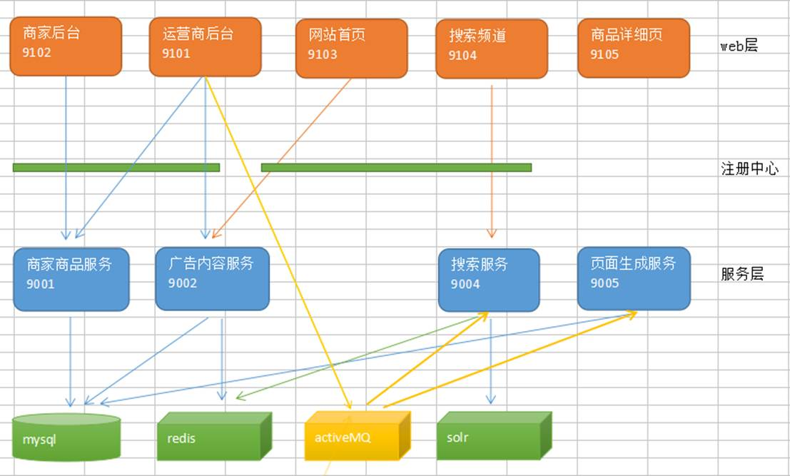

我们通过引入消息中间件activeMQ,使得运营商系统与搜索服务、页面生成服务解除了耦合。

 

## 1.2 JMS简介

### 1.2.1什么是JMS

JMS（[**Java** ](http://lib.csdn.net/base/java)Messaging Service）是Java平台上有关面向消息中间件的技术规范，它便于消息系统中的Java应用程序进行消息交换,并且通过提供标准的产生、发送、接收消息的接口简化企业应用的开发。

​       JMS本身只定义了一系列的接口规范，是一种与厂商无关的 API，用来访问消息收发系统。它类似于 JDBC([**java** ](http://lib.csdn.net/base/java)Database Connectivity)：这里，JDBC 是可以用来访问许多不同关系[**数据库**](http://lib.csdn.net/base/mysql)的 API，而 JMS 则提供同样与厂商无关的访问方法，以访问消息收发服务。许多厂商目前都支持 JMS，包括 IBM 的 MQSeries、BEA的 Weblogic JMS service和 Progress 的 SonicMQ，这只是几个例子。 JMS 使您能够通过消息收发服务（有时称为消息中介程序或路由器）从一个 JMS 客户机向另一个 JML 客户机发送消息。消息是 JMS 中的一种类型对象，由两部分组成：报头和消息主体。报头由路由信息以及有关该消息的元数据组成。消息主体则携带着应用程序的数据或有效负载。

JMS 定义了五种不同的消息正文格式，以及调用的消息类型，允许你发送并接收以一

些不同形式的数据，提供现有消息格式的一些级别的兼容性。

· TextMessage--一个字符串对象

· MapMessage--一套名称-值对

· ObjectMessage--一个序列化的 Java 对象

· BytesMessage--一个字节的数据流

· StreamMessage -- Java 原始值的数据流

### 1.2.2 JMS消息传递类型

对于消息的传递有两种类型：

一种是点对点的，即一个生产者和一个消费者一一对应；

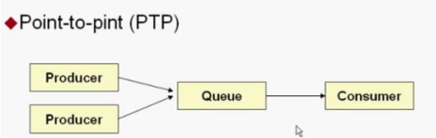

另一种是发布/ 订阅模式，即一个生产者产生消息并进行发送后，可以由多个消费者进

行接收。

​    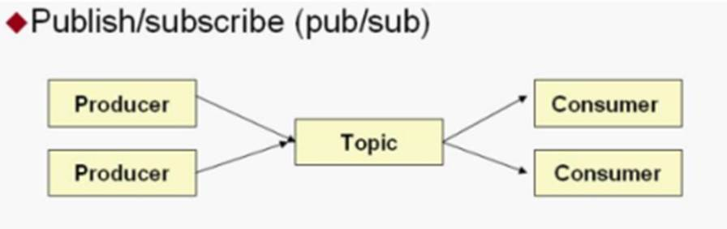

## 1.3ActiveMQ下载与安装

### 1.3.1下载

官方网站下载：<http://activemq.apache.org/>

### 1.3.2安装（Linux）

（1）将apache-activemq-5.12.0-bin.tar.gz 上传至服务器

（2）解压此文件

   tar  zxvf    apache-activemq-5.12.0-bin.tar.gz   

（3）为apache-activemq-5.12.0目录赋权

   chmod 777 apache-activemq-5.12.0   

（4）进入apache-activemq-5.12.0\bin目录

（5）赋与执行权限

   chmod 755 activemq    --------------------------------------  **知识点小贴士**      --------------------------   linux 命令chmod 755的意思   chmod是**Linux**下设置文件权限的命令，后面的数字表示不同用户或用户组的权限。   一般是三个数字：    第一个数字表示文件所有者的权限    第二个数字表示与文件所有者同属一个用户组的其他用户的权限    第三个数字表示其它用户组的权限。         权限分为三种：读（r=4），写（w=2），执行（x=1） 。 综合起来还有可读可执行（rx=5=4+1）、可读可写（rw=6=4+2）、可读可写可执行(rwx=7=4+2+1)。         所以，chmod 755 设置用户的权限为：    1.文件所有者可读可写可执行                                      --7   2.与文件所有者同属一个用户组的其他用户可读可执行 --5     3.其它用户组可读可执行                                            --5   

### 1.3.3启动

​    ./activemq start   

出现下列提示表示成功！

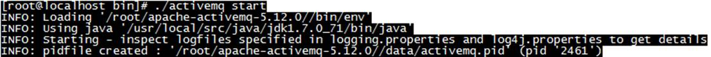

假设服务器地址为192.168.25.135 ，打开浏览器输入地址

[http://192.168.25.135:8161/](http://192.168.25.129:8161/) 即可进入ActiveMQ管理页面


点击进入管理页面

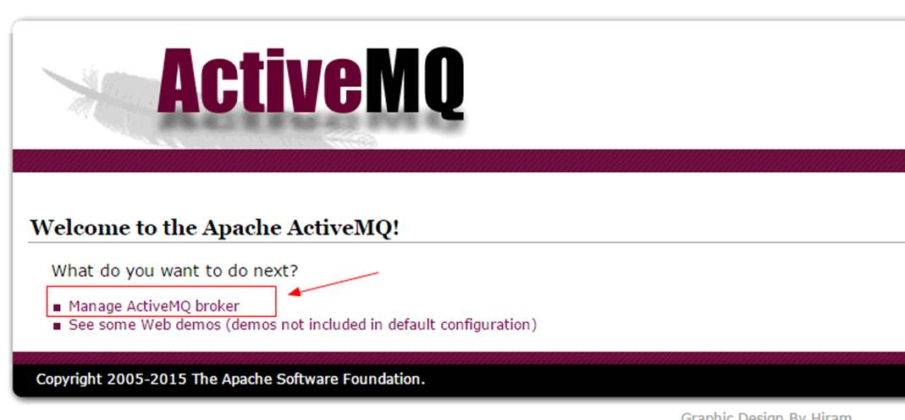


输入用户名和密码  均为 admin 

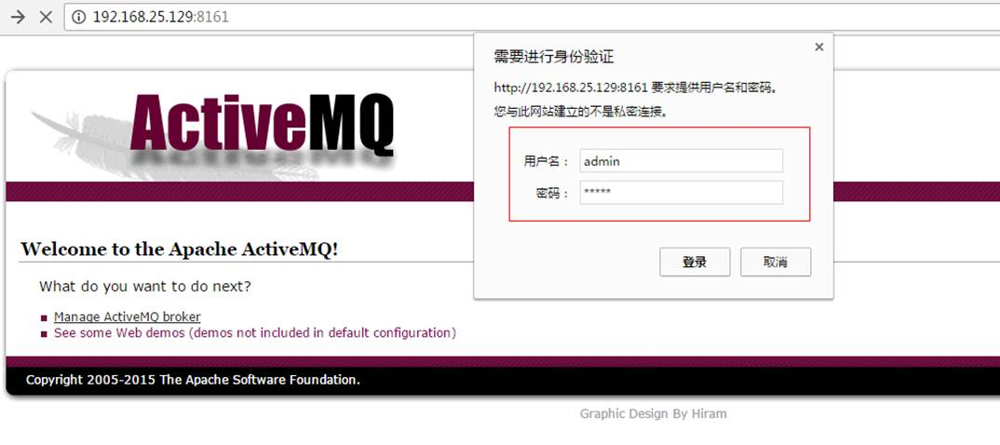

进入主界面

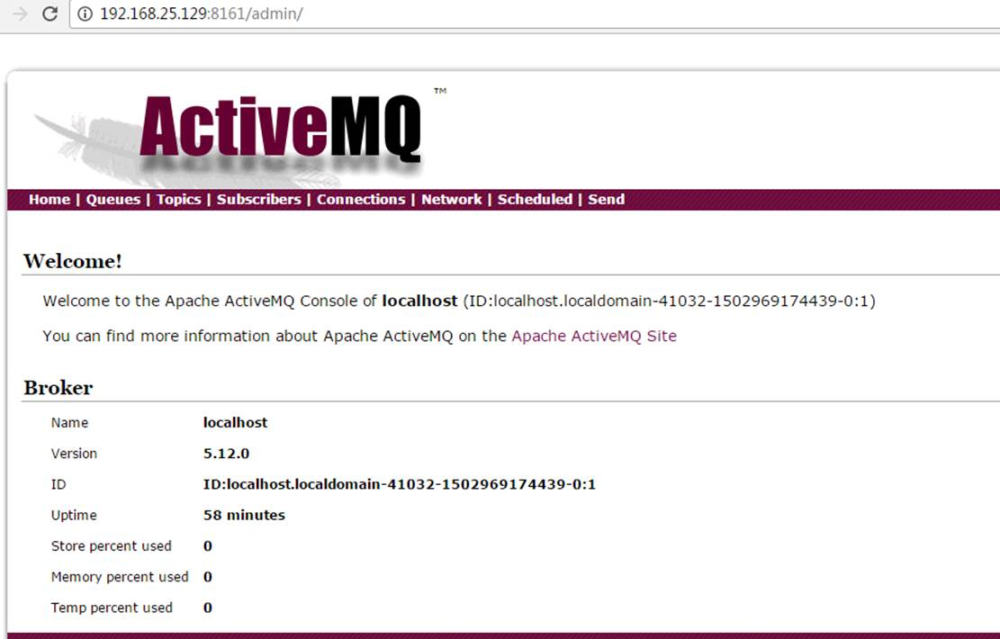

点对点消息列表：

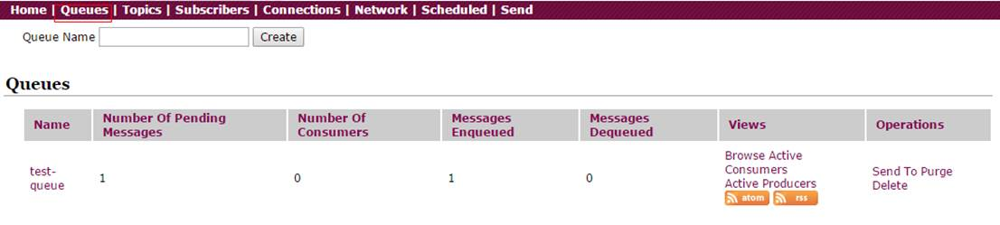

列表各列信息含义如下：

**Number Of Pending Messages**  **：**等待消费的消息 这个是当前未出队列的数量。

**Number Of Consumers**  **：**消费者 这个是消费者端的消费者数量

**Messages Enqueued**  **：**进入队列的消息  进入队列的总数量,包括出队列的。

**Messages Dequeued**  **：**出了队列的消息  可以理解为是消费这消费掉的数量。


# 4.商品审核-导入Solr索引库

## 4.1需求分析

运用消息中间件activeMQ实现运营商后台与搜索服务的零耦合。运营商执行商品审核后，向activeMQ发送消息（SKU列表），搜索服务从activeMQ接收到消息并导入到solr索引库。

## 4.2消息生产者（运营商后台）

### 4.2.1解除耦合

修改pinyougou-manager-web，移除搜索服务接口依赖：

```xml
<!--<dependency>-->
    <!--<groupId>com.pinyougou</groupId>-->
    <!--<artifactId>pinyougou-search-interface</artifactId>-->
    <!--<version>0.0.5-SNAPSHOT</version>-->
<!--</dependency>-->
```

GoodsController.java中删除调用搜索服务接口的相关代码

```java

//itemSearchService.deleteByGoodsIds(Arrays.asList(ids));

//@Reference
//private ItemSearchService itemSearchService;

//itemSearchService.importList(itemList);		

```

### 4.2.2准备工作

（1）修改pinyougou-manager-web的pom.xml,引入依赖

```xml
<dependency>
    <groupId>org.apache.activemq</groupId>
    <artifactId>activemq-client</artifactId>
    <version>5.13.4</version>
</dependency>
```

（2）pinyougou-manager-web工程添加applicationContext-jms-producer.xml

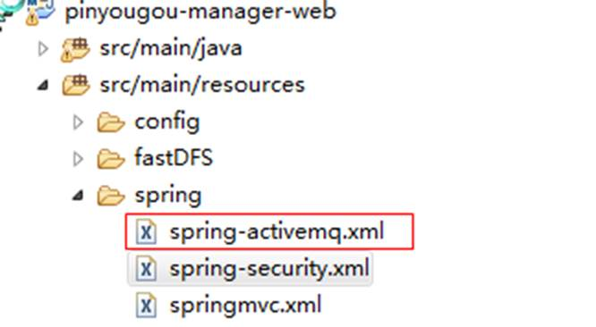

改名为spring-jms.xml  内容如下：

```xml
<!-- 真正可以产生Connection的ConnectionFactory，由对应的 JMS服务厂商提供-->
<bean id="targetConnectionFactory" class="org.apache.activemq.ActiveMQConnectionFactory">
    <property name="brokerURL" value="tcp://192.168.25.135:61616"/>
</bean>
<!-- Spring用于管理真正的ConnectionFactory的ConnectionFactory -->
<bean id="connectionFactory" class="org.springframework.jms.connection.SingleConnectionFactory">
    <!-- 目标ConnectionFactory对应真实的可以产生JMS Connection的ConnectionFactory -->
    <property name="targetConnectionFactory" ref="targetConnectionFactory"/>
</bean>
<!-- Spring提供的JMS工具类，它可以进行消息发送、接收等 -->
<bean id="jmsTemplate" class="org.springframework.jms.core.JmsTemplate">
    <!-- 这个connectionFactory对应的是我们定义的Spring提供的那个ConnectionFactory对象 -->
    <property name="connectionFactory" ref="connectionFactory"/>
</bean>
<!--这个是队列目的地，点对点-->
<bean id="queueSolrDestination" class="org.apache.activemq.command.ActiveMQQueue">
    <constructor-arg value="pinyougou_queue_solr"/>
</bean>
```

（3）修改web.xml 

```xml
<context-param>
    <param-name>contextConfigLocation</param-name>
    <param-value>classpath:spring/spring-*.xml</param-value>
</context-param>
```

### 4.2.3代码实现

修改pinyougou-manager-web工程的GoodsController.java

```java
@Autowired
private Destination queueSolrDestination;//用于发送solr导入的消息

@Autowired
private JmsTemplate jmsTemplate;

@RequestMapping("/updateStatus")
public Result updateStatus(Long[] ids,String status){
	try {
		goodsService.updateStatus(ids, status);
		//按照SPU ID查询 SKU列表(状态为1)		
		if(status.equals("1")){//审核通过
				List<TbItem> itemList = goodsService.findItemListByGoodsIdandStatus(ids, status);							
			//调用搜索接口实现数据批量导入
			if(itemList.size()>0){				
				final String jsonString = JSON.toJSONString(itemList);		
				jmsTemplate.send(queueSolrDestination, new MessageCreator() {	
					@Override
					public Message createMessage(Session session) throws JMSException {							
							return session.createTextMessage(jsonString);
					}
				});					
			}else{
					System.out.println("没有明细数据");
			}				
		}		
		return new Result(true, "修改状态成功"); 
	} catch (Exception e) {
		e.printStackTrace();
		return new Result(false, "修改状态失败");
	}
}

```

测试

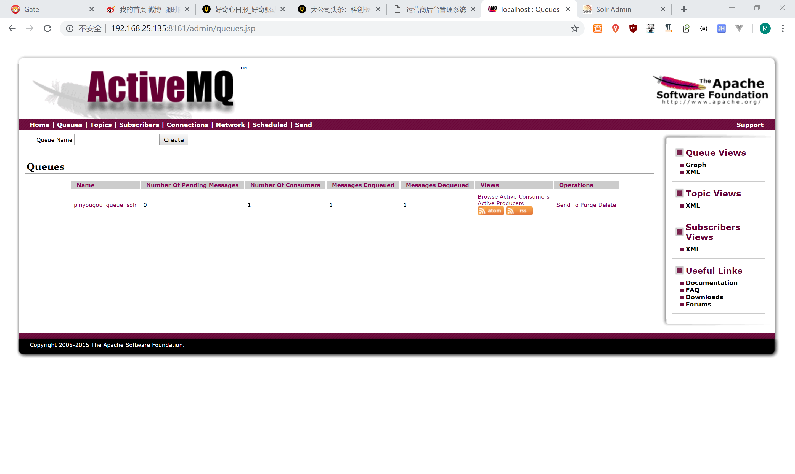

## 4.3消息消费者（搜索服务）

### 4.3.1准备工作

（1）修改pinyougou-search-service ，在pom.xml中添加activemq依赖

```xml
<dependency>
    <groupId>org.apache.activemq</groupId>
    <artifactId>activemq-client</artifactId>
    <version>5.13.4</version>
</dependency>
```

（2）添加spring配置文件applicationContext-jms-consumer.xml

```xml
<!-- 真正可以产生Connection的ConnectionFactory，由对应的 JMS服务厂商提供-->
<bean id="targetConnectionFactory" class="org.apache.activemq.ActiveMQConnectionFactory">
   <property name="brokerURL" value="tcp://192.168.25.135:61616"/>
</bean>
<!-- Spring用于管理真正的ConnectionFactory的ConnectionFactory -->
<bean id="connectionFactory" class="org.springframework.jms.connection.SingleConnectionFactory">
   <property name="targetConnectionFactory" ref="targetConnectionFactory"/>
</bean>
<!--这个是队列目的地，点对点的  文本信息-->
<bean id="queueSolrDestination" class="org.apache.activemq.command.ActiveMQQueue">
   <constructor-arg value="pinyougou_queue_solr"/>
</bean>
<!-- 消息监听容器 -->
<bean class="org.springframework.jms.listener.DefaultMessageListenerContainer">
   <property name="connectionFactory" ref="connectionFactory" />
   <property name="destination" ref="queueSolrDestination" />
   <property name="messageListener" ref="itemSearchListener" />
</bean>
```

### 4.3.2代码实现

在pinyougou-search-service的com.pinyougou.search.service.impl新增监听类

```java
package com.pinyougou.search.service.impl;

import com.alibaba.fastjson.JSON;
import com.pinyougou.pojo.TbItem;
import com.pinyougou.search.service.ItemSearchService;
import org.springframework.beans.factory.annotation.Autowired;
import org.springframework.stereotype.Component;

import javax.jms.Message;
import javax.jms.MessageListener;
import javax.jms.TextMessage;
import java.util.List;
import java.util.Map;

@Component
public class ItemSearchListener implements MessageListener {
   @Autowired
   private ItemSearchService itemSearchService;
   
   @Override
   public void onMessage(Message message) {
      System.out.println("监听接收到消息...");
      try {
         TextMessage textMessage=(TextMessage)message;
         String text = textMessage.getText();
         List<TbItem> list = JSON.parseArray(text,TbItem.class);
         for(TbItem item:list){
            System.out.println(item.getId()+" "+item.getTitle());
            Map specMap= JSON.parseObject(item.getSpec());//将spec字段中的json字符串转换为map
            item.setSpecMap(specMap);//给带注解的字段赋值
         }        
         itemSearchService.importList(list);//导入    
         System.out.println("成功导入到索引库");
      } catch (Exception e) {
         e.printStackTrace();
      }        
   }
}
```

测试

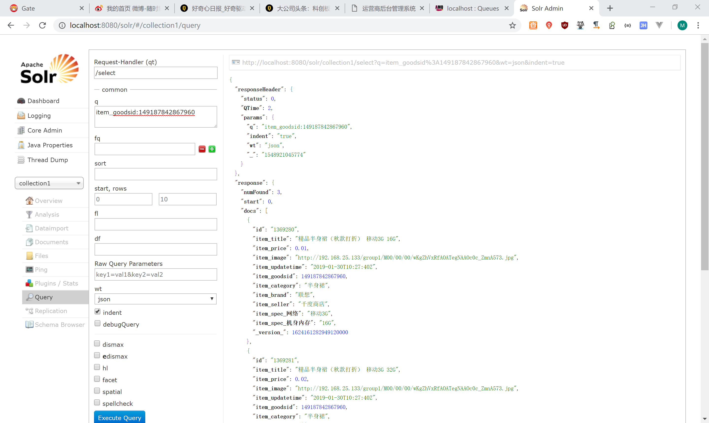

# 5.商品删除-移除Solr索引库记录

## 5.1需求分析

通过消息中间件实现在商品删除时也同时移除索引库记录的功能。

## 5.2消息生产者（运营商后台）

### 5.2.1配置文件

修改pinyougou-manager-web工程的spring-jms.xml，添加bean配置

```xml
<!--这个是队列目的地，点对点-->
<bean id="queueSolrDeleteDestination" class="org.apache.activemq.command.ActiveMQQueue">
    <constructor-arg value="pinyougou_queue_solr_delete"/>
</bean>
```

### 5.2.2代码实现

修改GoodsController.java

```java
    
	@Autowired
	private Destination queueSolrDeleteDestination;//用户在索引库中删除记录


	/**
    * 批量删除
    * @param ids
    * @return
    */
   @RequestMapping("/delete")
   public Result delete(final Long [] ids){
      try {
         goodsService.delete(ids);
//       itemSearchService.deleteByGoodsIds(Arrays.asList(ids));
         jmsTemplate.send(queueSolrDeleteDestination, new MessageCreator() {
            @Override
            public Message createMessage(Session session) throws JMSException {
               return session.createObjectMessage(ids);
            }
         });
         return new Result(true, "删除成功");
      } catch (Exception e) {
         e.printStackTrace();
         return new Result(false, "删除失败");
      }
   }
```

## 5.3消息消费者（搜索服务）

### 5.3.1配置文件

修改pinyougou-search-service的applicationContext-activemq-consumer.xml

```xml
	<!--这个是队列目的地，点对点的  文本信息  (删除索引库中记录) -->  
	<bean id="queueSolrDeleteDestination" class="org.apache.activemq.command.ActiveMQQueue">  
	    <constructor-arg value="pinyougou_queue_solr_delete"/>  
	</bean>  
	<!-- 消息监听容器(删除索引库中记录) -->
	<bean class="org.springframework.jms.listener.DefaultMessageListenerContainer">
		<property name="connectionFactory" ref="connectionFactory" />
		<property name="destination" ref="queueSolrDeleteDestination" />
		<property name="messageListener" ref="itemDeleteListener" />
	</bean>
```

### 5.3.2代码实现

com.pinyougou.search.service.impl包下创建监听类ItemDeleteListener

```java
package com.pinyougou.search.service.impl;

import com.pinyougou.search.service.ItemSearchService;
import org.springframework.beans.factory.annotation.Autowired;
import org.springframework.stereotype.Component;

import javax.jms.Message;
import javax.jms.MessageListener;
import javax.jms.ObjectMessage;
import java.util.Arrays;

/**
 * 监听：用于删除索引库中记录
 * @author Administrator
 *
 */
@Component
public class ItemDeleteListener implements MessageListener {

   @Autowired
   private ItemSearchService itemSearchService;
   
   @Override
   public void onMessage(Message message) {
      try {        
         ObjectMessage objectMessage= (ObjectMessage)message;
         Long[]  goodsIds = (Long[]) objectMessage.getObject();    
         System.out.println("ItemDeleteListener监听接收到消息..."+goodsIds);
         itemSearchService.deleteByGoodsIds(Arrays.asList(goodsIds));
         System.out.println("成功删除索引库中的记录");       
      } catch (Exception e) {
         e.printStackTrace();
      }        
   }

}
```

测试

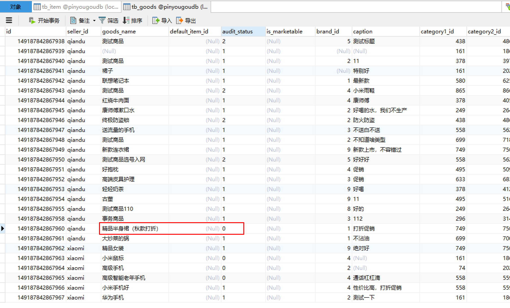

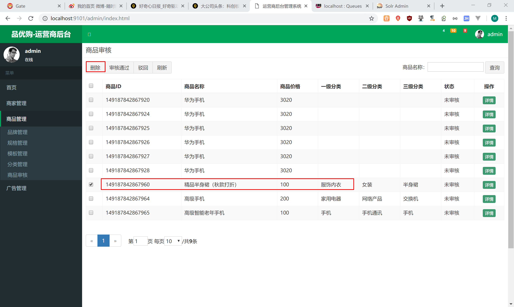

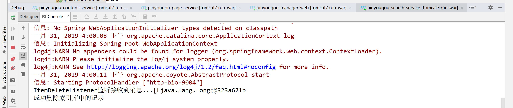

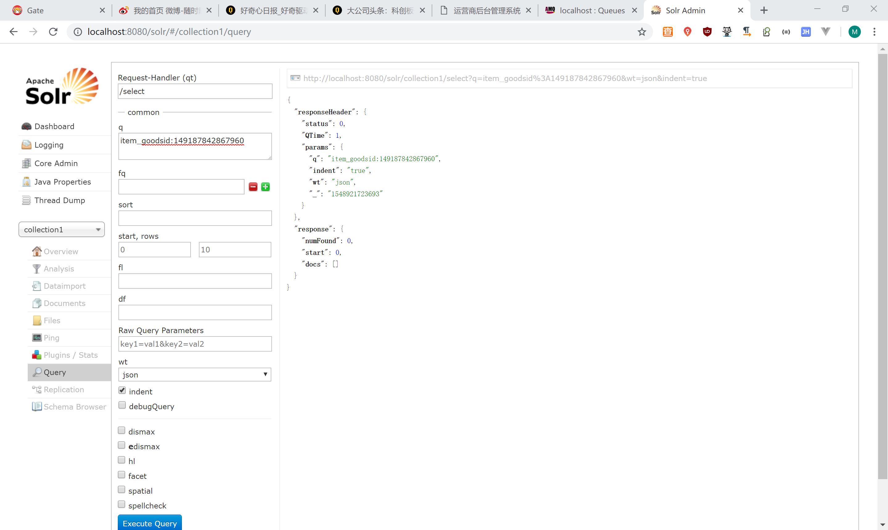


# 6.商品审核-执行网页静态化

## 6.1需求分析

运用消息中间件activeMQ实现运营商后台与网页生成服务的零耦合。运营商执行商品审核后，向activeMQ发送消息（商品ID），网页生成服务从activeMQ接收到消息后执行网页生成操作。

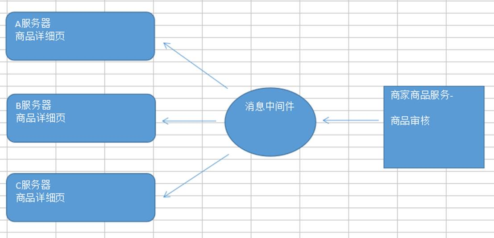

## 6.2消息生产者（运营商后台）

### 6.2.1解除耦合

修改pinyougou-manager-web，移除网页生成服务接口依赖：

```xml
<!--<dependency>-->
    <!--<groupId>com.pinyougou</groupId>-->
    <!--<artifactId>pinyougou-page-interface</artifactId>-->
    <!--<version>0.0.5-SNAPSHOT</version>-->
<!--</dependency>-->
```

GoodsController.java中删除调用网页生成服务接口的相关代码

```java
	//private ItemPageService itemPageService;

	//静态页生成
	//for(Long goodsId:ids){
		//itemPageService.genItemHtml(goodsId);
	//}

```

### 6.2.2准备工作

修改配置文件spring-jms.xml，添加配置

```xml
<!--这个是订阅模式  文本信息-->
<bean id="topicPageDestination" class="org.apache.activemq.command.ActiveMQTopic">
    <constructor-arg value="pinyougou_topic_page"/>
</bean>
```

### 6.2.3代码实现

修改pinyougou-manager-web的GoodsController.java

```java
//静态页生成
for(final Long goodsId:ids){
   jmsTemplate.send(topicPageDestination, new MessageCreator() {
      @Override
      public Message createMessage(Session session) throws JMSException {
         return session.createTextMessage(goodsId+"");
      }
   });
}
```

## 6.3消息消费者（页面生成服务）

### 6.3.1解除dubbox依赖

（1）修改工程pinyougou-page-service ，删除dubbox相关依赖

```xml
<!-- dubbo相关 -->
<!--<dependency>-->
    <!--<groupId>com.alibaba</groupId>-->
    <!--<artifactId>dubbo</artifactId>-->
<!--</dependency>-->
<!--<dependency>-->
    <!--<groupId>org.apache.zookeeper</groupId>-->
    <!--<artifactId>zookeeper</artifactId>-->
<!--</dependency>-->
<!--<dependency>-->
    <!--<groupId>com.github.sgroschupf</groupId>-->
    <!--<artifactId>zkclient</artifactId>-->
<!--</dependency>-->
```

（2）修改applicationContext-service.xml，删除dubbox相关配置

```xml
<!--<dubbo:protocol name="dubbo" port="20885"></dubbo:protocol>-->
<!--<dubbo:application name="pinyougou-page-service"/>-->
<!--<dubbo:registry address="zookeeper://192.168.25.135:2181"/>-->
<!--<dubbo:annotation package="com.pinyougou.page.service.impl"/>-->
```

（3）修改ItemPageServiceImpl类的@Service注解
为org.springframework.stereotype.Service包下的@Service注解

### 6.3.2准备工作

（1）修改applicationContext-service.xml，添加配置

```xml
<context:component-scan base-package="com.pinyougou.page.service.impl"/>
```

（2）pom.xml中引入activeMQ客户端的依赖

```xml
<dependency>
    <groupId>org.apache.activemq</groupId>
    <artifactId>activemq-client</artifactId>
    <version>5.13.4</version>
</dependency>
```

（3）添加spring配置文件applicationContext-jms-consumer.xml

```xml
<?xml version="1.0" encoding="UTF-8"?>
<beans xmlns="http://www.springframework.org/schema/beans" xmlns:context="http://www.springframework.org/schema/context" xmlns:xsi="http://www.w3.org/2001/XMLSchema-instance" 
   xmlns:jms="http://www.springframework.org/schema/jms"
   xsi:schemaLocation="http://www.springframework.org/schema/beans   
      http://www.springframework.org/schema/beans/spring-beans.xsd
      http://www.springframework.org/schema/context   
      http://www.springframework.org/schema/context/spring-context.xsd">
   
    <!-- 真正可以产生Connection的ConnectionFactory，由对应的 JMS服务厂商提供-->  
   <bean id="targetConnectionFactory" class="org.apache.activemq.ActiveMQConnectionFactory">  
       <property name="brokerURL" value="tcp://192.168.25.135:61616"/>  
   </bean>
      
    <!-- Spring用于管理真正的ConnectionFactory的ConnectionFactory -->  
   <bean id="connectionFactory" class="org.springframework.jms.connection.SingleConnectionFactory">  
   <!-- 目标ConnectionFactory对应真实的可以产生JMS Connection的ConnectionFactory -->  
       <property name="targetConnectionFactory" ref="targetConnectionFactory"/>  
   </bean>  
   
    <!--这个是主题目的    生成页面-->  
   <bean id="topicPageDestination" class="org.apache.activemq.command.ActiveMQTopic">  
       <constructor-arg value="pinyougou_topic_page"/>  
   </bean>    
   
   <!-- 消息监听容器   生成页面 -->
   <bean class="org.springframework.jms.listener.DefaultMessageListenerContainer">
      <property name="connectionFactory" ref="connectionFactory" />
      <property name="destination" ref="topicPageDestination" />
      <property name="messageListener" ref="pageListener" />
   </bean>
   
   
   <!--这个是主题目的    删除页面-->  
   <bean id="topicPageDeleteDestination" class="org.apache.activemq.command.ActiveMQTopic">  
       <constructor-arg value="pinyougou_topic_page_delete"/>  
   </bean>    
   
   <!-- 消息监听容器   生成页面 -->
   <bean class="org.springframework.jms.listener.DefaultMessageListenerContainer">
      <property name="connectionFactory" ref="connectionFactory" />
      <property name="destination" ref="topicPageDeleteDestination" />
      <property name="messageListener" ref="pageDeleteListener" />
   </bean>
   <bean id="pageListener" class="java.lang.Object"/>
   <bean id="pageDeleteListener" class="java.lang.Object"/>

</beans>
```

### 6.3.3代码编写

创建消息监听类PageListener

```java
package com.pinyougou.page.service.impl;

import com.pinyougou.page.service.ItemPageService;
import org.springframework.beans.factory.annotation.Autowired;
import org.springframework.stereotype.Component;

import javax.jms.Message;
import javax.jms.MessageListener;
import javax.jms.TextMessage;

@Component
public class PageListener implements MessageListener {

	@Autowired
	private ItemPageService itemPageService;
		
	@Override
	public void onMessage(Message message) {		
		TextMessage textMessage= (TextMessage)message;
		try {
			String text = textMessage.getText();
			System.out.println("接收到消息："+text);
			boolean b = itemPageService.genItemHtml(Long.parseLong(text));
		} catch (Exception e) {
			e.printStackTrace();
		}		
	}
}

```

测试

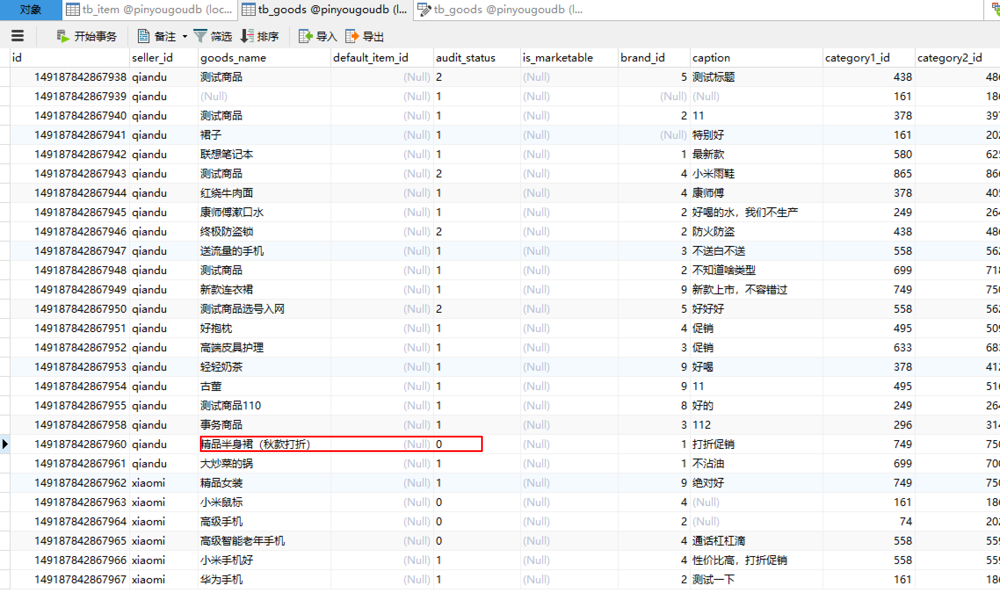

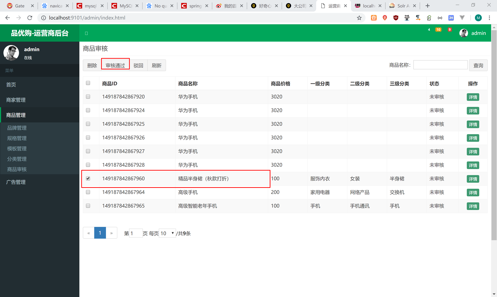


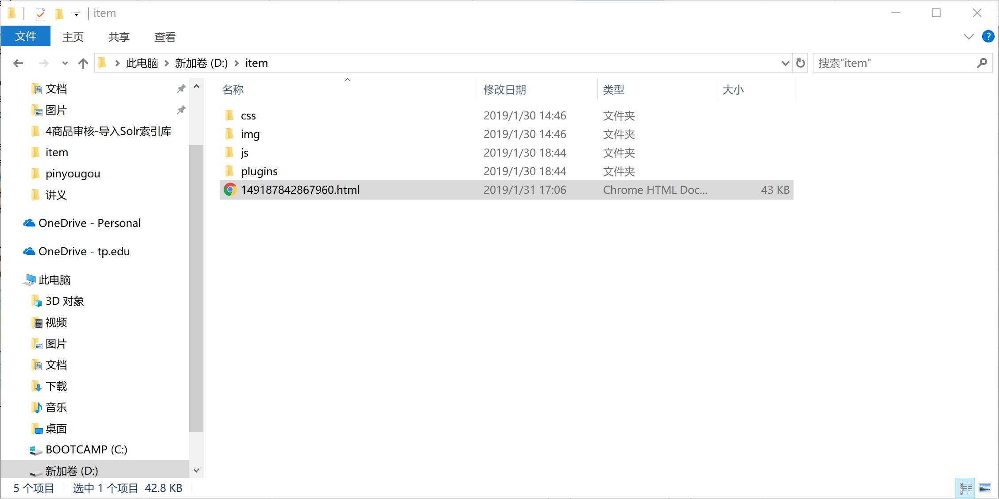

# 7.商品删除-删除商品详细页

## 7.1需求分析

执行商品删除后，同时删除每个服务器上的商品详细页

## 7.2消息生产者（运营商后台）

### 7.2.1配置文件

修改spring-activemq.xml，添加配置

```xml
  <!--这个是订阅模式 删除商品详细页-->
    <bean id="topicPageDeleteDestination" class="org.apache.activemq.command.ActiveMQTopic">
        <constructor-arg value="pinyougou_topic_page_delete"/>
    </bean>

```

### 7.2.2代码实现

修改GoodsController.java

```java
//删除每个服务器上的商品详细页
jmsTemplate.send(topicPageDeleteDestination, new MessageCreator() {

    @Override
    public Message createMessage(Session session) throws JMSException {
        return session.createObjectMessage(ids);
    }
});
```

## 7.3消息消费者（页面生成服务）

### 7.3.1配置文件

修改pinyougou-page-service的applicationContext-activemq-consumer.xml

```xml
<!--这个是主题目的    删除页面-->
<bean id="topicPageDeleteDestination" class="org.apache.activemq.command.ActiveMQTopic">
   <constructor-arg value="pinyougou_topic_page_delete"/>
</bean>

<!-- 消息监听容器   生成页面 -->
<bean class="org.springframework.jms.listener.DefaultMessageListenerContainer">
   <property name="connectionFactory" ref="connectionFactory" />
   <property name="destination" ref="topicPageDeleteDestination" />
   <property name="messageListener" ref="pageDeleteListener" />
</bean>
```

### 7.3.2代码实现

（1）修改pinyougou-page-interface的ItemPageService.java

```java
package com.pinyougou.page.service;

public interface ItemPageService {

   /**
    * 生成商品详细页
    * @param goodsId
    * @return
    */
   public boolean genItemHtml(Long goodsId);

   /**
    * 删除商品详细页
    * @param goodsIds
    * @return
    */
   public boolean deleteItemHtml(Long [] goodsIds);

}
```

（2）修改pinyougou-page-service的ItemPageServiceImpl.java

```java
@Override
public boolean deleteItemHtml(Long[] goodsIds) {
   try {
      for(Long goodsId:goodsIds){
         new File(pagedir+goodsId+".html").delete();
      }
      return true;
   } catch (Exception e) {
      // TODO Auto-generated catch block
      e.printStackTrace();
      return false;
   }
}
```

（3）创建监听类PageDeleteListener

```java
package com.pinyougou.page.service.impl;

import com.pinyougou.page.service.ItemPageService;
import org.springframework.beans.factory.annotation.Autowired;
import org.springframework.stereotype.Component;

import javax.jms.JMSException;
import javax.jms.Message;
import javax.jms.MessageListener;
import javax.jms.ObjectMessage;
@Component
public class PageDeleteListener implements MessageListener {

   @Autowired
   private ItemPageService itemPageService;
   
   @Override
   public void onMessage(Message message) {
      System.out.println("监听接收到消息...");
      ObjectMessage objectMessage  =(ObjectMessage)message;
      try {
         Long [] goodsIds= (Long[]) objectMessage.getObject();
         System.out.println("接收到消息:"+goodsIds);
         boolean b = itemPageService.deleteItemHtml(goodsIds);     
         System.out.println("删除网页："+b);
         
      } catch (JMSException e) {
         // TODO Auto-generated catch block
         e.printStackTrace();
      }
      
      

   }

}
```

测试

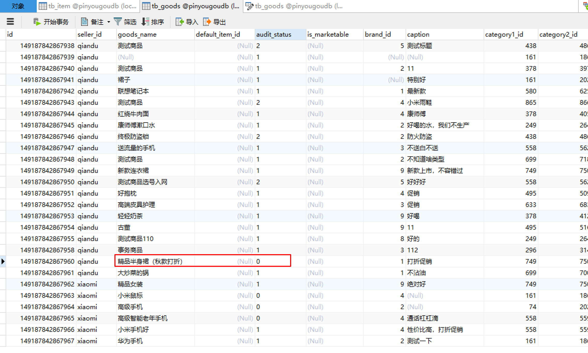

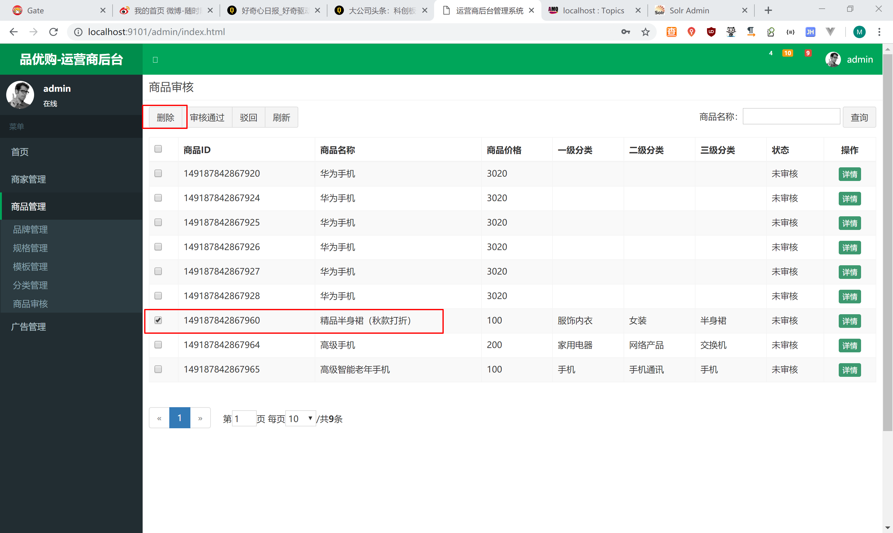

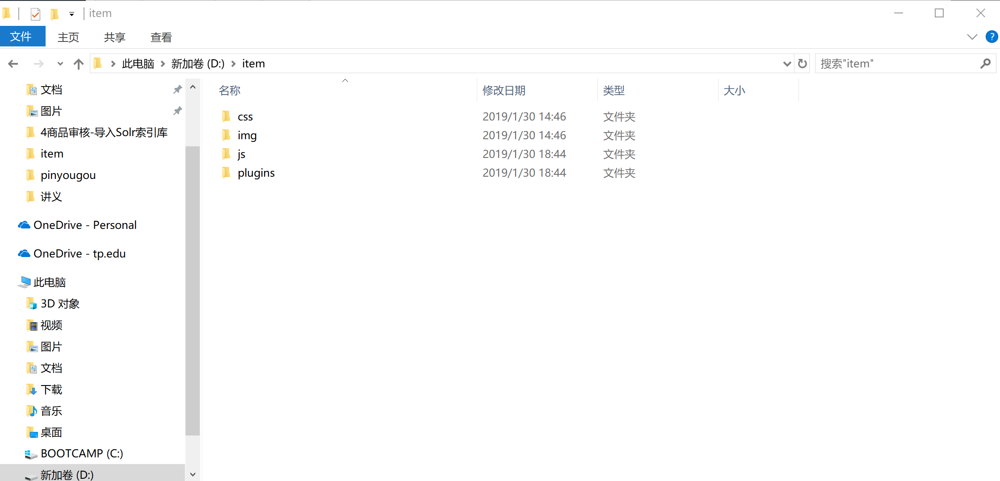