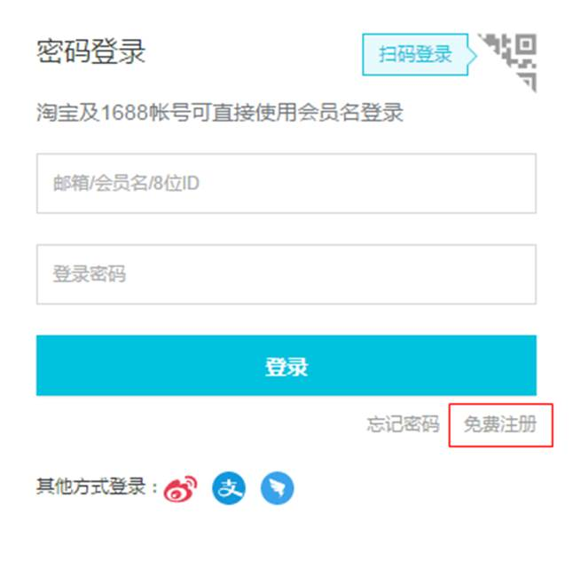
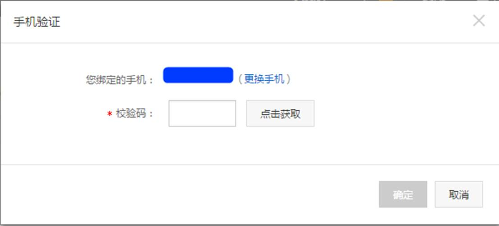
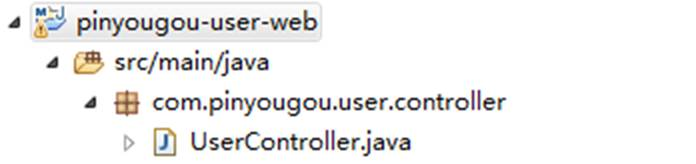

# 2.短信发送平台-阿里大于

## 2.1阿里大于简介 

​       阿里大于是**阿里云**旗下产品，融合了三大运营商的通信能力，通过将传统通信业务和能力与互联网相结合，创新融合阿里巴巴生态内容，全力为中小企业和开发者提供优质服务阿里大于提供包括短信、语音、流量直充、私密专线、店铺手机号等个性化服务。通过阿里大于打通三大运营商通信能力，全面融合阿里巴巴生态，以开放API及SDK的方式向开发者提供通信和数据服务，更好地支撑企业业务发展和创新服务。

## 2.2准备工作

### 2.2.1注册账户

首先我们先进入“阿里大于”  [www.alidayu.com](http://www.baidu.com/baidu.php?url=ZzmK000GQJC8hW1POcJEP4KEa9MqOc64Kv9VaSYkPBGRtKKgrM9zjpMjkg0QSyMnQxKRQWKjPMwVPRtuZHdquplwvyTojNksmJ4fXyH6PR2oD2XMXttLlESx3RspZ_3aMmqjEv4UOpBl4_suPNxrqoJgxNO3dD62O8C6tR-EGupmJLpXA6.7D_iuTZ-GYkYApacrSapBsAprFMw6wKL9JuBBHwmEukmr_X5is1gsdeEQx3txQ_erMktJOAEWkl_LT8FB8zzEWgEvNSQQPLuy--rexduYt8FWojG4THZgZG4THZy7MHWuxJB4THAe_tpqOudEmtxZ_L2N9h9mLU2Srqf.U1Yk0ZDq_2Q0eeH1YSn0IjvsC_jEV55H3sKGUHYznWR0u1dBuHms0ZNG5yF9pywd0ZKGujYk0APGujY1rjR0UgfqnH0YP7tknjDLg1DsnH-xn1msnfKopHYs0ZFY5Hm4P0K-pyfqnHfdndtznHDzPdtkP10snNtznW01PNtznWDLPdtznWDdPsKBpHYznjf0UynqnHR4PWRzPWbdP-t1PWn4rHmknj9xn1mYPjbsnHDYg100TgKGujYs0Z7Wpyfqn0KzuLw9u1Ys0AqvUjYzPWm4Qywlg1cvPW-mQywlg1msn1nVn7t3PHbVnsK9mWYsg100ugFM5H00TZ0qn0K8IM0qna3snj0snj0sn0KVIZ0qn0KbuAqs5H00ThCqn0KbugmqTAn0uMfqn0KspjYs0Aq15H00mMTqnH00UMfqn0K1XWY0IZN15HDLPjnzPjnzP1b4rjnzP1RvPWD10ZF-TgfqnHf3rjcYPjDLPjmvP6K1pyfqmyPbryNBmH6snjK9ujRdnsKWTvYqrjuAwjNarDRdnH03rH7aPsK9m1Yk0ZK85H00TydY5H00Tyd15H00XMfqn0KVmdqhThqV5HDsPjuxn7tsg100uA78IyF-gLK_my4GuZnqn7tsg1Kxn0KbIA-b5H00ugwGujYVnfK9TLKWm1Ys0ZNspy4Wm1Ys0Z7VuWYs0AuWIgfqn0KhXh6qn0KlTAkdT1Ys0A7buhk9u1Yk0APzm1YznWnz&us=0.0.0.0.0.0.10&us=0.0.0.0.0.0.30&ck=0.0.0.0.0.0.0.0&shh=www.baidu.com)  （https://dayu.aliyun.com/）





注册账号后，再在手机下载“阿里云”应用，登陆，然后进行在线实名认证。

### 2.2.2登陆系统

使用刚才注册的账号进行登陆。


点击进入控制台


点击使用**短信服务**


https://home.console.aliyun.com/new#/


 

### 3.2.3申请签名


 


 

### 3.2.4申请模板

 


 


 

### 3.2.5创建accessKey





# 3.短信微服务

## 3.1需求分析

构建一个通用的短信发送服务（独立于品优购的单独工程），接收activeMQ的消息（MAP类型）  消息包括手机号（mobile）、短信模板号（template_code）、签名（sign_name）、参数字符串（param ）

## 3.2代码实现

### 3.2.1工程搭建

（1）创建工程itcast_sms （JAR工程），POM文件引入依赖  

```xml
  <properties>   
    <java.version>1.7</java.version>
  </properties>
  <parent>
    <groupId>org.springframework.boot</groupId>
    <artifactId>spring-boot-starter-parent</artifactId>
	<version>1.4.0.RELEASE</version>
  </parent>  
  <dependencies>
    <dependency>
        <groupId>org.springframework.boot</groupId>
        <artifactId>spring-boot-starter-web</artifactId>
    </dependency>
    <dependency>
	    <groupId>org.springframework.boot</groupId>
	    <artifactId>spring-boot-starter-activemq</artifactId>
	</dependency>
    <dependency>
   		<groupId>com.aliyun</groupId>
   		<artifactId>aliyun-java-sdk-dysmsapi</artifactId>
   		<version>1.0.0-SNAPSHOT</version>
   	</dependency>
   	<dependency>
   		<groupId>com.aliyun</groupId>
   		<artifactId>aliyun-java-sdk-core</artifactId>
   		<version>3.2.5</version>
   	</dependency>
  </dependencies>

```

（2）创建引导类

```java
package cn.itcast.sms;
import org.springframework.boot.SpringApplication;
import org.springframework.boot.autoconfigure.SpringBootApplication;
@SpringBootApplication
public class Application {
	public static void main(String[] args) {
		SpringApplication.run(Application.class, args);
	}
}
```

（3）创建配置文件application.properties

```properties
server.port=9003
spring.activemq.broker-url=tcp://192.168.25.135:61616
accessKeyId=不告诉你
accessKeySecret=不告诉你
```

### 3.2.2短信工具类

参照之前的短信demo创建短信工具类

```java
package cn.itcast.sms;
import com.aliyuncs.DefaultAcsClient;
import com.aliyuncs.IAcsClient;
import com.aliyuncs.dysmsapi.model.v20170525.QuerySendDetailsRequest;
import com.aliyuncs.dysmsapi.model.v20170525.QuerySendDetailsResponse;
import com.aliyuncs.dysmsapi.model.v20170525.SendSmsRequest;
import com.aliyuncs.dysmsapi.model.v20170525.SendSmsResponse;
import com.aliyuncs.exceptions.ClientException;
import com.aliyuncs.profile.DefaultProfile;
import com.aliyuncs.profile.IClientProfile;
import java.text.SimpleDateFormat;
import java.util.Date;
import org.springframework.beans.factory.annotation.Autowired;
import org.springframework.core.env.Environment;
import org.springframework.stereotype.Component;
/**
 * 短信工具类
 * @author Administrator
 *
 */
@Component
public class SmsUtil {

    //产品名称:云通信短信API产品,开发者无需替换
    static final String product = "Dysmsapi";
    //产品域名,开发者无需替换
    static final String domain = "dysmsapi.aliyuncs.com";
    
    @Autowired
    private Environment env;

    // TODO 此处需要替换成开发者自己的AK(在阿里云访问控制台寻找)
    
    /**
     * 发送短信
     * @param mobile 手机号
     * @param template_code 模板号
     * @param sign_name 签名
     * @param param 参数
     * @return
     * @throws ClientException
     */
    public SendSmsResponse sendSms(String mobile,String template_code,String sign_name,String param) throws ClientException {

    	String accessKeyId =env.getProperty("accessKeyId");
        String accessKeySecret = env.getProperty("accessKeySecret");
    	
        //可自助调整超时时间
        System.setProperty("sun.net.client.defaultConnectTimeout", "10000");
        System.setProperty("sun.net.client.defaultReadTimeout", "10000");

        //初始化acsClient,暂不支持region化
        IClientProfile profile = DefaultProfile.getProfile("cn-hangzhou", accessKeyId, accessKeySecret);
        DefaultProfile.addEndpoint("cn-hangzhou", "cn-hangzhou", product, domain);
        IAcsClient acsClient = new DefaultAcsClient(profile);

        //组装请求对象-具体描述见控制台-文档部分内容
        SendSmsRequest request = new SendSmsRequest();
        //必填:待发送手机号
        request.setPhoneNumbers(mobile);
        //必填:短信签名-可在短信控制台中找到
        request.setSignName(sign_name);
        //必填:短信模板-可在短信控制台中找到
        request.setTemplateCode(template_code);
        //可选:模板中的变量替换JSON串,如模板内容为"亲爱的${name},您的验证码为${code}"时,此处的值为
        request.setTemplateParam(param);

        //选填-上行短信扩展码(无特殊需求用户请忽略此字段)
        //request.setSmsUpExtendCode("90997");

        //可选:outId为提供给业务方扩展字段,最终在短信回执消息中将此值带回给调用者
        request.setOutId("yourOutId");

        //hint 此处可能会抛出异常，注意catch
        SendSmsResponse sendSmsResponse = acsClient.getAcsResponse(request);

        return sendSmsResponse;
    }

    public  QuerySendDetailsResponse querySendDetails(String mobile,String bizId) throws ClientException {
    	String accessKeyId =env.getProperty("accessKeyId");
        String accessKeySecret = env.getProperty("accessKeySecret");
        //可自助调整超时时间
        System.setProperty("sun.net.client.defaultConnectTimeout", "10000");
        System.setProperty("sun.net.client.defaultReadTimeout", "10000");
        //初始化acsClient,暂不支持region化
        IClientProfile profile = DefaultProfile.getProfile("cn-hangzhou", accessKeyId, accessKeySecret);
        DefaultProfile.addEndpoint("cn-hangzhou", "cn-hangzhou", product, domain);
        IAcsClient acsClient = new DefaultAcsClient(profile);
        //组装请求对象
        QuerySendDetailsRequest request = new QuerySendDetailsRequest();
        //必填-号码
        request.setPhoneNumber(mobile);
        //可选-流水号
        request.setBizId(bizId);
        //必填-发送日期 支持30天内记录查询，格式yyyyMMdd
        SimpleDateFormat ft = new SimpleDateFormat("yyyyMMdd");
        request.setSendDate(ft.format(new Date()));
        //必填-页大小
        request.setPageSize(10L);
        //必填-当前页码从1开始计数
        request.setCurrentPage(1L);
        //hint 此处可能会抛出异常，注意catch
        QuerySendDetailsResponse querySendDetailsResponse = acsClient.getAcsResponse(request);
        return querySendDetailsResponse;
    }
}
```

### 3.2.3消息监听类

创建SmsListener.java

```java
package cn.itcast.sms;
import java.util.Map;
import org.springframework.beans.factory.annotation.Autowired;
import org.springframework.jms.annotation.JmsListener;
import org.springframework.stereotype.Component;
import com.aliyuncs.dysmsapi.model.v20170525.SendSmsResponse;
import com.aliyuncs.exceptions.ClientException;
/**
 * 消息监听类
 * @author Administrator
 */
@Component
public class SmsListener {
	@Autowired
	private SmsUtil smsUtil;
	
	@JmsListener(destination="sms")
	public void sendSms(Map<String,String> map){		
		try {
			SendSmsResponse response = smsUtil.sendSms(
					map.get("mobile"), 
					map.get("template_code"),
					map.get("sign_name"),
					map.get("param")  );					 
			    System.out.println("Code=" + response.getCode());
		        System.out.println("Message=" + response.getMessage());
		        System.out.println("RequestId=" + response.getRequestId());
		        System.out.println("BizId=" + response.getBizId());			
		} catch (ClientException e) {
			e.printStackTrace();			
		}		
	}
}
```

## 3.3代码测试

修改springboot-demo  的QueueController.java 

```java
	@RequestMapping("/sendmap")
	public void sendMap(){
		Map map=new HashMap<>();
		map.put("mobile", "18019409905");
		map.put("template_code", "SMS_157451012");
		map.put("sign_name","没有签名");
		map.put("param", "{\"code\":\"3456\"}");
		
		jmsMessagingTemplate.convertAndSend("sms", map);
	}
```

启动itcast_sms

启动springboot-demo

地址栏输入：http://localhost:8088/sendmap

观察控制台输出


随后短信也成功发送到你的手机上

实际情况


# 4.用户注册

## 4.1需求分析

完成用户注册功能


## 4.2工程搭建

### 4.2.1用户服务接口层

（1）创建pinyougou-user-interface（jar）

（2）引入pojo依赖

### 4.2.2用户服务实现层

（1）创建pinyougou-user-service（war）

（2）引入spring  dubbox   activeMQ相关依赖，引入依赖（ pinyougou-user-interface  pinyougou-dao  pinyougou-common），运行端口为9006

（3）添加web.xml  

（4）创建Spring 配置文件applicationContext-service.xml 和applicationContent-tx.xml 

```xml
    <dubbo:protocol name="dubbo" port="20886" />
    <dubbo:annotation package="com.pinyougou.user.service.impl" />  
	<dubbo:application name="pinyougou-user-service"/>  
    <dubbo:registry address="zookeeper://192.168.25.135:2181"/>

```

### 4.2.3用户中心WEB层

创建war工程  pinyougou-user-web 我们将注册功能放入此工程

（1）添加web.xml 

（2）引入依赖pinyougou-user-interface 、spring相关依赖（参照其它web工程）,tomcat运行端口9106

（3）添加spring配置文件

（4）拷贝静态原型页面register.html 及相关资源 

## 4.3基本注册功能实现

### 4.3.1生成和拷贝代码





### 4.3.2后端服务实现层

修改pinyougou-user-service的UserServiceImpl.java

```java
	/**
	 * 增加
	 */
	@Override
	public void add(TbUser user) {
		user.setCreated(new Date());//创建日期
		user.setUpdated(new Date());//修改日期
		String password = DigestUtils.md5Hex(user.getPassword());//对密码加密
		user.setPassword(password);
		userMapper.insert(user);		
	}

```

### 4.3.3前端控制层

修改userController.js

```js
 //控制层 
app.controller('userController' ,function($scope,$controller   ,userService){	
	//注册
	$scope.reg=function(){		
	    if($scope.entity.password!=$scope.password)  {
	      	alert("两次输入的密码不一致，请重新输入");		    	
	      	return ;
	    } 		
		userService.add( $scope.entity  ).success(
			function(response){
				alert(response.message);
			}		
		);				
	}    
});	

```

### 4.3.4修改页面

修改页面register.html ，引入js

```html
<script type="text/javascript" src="plugins/angularjs/angular.min.js"></script>
<script type="text/javascript" src="js/base.js"></script>	
<script type="text/javascript" src="js/service/userService.js"></script>	
<script type="text/javascript" src="js/controller/userController.js"></script>

```

指令

```html
<body ng-app="pinyougou" ng-controller="userController" >
```

绑定表单

```html
<form class="sui-form form-horizontal">
		<div class="control-group">
			<label class="control-label">用户名：</label>
			<div class="controls">
				<input type="text" placeholder="请输入你的用户名" ng-model="entity.username" class="input-xfat input-xlarge">
			</div>
		</div>
		<div class="control-group">
			   <label for="inputPassword" class="control-label">登录密码：</label>
			<div class="controls">
				<input type="password" placeholder="设置登录密码" ng-model="entity.password" class="input-xfat input-xlarge">
			</div>
		</div>
		<div class="control-group">
			<label for="inputPassword" class="control-label">确认密码：</label>
			<div class="controls">
							<input type="password" placeholder="再次确认密码" ng-model="password" class="input-xfat input-xlarge">
			</div>
		</div>
		<div class="control-group">
				<label class="control-label">手机号：</label>
				<div class="controls">
				<input type="text" placeholder="请输入你的手机号" ng-model="entity.phone" class="input-xfat input-xlarge">
				</div>
		</div>
		<div class="control-group">
				<label for="inputPassword" class="control-label">短信验证码：</label>
				<div class="controls">
					<input type="text" placeholder="短信验证码" class="input-xfat input-xlarge">  <a href="#">获取短信验证码</a>
				</div>
		</div>
		<div class="control-group">
				<label for="inputPassword" class="control-label">&nbsp;&nbsp;&nbsp;&nbsp;&nbsp;&nbsp;</label>
				<div class="controls">
				<input name="m1" type="checkbox" value="2" checked=""><span>同意协议并注册《品优购用户协议》</span>
				</div>
		</div>
		<div class="control-group">
			<label class="control-label"></label>
			<div class="controls btn-reg">
				<a class="sui-btn btn-block btn-xlarge btn-danger" ng-click="reg()" target="_blank">完成注册</a>
			</div>
		</div>
</form>

```

## 4.4 注册判断短信验证码

### 4.4.1实现思路

点击页面上的”获取短信验证码”连接，向后端传递手机号。后端随机生成6位数字作为短信验证码，将其保存在redis中（手机号作为KEY），并发送到短信网关。

用户注册时，后端根据手机号查询redis中的验证码与用户填写的验证码是否相同，如果不同则提示用户不能注册。

### 4.4.2生成验证码

（1）修改pinyougou-user-interface工程UserService.java  ，增加方法

```java
	/**
	 * 生成短信验证码
	 * @return
	 */
	public void createSmsCode(String phone);

```

（2）修改pinyougou-user-service工程的UserServiceImpl.java

```java
	@Autowired
	private RedisTemplate<String , Object> redisTemplate;	
	/**
	 * 生成短信验证码
	 */
	public void createSmsCode(String phone){
		//生成6位随机数
		String code =  (long) (Math.random()*1000000)+"";
		System.out.println("验证码："+code);
		//存入缓存
		redisTemplate.boundHashOps("smscode").put(phone, code);
		//发送到activeMQ	....
	}

```

（3）在 pinyougou-common  添加工具类PhoneFormatCheckUtils.java，用于验证手机号

（4）修改pinyougou-user-web的UserController.java

```java
	/**
	 * 发送短信验证码
	 * @param phone
	 * @return
	 */
	@RequestMapping("/sendCode")
	public Result sendCode(String phone){
		//判断手机号格式
		if(!PhoneFormatCheckUtils.isPhoneLegal(phone)){
			return new Result(false, "手机号格式不正确");
		}		
		try {
			userService.createSmsCode(phone);//生成验证码
			return new Result(true, "验证码发送成功");
		} catch (Exception e) {
			e.printStackTrace();
			return new Result(true, "验证码发送失败");
		}		
	}

```

（5）pinyougou-user-web的userService.js

```js
	//发送验证码
	this.sendCode=function(phone){
		return $http.get("../user/sendCode.do?phone="+phone);
	}

```

（6）pinyougou-user-web的userController.js

```js
//发送验证码
	$scope.sendCode=function(){
		if($scope.entity.phone==null){
			alert("请输入手机号！");
			return ;
		}		
		userService.sendCode($scope.entity.phone).success(
			function(response){
				alert(response.message);								
			}				
		);
	}

```

（7）修改页面register.html

```html
<a ng-click="sendCode()" >获取短信验证码</a>
```

### 4.4.3用户注册判断验证码

（1）修改pinyougou-user-interface的UserService.java 

```java
	/**
	 * 判断短信验证码是否存在
	 * @param phone
	 * @return
	 */
	public boolean  checkSmsCode(String phone,String code);

```

（2）修改pinyougou-user-service的
UserServiceImpl.java

```java
/**
	 * 判断验证码是否正确
	 */
	public boolean  checkSmsCode(String phone,String code){
		//得到缓存中存储的验证码
		String sysCode = (String) redisTemplate.boundHashOps("smscode").get(phone);
		if(sysCode==null){
			return false;
		}
		if(!sysCode.equals(code)){
			return false;
		}
		return true;		
	}

```

（3）修改pinyougou-user-web的UserController.java 

```java
	/**
	 * 增加
	 * @param user
	 * @return
	 */
	@RequestMapping("/add")
	public Result add(@RequestBody TbUser user,String smscode){
		boolean checkSmsCode = userService.checkSmsCode(user.getPhone(), smscode);
		if(checkSmsCode==false){
			return new Result(false, "验证码输入错误！");			
		}		
		try {
			userService.add(user);
			return new Result(true, "增加成功");
		} catch (Exception e) {
			e.printStackTrace();
			return new Result(false, "增加失败");
		}
	}

```

（4）修改pinyougou-user-web的userService.js

```js
	//增加 
	this.add=function(entity,smscode){
		return  $http.post('../user/add.do?smscode='+smscode ,entity );
	}

```

（5）修改pinyougou-portal-web 的UserController.java

```java
	//保存 
	$scope.reg=function(){				
			userService.add( $scope.entity, $scope.smscode  ).success(
			function(response){				
				alert(response.message);
			}		
		);				
	}

```

（6）修改页面，绑定变量

```html
<input type="text" placeholder="短信验证码" ng-model="smscode" class="input-xfat input-xlarge">  <a href="#" ng-click="sendCode()">获取短信验证码</a>
```

### 4.4.4短信验证码发送到手机

（1）在pinyougou-user-service添加配置文件applicationContext-activemq.xml

```xml
    <!-- 真正可以产生Connection的ConnectionFactory，由对应的 JMS服务厂商提供-->  
	<bean id="targetConnectionFactory" class="org.apache.activemq.ActiveMQConnectionFactory">  
	    <property name="brokerURL" value="tcp://192.168.25.135:61616"/>  
	</bean> 
    <!-- Spring用于管理真正的ConnectionFactory的ConnectionFactory -->  
	<bean id="connectionFactory" class="org.springframework.jms.connection.SingleConnectionFactory">  
	<!-- 目标ConnectionFactory对应真实的可以产生JMS Connection的ConnectionFactory -->  
	    <property name="targetConnectionFactory" ref="targetConnectionFactory"/>  
	</bean>     
    <!-- Spring提供的JMS工具类，它可以进行消息发送、接收等 -->  
	<bean id="jmsTemplate" class="org.springframework.jms.core.JmsTemplate">  
	    <!-- 这个connectionFactory对应的是我们定义的Spring提供的那个ConnectionFactory对象 -->  
	    <property name="connectionFactory" ref="connectionFactory"/>  
	</bean>      
	<!--这个是点对点消息  -->  
	<bean id="smsDestination" class="org.apache.activemq.command.ActiveMQQueue">  
	    <constructor-arg value="sms"/>  
	</bean>  

```

（2）修改pinyougou-user-service的UserServiceImpl.java

```java
	@Autowired
	private JmsTemplate jmsTemplate;	
	@Autowired
	private Destination smsDestination;	

	@Value("${template_code}")
	private String template_code;
	
	@Value("${sign_name}")
	private String sign_name;


	/**
	 * 生成短信验证码
	 */
	public void createSmsCode(final String phone){		
		//生成6位随机数
		final String code =  (long) (Math.random()*1000000)+"";
		System.out.println("验证码："+code);
		//存入缓存
		redisTemplate.boundHashOps("smscode").put(phone, code);
		//发送到activeMQ		
		jmsTemplate.send(smsDestination, new MessageCreator() {			
			@Override
			public Message createMessage(Session session) throws JMSException {	
				MapMessage mapMessage = session.createMapMessage();			
				mapMessage.setString("mobile", phone);//手机号
				mapMessage.setString("template_code", "SMS_85735065");//模板编号
				mapMessage.setString("sign_name", "黑马");//签名				
				Map m=new HashMap<>();
				m.put("number", code);				
				mapMessage.setString("param", JSON.toJSONString(m));//参数
				return mapMessage;
			}
		});				
	}

```

（3）在pinyougou-common的properties目录下创建配置文件sms.properties

```properties
template_code=SMS_85735065
sign_name=\u9ED1\u9A6C

```

测试


