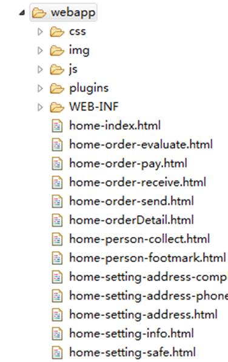
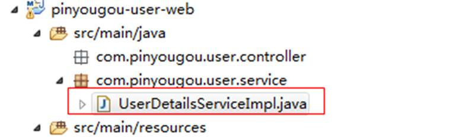
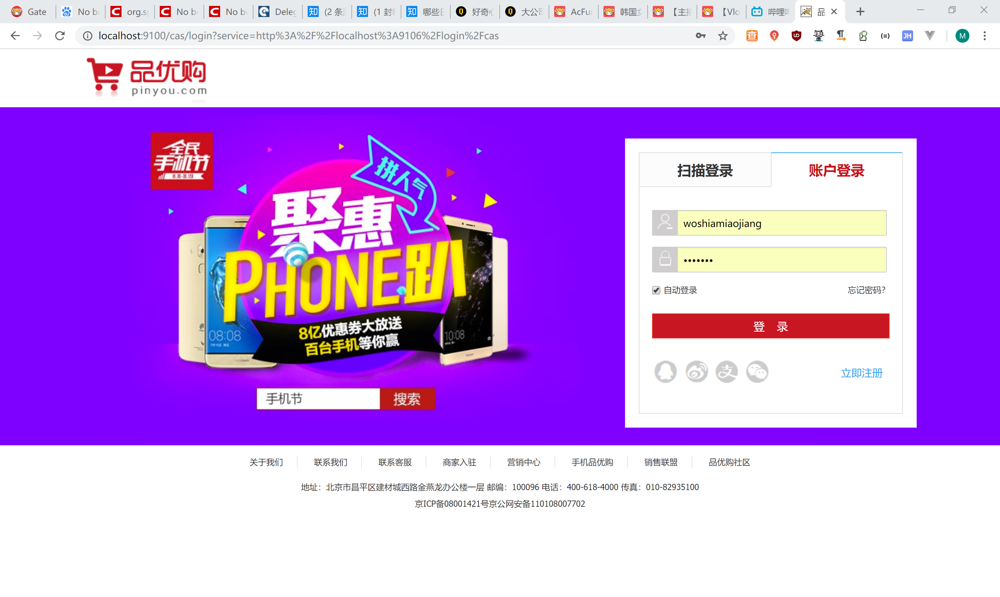
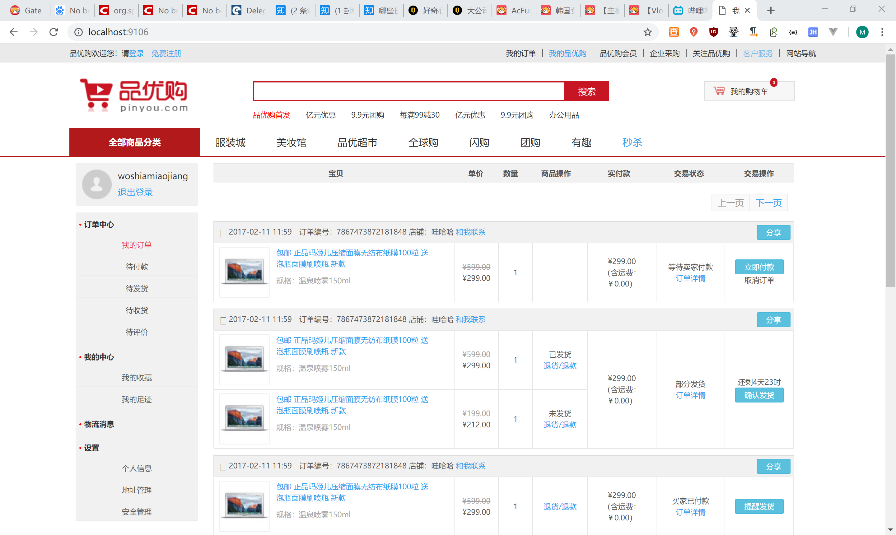
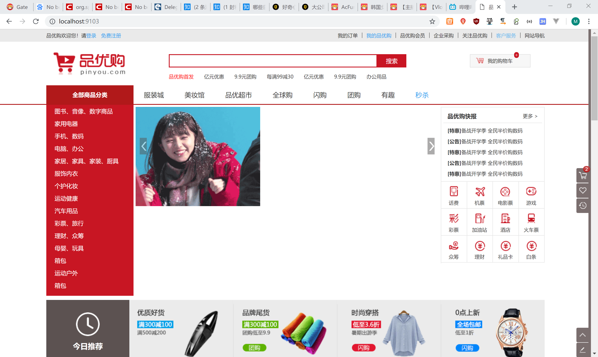

# 5.品优购用户中心

## 5.1需求分析

用户中心实现单点登录。

## 5.2代码实现

### 5.2.1用户中心实现单点登录

（1）将用户中心相关的页面（home-开头的）拷贝至  pinnyougou-user-web  



（2）pom.xml 引入springSecurity、cas客户端和springSecurity Cas整合包依赖（参照casclient_demo3）。

（3）web.xml  添加spring-security过滤器（参照参照casclient_demo3）设置首页为home-index.html

```xml
	<welcome-file-list>
		<welcome-file>home-index.html</welcome-file>
	</welcome-file-list>

```

（4）构建UserDetailsServiceImpl.java  （参照casclient_demo3）



（5）添加spring-security.xml（参照casclient_demo3），并做以下修改

配置匿名访问资源

```xml
	<!-- 匿名访问资源 -->
	<http pattern="/css/**" security="none"></http>
	<http pattern="/js/**" security="none"></http>
	<http pattern="/image/**" security="none"></http>
	<http pattern="/plugins/**" security="none"></http>
	<http pattern="/register.html" security="none"></http>
	<http pattern="/user/add.do" security="none"></http>
	<http pattern="/user/sendCode.do" security="none"></http>

```

设置服务地址属性

```xml
<beans:bean id="serviceProperties" class="org.springframework.security.cas.ServiceProperties">    
     <beans:property name="service" value="http://localhost:9106/login/cas"/>
</beans:bean>  

```

设置认证类

```xml
<beans:bean 
id="userDetailsService" class="com.pinyougou.user.service.UserDetailServiceImpl"/>  

```

### 5.2.2页面显示用户名

（1）pinyougou-user-web创建LoginController.java

```java
@RestController
@RequestMapping("/login")
public class LoginController {	
	@RequestMapping("/name")
	public Map showName(){
		String name = SecurityContextHolder.getContext().getAuthentication().getName();//得到登陆人账号
		Map map=new HashMap<>();
		map.put("loginName", name);
		return map;		
	}	
}

```

（2）创建loginService.js

```js
//服务层
app.service('loginService',function($http){
	//读取列表数据绑定到表单中
	this.showName=function(){
		return $http.get('../login/name.do');		
	}
});

```

（3）创建indexController.js

```js
//首页控制器
app.controller('indexController',function($scope,loginService){
	$scope.showName=function(){
		loginService.showName().success(
			function(response){				
				$scope.loginName=response.loginName;
			}
		);		
	}	
});

```

（5）修改home-index.html  引入js

```html
    <script type="text/javascript" src="plugins/angularjs/angular.min.js"></script>
	<script type="text/javascript" src="js/base.js"></script>	
	<script type="text/javascript" src="js/service/loginService.js"></script>
	<script type="text/javascript" src="js/controller/indexController.js"></script>

```

指令，调用方法查询登陆名

```html
<body ng-app="pinyougou" ng-controller="indexController" ng-init="showName()">
```

显示用户名

```html
 <span class="name">{{loginName}}</span>
```

### 5.2.3退出登录

设置退出登录后的跳转地址

```xml
<beans:bean id="requestSingleLogoutFilter" class="org.springframework.security.web.authentication.logout.LogoutFilter">  
        <beans:constructor-arg value="http://localhost:9100/cas/logout?service=http://localhost:9103"/>  
       ........  
</beans:bean>  

```

退出登录后，跳转到网站首页

```html
<span class="safe"> <a href="/logout/cas">退出登录 </a></span>
```

测试







