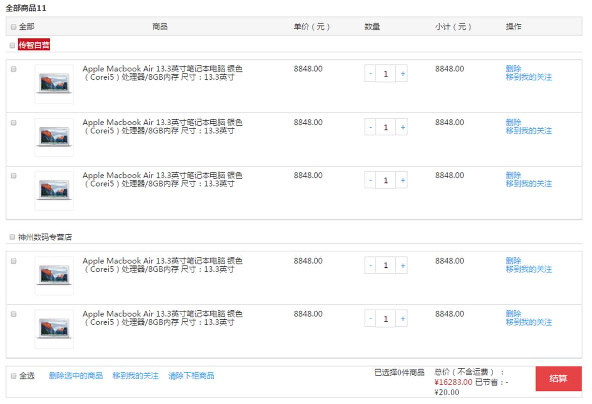
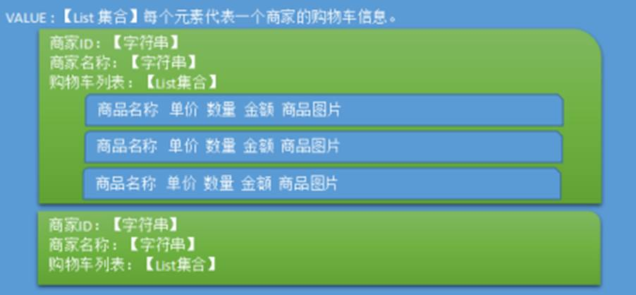
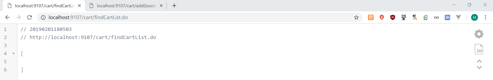
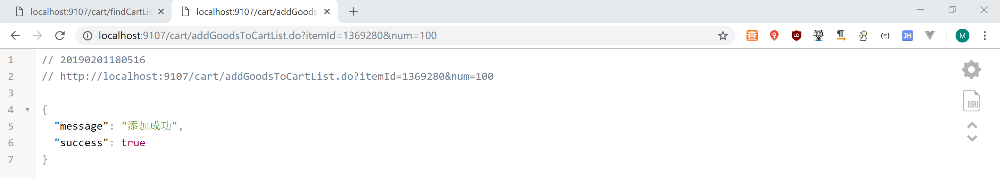
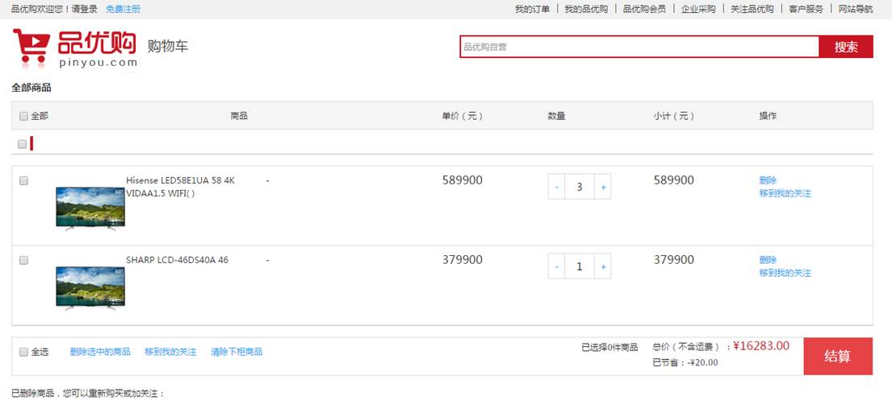
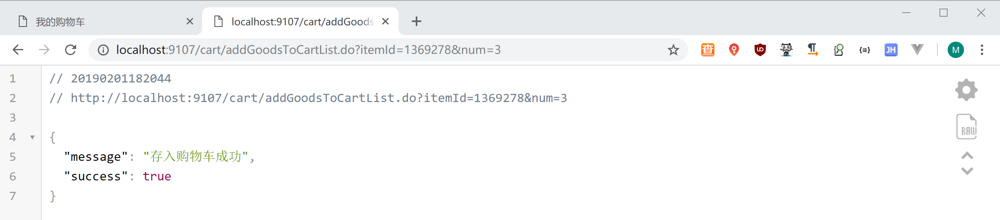
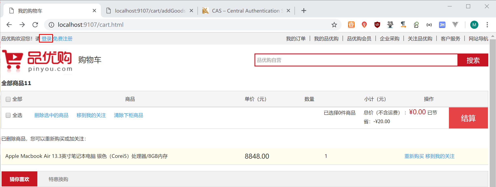
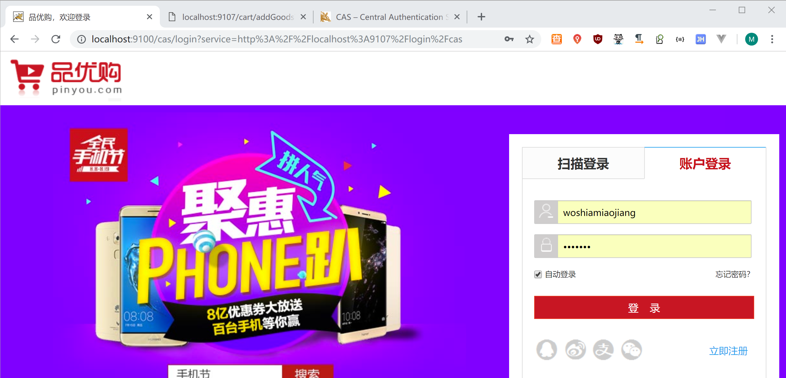
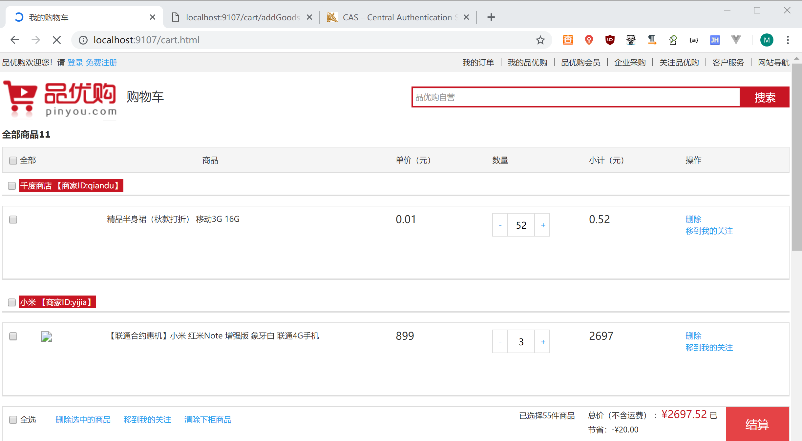

# 1.购物车需求分析与解决方案

## 1.1需求分析

用户在商品详细页点击加入购物车，提交商品SKU编号和购买数量，添加到购物车。购物车展示页面如下：



## 1.2实现思路

购物车数据的存储结构如下：



当用户在未登录的情况下，将此购物车存入cookies , 在用户登陆的情况下，将购物车数据存入redis  。如果用户登陆时，cookies中存在购物车，需要将cookies的购物车合并到redis中存储.

## 1.3工程搭建

（1）创建工程pinyougou-cart-interface  ，依赖pinyougou-pojo

（2）创建工程pinyougou-cart-service（WAR），依赖pinyougou-cart-interface 和pinyougou-common工程 和spring、 dubbox  等相关依赖,  添加web.xml 与spring配置文件（参照其他service工程）  tomcat插件端口设置为9007  ，dubbo端口为20887 

（3）创建工程pinyougou-cart-web  ,依赖 pinyougou-cart-interface   springsecurity 、CAS 等。添加web.xml 与spring配置文件（参照其他web工程）tomcat插件端口设置为9107 ，拷贝UserDetailServiceImpl.java  ,  拷贝页面资源 


（4）将资源文件夹中 Cookie工具类拷贝到pinyougou-common工程中。需要在pinyougou-common工程引入servlet-api依赖

```xml
	<dependency>
		<groupId>javax.servlet</groupId>
		<artifactId>servlet-api</artifactId>
		<scope>provided</scope>
	</dependency>

```

## 1.4购物车实体类

在pinyougou-pojo的com.pinyougou.pojogroup中创建购物车实体类  

```java
package com.pinyougou.pojogroup;

import java.io.Serializable;
import java.util.List;

import com.pinyougou.pojo.TbOrderItem;
/**
 * 购物车对象
 * @author Administrator
 *
 */
public class Cart implements Serializable{

   private String sellerId;//商家ID
   private String sellerName;//商家名称
   
   private List<TbOrderItem> orderItemList;//购物车明细集合

   public String getSellerId() {
      return sellerId;
   }

   public void setSellerId(String sellerId) {
      this.sellerId = sellerId;
   }

   public String getSellerName() {
      return sellerName;
   }

   public void setSellerName(String sellerName) {
      this.sellerName = sellerName;
   }

   public List<TbOrderItem> getOrderItemList() {
      return orderItemList;
   }

   public void setOrderItemList(List<TbOrderItem> orderItemList) {
      this.orderItemList = orderItemList;
   }
   
   
   
}
```

这个类是对每个商家的购物车进行的封装 

# 2.Cookie存储购物车

## 2.1需求分析

使用cookie存储购物车数据。服务层负责逻辑，控制层负责读写cookie 。

## 2.2服务接口层

（1）服务层接口  pinyougou-cart-interface新建com.pinyougou.cart.service包，包下建立接口CartService

```java
package com.pinyougou.cart.service;

import com.pinyougou.pojogroup.Cart;

import java.util.List;

/**
 * 购物车服务接口 
 * @author Administrator
 *
 */
public interface CartService {
   /**
    * 添加商品到购物车
    * @param cartList
    * @param itemId
    * @param num
    * @return
    */
   public List<Cart> addGoodsToCartList(List<Cart> cartList, Long itemId, Integer num );
}
```

## 2.3服务实现层

实现思路:

```xml
		//1.根据商品SKU ID查询SKU商品信息
		//2.获取商家ID		
		//3.根据商家ID判断购物车列表中是否存在该商家的购物车		
		//4.如果购物车列表中不存在该商家的购物车
		//4.1 新建购物车对象
		//4.2 将新建的购物车对象添加到购物车列表		
		//5.如果购物车列表中存在该商家的购物车		
		// 查询购物车明细列表中是否存在该商品
		//5.1. 如果没有，新增购物车明细		
		//5.2. 如果有，在原购物车明细上添加数量，更改金额

```

代码实现
pinyougou-cart-service 工程创建CartServiceImpl.java

```java
package com.pinyougou.cart.service.impl;

import com.pinyougou.cart.service.CartService;
import com.pinyougou.mapper.TbItemMapper;
import com.pinyougou.pojo.TbItem;
import com.pinyougou.pojo.TbOrderItem;
import com.pinyougou.pojogroup.Cart;
import org.springframework.beans.factory.annotation.Autowired;
import org.springframework.stereotype.Service;

import java.math.BigDecimal;
import java.util.ArrayList;
import java.util.List;

/**
 * 购物车服务实现类
 * @author Administrator
 *
 */
@Service
public class CartServiceImpl implements CartService {

   @Autowired
   private TbItemMapper itemMapper;
   
   @Override
   public List<Cart> addGoodsToCartList(List<Cart> cartList, Long itemId, Integer num) {
   
      //1.根据商品SKU ID查询SKU商品信息
      TbItem item = itemMapper.selectByPrimaryKey(itemId);
      if(item==null){
         throw new RuntimeException("商品不存在");
      }
      if(!item.getStatus().equals("1")){
         throw new RuntimeException("商品状态无效");
      }
      
      //2.获取商家ID    
      String sellerId = item.getSellerId();
      
      //3.根据商家ID判断购物车列表中是否存在该商家的购物车     
      Cart cart = searchCartBySellerId(cartList,sellerId);
      
      //4.如果购物车列表中不存在该商家的购物车
      if(cart==null){       
         
         //4.1 新建购物车对象 ，
         cart=new Cart();
         cart.setSellerId(sellerId);
         cart.setSellerName(item.getSeller());                 
         TbOrderItem orderItem = createOrderItem(item,num);
         List orderItemList=new ArrayList();
orderItemList.add(orderItem);
         cart.setOrderItemList(orderItemList);
         
         //4.2将购物车对象添加到购物车列表
         cartList.add(cart);
         
      }else{
         //5.如果购物车列表中存在该商家的购物车        
         // 判断购物车明细列表中是否存在该商品
         TbOrderItem orderItem = searchOrderItemByItemId(cart.getOrderItemList(),itemId);
                  
         if(orderItem==null){
            //5.1. 如果没有，新增购物车明细             
            orderItem=createOrderItem(item,num);
            cart.getOrderItemList().add(orderItem);
         }else{
            //5.2. 如果有，在原购物车明细上添加数量，更改金额
            orderItem.setNum(orderItem.getNum()+num);        
            orderItem.setTotalFee(new BigDecimal(orderItem.getNum()*orderItem.getPrice().doubleValue())  );
            //如果数量操作后小于等于0，则移除
            if(orderItem.getNum()<=0){
               cart.getOrderItemList().remove(orderItem);//移除购物车明细    
            }
            //如果移除后cart的明细数量为0，则将cart移除
            if(cart.getOrderItemList().size()==0){
               cartList.remove(cart);
            }
         }        
      }        
      return cartList;
   }
   
   
   /**
    * 根据商家ID查询购物车对象
    * @param cartList
    * @param sellerId
    * @return
    */
   private Cart searchCartBySellerId(List<Cart> cartList, String sellerId){
      for(Cart cart:cartList){
         if(cart.getSellerId().equals(sellerId)){
            return cart;
         }     
      }
      return null;
   }
   
   /**
    * 根据商品明细ID查询
    * @param orderItemList
    * @param itemId
    * @return
    */
   private TbOrderItem searchOrderItemByItemId(List<TbOrderItem> orderItemList ,Long itemId ){
      for(TbOrderItem orderItem :orderItemList){
         if(orderItem.getItemId().longValue()==itemId.longValue()){
            return orderItem;           
         }        
      }
      return null;
   }
   
   /**
    * 创建订单明细
    * @param item
    * @param num
    * @return
    */
   private TbOrderItem createOrderItem(TbItem item,Integer num){
      if(num<=0){
         throw new RuntimeException("数量非法");
      }
      
      TbOrderItem orderItem=new TbOrderItem();
      orderItem.setGoodsId(item.getGoodsId());
      orderItem.setItemId(item.getId());
      orderItem.setNum(num);
      orderItem.setPicPath(item.getImage());
      orderItem.setPrice(item.getPrice());
      orderItem.setSellerId(item.getSellerId());
      orderItem.setTitle(item.getTitle());
      orderItem.setTotalFee(new BigDecimal(item.getPrice().doubleValue()*num));
      return orderItem;
   }
}
```

## 2.4后端控制层

实现思路：

（1）从cookie中取出购物车

（2）向购物车添加商品

（3）将购物车存入cookie 

pinyougou-cart-web工程新建CartController.java 

```java
package com.pinyougou.cart.controller;

import com.alibaba.dubbo.config.annotation.Reference;
import com.alibaba.fastjson.JSON;
import com.pinyougou.cart.service.CartService;
import com.pinyougou.pojogroup.Cart;
import entity.Result;
import org.springframework.beans.factory.annotation.Autowired;
import org.springframework.web.bind.annotation.RequestMapping;
import org.springframework.web.bind.annotation.RestController;

import javax.servlet.http.HttpServletRequest;
import javax.servlet.http.HttpServletResponse;
import java.util.List;

@RestController
@RequestMapping("/cart")
public class CartController {

   @Reference
   private CartService cartService;
   
   @Autowired
   private HttpServletRequest request;
   
   @Autowired
   private HttpServletResponse response;
   
   
   /**
    * 购物车列表
    * @param request
    * @return
    */
   @RequestMapping("/findCartList")
   public List<Cart> findCartList(){
      String cartListString = util.CookieUtil.getCookieValue(request, "cartList","UTF-8");
      if(cartListString==null || cartListString.equals("")){
         cartListString="[]";
      }
      List<Cart> cartList_cookie = JSON.parseArray(cartListString, Cart.class);
      return cartList_cookie;    
   }
   
   /**
    * 添加商品到购物车
    * @param request
    * @param response
    * @param itemId
    * @param num
    * @return
    */
   @RequestMapping("/addGoodsToCartList")
   public Result addGoodsToCartList(Long itemId, Integer num){
      try {        
         List<Cart> cartList =findCartList();//获取购物车列表
         cartList = cartService.addGoodsToCartList(cartList, itemId, num);  
         util.CookieUtil.setCookie(request, response, "cartList", JSON.toJSONString(cartList),3600*24,"UTF-8");
         return new Result(true, "添加成功");
      } catch (Exception e) {
         e.printStackTrace();
         return new Result(false, "添加失败");
      }
   }  
}
```

**浏览器测试：**

查看购物车：

http://localhost:9107/cart/findCartList.do

测试



添加商品到购物车 ：

http://localhost:9107/cart/addGoodsToCartList.do?itemId=1369280&num=100

测试



# 3.购物车前端代码

## 3.1需求分析

实现购物车页面的展示与相关操作



可以实现购物车列表、数量的增减与移除以及合计数统计

## 3.2购物车列表

### 3.2.1前端服务层

pinyougou-cart-web增加cartService.js

```js
//购物车服务层
app.service('cartService',function($http){
	//购物车列表
	this.findCartList=function(){
		return $http.get('cart/findCartList.do');		
	}
});

```

### 3.2.2前端控制层

pinyougou-cart-web增加cartController.js  

```js
//购物车控制层 
app.controller('cartController',function($scope,cartService){
	//查询购物车列表
	$scope.findCartList=function(){
		cartService.findCartList().success(
			function(response){
				$scope.cartList=response;
			}
		);		
	}
});

```

### 3.2.3页面

修改cart.html  引入js

```html
    <script type="text/javascript" src="plugins/angularjs/angular.min.js">  </script>
    <script type="text/javascript" src="js/base.js">  </script>
    <script type="text/javascript" src="js/service/cartService.js">  </script>
    <script type="text/javascript" src="js/controller/cartController.js">  </script> 

```

添加相关指令，指定控制器，调用初始化方法

```html
<body ng-app="pinyougou" ng-controller="cartController" ng-init="findCartList()">
```

循环显示购物车列表

```html
<div class="cart-item-list" ng-repeat="cart in cartList">
	<div class="cart-shop">
		<input type="checkbox" name="" id="" value="" />
		<span class="shopname self">{{cart.sellerName}}【商家ID:{{cart.sellerId}}】</span>
	</div>
	<div class="cart-body">
		<div class="cart-list" ng-repeat="orderItem in cart.orderItemList">
			<ul class="goods-list yui3-g">
				<li class="yui3-u-1-24">
					<input type="checkbox" name="" id="" value="" />
				</li>
				<li class="yui3-u-11-24">
					<div class="good-item">
						<div class="item-img"></div>
						<div class="item-msg">
							{{orderItem.title}}
						</div>
					</div>
				</li>				
				<li class="yui3-u-1-8"><span class="price">{{orderItem.price.toFixed(2)}}</span></li>
				<li class="yui3-u-1-8">
					<a href="javascript:void(0)" class="increment mins">-</a>
					<input autocomplete="off" type="text" ng-model="orderItem.num"  minnum="1" class="itxt" />
					<a href="javascript:void(0)" class="increment plus">+</a>
				</li>
				<li class="yui3-u-1-8"><span class="sum">{{orderItem.totalFee.toFixed(2)}}</span></li>
				<li class="yui3-u-1-8">
					<a href="#none">删除</a><br />
					<a href="#none">移到我的关注</a>
				</li>
			</ul>
		</div>		
	</div>
</div>

```

## 3.3购物车数量增减与移除

### 3.3.1前端服务层

pinyougou-cart-web的 cartService.js

```js
	//添加商品到购物车
	this.addGoodsToCartList=function(itemId,num){
		return $http.get('cart/addGoodsToCartList.do?itemId='+itemId+'&num='+num);
	}

```

### 3.3.2前端控制层

pinyougou-cart-web的 cartController.js

```js
	//添加商品到购物车
	$scope.addGoodsToCartList=function(itemId,num){
		cartService.addGoodsToCartList(itemId,num).success(
			function(response){
				if(response.success){
					$scope.findCartList();//刷新列表
				}else{
					alert(response.message);//弹出错误提示
				}				
			}
		);
	}

```

### 3.3.3页面

修改pinyougou-cart-web的cart.html   实现数量增减

```html
<li class="yui3-u-1-8">
	<a href="javascript:void(0)" ng-click="addGoodsToCartList(orderItem.itemId,-1)" class="increment mins">-</a>
	<input autocomplete="off" type="text" ng-model="orderItem.num"  minnum="1" class="itxt" />
	<a href="javascript:void(0)" ng-click="addGoodsToCartList(orderItem.itemId,1)"  class="increment plus">+</a>  </li>

```

实现删除功能

```html
<a href="#none" ng-click="addGoodsToCartList(orderItem.itemId,-orderItem.num)" >删除</a><br />
```

## 3.4合计数

### 3.4.1前端服务层

修改cartService.js  

```js
	//求合计
	this.sum=function(cartList){		
		var totalValue={totalNum:0, totalMoney:0.00 };//合计实体
		for(var i=0;i<cartList.length;i++){
			var cart=cartList[i];
			for(var j=0;j<cart.orderItemList.length;j++){
				var orderItem=cart.orderItemList[j];//购物车明细
				totalValue.totalNum+=orderItem.num;
				totalValue.totalMoney+= orderItem.totalFee;
			}				
		}
		return totalValue;
	}

```

### 3.4.2前端控制层

修改cartController.js ，调用服务层方法

```js
	//查询购物车列表
	$scope.findCartList=function(){
		cartService.findCartList().success(
			function(response){
				$scope.cartList=response;
				$scope.totalValue=cartService.sum($scope.cartList);//求合计数
			}
		);
	}

```

### 3.4.3页面

```html
<div class="chosed">已选择<span>{{totalValue.totalNum}}</span>件商品</div>
		<div class="sumprice">
	    <span><em>总价（不含运费） ：
</em><i class="summoney">¥{{totalValue.totalMoney}}</i></span>
</div>

```

# 4.Redis存储购物车

## 4.1需求分析

判断当前用户是否登陆，如果未登录采用Cookie存储，如果登录则采用Redis存储。登录后要进行Cookie购物车与Redis购物车的合并操作，并清除Cookie购物车。

## 4.2获取当前登录人账号

### 4.2.1配置文件

spring-security.xml 更改配置:

去掉

```xml
<http pattern="/cart/*.do" security="none"></http>
```

添加

```xml
	<http use-expressions="false" entry-point-ref="casProcessingFilterEntryPoint">
	   <intercept-url pattern="/cart/*.do" access="IS_AUTHENTICATED_ANONYMOUSLY"/>
        <intercept-url pattern="/**" access="ROLE_USER"/>  
        <custom-filter position="CAS_FILTER" ref="casAuthenticationFilter" />  
        <custom-filter ref="requestSingleLogoutFilter" before="LOGOUT_FILTER"/>  
        <custom-filter ref="singleLogoutFilter" before="CAS_FILTER"/>  
    </http>

```

access="IS_AUTHENTICATED_ANONYMOUSLY" 用于设置资源可以在不登陆时可以访问。

此配置与 security="none"的区别在于当用户未登陆时获取登陆人账号的值为anonymousUser  ，而security="none"的话，无论是否登陆都不能获取登录人账号的值。

### 4.2.2代码实现

在pinyougou-cart-web的findCartList和addGoodsToCartList方法中，获取用户名

```java
//得到登陆人账号,判断当前是否有人登陆
String username = SecurityContextHolder.getContext().getAuthentication().getName();    

```

测试：当用户未登陆时，username的值为anonymousUser  

## 4.3远程购物车存取

### 4.3.1服务接口层

pinyougou-cart-interface中CartService.java定义方法

```java
	/**
	 * 从redis中查询购物车
	 * @param username
	 * @return
	 */
	public List<Cart> findCartListFromRedis(String username);
	
	/**
	 * 将购物车保存到redis
	 * @param username
	 * @param cartList
	 */
	public void saveCartListToRedis(String username,List<Cart> cartList);

```

### 4.3.2服务实现层

pinyougou-cart-service中CartServiceImpl.java实现方法

```java
	@Autowired
	private RedisTemplate redisTemplate;
	@Override
	public List<Cart> findCartListFromRedis(String username) {
		System.out.println("从redis中提取购物车数据....."+username);
		List<Cart> cartList = (List<Cart>) redisTemplate.boundHashOps("cartList").get(username);
		if(cartList==null){
			cartList=new ArrayList();
		}
		return cartList;
	}
	@Override
	public void saveCartListToRedis(String username, List<Cart> cartList) {
		System.out.println("向redis存入购物车数据....."+username);
		redisTemplate.boundHashOps("cartList").put(username, cartList);
	}

```

### 4.3.3控制层

修改CartController.java的findCartList方法

```java
/**
 * 购物车列表
 * @param request
 * @return
 */
@RequestMapping("/findCartList")
public List<Cart> findCartList(){
	String username = SecurityContextHolder.getContext().getAuthentication().getName(); 
	if(username.equals("anonymousUser")){//如果未登录
		//读取本地购物车//
		..........
		return cartList_cookie;
	}else{//如果已登录					
		List<Cart> cartList_redis =cartService.findCartListFromRedis(username);//从redis中提取				
		return cartList_redis;
	}			
}

```

修改addGoodsToCartList方法

```java
/**
 * 添加商品到购物车
 * @param request
 * @param response
 * @param itemId
 * @param num
 * @return
 */
@RequestMapping("/addGoodsToCartList")
public Result addGoodsToCartList(Long itemId,Integer num){
	String username = SecurityContextHolder.getContext().getAuthentication().getName(); 
	System.out.println("当前登录用户："+username);
	try {			
		List<Cart> cartList =findCartList();//获取购物车列表
		cartList = cartService.addGoodsToCartList(cartList, itemId, num);
		if(username.equals("anonymousUser")){ //如果是未登录，保存到cookie
			util.CookieUtil.setCookie(request, response, "cartList", JSON.toJSONString(cartList),3600*24 ,"UTF-8");
			System.out.println("向cookie存入数据");
		}else{//如果是已登录，保存到redis
			cartService.saveCartListToRedis(username, cartList);			
		}
		return new Result(true, "添加成功");
	}  catch (RuntimeException e) {
		e.printStackTrace();
		return new Result(false, e.getMessage());
	}catch (Exception e) {
		e.printStackTrace();
		return new Result(false, "添加失败");
	}
}

```

为避免调用远程服务超时，我们可以将过期时间改为6秒（默认为1秒）

```java
	@Reference(timeout=6000)
	private CartService cartService;

```

### 4.3.4跳板页

（1）创建跳板页：pinyougou-cart-web 工程新建login.html ,页面添加脚本

```html
	<script type="text/javascript">
		location.href="cart.html";
	</script>
```

（2）购物车页面链接到跳板页

```html
请<a href="login.html">登录</a> 
```

## 4.4购物车合并

### 4.4.1服务接口层

pinyougou-cart-interface工程的CartService.java定义方法

```java
	/**
	 * 合并购物车
	 * @param cartList1
	 * @param cartList2
	 * @return
	 */
	public List<Cart> mergeCartList(List<Cart> cartList1,List<Cart> cartList2);

```

### 4.4.2服务实现层

pinyougou-cart-service工程CartServiceImpl.java实现方法

```java
	public List<Cart> mergeCartList(List<Cart> cartList1, List<Cart> cartList2) {
		System.out.println("合并购物车");
		for(Cart cart: cartList2){
			for(TbOrderItem orderItem:cart.getOrderItemList()){
				cartList1= addGoodsToCartList(cartList1,orderItem.getItemId(),orderItem.getNum());		
			}			
		}		
		return cartList1;
	}

```

### 4.4.3控制层

修改pinyougou-cart-web工程CartController类的findCartList方法

```java
	@RequestMapping("/findCartList")
	public List<Cart> findCartList(){
		String username = SecurityContextHolder.getContext().getAuthentication().getName(); 
		String cartListString  = util.CookieUtil.getCookieValue(request, "cartList", "UTF-8");
		if(cartListString==null || cartListString.equals("")){
			cartListString="[]";
		}
		List<Cart> cartList_cookie = JSON.parseArray(cartListString, Cart.class);
		if(username.equals("anonymousUser")){//如果未登录			
			return cartList_cookie;			
		}else{
			List<Cart> cartList_redis =cartService.findCartListFromRedis(username);//从redis中提取	
			if(cartList_cookie.size()>0){//如果本地存在购物车
				//合并购物车
				cartList_redis=cartService.mergeCartList(cartList_redis, cartList_cookie);	
				//清除本地cookie的数据
				util.CookieUtil.deleteCookie(request, response, "cartList");
				//将合并后的数据存入redis 
				cartService.saveCartListToRedis(username, cartList_redis); 
			}			
			return cartList_redis;			
		}	
	}

```

测试

http://localhost:9107/cart/addGoodsToCartList.do?itemId=1369278&num=3









