# 课程目标

目标1：掌握跨域请求CORS解决方案

目标2：完成结算页收货人地址选择功能

目标3：完成结算页支付方式选择

目标4：完成结算页商品清单功能

目标5：完成保存订单功能

# 1.商品详细页跨域请求

## 1.1需求分析

从商品详细页点击“加入购物车”按钮，将当前商品加入购物车，并跳转到购物车页面。

## 1.2 JS跨域请求

这里说的js跨域是指通过js在不同的域之间进行数据传输或通信，比如用ajax向一个不同的域请求数据，或者通过js获取页面中不同域的框架中(iframe)的数据。只要协议、域名、端口有任何一个不同，都被当作是不同的域。

## 1.3跨域调用测试

修改pinyougou-page-web 的itemController.js ，引入$http服务，修改addToCart方法

```js
//添加商品到购物车
	$scope.addToCart=function(){
		$http.get('http://localhost:9107/cart/addGoodsToCartList.do?itemId='
				+ $scope.sku.id +'&num='+$scope.num).success(
				 function(response){
					 if(response.success){
						 location.href='http://localhost:9107/cart.html';//跳转到购物车页面
					 }else{
						 alert(response.message);
					 }					 
				 }				
		);				
	}

```

测试后发现无法跨域调用

XMLHttpRequest cannot  load 

http://localhost:9107/cart/addGoodsToCartList.do?itemId=112344&num=1. 

No 'Access-Control-Allow-Origin' header is present on the requested resource. Origin 'http://localhost:9100' is therefore not allowed access. The response had HTTP status code 400.

## 1.4跨域解决方案CORS

CORS是一个W3C标准，全称是"跨域资源共享"（Cross-origin resource sharing）。CORS需要浏览器和服务器同时支持。目前，所有浏览器都支持该功能，IE浏览器不能低于IE10。

它允许浏览器向跨源服务器，发出XMLHttpRequest请求，从而克服了AJAX只能同源使用的限制。整个CORS通信过程，都是浏览器自动完成，不需要用户参与。对于开发者来说，CORS通信与同源的AJAX通信没有差别，代码完全一样。浏览器一旦发现AJAX请求跨源，就会自动添加一些附加的头信息，有时还会多出一次附加的请求，但用户不会有感觉。因此，实现CORS通信的关键是服务器。只要服务器实现了CORS接口，就可以跨源通信。

请求过程如下图:

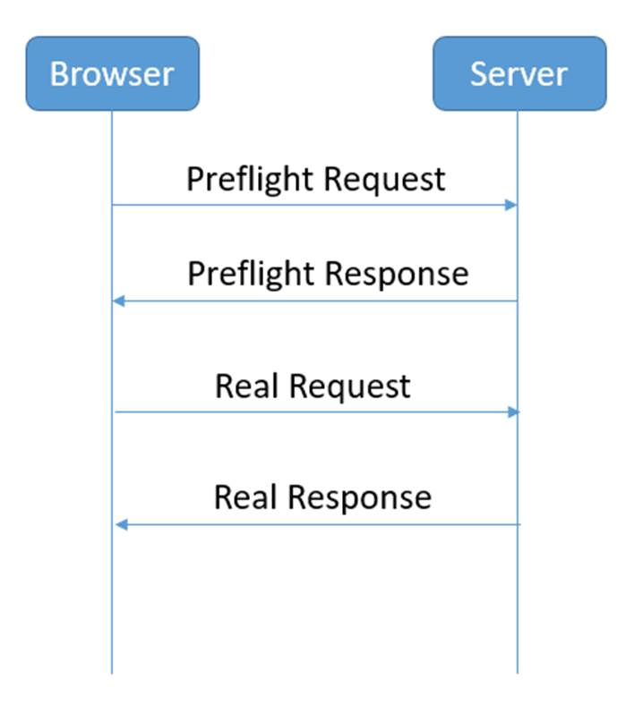

Preflight Request：

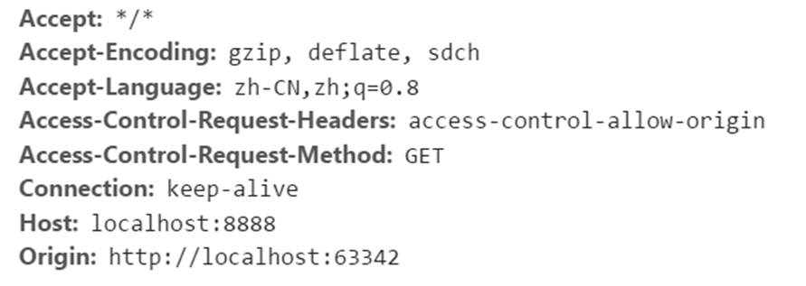

然后服务器端给我们返回一个Preflight Response

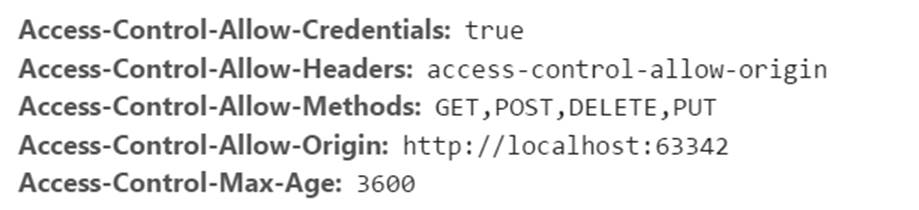

下面我们就开始动手，让我们的购物车工程能够接收跨域请求

（1）首先修改pinyougou-cart-web 的CartController.java的addGoodsToCartList方法，添加下面两句代码

```java
response.setHeader("Access-Control-Allow-Origin", "http://localhost:9105");
response.setHeader("Access-Control-Allow-Credentials", "true");
```

**Access-Control-Allow-Origin**

Access-Control-Allow-Origin是**HTML5**中定义的一种解决资源跨域的策略。

他是通过服务器端返回带有Access-Control-Allow-Origin标识的Response header，用来解决资源的跨域权限问题。

 使用方法，在response添加 Access-Control-Allow-Origin，例如

   Access-Control-Allow-Origin:www.google.com   

也可以设置为 * 表示该资源谁都可以用

（2）修改pinyougou-page-web的itemController.js 

```js
//添加商品到购物车
$scope.addToCart=function(){
   $http.get('http://localhost:9107/cart/addGoodsToCartList.do?itemId='
      + $scope.sku.id +'&num='+$scope.num,{'withCredentials':true}).success(
      function(response){
         if(response.success){
            location.href='http://localhost:9107/cart.html';//跳转到购物车页面
         }else{
            alert(response.message);
         }
      }
   );
}
```

调用测试，可以实现跨域了。

CORS请求默认不发送Cookie和HTTP认证信息。如果要把Cookie发到服务器，一方面要服务器同意，指定Access-Control-Allow-Credentials字段。另一方面，开发者必须在AJAX请求中打开withCredentials属性。否则，即使服务器同意发送Cookie，浏览器也不会发送。或者，服务器要求设置Cookie，浏览器也不会处理。


测试

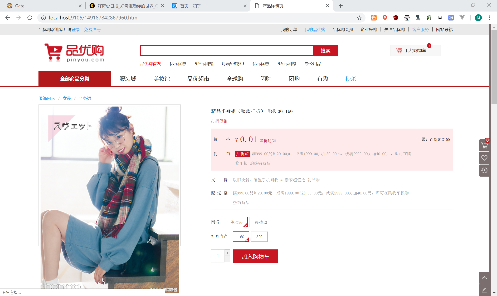

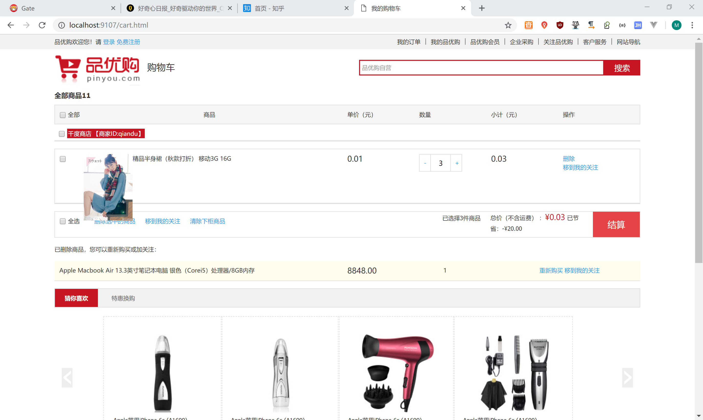

## 1.5 SpringMVC跨域注解

springMVC的版本在4.2或以上版本，可以使用注解实现跨域, 我们只需要在需要跨域的方法上添加注解@CrossOrigin即可

```java
@CrossOrigin(origins="http://localhost:9105",allowCredentials="true")
```

allowCredentials="true"  可以缺省

# 2.结算页-收件人地址选择

## 2.1需求与数据库分析

### 2.1.1需求描述

在结算页实现收件人地址选择功能

### 2.1.2数据库结构分析

Tb_address 为地址表

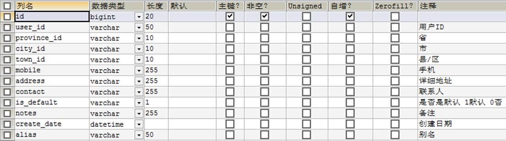

## 2.2准备工作

### 2.2.1生成代码

使用《黑马程序员代码生成器》生成代码，并拷贝到工程

（1）AddressService接口拷入pinyougou-user-interface 

（2）AddressServiceImpl 类拷入到pinyougou-user-service 

（3）pinyougou-cart-web 引入pinyougou-user-interface依赖 ，AddressController 类拷入到pinyougou-cart-web  

### 2.2.2拷贝页面资源

将getOrderInfo.html拷贝至pinyougou-cart-web的webapp下

## 2.3实现地址列表

### 2.3.1后端代码

（1）修改pinyougou-user-interface的AddressService.java，新增方法定义

```java
	/**
	 * 根据用户查询地址
	 * @param userId
	 * @return
	 */
	public List<TbAddress> findListByUserId(String userId );

```

（2）修改pinyougou-user-service的AddressServiceImpl.java

```java
/**
 * 根据用户查询地址
 * @param userId
 * @return
 */
@Override
public List<TbAddress> findListByUserId(String userId ){
   TbAddressExample example=new TbAddressExample();
   Criteria criteria = example.createCriteria();
   criteria.andUserIdEqualTo(userId);
   return addressMapper.selectByExample(example);
}
```

（3）修改pinyougou-cart-web的AddressController.java

```java
@RequestMapping("/findListByLoginUser")
public List<TbAddress> findListByLoginUser(){
   String userId = SecurityContextHolder.getContext().getAuthentication().getName();
   return addressService.findListByUserId(userId);
}
```

### 2.3.2前端代码

（1）pinyougou-cart-web的cartService.js

```js
	//获取地址列表
	this.findAddressList=function(){
		return $http.get('address/findListByLoginUser.do');	
	}

```

（2）pinyougou-cart-web的cartController.js

```js
	//获取地址列表
	$scope.findAddressList=function(){
		cartService.findAddressList().success(
			function(response){
				$scope.addressList=response;
			}		
		);		
	}

```

（3）修改getOrderInfo.html

引入 js

```html
<script type="text/javascript" src="plugins/angularjs/angular.min.js">  </script>
<script type="text/javascript" src="js/base.js">  </script>
<script type="text/javascript" src="js/service/cartService.js">  </script>
<script type="text/javascript" src="js/controller/cartController.js">  </script>

```

指令

```html
<body ng-app="pinyougou" ng-controller="cartController" ng-init="findAddressList()">
```

循环列表

```html
<div ng-repeat="address in addressList" >
<div class="con name">
<a href="javascript:;" >{{address.contact}}<span title="点击取消选择">&nbsp;</a>
</div>
<div class="con address"   >{{address.address}}<span>{{address.mobile}}</span>	
	<span class="base" ng-if="address.isDefault=='1'">默认地址</span>
	<span class="edittext"><a data-toggle="modal" data-target=".edit" data-keyboard="false" >编辑</a>&nbsp;&nbsp;<a href="javascript:;">删除</a></span>
</div>
<div class="clearfix"></div>
</div>

```

测试

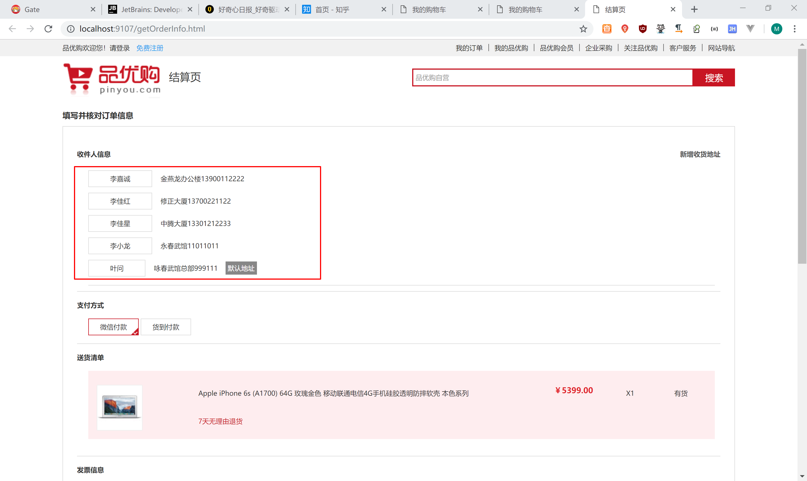

## 2.4地址选择

（1）在cartController.js增加代码

```js
	//选择地址
	$scope.selectAddress=function(address){
		$scope.address=address;		
	}
	
	//判断是否是当前选中的地址
	$scope.isSelectedAddress=function(address){
		if(address==$scope.address){
			return true;
		}else{
			return false;
		}		
	}

```

（2）修改页面-点击选择

```html
<div class="con name {{isSelectedAddress(address)?'selected':''}}" ><a href="javascript:;" ng-click="selectAddress(address)">{{address.contact}}<span title="点击取消选择">&nbsp;</a></div>
```

（3）修改页面，显示选择的地址

```html
<div class="fc-receiverInfo">寄送至:{{address.address}} 收货人：{{address.contact}} {{address.mobile}}</div>
```

## 2.5默认地址显示

修改cartController.js

```js
	//获取地址列表
	$scope.findAddressList=function(){
		cartService.findAddressList().success(
			function(response){
				$scope.addressList=response;
				//设置默认地址
				for(var i=0;i< $scope.addressList.length;i++){
					if($scope.addressList[i].isDefault=='1'){
						$scope.address=$scope.addressList[i];
						break;
					}
				}
			}
		);
	}
```

测试

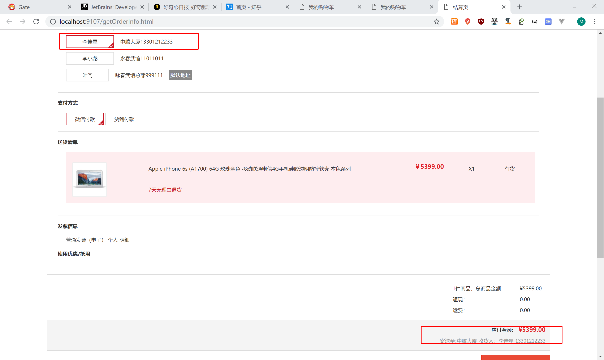

## 2.6收件人地址增加、修改与删除

学员实现

# 3.结算页-支付方式选择

## 3.1需求分析

实现支付方式的选择，品优购支持两种支付方式：微信支付和货到付款

## 3.2支付方式选择

### 3.2.1前端控制层

cartController.js

```js
	$scope.order={paymentType:'1'};
	//选择支付方式
	$scope.selectPayType=function(type){
		$scope.order.paymentType= type;
	}
```

### 3.2.2页面

getOrderInfo.html

```html
<li class="selected" ng-click="selectPayType('1')">微信付款<span title="点击取消选择"></span></li>
<li ng-click="selectPayType('2')">货到付款<span title="点击取消选择"></span></li>
```

# 4.结算页-商品清单与金额显示

## 4.1需求分析

显示购物车中的商品清单以及合计数量、金额

## 4.2显示商品清单

（1）页面getOrderInfo.html上初始化调用

```html
<body ng-app="pinyougou" ng-controller="cartController" ng-init="findAddressList();findCartList()">
```

（2）循环显示商品清单

```html
<div ng-repeat="cart in cartList">
	<ul class="yui3-g" ng-repeat="orderItem in cart.orderItemList">
		<li class="yui3-u-1-6">
			<span></span>
		</li>
		<li class="yui3-u-7-12">
			<div class="desc">{{orderItem.title}}</div>
			<div class="seven">7天无理由退货</div>
		</li>
		<li class="yui3-u-1-12">
			<div class="price">￥{{orderItem.price}}</div>
		</li>
		<li class="yui3-u-1-12">
			<div class="num">X{{orderItem.num}}</div>
		</li>
		<li class="yui3-u-1-12">
			<div class="exit">有货</div>
		</li>
	</ul>
</div>

```

## 4.3显示合计金额

修改 getOrderInfo.html

```html
<div class="list">
    <span><i class="number">{{totalValue.totalNum}}</i>件商品，总商品金额</span>
    <em class="allprice">¥{{totalValue.totalMoney.toFixed(2)}}</em>
</div>
```

```html
<div class="fc-price">应付金额:
				<span class="price">¥{{totalValue.totalMoney.toFixed(2)}}</span></div>
```

测试

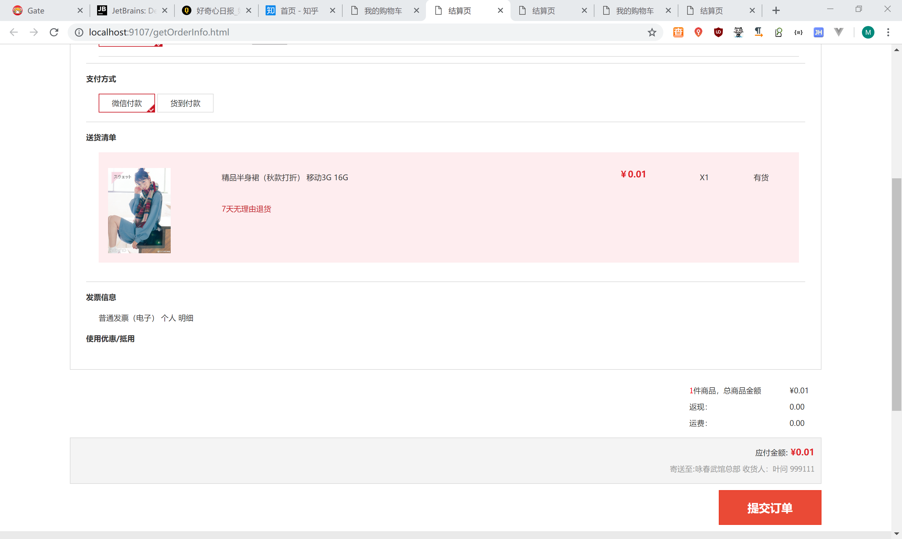

# 5.保存订单

## 5.1需求分析

### 5.1.1需求描述

点击订单结算页的提交订单 ，将购物车保存到订单表和订单明细表中，并将购物车数据清除.

### 5.1.2数据库结构分析

Tb_order为订单主表

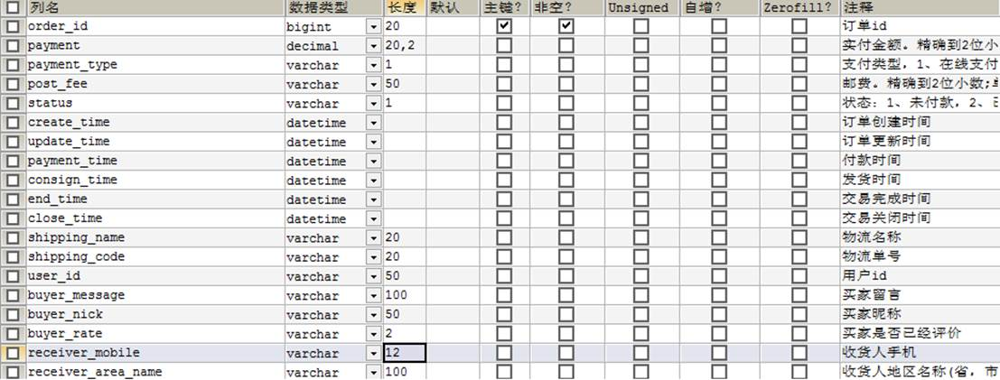

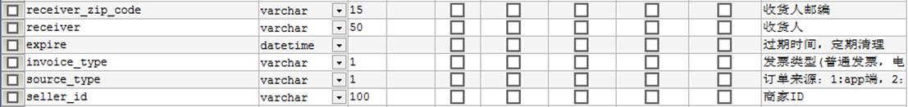

 

## 5.2准备工作

### 5.2.1搭建框架

（1）创建pinyougou-order-interface  引入依赖pinyougou-pojo

（2）创建pinyougou-order-service  （WAR） 参照其它服务工程引入依赖，添加web.xml  spring配置文件  dubbox端口20888  tomcat7运行端口9008

（3）pinyougou-cart-web 引入依赖pinyougou-order-interface   

### 5.2.2生成代码

生成tb_order表相关代码，并拷贝到工程中

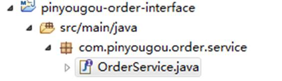

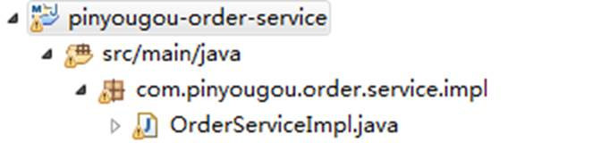

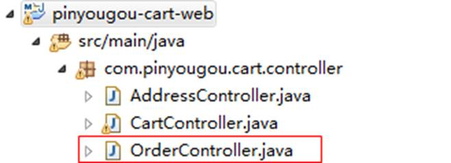

### 5.2.3分布式ID生成器

我们采用的是开源的twitter(  非官方中文惯称：推特.是国外的一个网站，是一个社交网络及微博客服务)  的snowflake算法。

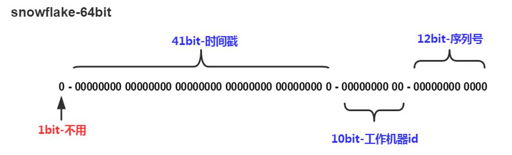

（1）将“配置文件/工具类”下的IdWorker.java 拷贝到common工程

（2）在pinyougou-order-service工程的spring配置文件中添加配置

```xml
<bean id="idWorker" class="util.IdWorker">
    	<!-- 进程ID -->
    	<constructor-arg index="0" value="0"></constructor-arg>
    	<!-- 数据中心ID -->
    	<constructor-arg index="1" value="0"></constructor-arg>
 </bean>

```

## 5.3后端代码

### 5.3.1服务实现层

修改pinyougou-order-service的OrderServiceImpl.java

```java
	@Autowired
	private RedisTemplate<String, Object> redisTemplate;
	
	@Autowired
	private TbOrderItemMapper orderItemMapper;
	
	@Autowired
	private IdWorker idWorker;
	
	/**
	 * 增加
	 */
	@Override
	public void add(TbOrder order) {
		//得到购物车数据
		List<Cart> cartList = (List<Cart>) 
				redisTemplate.boundHashOps("cartList").get( order.getUserId() );
		for(Cart cart:cartList){
			long orderId = idWorker.nextId();
			System.out.println("sellerId:"+cart.getSellerId());
			TbOrder tborder=new TbOrder();//新创建订单对象
			tborder.setOrderId(orderId);//订单ID
			tborder.setUserId(order.getUserId());//用户名
			tborder.setPaymentType(order.getPaymentType());//支付类型
			tborder.setStatus("1");//状态：未付款
			tborder.setCreateTime(new Date());//订单创建日期
			tborder.setUpdateTime(new Date());//订单更新日期
			tborder.setReceiverAreaName(order.getReceiverAreaName());//地址
			tborder.setReceiverMobile(order.getReceiverMobile());//手机号
			tborder.setReceiver(order.getReceiver());//收货人
tbOrder.setSourceType(order.getSourceType());//订单来源
			tborder.setSellerId(cart.getSellerId());//商家ID				
			//循环购物车明细
			double money=0;
			for(TbOrderItem orderItem :cart.getOrderItemList()){		
				orderItem.setId(idWorker.nextId());
				orderItem.setOrderId( orderId  );//订单ID	
				orderItem.setSellerId(cart.getSellerId());
				money+=orderItem.getTotalFee().doubleValue();//金额累加
				orderItemMapper.insert(orderItem);				
			}
			tborder.setPayment(new BigDecimal(money));			
			orderMapper.insert(tborder);	
		}
		redisTemplate.boundHashOps("cartList").delete(order.getUserId());
	}

```


### 5.3.3控制层

修改pinyougou-cart-web的OrderController.java 

```java
	/**
	 * 增加
	 * @param order
	 * @return
	 */
	@RequestMapping("/add")
	public Result add(@RequestBody TbOrder order){
		//获取当前登录人账号
		String username = SecurityContextHolder.getContext().getAuthentication().getName();
		order.setUserId(username);
		order.setSourceType("2");//订单来源  PC
		try {
			orderService.add(order);
			return new Result(true, "增加成功");
		} catch (Exception e) {
			e.printStackTrace();
			return new Result(false, "增加失败");
		}
	}

```

## 5.4前端代码

### 5.4.1服务层

修改pinyougou-cart-web的cartService.js

```js
	//保存订单
	this.submitOrder=function(order){
		return $http.post('order/add.do',order);		
	}

```

### 5.4.2控制层

修改cartController.js

```js
	//保存订单
	$scope.submitOrder=function(){
		$scope.order.receiverAreaName=$scope.address.address;//地址
		$scope.order.receiverMobile=$scope.address.mobile;//手机
		$scope.order.receiver=$scope.address.contact;//联系人
		cartService.submitOrder( $scope.order ).success(
			function(response){
				if(response.success){
					//页面跳转
					if($scope.order.paymentType=='1'){//如果是微信支付，跳转到支付页面
						location.href="pay.html";
					}else{//如果货到付款，跳转到提示页面
						location.href="paysuccess.html";
					}					
				}else{
					alert(response.message);	//也可以跳转到提示页面				
				}				
			}				
		);		
	}

```

### 5.4.3页面

修改getOrderInfo.html

```html
<a class="sui-btn btn-danger btn-xlarge" ng-click="submitOrder()" >提交订单</a>
```

将静态原型中的pay.html  paysuccess.html  payfail.html 拷贝到pinyougou-cart-web中

测试

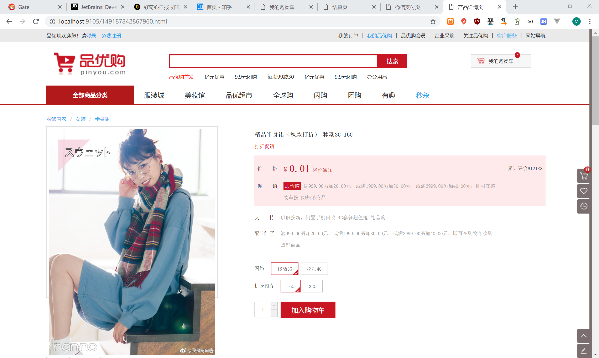

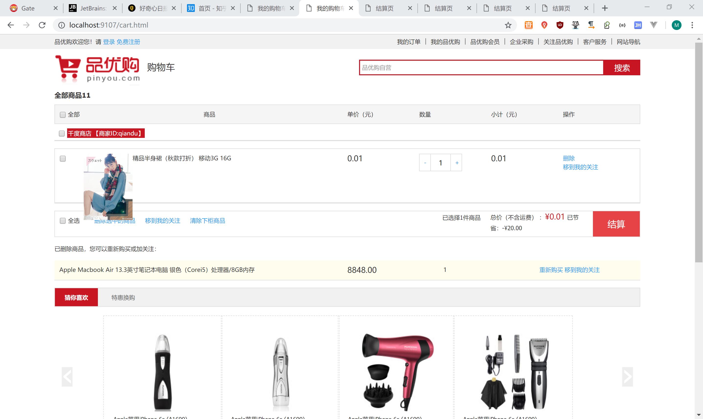


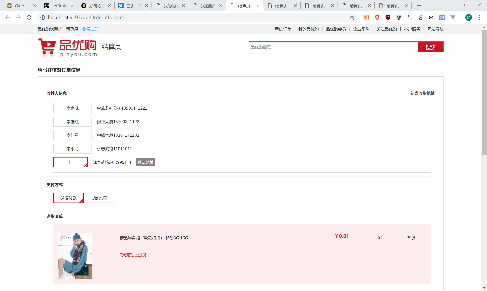

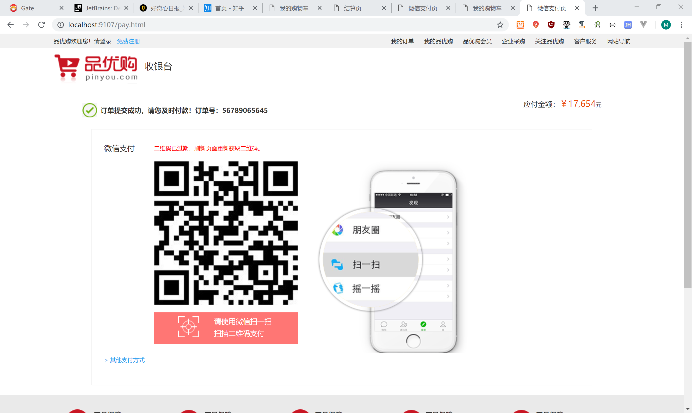