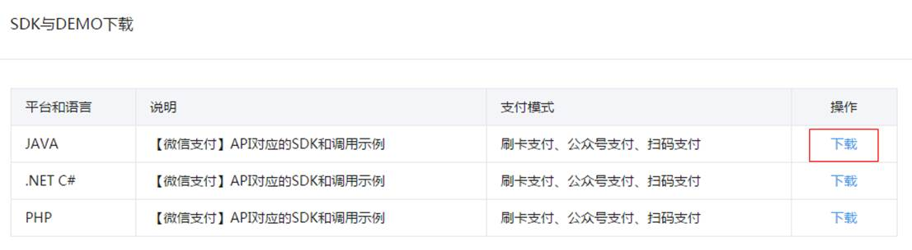
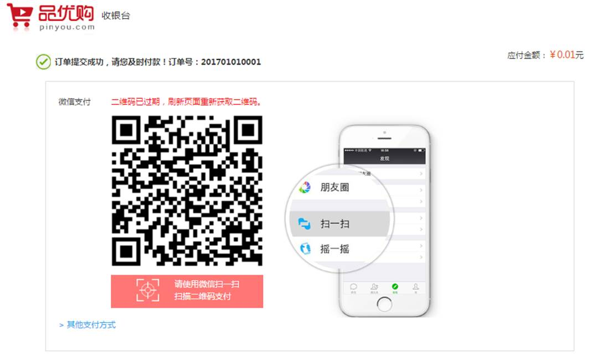
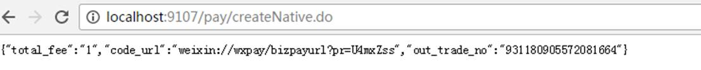

# 课程目标

目标1：掌握二维码生成插件qrious的使用

目标2：能够说出微信支付开发的整体思路

目标3：能够调用微信支付接口（统一下单）生成支付二维码

目标4：能够调用微信支付接口（查询订单）查询支付状态

目标5：实现支付日志的生成与订单状态的修改

# 1.二维码

## 1.1什么是二维码

二维码又称QR Code，QR全称Quick Response，是一个近几年来移动设备上超流行的一种编码方式，它比传统的Bar Code条形码能存更多的信息，也能表示更多的数据类型。

二维条码/二维码（2-dimensional bar code）是用某种特定的几何图形按一定规律在平面（二维方向上）分布的黑白相间的图形记录数据符号信息的；在代码编制上巧妙地利用构成计算机内部逻辑基础的“0”、“1”比特流的概念，使用若干个与二进制相对应的几何形体来表示文字数值信息，通过图象输入设备或光电扫描设备自动识读以实现信息自动处理：它具有条码技术的一些共性：每种码制有其特定的字符集；每个字符占有一定的宽度；具有一定的校验功能等。同时还具有对不同行的信息自动识别功能、及处理图形旋转变化点。


## 1.2二维码优势

l  信息容量大, 可以容纳多达1850个大写字母或2710个数字或500多个汉字

l  应用范围广, 支持文字,声音,图片,指纹等等...

l  容错能力强, 即使图片出现部分破损也能使用

l  成本低, 容易制作

## 1.3二维码容错级别

L级（低） 7％的码字可以被恢复。

M级（中） 的码字的15％可以被恢复。

Q级（四分）的码字的25％可以被恢复。

H级（高） 的码字的30％可以被恢复。

## 1.4二维码生成插件qrious

qrious是一款基于HTML5 Canvas的纯JS二维码生成插件。通过qrious.js可以快速生成各种二维码，你可以控制二维码的尺寸颜色，还可以将生成的二维码进行Base64编码。

qrious.js二维码插件的可用配置参数如下：

| 参数       | 类型   | 默认值      | 描述                               |
| ---------- | ------ | ----------- | ---------------------------------- |
| background | String | "white"     | 二维码的背景颜色。                 |
| foreground | String | "black"     | 二维码的前景颜色。                 |
| level      | String | "L"         | 二维码的误差校正级别(L, M, Q, H)。 |
| mime       | String | "image/png" | 二维码输出为图片时的MIME类型。     |
| size       | Number | 100         | 二维码的尺寸，单位像素。           |
| value      | String | ""          | 需要编码为二维码的值               |

下面的代码即可生成一张二维码

```html
<html>
<head>
<title>二维码入门小demo</title>
</head>
<body>

<script src="qrious.min.js"></script>
<script>
 var qr = new QRious({
	   element:document.getElementById('qrious'),
	   size:250, 	   level:'H',	   value:'http://www.itcast.cn'
	});
</script>
</body>
</html>

```

运行效果：


大家掏出手机，扫一下看看是否会看到传智播客的官网呢？

# 2.微信扫码支付简介

## 2.1微信扫码支付申请

微信扫码支付是商户系统按微信支付协议生成支付二维码，用户再用微信“扫一扫”完成支付的模式。该模式适用于PC网站支付、实体店单品或订单支付、媒体广告支付等场景。

申请步骤：（了解）

**第一步：注册公众号（类型须为：****服务号****）**

请根据营业执照类型选择以下主体注册：[个体工商户](http://kf.qq.com/faq/120911VrYVrA151009JB3i2Q.html)| [企业/公司](http://kf.qq.com/faq/120911VrYVrA151013MfYvYV.html)| [政府](http://kf.qq.com/faq/161220eaAJjE161220IJn6zU.html)| [媒体](http://kf.qq.com/faq/161220IFBJFv161220YnqAbQ.html)| [其他类型](http://kf.qq.com/faq/120911VrYVrA151013nYFZ7Z.html)。

**第二步：认证公众号**

公众号认证后才可申请微信支付，认证费：300元/次。

**第三步：提交资料申请微信支付**

登录公众平台，点击左侧菜单【微信支付】，开始填写资料等待审核，审核时间为1-5个工作日内。

**第四步：开户成功，登录商户平台进行验证**

资料审核通过后，请登录联系人邮箱查收商户号和密码，并登录商户平台填写财付通备付金打的小额资金数额，完成账户验证。

**第五步：在线签署协议**

本协议为线上电子协议，签署后方可进行交易及资金结算，签署完立即生效。

本课程已经提供好“传智播客”的微信支付账号，学员无需申请。

## 2.2开发文档

微信支付接口调用的整体思路：

按API要求组装参数，以XML方式发送（POST）给微信支付接口（URL）,微信支付接口也是以XML方式给予响应。程序根据返回的结果（其中包括支付URL）生成二维码或判断订单状态。

在线微信支付开发文档：

<https://pay.weixin.qq.com/wiki/doc/api/index.html>

如果你不能联网，请查阅讲义配套资源 （资源\配套软件\微信扫码支付\开发文档）

我们在本章课程中会用到”统一下单”和”查询订单”两组API  

 

1. appid：微信公众账号或开放平台APP的唯一标识

2. mch_id：商户号  (配置文件中的partner)

3. partnerkey：商户密钥

4. sign:数字签名, 根据微信官方提供的密钥和一套算法生成的一个加密信息, 就是为了保证交易的安全性

## 2.3微信支付SDK

微信支付提供了SDK, 大家下载后打开源码，install到本地仓库。



课程配套的本地仓库已经提供jar包，所以安装SDK步骤省略。

使用微信支付SDK,在maven工程中引入依赖

```xml
	<dependency>
		<groupId>com.github.wxpay</groupId>
		<artifactId>wxpay-sdk</artifactId>
		<version>0.0.3</version>
	</dependency>

```

我们主要会用到微信支付SDK的以下功能：

（1）获取随机字符串

```java
WXPayUtil.generateNonceStr()
```

（2）MAP转换为XML字符串（自动添加签名）

```java
 WXPayUtil.generateSignedXml(param, partnerkey)
```

（3）XML字符串转换为MAP

```xml
WXPayUtil.xmlToMap(result)
```

## 2.4 HttpClient工具类

HttpClient是Apache Jakarta Common下的子项目，用来提供高效的、最新的、功能丰富的支持HTTP协议的客户端编程工具包，并且它支持HTTP协议最新的版本和建议。HttpClient已经应用在很多的项目中，比如Apache Jakarta上很著名的另外两个开源项目Cactus和HTMLUnit都使用了HttpClient。

HttpClient通俗的讲就是模拟了浏览器的行为，如果我们需要在后端向某一地址提交数据获取结果，就可以使用HttpClient.

关于HttpClient（原生）具体的使用不属于我们本章的学习内容，我们这里这里为了简化HttpClient的使用，提供了工具类HttpClient（对原生HttpClient进行了封装）

HttpClient工具类使用的步骤

```java
HttpClient client=new HttpClient(请求的url地址);
client.setHttps(true);//是否是https协议
client.setXmlParam(xmlParam);//发送的xml数据
client.post();//执行post请求
String result = client.getContent(); //获取结果

```

## 2.5工程搭建与准备工作

（1）建立支付服务接口模块pinyougou-pay-interface  （jar）

（2）建立支付服务实现模块pinyougou-pay-service （war） 依赖pinyougou-pay-interface 和pinyougou-common 、 spring  dubbox 相关依赖 、**微信****SDK**  （因为不需要连接数据库所以不用引用dao工程）

```xml
	<dependency>
		<groupId>com.github.wxpay</groupId>
		<artifactId>wxpay-sdk</artifactId>
		<version>0.0.3</version>
	</dependency>

```

添加tomcat插件，运行端口为9000

添加spring配置文件 ，参见其它服务工程 

（3）在pinyougou-common工程中添加工具类HttpClient.java ，并添加依赖

```xml
	  	<dependency>
	  		<groupId>org.apache.httpcomponents</groupId>
	  		<artifactId>httpclient</artifactId>	  		
	  	</dependency>

```

添加配置文件weixinpay.properties

```properties
appid=wx8397f8696b538317
partner=1473426802
partnerkey=8A627A4578ACE384017C997F12D68B23
notifyurl=http://a31ef7db.ngrok.io/WeChatPay/WeChatPayNotify

```

appid： 微信公众账号或开放平台APP的唯一标识

partner：财付通平台的商户账号

partnerkey：财付通平台的商户密钥

notifyurl:  回调地址

（4）pinyougou-cart-web依赖工程pinyougou-pay-service  

（5）将二维码插件QRious  拷贝到pinyougou-cart-web  的plugins目录中

# 3.品优购-微信支付二维码生成

## 3.1需求分析与实现思路

### 3.1.1需求分析

在支付页面上生成支付二维码，并显示订单号和金额

用户拿出手机,打开微信扫描页面上的二维码,然后在微信中完成支付



### 3.1.2实现思路

我们通过HttpClient工具类实现对远程支付接口的调用。

接口链接：https://api.mch.weixin.qq.com/pay/unifiedorder

具体参数参见“统一下单”API, 构建参数发送给统一下单的url ，返回的信息中有支付url，根据url生成二维码，显示的订单号和金额也在返回的信息中。

 

## 3.2后端代码实现

### 3.2.1服务接口层

（1）在pinyougou-pay-interface创建包com.pinyougou.pay.service ，包下建立接口

```java
package com.pinyougou.pay.service;
import java.util.Map;
/**
 * 微信支付接口
 * @author Administrator
 *
 */
public interface WeixinPayService {

	/**
	 * 生成微信支付二维码
	 * @param out_trade_no 订单号
	 * @param total_fee 金额(分)
	 * @return
	 */
	public Map createNative(String out_trade_no,String total_fee);
}

```

### 3.2.2服务实现层

pinyougou-pay-service创建com.pinyougou.pay.service.impl包，新建类

```java

@Service
public class WeixinPayServiceImpl implements WeixinPayService {

	@Value("${appid}")
	private String appid;
	
	@Value("${partner}")
	private String partner;
	
	@Value("${partnerkey}")
	private String partnerkey;
	
	/**
	 * 生成二维码
	 * @return
	 */
	public Map createNative(String out_trade_no,String total_fee){
		//1.创建参数
		Map<String,String> param=new HashMap();//创建参数
		param.put("appid", appid);//公众号
		param.put("mch_id", partner);//商户号
		param.put("nonce_str", WXPayUtil.generateNonceStr());//随机字符串		
		param.put("body", "品优购");//商品描述
		param.put("out_trade_no", out_trade_no);//商户订单号
		param.put("total_fee",total_fee);//总金额（分）
		param.put("spbill_create_ip", "127.0.0.1");//IP
		param.put("notify_url", "http://test.itcast.cn");//回调地址(随便写)
		param.put("trade_type", "NATIVE");//交易类型
		try {
			//2.生成要发送的xml 
			String xmlParam = WXPayUtil.generateSignedXml(param, partnerkey);
			System.out.println(xmlParam);	
			HttpClient client=new HttpClient("https://api.mch.weixin.qq.com/pay/unifiedorder");
			client.setHttps(true);
			client.setXmlParam(xmlParam);
			client.post();		
			//3.获得结果 
			String result = client.getContent();
			System.out.println(result);
			Map<String, String> resultMap = WXPayUtil.xmlToMap(result);			
			Map<String, String> map=new HashMap<>();
			map.put("code_url", resultMap.get("code_url"));//支付地址
			map.put("total_fee", total_fee);//总金额
			map.put("out_trade_no",out_trade_no);//订单号
			return map;
		} catch (Exception e) {
			e.printStackTrace();
			return new HashMap<>();
		}			
	}
}

```

### 3.2.3控制层

pinyougou-cart-web创建PayController.java 

```java

/**
 * 支付控制层
 * @author Administrator
 *
 */
@RestController
@RequestMapping("/pay")
public class PayController {
	@Reference
	private  WeixinPayService weixinPayService;
	
	/**
	 * 生成二维码
	 * @return
	 */
	@RequestMapping("/createNative")
	public Map createNative(){
		IdWorker idworker=new IdWorker();		
		return weixinPayService.createNative(idworker.nextId()+"","1");		
	}
}

```

这里我们订单号通过分布式ID生成器生成，金额暂时写死，后续开发我们再对接业务系统得到订单号和金额

浏览器测试



## 3.3前端代码实现

### 3.3.1服务层

在pinyougou-cart-web创建 payService.js

```js
app.service('payService',function($http){
	//本地支付
	this.createNative=function(){
		return $http.get('pay/createNative.do');
	}	
});

```

### 3.3.2控制层

在pinyougou-cart-web 创建payController.js

```js
app.controller('payController' ,function($scope ,payService){	
	//本地生成二维码
	$scope.createNative=function(){
		payService.createNative().success(
			function(response){
				$scope.money=  (response.total_fee/100).toFixed(2) ;	//金额
				$scope.out_trade_no= response.out_trade_no;//订单号
				//二维码
		    	var qr = new QRious({
		 		   element:document.getElementById('qrious'),
		 		   size:250,
		 		   level:'H',
		 		   value:response.code_url
		 		});				
			}
		);		
	}		
});

```

