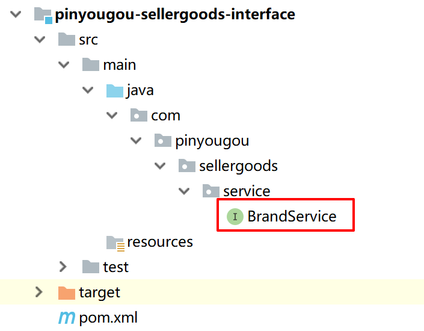

# Day2

## 应用Angular实现品牌列表

品牌页添加代码brand.html

```html
<!DOCTYPE html>
<html>
<head>   
	<script type="text/javascript" src="../plugins/angularjs/angular.min.js"></script>
	<script type="text/javascript">
		var app=angular.module('pinyougou',[]);
		app.controller('brandController',function($scope,$http){
		    // 查询品牌列表
		    $scope.findAll=function () {
				$http.get('../brand/findAll.do').success(
				    function(response){
						$scope.list=response;
					}
				);
            }
		});
	</script>	
</head>
<body class="hold-transition skin-red sidebar-mini" ng-app="pinyougou" ng-controller="brandController" ng-init="findAll()">
  <!-- .box-body -->			                     
    <tbody>
        <tr ng-repeat="entity in list">
            <td><input  type="checkbox" ></td>			                              
            <td>{{entity.id}}</td>
            <td>{{entity.name}}</td>
            <td>{{entity.firstChar}}</td>
            <td class="text-center">                                           
                <button type="button" class="btn bg-olive btn-xs" data-toggle="modal" data-target="#editModal"  >修改</button>                                           
            </td>
        </tr>
    </tbody>                  
</body>
</html>
```

启动服务器。启动zookeeper。启动sellergoods-service与manager-web。


## 实现分页


分页对象

```java
package entity;

import java.io.Serializable;
import java.util.List;

/**
 * 分页结果类
 * @author miion
 * @create 2019-01-02
 */
public class PageResult implements Serializable {

    /**
     * 总记录数
     */
    private long total;

    /**
     * 当前页记录
     */
    private List rows;

    public PageResult(long total, List rows) {
        super();
        this.total = total;
        this.rows = rows;
    }

    public long getTotal() {
        return total;
    }

    public void setTotal(long total) {
        this.total = total;
    }

    public List getRows() {
        return rows;
    }

    public void setRows(List rows) {
        this.rows = rows;
    }

    @Override
    public String toString() {
        return "PageResult{" +
                "total=" + total +
                ", rows=" + rows +
                '}';
    }
}

```



添加分页接口

```java
package com.pinyougou.sellergoods.service;

import com.pinyougou.pojo.TbBrand;
import entity.PageResult;

import java.util.List;

/**
 * 品牌接口
 * @author Administrator
 *
 */
public interface BrandService {

	List<TbBrand> findAll();

	/**
	 * 分页
	 * @param pageNum 当前页码
	 * @param pageSize 每页记录数
	 * @return
	 */
	PageResult findPage(int pageNum, int pageSize);

}
```

添加分页接口实现


```java
@Override
public PageResult findPage(int pageNum, int pageSize) {

    /**
	 * 分页
	 */
    PageHelper.startPage(pageNum, pageSize);

    Page<TbBrand> page = (Page<TbBrand>) brandMapper.selectByExample(null);

    return new PageResult(page.getTotal(), page.getResult());
}
```


添加控制层调用service接口

```java
package com.pinyougou.manager.controller;

import com.alibaba.dubbo.config.annotation.Reference;
import com.pinyougou.pojo.TbBrand;
import com.pinyougou.sellergoods.service.BrandService;
import entity.PageResult;
import org.springframework.web.bind.annotation.RequestMapping;
import org.springframework.web.bind.annotation.RestController;

import java.util.List;

@RestController
@RequestMapping("/brand")
public class BrandController {

	@Reference
	private BrandService brandService;
	
	@RequestMapping("/findAll")
	public List<TbBrand> findAll(){
		return brandService.findAll();		
	}

	@RequestMapping("/findPage")
	public PageResult findPage(int page, int size){
		return brandService.findPage(page, size);
	}
	
}

```

测试

http://localhost:9101/brand/findPage.do?page=1&size=10


## 分页改造前端

修改brand.html

```html
    <!-- 分页组件开始 -->
    <script src="../plugins/angularjs/pagination.js"></script>
    <link rel="stylesheet" href="../plugins/angularjs/pagination.css">
    <!-- 分页组件结束 -->

    <script type="text/javascript">

        var app = angular.module('pinyougou', ['pagination']);
        app.controller('brandController', function ($scope, $http) {   

            //分页控件配置currentPage:当前页 totalItems :总记录数 itemsPerPage:每页记录数 perPageOptions :分页选项 onChange:当页码变更后自动触发的方法
            $scope.paginationConf = {
                currentPage: 1,
                totalItems: 10,
                itemsPerPage: 10,
                perPageOptions: [10, 20, 30, 40, 50],
                onChange: function () {
                    $scope.reloadList();
                }
            };

            //刷新列表
            $scope.reloadList = function () {
                $scope.findPage($scope.paginationConf.currentPage, $scope.paginationConf.itemsPerPage);
            }

            //分页
            $scope.findPage = function (page, size) {
                $http.get('../brand/findPage.do?page=' + page + '&size=' + size).success(
                    function (response) {
                        $scope.list = response.rows;//显示当前页数据
                        $scope.paginationConf.totalItems = response.total;//更新总记录数
                    }
                );
            }

        });
    </script>

</head>
<body class="hold-transition skin-red sidebar-mini" ng-app="pinyougou" ng-controller="brandController">
    	<table> 
        </table>
        <!--数据列表/-->
        <tm-pagination conf="paginationConf"></tm-pagination>
    </div>
    <!-- 数据表格 /-->

```

测试

http://localhost:9101/admin/brand.html


## 添加品牌

后端

brandService.java

```java
/**
 * 增加
 */
void add(TbBrand brand);
```

brandServiceImpl.java

```java
	@Override
	public void add(TbBrand brand) {
		brandMapper.insert(brand);
	}
```

brandController.java

```java
@RequestMapping("/add")
	public Result add(@RequestBody TbBrand brand){
		try {
			brandService.add(brand);
			return new Result(true, "增加成功");
		} catch (Exception e) {
			e.printStackTrace();
			return new Result(false, "增加失败");
		}
	}
```

pojo.entity添加Result

```java
public class Result implements Serializable{

	private boolean success;//是否成功
	
	private String message;//返回信息
	
	
	public Result(boolean success, String message) {
		super();
		this.success = success;
		this.message = message;
	}

	public boolean isSuccess() {
		return success;
	}

	public void setSuccess(boolean success) {
		this.success = success;
	}

	public String getMessage() {
		return message;
	}

	public void setMessage(String message) {
		this.message = message;
	}	
}
```

前端

brand.html

```html
            //新增
            $scope.add=function(){
                $http.post('../brand/add.do',$scope.entity ).success(
                    function(response){
                        if(response.success){
                            //重新查询
                            $scope.reloadList();//重新加载
                        }else{
                            alert(response.message);
                        }
                    }
                );
            }


<td><input class="form-control" placeholder="品牌名称" ng-model="entity.name"></td>

<td><input class="form-control" placeholder="首字母" ng-model="entity.firstChar"></td>

<button class="btn btn-success" data-dismiss="modal" aria-hidden="true" ng-click="add()">保存</button>

data-target="#editModal" ng-click="entity={}"><i class="fa fa-file-o"></i> 新建
```

测试

http://localhost:9101/admin/brand.html


## 修改品牌

后端

brandService.java

```java
	/**
	 * 根据ID查询实体
	 * @param id
	 * @return
	 */
    TbBrand findOne(Long id);

	/**
     * 修改
     * @param brand
     */
    void update(TbBrand brand);
```

brandServiceImpl.java

```java
	@Override
	public TbBrand findOne(Long id) {

		return brandMapper.selectByPrimaryKey(id);
	}

	@Override
	public void update(TbBrand brand) {
		brandMapper.updateByPrimaryKey(brand);
	}
```

brandController.java

```java
    @RequestMapping("/findOne")
    public TbBrand findOne(Long id){
        return brandService.findOne(id);
    }


    @RequestMapping("/update")
    public Result update(@RequestBody TbBrand brand){
        try {
            brandService.update(brand);
            return new Result(true, "修改成功");
        } catch (Exception e) {
            e.printStackTrace();
            return new Result(false, "修改失败");
        }
    }
```

前端

brand.html

```html
			//新增
            $scope.save=function(){
                var methodName='add';//方法名
                if($scope.entity.id!=null){
                    methodName='update';
                }
                $http.post('../brand/'+methodName +'.do',$scope.entity).success(
                    function(response){
                        if(response.success){
                            $scope.reloadList();//刷新
                        }else{
                            alert(response.message);
                        }
                    }
                );
            }

            //查询实体
            $scope.findOne=function(id){
                $http.get('../brand/findOne.do?id='+id).success(
                    function(response){
                        $scope.entity=response;
                    }
                );
            }

<button type="button" class="btn bg-olive btn-xs" data-toggle="modal" data-target="#editModal" ng-click="findOne(entity.id)">修改
                        
<button class="btn btn-success" data-dismiss="modal" aria-hidden="true" ng-click="save()">保存</button>

```

测试


## 勾选删除品牌

BrandService.java

```java
   /**
    * 删除
    * @param ids
    */
   void delete(Long[] ids);
```

BrandServiceImpl.java

```java
@Override
public void delete(Long[] ids) {
    for(Long id:ids){
        brandMapper.deleteByPrimaryKey(id);
    }
}
```

BrandController.java

```java
@RequestMapping("/delete")
public Result delete(Long [] ids){
    try {
        brandService.delete(ids);
        return new Result(true, "删除成功");
    } catch (Exception e) {
        e.printStackTrace();
        return new Result(false, "删除失败");
    }
}
```

Brand.html

```html
$scope.selectIds=[];//用户勾选的ID集合
//用户勾选复选框
$scope.updateSelection=function($event,id){
    if($event.target.checked){
        $scope.selectIds.push(id);//push向集合添加元素
    }else{
        var index= $scope.selectIds.indexOf(id);//查找值的 位置
        $scope.selectIds.splice(index,1);//参数1：移除的位置 参数2：移除的个数
    }
}

//删除
$scope.dele=function(){
    if(confirm('确定要删除吗？')){
        $http.get('../brand/delete.do?ids='+$scope.selectIds).success(
            function(response){
                if(response.success){
                    $scope.reloadList();//刷新
                }else{
                    alert(response.message);
                }
            }
        );
    }
}

<button type="button" class="btn btn-default" title="删除" ng-click="dele()"><i class="fa fa-trash-o"></i> 删除</button>

```

测试


## 条件查询

BrandService.java

```java
/**
 * 品牌分页
 * @param pageNum 当前页面
 * @param pageSize 每页记录数
 * @return
 */
PageResult findPage(TbBrand brand, int pageNum,int pageSize);
```

BrandServiceImpl.java

```java
@Override
public PageResult findPage(TbBrand brand, int pageNum, int pageSize) {

    PageHelper.startPage(pageNum, pageSize);//分页

    TbBrandExample example=new TbBrandExample();

    TbBrandExample.Criteria criteria = example.createCriteria();
    if(brand!=null){
        if(brand.getName()!=null && brand.getName().length()>0){
            criteria.andNameLike("%"+brand.getName()+"%");
        }
        if(brand.getFirstChar()!=null && brand.getFirstChar().length()>0){
            criteria.andFirstCharLike("%"+brand.getFirstChar()+"%");
        }
    }

    Page<TbBrand> page = (Page<TbBrand>) brandMapper.selectByExample(example);

    return new PageResult(page.getTotal(), page.getResult());
}
```

BrandController.java

```java
@RequestMapping("/search")
public PageResult search(@RequestBody TbBrand brand,int page,int size){
    return brandService.findPage(brand, page, size);
}
```

Brand.html

```html
//刷新列表
$scope.reloadList=function(){
$scope.search( $scope.paginationConf.currentPage ,  $scope.paginationConf.itemsPerPage );
}


$scope.searchEntity={};
//条件查询
$scope.search=function(page,size){

    $http.post('../brand/search.do?page='+page +'&size='+size, $scope.searchEntity).success(
    function(response){
    $scope.list=response.rows;//显示当前页数据
    $scope.paginationConf.totalItems=response.total;//更新总记录数
    }
    );

}

<div class="box-tools pull-right">
    <div class="has-feedback">
        品牌名称:<input ng-model="searchEntity.name"> 品牌首字母:<input ng-model="searchEntity.firstChar">
        <button  class="btn btn-default" ng-click="reloadList()">查询</button>
    </div>
</div>
```

测试


