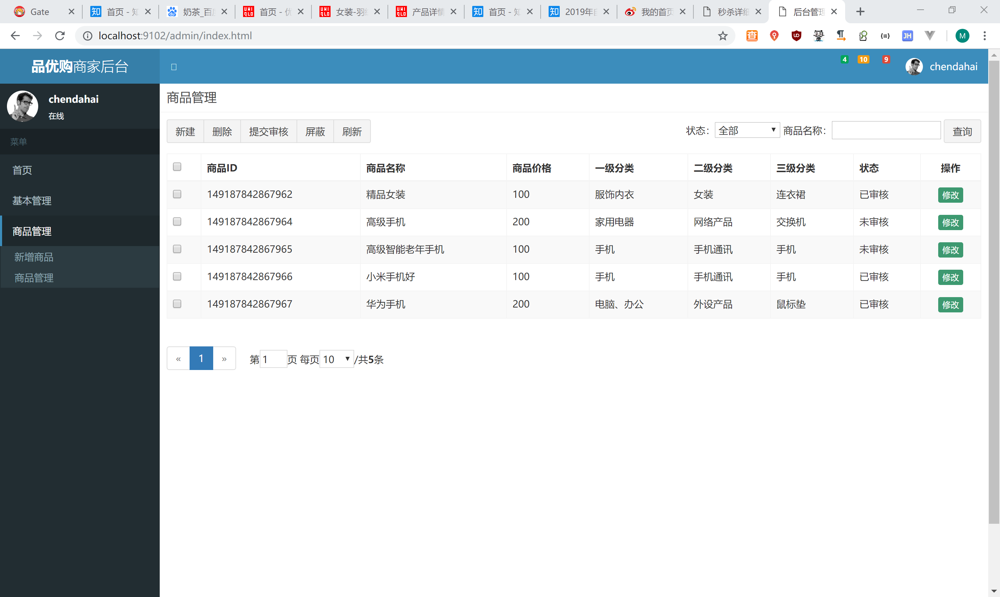
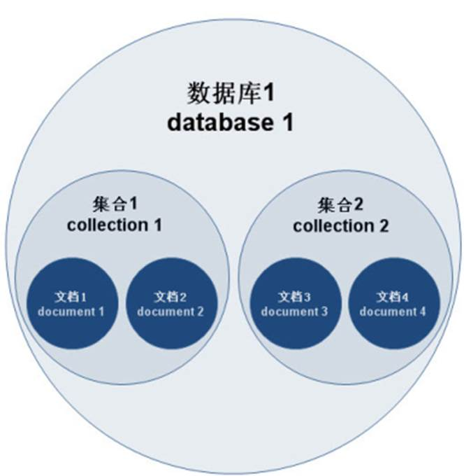
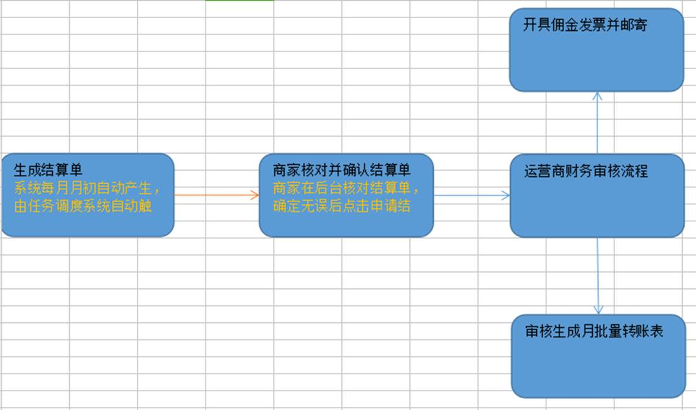

# 课程目标

目标1：运用SpringTask实现任务调度

目标2：运用MavenProfile实现开发和生产环境切换

目标3：了解MongoDB数据库的应用场景

目标4：说出其它业务功能的需求和实现思路

# 1.任务调度SpringTask

## 1.1什么是任务调度

在企业级应用中，经常会制定一些“计划任务”，即在某个时间点做某件事情，核心是以时间为关注点，即在一个特定的时间点，系统执行指定的一个操作。常见的任务调度框架有Quartz和SpringTask等。

## 1.2 SpringTask入门小Demo

创建模块pinyougou-task-service,引入spring相关依赖 dao 和common工程，tomcat7端口为9108  

添加web.xml 

添加配置文件applicationContext-task.xml  ,内容如下

```xml
<?xml version="1.0" encoding="UTF-8"?>
<beans xmlns="http://www.springframework.org/schema/beans"
	xmlns:xsi="http://www.w3.org/2001/XMLSchema-instance" xmlns:p="http://www.springframework.org/schema/p"
	xmlns:context="http://www.springframework.org/schema/context"
	xmlns:task="http://www.springframework.org/schema/task"	
	xsi:schemaLocation="http://www.springframework.org/schema/beans http://www.springframework.org/schema/beans/spring-beans.xsd
        http://www.springframework.org/schema/context http://www.springframework.org/schema/context/spring-context.xsd
        http://www.springframework.org/schema/task http://www.springframework.org/schema/task/spring-task-4.2.xsd">
	<context:component-scan base-package="com.pinyougou.task"/>
    <task:annotation-driven/>
</beans>

```

创建包com.pinyougou.task

编写类

```java
@Component
public class SeckillTask {
	/**
	 * 刷新秒杀商品
	 */
	@Scheduled(cron="* * * * * ?")
	public void refreshSeckillGoods(){
		System.out.println("执行了任务调度"+new Date());		
	}		
}

```

执行后会看到控制台每秒都输出了当前时间，其中cron设置的为表达式，是执行的时间规则。

## 1.3 Cron表达式

### 1.3.1 Cron表达式格式

 

Cron表达式是一个字符串，字符串以5或6个空格隔开，分为6或7个域，每一个域代表一个含义，Cron有如下两种语法格式： 

（1）Seconds Minutes Hours DayofMonth Month DayofWeek Year

（2）Seconds Minutes Hours DayofMonth Month DayofWeek

每一个域可出现的字符如下： 

Seconds:可出现", - * /"四个字符，有效范围为0-59的整数 

Minutes:可出现", - * /"四个字符，有效范围为0-59的整数 

Hours:可出现", - * /"四个字符，有效范围为0-23的整数 

DayofMonth:可出现", - * / ? L W C"八个字符，有效范围为1-31的整数 

Month:可出现", - * /"四个字符，有效范围为1-12的整数或JAN-DEc 

DayofWeek:可出现", - * / ? L C #"四个字符，有效范围为1-7的整数或SUN-SAT两个范围。1表示星期天，2表示星期一， 依次类推 

Year:可出现", - * /"四个字符，有效范围为1970-2099年

每一个域都使用数字，但还可以出现如下特殊字符，它们的含义是： 

(1)*：表示匹配该域的任意值，假如在Minutes域使用*, 即表示每分钟都会触发事件。

(2)?:只能用在DayofMonth和DayofWeek两个域。它也匹配域的任意值，但实际不会。因为DayofMonth和 DayofWeek会相互影响。例如想在每月的20日触发调度，不管20日到底是星期几，则只能使用如下写法： 13 13 15 20 * ?, 其中最后一位只能用？，而不能使用*，如果使用*表示不管星期几都会触发，实际上并不是这样。 

(3)-:表示范围，例如在Minutes域使用5-20，表示从5分到20分钟每分钟触发一次 

(4)/：表示起始时间开始触发，然后每隔固定时间触发一次，例如在Minutes域使用5/20,则意味着5分钟触发一次，而25，45等分别触发一次. 

(5),:表示列出枚举值值。例如：在Minutes域使用5,20，则意味着在5和20分每分钟触发一次。 

(6)L:表示最后，只能出现在DayofWeek和DayofMonth域，如果在DayofWeek域使用5L,意味着在最后的一个星期四触发。 

(7)W: 表示有效工作日(周一到周五),只能出现在DayofMonth域，系统将在离指定日期的最近的有效工作日触发事件。例如：在 DayofMonth使用5W，如果5日是星期六，则将在最近的工作日：星期五，即4日触发。如果5日是星期天，则在6日(周一)触发；如果5日在星期一 到星期五中的一天，则就在5日触发。另外一点，W的最近寻找不会跨过月份 

(8)LW:这两个字符可以连用，表示在某个月最后一个工作日，即最后一个星期五。 

(9)#:用于确定每个月第几个星期几，只能出现在DayofMonth域。例如在4#2，表示某月的第二个星期三。

### 1.3.2 Cron表达式例子

0 0 10,14,16 * * ? 每天上午10点，下午2点，4点 

0 0/30 9-17 * * ? 朝九晚五工作时间内每半小时 

0 0 12 ? * WED 表示每个星期三中午12点 

"0 0 12 * * ?" 每天中午12点触发 

"0 15 10 ? * *" 每天上午10:15触发 

"0 15 10 * * ?" 每天上午10:15触发 

"0 15 10 * * ? *" 每天上午10:15触发 

"0 15 10 * * ? 2005" 2005年的每天上午10:15触发 

"0 * 14 * * ?" 在每天下午2点到下午2:59期间的每1分钟触发 

"0 0/5 14 * * ?" 在每天下午2点到下午2:55期间的每5分钟触发 

"0 0/5 14,18 * * ?" 在每天下午2点到2:55期间和下午6点到6:55期间的每5分钟触发 

"0 0-5 14 * * ?" 在每天下午2点到下午2:05期间的每1分钟触发 

"0 10,44 14 ? 3 WED" 每年三月的星期三的下午2:10和2:44触发 

"0 15 10 ? * MON-FRI" 周一至周五的上午10:15触发 

"0 15 10 15 * ?" 每月15日上午10:15触发 

"0 15 10 L * ?" 每月最后一日的上午10:15触发 

"0 15 10 ? * 6L" 每月的最后一个星期五上午10:15触发 

"0 15 10 ? * 6L 2002-2005" 2002年至2005年的每月的最后一个星期五上午10:15触发 

"0 15 10 ? * 6#3" 每月的第三个星期五上午10:15触发

 

## 1.4秒杀商品列表的增量更新

每分钟执行查询秒杀商品表，将符合条件的记录并且缓存中不存在的秒杀商品存入缓存

```java
	/**
	 * 刷新秒杀商品
	 */
	@Scheduled(cron="0 * * * * ?")
	public void refreshSeckillGoods(){
		System.out.println("执行了任务调度"+new Date());			
		//查询所有的秒杀商品键集合
		List ids = new ArrayList( redisTemplate.boundHashOps("seckillGoods").keys());
		//查询正在秒杀的商品列表		
		TbSeckillGoodsExample example=new TbSeckillGoodsExample();
		Criteria criteria = example.createCriteria();
		criteria.andStatusEqualTo("1");//审核通过
		criteria.andStockCountGreaterThan(0);//剩余库存大于0
		criteria.andStartTimeLessThanOrEqualTo(new Date());//开始时间小于等于当前时间
		criteria.andEndTimeGreaterThan(new Date());//结束时间大于当前时间		
		criteria.andIdNotIn(ids);//排除缓存中已经有的商品 		
		List<TbSeckillGoods> seckillGoodsList= seckillGoodsMapper.selectByExample(example);		
		//装入缓存 
		for( TbSeckillGoods seckill:seckillGoodsList ){
			redisTemplate.boundHashOps("seckillGoods").put(seckill.getId(), seckill);
		}
		System.out.println("将"+seckillGoodsList.size()+"条商品装入缓存");
	}

```

## 1.5过期秒杀商品的移除

每秒中在缓存的秒杀上皮列表中查询过期的商品，发现过期同步到数据库，并在缓存中移除该秒杀商品

```java
	/**
	 * 移除秒杀商品
	 */
	@Scheduled(cron="* * * * * ?")
	public void removeSeckillGoods(){
		System.out.println("移除秒杀商品任务在执行");
		//扫描缓存中秒杀商品列表，发现过期的移除
		List<TbSeckillGoods> seckillGoodsList = redisTemplate.boundHashOps("seckillGoods").values();
		for( TbSeckillGoods seckill:seckillGoodsList ){
			if(seckill.getEndTime().getTime()<new Date().getTime()  ){//如果结束日期小于当前日期，则表示过期
				seckillGoodsMapper.updateByPrimaryKey(seckill);//向数据库保存记录
	redisTemplate.boundHashOps("seckillGoods").delete(seckill.getId());//移除缓存数据
				System.out.println("移除秒杀商品"+seckill.getId());
			}			
		}
		System.out.println("移除秒杀商品任务结束");		
	}

```

# 2.Maven Profile

## 2.1什么是MavenProfile

在我们平常的java开发中，会经常使用到很多配制文件（xxx.properties，xxx.xml），而当我们在本地开发（dev），测试环境测试（test），线上生产使用（product）时，需要不停的去修改这些配制文件，次数一多，相当麻烦。现在，利用maven的filter和profile功能，我们可实现在编译阶段简单的指定一个参数就能切换配制，提高效率，还不容易出错.

profile可以让我们定义一系列的配置信息，然后指定其激活条件。这样我们就可以定义多个profile，然后每个profile对应不同的激活条件和配置信息，从而达到不同环境使用不同配置信息的效果。

## 2.2 Maven Profile入门

修改pinyougou-page-web的pom.xml 

```xml
 <properties>
  	<port>9105</port>
  </properties>
  <build>  
	  <plugins>	     
	      <plugin>
				<groupId>org.apache.tomcat.maven</groupId>
				<artifactId>tomcat7-maven-plugin</artifactId>
				<version>2.2</version>
				<configuration>
					<!-- 指定端口 -->
					<port>${port}</port>
					<!-- 请求路径 -->
					<path>/</path>
				</configuration>
	  	  </plugin>
	  </plugins>  
    </build>

```

运行tomcat7:run ,发现运行结果是一样的，因为port是变量，而变量值是定义为9105。这其实就是我们之前学习的maven的变量。

那我们现在思考一下，如果这个端口在开发时使用9105，如果在生产环境（或其他环境）为9205呢？如何解决值的动态切换呢？

这时我们修改pom.xml，增加profile定义

```xml
  <profiles>
  	<profile>
  		<id>dev</id>
  		<properties>
  			<port>9105</port>
  		</properties>
  	</profile>
  	<profile>
  		<id>pro</id>
  		<properties>
  			<port>9205</port>
  		</properties>
  	</profile>  
  </profiles>

```

执行命令 tomcat7:run -P pro  发现以9205端口启动

执行命令 tomcat7:run -P dev  发现以9105端口启动

-P 后边跟的是profile的id

如果我们只执行命令tomcat7:run ,也是以9105启动，因为我们一开始定义的变量值就是9105，就是在不指定profileID时的默认值.

## 2.3切换数据库连接配置

### 2.3.1编写不同环境的配置文件

（1）我们在pinyougou-dao工程中src/main/resources下创建filter文件夹

（2）filter文件夹下创建db_dev.properties ，用于配置开发环境用到的数据库

```properties
env.jdbc.driver=com.mysql.jdbc.Driver
env.jdbc.url=jdbc:mysql://localhost:3306/pinyougoudb?characterEncoding=utf-8
env.jdbc.username=root
env.jdbc.password=123456

```

（3）filter文件夹下创建db_pro.properties  

```properties
env.jdbc.driver=com.mysql.jdbc.Driver
env.jdbc.url=jdbc:mysql://localhost:3306/pinyougoudb_pro?characterEncoding=utf-8
env.jdbc.username=root
env.jdbc.password=123456

```

（4）修改properties下的db.properties

```properties
jdbc.driver=${env.jdbc.driver}
jdbc.url=${env.jdbc.url}
jdbc.username=${env.jdbc.username}
jdbc.password=${env.jdbc.password}

```

### 2.3.2定义Profile

修改pom.xml 

```xml
  <properties>
  		<env>dev</env>
  </properties>
  <profiles>
  	<profile>
  		<id>dev</id>
  		<properties>
  			<env>dev</env>
  		</properties>
  	</profile>    
  	<profile>
  		<id>pro</id>
  		<properties>
  			<env>pro</env>
  		</properties>
  	</profile>
  </profiles>

```

这里我们定义了2个profile，分别是开发环境和生产环境

### 2.3.3资源过滤与变量替换

修改pom.xml ，在build节点中添加如下配置

```xml
  	<filters>
  		<filter>src/main/resources/filters/db_${env}.properties</filter>
  	</filters>
  	<resources>
  		<resource>
  			<directory>src/main/resources</directory>
  			<filtering>true</filtering>
  		</resource>  		
  	</resources>

```

这里我们利用filter实现对资源文件(resouces) 过滤 
 maven filter可利用指定的xxx.properties中对应的key=value对资源文件中的${key}进行替换，最终把你的资源文件中的username=${key}替换成username=value 

### 2.3.4打包

在pinyougou-dao 工程 执行命令：package -P pro ,  解压生成的jar包，观察db.properties配置文件内容，已经替换为生产环境的值。

在pinyougou-sellergoods-service工程 执行命令 pageage  ，解压生成的war包里的pinyougou-dao的jar包，发现也是生成环境的值。

### 2.3.5测试运行

【1】连接生产数据库

（1）在pinyougou-dao 工程执行命令：install -P pro

（2）在pinyougou-sellergoods-service：执行命令：tomcat7:run 

（3）在pinyougou-shop-web ：  执行命令：tomcat7:run

【2】连接开发数据库

（1）在pinyougou-dao 工程执行命令：install -P dev  (或 install   )

（2）在pinyougou-sellergoods-service：执行命令：tomcat7:run 

（3）在pinyougou-shop-web ：  执行命令：tomcat7:run

## 2.4切换注册中心连接配置

### 2.4.1集中配置注册中心地址

（1）在pinyougou-common工程中properties下创建dubbox.properties

```properties
address=192.168.25.135:2181
```

（2）Spring目录下创建spring配置文件 applicationContext-dubbox.xml 配置如下：

```xml
<dubbo:registry protocol="zookeeper" address="${address}"/>
```

（3）所有的服务工程与web工程都要依赖pinyougou-common . 并删除每个工程中关于注册中心地址的配置  

（4）安装pinyougou-common到本地仓库，然后测试运行。

### 2.4.2 MavenProfile配置

（1）在pinyougou-common工程中创建filters目录 ，目录下建立dubbox_dev.properties

```properties
env.address=192.168.25.135:2181
```

（2）建立dubbox_pro.properties

```properties
env.address=192.168.25.136:2181
```

（3）修改dubbox.properties

```properties
address=${env.address}
```

（4）修改pinyougou-common的pom.xml

```xml
<properties>
		<env>dev</env>	
</properties>
 <profiles>
	<profile>
		<id>dev</id>
		<properties>
			<env>dev</env>
		</properties>
	</profile>
	<profile>
		<id>pro</id>
		<properties>
			<env>pro</env>
		</properties>
	</profile>
</profiles> 
.............................
 <build>
		<filters>
			<filter>src/main/resources/filters/dubbox_${env}.properties</filter>
		</filters>
		<resources>
			<resource>
				<directory>src/main/resources</directory>
				<filtering>true</filtering>
			</resource>	
		</resources>	
  </build>

```

测试



# 3.MongoDB简介

## 3.1什么是MongoDB

MongoDB 是一个跨平台的，面向文档的数据库，是当前 NoSQL 数据库产品中最热门的一种。它介于关系数据库和非关系数据库之间，是非关系数据库当中功能最丰富，最像关系数据库的产品。它支持的数据结构非常松散，是类似JSON  的 BSON 格式，因此可以存储比较复杂的数据类型。

MongoDB 的官方网站地址是：<http://www.mongodb.org/>

  

## 3.2 MongoDB特点

MongoDB 最大的特点是他支持的查询语言非常强大，其语法有点类似于面向对象的查询语言，几乎可以实现类似关系数据库单表查询的绝大部分功能，而且还支持对数据建立索引。它是一个面向集合的,模式自由的文档型数据库。

具体特点总结如下：

（1）面向集合存储，易于存储对象类型的数据

（2）模式自由

（3）支持动态查询

（4）支持完全索引，包含内部对象

（5）支持复制和故障恢复

（6）使用高效的二进制数据存储，包括大型对象（如视频等）

（7）自动处理碎片，以支持云计算层次的扩展性

（8）支持 Python，PHP，Ruby，Java，C，C#，Javascript，Perl 及 C++语言的驱动程序，社区中也提供了对 Erlang 及.NET 等平台的驱动程序

（9） 文件存储格式为 BSON（一种 JSON 的扩展）

## 3.3 MongoDB体系结构

MongoDB 的逻辑结构是一种层次结构。主要由：

文档(document)、集合(collection)、数据库(database)这三部分组成的。逻辑结构是面向用户

的，用户使用 MongoDB 开发应用程序使用的就是逻辑结构。

（1）MongoDB 的文档（document），相当于关系数据库中的一行记录。

（2）多个文档组成一个集合（collection），相当于关系数据库的表。

（3）多个集合（collection），逻辑上组织在一起，就是数据库（database）。

（4）一个 MongoDB 实例支持多个数据库（database）。

文档(document)、集合(collection)、数据库(database)的层次结构如下图:

  

下表是MongoDB与MySQL数据库逻辑结构概念的对比

| MongoDb           | 关系型数据库Mysql |
| ----------------- | ----------------- |
| 数据库(databases) | 数据库(databases) |
| 集合(collections) | 表(table)         |
| 文档(document)    | 行(row)           |

## 3.4 MongoDB在品优购系统中的应用

我们品优购的评价系统、收藏系统采用等信息存储在MongoDB .  MongoDB安装及数据库操作部分属于自学内容，，大家可以根据本课程提供的配套的自学资料学习此部分内容。

 

# 4.品优购-其它业务功能分析

## 4.1用户中心（WEB）

用户在首页登陆系统后会进入到用户中心首页。

### 4.1.1订单中心

功能需求：

（1）实现对订单的查询功能

（2）未付款订单的付款功能

（3）未付款订单的取消功能

（4）已付款提醒订单发货功能

（5）确认收货

（6）退货

（7）用户评价

（8）物流信息跟踪

### 4.1.2秒杀订单中心

同上。

### 4.1.3我的收藏

购物车中有将我的购物车商品移到我的收藏功能，在用户中心中可以查看我收藏的商品

对于这样的用户收藏数据，我们可以使用**mongoDB**来实现。

（1）我的收藏列表

（2）删除收藏

### 4.1.4我的足迹

（1）查看足迹列表

（2）删除我的足迹

### 4.1.5个人信息设置

（1）个人信息

（2）地址信息

（3）密码重置

（4）绑定手机

## 4.2商家后台-订单管理（WEB）

### 4.2.1订单管理

（1）订单查询

（2）订单发货

（3）订单退货

### 4.2.2秒杀订单管理

（1）秒杀中订单查询（查询redis ）

（2）已完成秒杀订单查询（查询数据库）

（3）秒杀订单发货

（4）秒杀订单退货查询

## 4.3运营商后台-订单管理（WEB）

### 4.3.1订单管理

根据商家、订单号、用户ID等信息查询订单列表

### 4.3.2秒杀订单管理

（1）查询秒杀中订单

（2）查询已付款订单

## 4.4评价系统

针对评论这样数据量大并且价值不高的数据，我们通常采用MongoDB来实现存储。

### 4.4.1评价系统-数据访问层

评价数据访问层-操作**mongoDB**

### 4.4.2评价系统-服务层

评价服务层

### 4.4.3 web工程调用评价系统

（1）在商品详细页显示该商品的所有评论信息（CORS跨域）

（2）用户中心web工程引用评价服务 可以对已收货的订单追加评价。

（3）商家后台web工程引用评价服务 可以查看订单的评价

（4）运营商后台web工程引用评价服务 可以查看订单的评价

（5）任务服务pinyougou-task-service 引用评价服务和搜索服务，统计每个商品的评价更新到solr索引库中。

## 4.5商家首页

构建商家首页工程，引用搜索服务，显示该商家的商品列表

## 4.6资金结算

用户购买商品是直接付款给平台的，而发货的是商家，那商家如何获得货款呢？这就需要运营商定期将货款转账给商家。

### 4.6.1佣金与佣金比例

说到平台与商家之间的资金结算，我们必须要提一下佣金。佣金就是运营商以销售额为基础抽取的销售提成。 商品类型不同，设定相应的佣金比例也不同。例如食品类佣金比例为0.5% ，那么商家每产生100元的销售额就需要支付给运营商平台相应比例的佣金。

### 4.6.2结算流程图



 

 

 

 