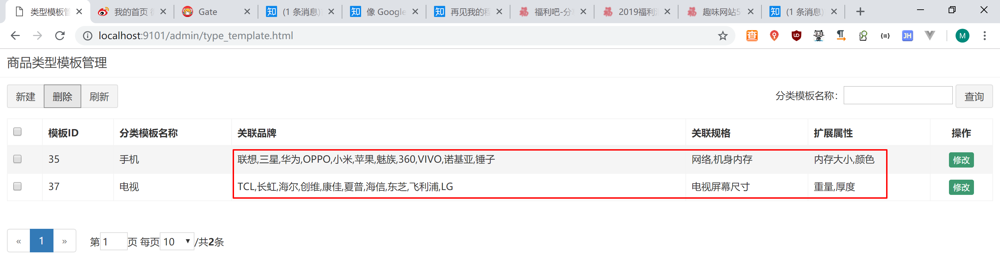

# Day03 规格及模板管理

## 前端分层开发

```html
    <script type="text/javascript">

        var app = angular.module('pinyougou', ['pagination']);

        //服务层
        app.service('brandService',function($http){
            //读取列表数据绑定到表单中
            this.findAll=function(){
                return $http.get('../brand/findAll.do');
            }
            //分页
            this.findPage=function(page,rows){
                return $http.get('../brand/findPage.do?page='+page+'&rows='+rows);
            }
            //查询实体
            this.findOne=function(id){
                return $http.get('../brand/findOne.do?id='+id);
            }
            //增加
            this.add=function(entity){
                return  $http.post('../brand/add.do',entity );
            }
            //修改
            this.update=function(entity){
                return  $http.post('../brand/update.do',entity );
            }
            //删除
            this.dele=function(ids){
                return $http.get('../brand/delete.do?ids='+ids);
            }
            //搜索
            this.search=function(page,rows,searchEntity){
                return $http.post('../brand/search.do?page='+page+"&rows="+rows, searchEntity);
            }
            //下拉列表数据
            this.selectOptionList=function(){
                return $http.get('../brand/selectOptionList.do');
            }

        });

        app.controller('brandController', function ($scope, $http, brandService) {
            // 查询品牌列表
            $scope.findAll = function () {
                brandService.findAll().success(
                    function (response) {
                        $scope.list = response;
                    }
                );
            }

            //分页控件配置currentPage:当前页 totalItems :总记录数 itemsPerPage:每页记录数 perPageOptions :分页选项 onChange:当页码变更后自动触发的方法
            $scope.paginationConf = {
                currentPage: 1,
                totalItems: 10,
                itemsPerPage: 10,
                perPageOptions: [10, 20, 30, 40, 50],
                onChange: function () {
                    $scope.reloadList();
                }
            };

            //刷新列表
            $scope.reloadList=function(){
                $scope.search( $scope.paginationConf.currentPage, $scope.paginationConf.itemsPerPage);
            }

            //分页
            $scope.findPage=function(page,rows){
                brandService.findPage(page,rows).success(
                    function(response){
                        $scope.list=response.rows;
                        $scope.paginationConf.totalItems=response.total;//更新总记录数
                    }
                );
            }

            //查询实体
            $scope.findOne=function(id){
                brandService.findOne(id).success(
                    function(response){
                        $scope.entity=response;
                    }
                );
            }

            //增加
            $scope.save=function(){
                var object=null;
                if($scope.entity.id!=null){
                    object=brandService.update($scope.entity);
                }else{
                    object=brandService.add($scope.entity);
                }
                object.success(
                    function(response){
                        if(response.success){//如果成功
                            $scope.reloadList();//刷新列表
                        }else{
                            alert(response.message);//提示错误
                        }
                    }
                );
            }

            $scope.selectIds=[];//用户选定复选的ID集合
            //用户勾选复选框
            $scope.updateSelection=function($event,id){
                if($event.target.checked){
                    $scope.selectIds.push(id);//push向集合添加元素
                }else{
                    var index= $scope.selectIds.indexOf(id);//查找值的 位置
                    $scope.selectIds.splice(index,1);//参数1：移除的位置 参数2：移除的个数
                }
            }

            //批量删除
            $scope.dele=function(){
                brandService.dele($scope.selectIds).success(
                    function(response){
                        if(response.success){
                            $scope.reloadList();//刷新
                        }else{
                            alert(response.message);
                        }
                    }
                );
            }

            $scope.searchEntity={};//定义搜索对象
            //条件查询
            $scope.search=function(page,rows){
                brandService.search(page,rows,$scope.searchEntity).success(
                    function(response){
                        $scope.list=response.rows;//显示当前页数据
                        $scope.paginationConf.totalItems=response.total;//更新总记录数
                    }
                );
            }
        });
    </script>

```

测试


## 代码分离JS


base_pagination.js

```javascript
var app=angular.module('pinyougou',['pagination']);
```

base.js

```javascript
var app=angular.module('pinyougou',[]);
```

brandService.js

```javascript
//品牌服务
app.service('brandService',function($http){
    //读取列表数据绑定到表单中
    this.findAll=function(){
        return $http.get('../brand/findAll.do');
    }
    //分页
    this.findPage=function(page,rows){
        return $http.get('../brand/findPage.do?page='+page+'&rows='+rows);
    }
    //查询实体
    this.findOne=function(id){
        return $http.get('../brand/findOne.do?id='+id);
    }
    //增加
    this.add=function(entity){
        return  $http.post('../brand/add.do',entity );
    }
    //修改
    this.update=function(entity){
        return  $http.post('../brand/update.do',entity );
    }
    //删除
    this.dele=function(ids){
        return $http.get('../brand/delete.do?ids='+ids);
    }
    //搜索
    this.search=function(page,rows,searchEntity){
        return $http.post('../brand/search.do?page='+page+"&rows="+rows, searchEntity);
    }
    //下拉列表数据
    this.selectOptionList=function(){
        return $http.get('../brand/selectOptionList.do');
    }

});
```

brandController.js

```javascript
app.controller('brandController', function ($scope, $http, brandService) {
    // 查询品牌列表
    $scope.findAll = function () {
        brandService.findAll().success(
            function (response) {
                $scope.list = response;
            }
        );
    }

    //分页控件配置currentPage:当前页 totalItems :总记录数 itemsPerPage:每页记录数 perPageOptions :分页选项 onChange:当页码变更后自动触发的方法
    $scope.paginationConf = {
        currentPage: 1,
        totalItems: 10,
        itemsPerPage: 10,
        perPageOptions: [10, 20, 30, 40, 50],
        onChange: function () {
            $scope.reloadList();
        }
    };

    //刷新列表
    $scope.reloadList=function(){
        $scope.search( $scope.paginationConf.currentPage, $scope.paginationConf.itemsPerPage);
    }

    //分页
    $scope.findPage=function(page,rows){
        brandService.findPage(page,rows).success(
            function(response){
                $scope.list=response.rows;
                $scope.paginationConf.totalItems=response.total;//更新总记录数
            }
        );
    }

    //查询实体
    $scope.findOne=function(id){
        brandService.findOne(id).success(
            function(response){
                $scope.entity=response;
            }
        );
    }

    //增加
    $scope.save=function(){
        var object=null;
        if($scope.entity.id!=null){
            object=brandService.update($scope.entity);
        }else{
            object=brandService.add($scope.entity);
        }
        object.success(
            function(response){
                if(response.success){//如果成功
                    $scope.reloadList();//刷新列表
                }else{
                    alert(response.message);//提示错误
                }
            }
        );
    }

    $scope.selectIds=[];//用户选定复选的ID集合
    //用户勾选复选框
    $scope.updateSelection=function($event,id){
        if($event.target.checked){
            $scope.selectIds.push(id);//push向集合添加元素
        }else{
            var index= $scope.selectIds.indexOf(id);//查找值的 位置
            $scope.selectIds.splice(index,1);//参数1：移除的位置 参数2：移除的个数
        }
    }

    //批量删除
    $scope.dele=function(){
        brandService.dele($scope.selectIds).success(
            function(response){
                if(response.success){
                    $scope.reloadList();//刷新
                }else{
                    alert(response.message);
                }
            }
        );
    }

    $scope.searchEntity={};//定义搜索对象
    //条件查询
    $scope.search=function(page,rows){
        brandService.search(page,rows,$scope.searchEntity).success(
            function(response){
                $scope.list=response.rows;//显示当前页数据
                $scope.paginationConf.totalItems=response.total;//更新总记录数
            }
        );
    }
});
```

brand.html

```html
<script type="text/javascript" src="../js/base_pagination.js"></script>
<script type="text/javascript" src="../js/service/brandService.js"></script>
<script type="text/javascript" src="../js/controller/brandController.js"></script>
```

测试


## 控制器继承


baseController.js

```javascript
//品牌控制层
app.controller('baseController' ,function($scope){

    //重新加载列表 数据
    $scope.reloadList=function(){
        //切换页码
        $scope.search( $scope.paginationConf.currentPage, $scope.paginationConf.itemsPerPage);
    }

    //分页控件配置
    $scope.paginationConf = {
        currentPage: 1,
        totalItems: 10,
        itemsPerPage: 10,
        perPageOptions: [10, 20, 30, 40, 50],
        onChange: function(){
            $scope.reloadList();//重新加载
        }
    };

    $scope.selectIds=[];//选中的ID集合

    //更新复选
    $scope.updateSelection = function($event, id) {
        if($event.target.checked){//如果是被选中,则增加到数组
            $scope.selectIds.push( id);
        }else{
            var idx = $scope.selectIds.indexOf(id);
            $scope.selectIds.splice(idx, 1);//删除
        }
    }


    $scope.jsonToString=function(jsonString,key){

        var json= JSON.parse(jsonString);
        var value="";

        for(var i=0;i<json.length;i++){
            if(i>0){
                value+=",";
            }
            value +=json[i][key];
        }

        return value;
    }

});
```

brandController.js

```javascript
//控制层
app.controller('brandController' ,function($scope,$controller,brandService){

    $controller('baseController',{$scope:$scope});//继承

    //读取列表数据绑定到表单中  
    $scope.findAll=function(){
        brandService.findAll().success(
            function(response){
                $scope.list=response;
            }
        );
    }

    //分页
    $scope.findPage=function(page,rows){
        brandService.findPage(page,rows).success(
            function(response){
                $scope.list=response.rows;
                $scope.paginationConf.totalItems=response.total;//更新总记录数
            }
        );
    }

    //查询实体
    $scope.findOne=function(id){
        brandService.findOne(id).success(
            function(response){
                $scope.entity= response;
            }
        );
    }

    //保存
    $scope.save=function(){
        var serviceObject;//服务层对象
        if($scope.entity.id!=null){//如果有ID
            serviceObject=brandService.update( $scope.entity ); //修改
        }else{
            serviceObject=brandService.add( $scope.entity  );//增加
        }
        serviceObject.success(
            function(response){
                if(response.success){
                    //重新查询
                    $scope.reloadList();//重新加载
                }else{
                    alert(response.message);
                }
            }
        );
    }


    //批量删除
    $scope.dele=function(){
        //获取选中的复选框
        brandService.dele( $scope.selectIds ).success(
            function(response){
                if(response.success){
                    $scope.reloadList();//刷新列表
                    $scope.selectIds=[];
                }
            }
        );
    }

    $scope.searchEntity={};//定义搜索对象

    //搜索
    $scope.search=function(page,rows){
        brandService.search(page,rows,$scope.searchEntity).success(
            function(response){
                $scope.list=response.rows;
                $scope.paginationConf.totalItems=response.total;//更新总记录数
            }
        );
    }

});    
```

测试


## 代码生成

用代码生成工具生成代码


拷贝8个接口


拷贝接口实现


SellerServiceImpl报错。因为主键是varchar类型。自动生成器没有考虑这种情况。手动修改

SellerService.java

```java
/**
 * 根据ID获取实体
 * @param id
 * @return
 */
public TbSeller findOne(String id);


/**
 * 批量删除
 * @param ids
 */
public void delete(String[] ids);
```

SellerServiceImpl.java

```java
/**
 * 根据ID获取实体
 * @param id
 * @return
 */
@Override
public TbSeller findOne(String id){
   return sellerMapper.selectByPrimaryKey(id);
}

/**
 * 批量删除
 */
@Override
public void delete(String[] ids) {
   for(String id:ids){
      sellerMapper.deleteByPrimaryKey(id);
   }     
}
```

拷贝控制层


最后根目录install一下

## 规格管理

修改specification.html

```html
<!DOCTYPE html>
<html>

<head>

    <script type="text/javascript" src="../plugins/angularjs/angular.min.js"></script>
    <!-- 分页组件开始 -->
    <script src="../plugins/angularjs/pagination.js"></script>
    <link rel="stylesheet" href="../plugins/angularjs/pagination.css">
    <!-- 分页组件结束 -->
    <script type="text/javascript" src="../js/base_pagination.js"></script>
    <script type="text/javascript" src="../js/service/specificationService.js"></script>
    <script type="text/javascript" src="../js/controller/baseController.js"></script>
    <script type="text/javascript" src="../js/controller/specificationController.js"></script>

</head>

<body class="hold-transition skin-red sidebar-mini" ng-app="pinyougou" ng-controller="specificationController">
            <tr ng-repeat="entity in list">
                <td><input type="checkbox"></td>
                <td>{{entity.id}}</td>
                <td>{{entity.specName}}</td>               
            </tr>
            </tbody>
        </table>
        <!--数据列表/-->
        <tm-pagination conf="paginationConf"></tm-pagination>
        <!--{{selectIds}}-->
    </div>
    <!-- 数据表格 /-->
</div>
<!-- /.box-body -->
</body>

</html>
```

http://localhost:9101/admin/specification.html

测试


## 增加规格-增加行

specification.html

```html
<!-- 规格选项 -->
<div class="btn-group">
    <button type="button" class="btn btn-default" title="新建" ng-click="addTableRow()"><i class="fa fa-file-o"></i> 新增规格选项
    </button>
</div>
<table class="table table-bordered table-striped table-hover dataTable">
    <thead>
    <tr>
        <th class="sorting">规格选项</th>
        <th class="sorting">排序</th>
        <th class="sorting">操作</th>
    </thead>
    <tbody>
    <tr ng-repeat="pojo in entity.specificationOptionList">
        <td>
            <input class="form-control" placeholder="规格选项" ng-model="pojo.optionName">
        </td>
        <td>
            <input class="form-control" placeholder="排序" ng-model="pojo.orders">
        </td>
        <td>
            <button type="button" class="btn btn-default" title="删除"><i class="fa fa-trash-o"></i> 删除
            </button>
        </td>
    </tr>
    </tbody>
</table>
```

speicficationController.js

```javascript
$scope.entity={specificationOptionList:[]};

//增加规格选项行
$scope.addTableRow=function(){
    $scope.entity.specificationOptionList.push({});
}

//删除规格选项行
$scope.deleTableRow=function(index){
    $scope.entity.specificationOptionList.splice(index,1);
}
```

测试


## 增加规格-删除行

specificationController.js

```javascript
//删除规格选项行
$scope.deleTableRow=function(index){
    $scope.entity.specificationOptionList.splice(index,1);
}
```

specification.html

```html
<td>
    <button type="button" class="btn btn-default" title="删除" ng-click="deleTableRow($index)"><i class="fa fa-trash-o"></i> 删除
    </button>
</td>
```

测试


## 增加规格-提交保存

新增POJO


```java
package com.pinyougou.pojogroup;

import com.pinyougou.pojo.TbSpecification;
import com.pinyougou.pojo.TbSpecificationOption;

import java.io.Serializable;
import java.util.List;

/**
 * 规格组合实体类
 * @author Administrator
 *
 */
public class Specification implements Serializable{

   private TbSpecification specification;
   
   private List<TbSpecificationOption> specificationOptionList;

   public TbSpecification getSpecification() {
      return specification;
   }

   public void setSpecification(TbSpecification specification) {
      this.specification = specification;
   }

   public List<TbSpecificationOption> getSpecificationOptionList() {
      return specificationOptionList;
   }

   public void setSpecificationOptionList(List<TbSpecificationOption> specificationOptionList) {
      this.specificationOptionList = specificationOptionList;
   }  
   
}
```

修改 specificationService.java

```java
/**
 * 增加
*/
public void add(Specification specification);
```

修改 specificationServiceImpl.java

```java
/**
 * 增加
 */
@Override
public void add(Specification specification) {
    // 获取规格实体
       TbSpecification tbspecification = specification.getSpecification();
       specificationMapper.insert(tbspecification);

       // 获取规格选项集合
       List<TbSpecificationOption> specificationOptionList = specification.getSpecificationOptionList();
       for (TbSpecificationOption option : specificationOptionList) {
           // 设置规格ID
           option.setSpecId(tbspecification.getId());
           // 新增规格
           specificationOptionMapper.insert(option);
       }
   }
```

修改 specificationController.java

```java
/**
 * 增加
 * @param specification
 * @return
 */
@RequestMapping("/add")
public Result add(@RequestBody Specification specification){
   try {
      specificationService.add(specification);
      return new Result(true, "增加成功");
   } catch (Exception e) {
      e.printStackTrace();
      return new Result(false, "增加失败");
   }
}
```

修改 TbSpecificationMapper.java

```xml
<insert id="insert" parameterType="com.pinyougou.pojo.TbSpecification" >
  <selectKey resultType="java.lang.Long" order="AFTER" keyProperty="id">
      SELECT LAST_INSERT_ID() AS id
  </selectKey>
  insert into tb_specification (id, spec_name)
  values (#{id,jdbcType=BIGINT}, #{specName,jdbcType=VARCHAR})
</insert>
```

修改 specificationController.js

```javascript
//保存 
$scope.save=function(){             
   var serviceObject;//服务层对象               
   if($scope.entity.specification.id!=null){//如果有ID
      serviceObject=specificationService.update( $scope.entity ); //修改  
   }else{
      serviceObject=specificationService.add( $scope.entity  );//增加 
   }           
   serviceObject.success(
      function(response){
         if(response.success){
            //重新查询 
              $scope.reloadList();//重新加载
         }else{
            alert(response.message);
         }
      }     
   );          
}
```

修改 specification.html

```html
<table class="table table-bordered table-striped" width="800px">
    <tr>
        <td>规格名称</td>
        <td><input class="form-control" placeholder="规格名称" ng-model="entity.specification.specName"></td>
    </tr>
</table>
```

测试


## 修改规格-查找

修改SpecificationService.java

```java
/**
 * 根据ID获取实体
 * @param id
 * @return
 */
public Specification findOne(Long id);
```

修改SpecificationServiceImpl.java

```java
/**
 * 根据ID获取实体
 * @param id
 * @return
 */
@Override
public Specification findOne(Long id){

    Specification specification=new Specification();
    //获取规格实体
    TbSpecification tbSpecification = specificationMapper.selectByPrimaryKey(id);
    specification.setSpecification(tbSpecification);

    //获取规格选项列表

    TbSpecificationOptionExample example=new TbSpecificationOptionExample();
    com.pinyougou.pojo.TbSpecificationOptionExample.Criteria criteria = example.createCriteria();
    criteria.andSpecIdEqualTo(id);
    List<TbSpecificationOption> specificationOptionList = specificationOptionMapper.selectByExample(example);

    specification.setSpecificationOptionList(specificationOptionList);

    return specification;//组合实体类
}
```

修改SpecificationController.java

```java
/**
 * 获取实体
 * @param id
 * @return
 */
@RequestMapping("/findOne")
public Specification findOne(Long id){
   return specificationService.findOne(id);      
}
```

修改Specification.html

```html
<td class="text-center">
    <button type="button" class="btn bg-olive btn-xs" data-toggle="modal" data-target="#editModal" ng-click="findOne(entity.id)">修改
    </button>
</td>
```

测试


## 修改规格-保存数据

修改SpecificationService.java

```java
/**
 * 修改
 */
public void update(Specification specification);
```

修改SpecificationServiceImpl.java

```java
/**
 * 修改
 */
@Override
public void update(Specification specification){

    //获取规格实体
    TbSpecification tbspecification = specification.getSpecification();
    specificationMapper.updateByPrimaryKey(tbspecification);

    //删除原来规格对应的规格选项

    TbSpecificationOptionExample example=new TbSpecificationOptionExample();
    com.pinyougou.pojo.TbSpecificationOptionExample.Criteria criteria = example.createCriteria();
    criteria.andSpecIdEqualTo(tbspecification.getId());
    specificationOptionMapper.deleteByExample(example);

    //获取规格选项集合
    List<TbSpecificationOption> specificationOptionList = specification.getSpecificationOptionList();
    for( TbSpecificationOption option:specificationOptionList){
        option.setSpecId(tbspecification.getId());//设置规格ID
        specificationOptionMapper.insert(option);//新增规格
    }

}
```

修改SpecificationController.java

```java
/**
 * 修改
 * @param specification
 * @return
 */
@RequestMapping("/update")
public Result update(@RequestBody Specification specification){
   try {
      specificationService.update(specification);
      return new Result(true, "修改成功");
   } catch (Exception e) {
      e.printStackTrace();
      return new Result(false, "修改失败");
   }
}  
```

测试


## 删除规格

修改SpecificationServiceImpl.java

```java
/**
 * 批量删除
 */
@Override
public void delete(Long[] ids) {
    for(Long id:ids){
        //删除规格表数据
        specificationMapper.deleteByPrimaryKey(id);

        //删除规格选项表数据
        TbSpecificationOptionExample example=new TbSpecificationOptionExample();
        com.pinyougou.pojo.TbSpecificationOptionExample.Criteria criteria = example.createCriteria();
        criteria.andSpecIdEqualTo(id);
        specificationOptionMapper.deleteByExample(example);
    }
}
```

修改Specification.html

```html
<button type="button" class="btn btn-default" title="删除" ng-click="dele()"><i class="fa fa-trash-o"></i> 删除</button>

<td><input type="checkbox" ng-click="updateSelection($event, entity.id)"></td>
```

测试


## 商品模板列表

修改type_template.html

```html
<script type="text/javascript" src="../plugins/angularjs/angular.min.js">  </script>
<script src="../plugins/angularjs/pagination.js"></script>
<link rel="stylesheet" href="../plugins/angularjs/pagination.css">
<script type="text/javascript" src="../js/base_pagination.js">  </script>
<script type="text/javascript" src="../js/service/typeTemplateService.js">  </script>
<script type="text/javascript" src="../js/controller/baseController.js">  </script>
<script type="text/javascript" src="../js/controller/typeTemplateController.js">  </script>


<tr ng-repeat="entity in list">
    <td><input  type="checkbox"></td>			                              
    <td>{{entity.id}}</td>
    <td>{{entity.name}}</td>
    <td>{{entity.brandIds}}</td>
    <td>{{entity.spedIds}}</td>
    <td>{{entity.customAttributeItems}}</td>
    <td class="text-center">                                           
        <button type="button" class="btn bg-olive btn-xs" data-toggle="modal" data-target="#editModal" >修改</button>                                           
    </td>
</tr>

<tm-pagination conf="paginationConf"></tm-pagination>
```

测试


## 下拉列表-静态

修改type_template.html

```html
<script type="text/javascript" src="../plugins/angularjs/angular.min.js"></script>

<!-- 分页组件开始 -->
<script src="../plugins/angularjs/pagination.js"></script>

<link rel="stylesheet" href="../plugins/angularjs/pagination.css">
<!-- 分页组件结束 -->

<script type="text/javascript" src="../js/base_pagination.js"></script>

<script type="text/javascript" src="../js/angular-select2.js"> </script>

<script type="text/javascript" src="../js/service/typeTemplateService.js"></script>
<script type="text/javascript" src="../js/service/brandService.js"></script>
<script type="text/javascript" src="../js/service/specificationService.js"></script>
<script type="text/javascript" src="../js/controller/baseController.js"></script>
<script type="text/javascript" src="../js/controller/typeTemplateController.js"></script>

<td>关联品牌</td>
<td>
    <input select2 select2-model="entity.brandIds"  config="brandList" multiple placeholder=" 选择品牌（可多选） " class="form-control">
</td>
```

修改typeTemplateController.js

```javascript
$scope.brandList={data:[{id:1,text:'联想'},{id:2,text:'华为'},{id:3,text:'小米'}]};//品牌列表
```

测试


## 下拉列表-动态-后端代码

TbBrandMapper.java添加

```java
List<Map> selectOptionList();
```

TbBrandMapper.xml添加

```xml
<select id="selectOptionList" resultType="java.util.Map">
   select id,name as text from tb_brand
</select>
```

BrandService添加

```java
/**
 * 返回下拉列表数据
 * @return
 */
List<Map> selectOptionList();
```

BrandServiceImpl添加

```java
@Override
public List<Map> selectOptionList() {
    return brandMapper.selectOptionList();
}
```

BrandController添加

```java
@RequestMapping("/selectOptionList")
public List<Map> selectOptionList() {
    return brandService.selectOptionList();
}
```

测试


## 下拉列表-动态-前端

brandService.js

```javascript
//下拉列表数据
this.selectOptionList=function(){
    return $http.get('../brand/selectOptionList.do');
}
```

typeTemplateController.js

```javascript
app.controller('typeTemplateController',function($scope,$controller,typeTemplateService,brandService){
    
    $scope.brandList={data:[]};//品牌列表
    //读取品牌列表
    $scope.findBrandList=function(){
        brandService.selectOptionList().success(
            function(response){
                $scope.brandList={data:response};
            }
        );
    }    
```

type_template.html

```html
<script type="text/javascript" src="../js/service/brandService.js"></script>

<body class="hold-transition skin-red sidebar-mini" ng-app="pinyougou" ng-controller="typeTemplateController" ng-init="findBrandList()">
```

测试


## 规格下拉列表

后端代码

TbSpecificationMapper.xml

```xml
<select id="selectOptionList" resultType="java.util.Map">
  select id, spec_name as text from tb_specification
</select>
```

TbSpecificationMapper.java

```java
List<Map> selectOptionList();
```

SpecificationService.java

```java
public List<Map> selectOptionList();
```

SpecificationServiceImpl.java

```java
@Override
public List<Map> selectOptionList() {
    return specificationMapper.selectOptionList();
}
```

SpecificationController.java

```java
@RequestMapping("/selectOptionList")
public List<Map> selectOptionList(){
    return specificationService.selectOptionList();
}
```

测试


前端

specificationService.js

```javascript
//下拉列表
this.selectOptionList=function(){
    return $http.get('../specification/selectOptionList.do');
}
```

typeTemplateController.js

```javascript
app.controller('typeTemplateController' ,function($scope,$controller,typeTemplateService,brandService,specificationService){
    
    $scope.specList={data:[]};//规格列表

    //读取规格列表
    $scope.findSpecList=function(){
        specificationService.selectOptionList().success(
            function(response){
                $scope.specList={data:response};
            }
        );
    }
```

type_template.html

```html
<script type="text/javascript" src="../js/service/specificationService.js"></script>

<body class="hold-transition skin-red sidebar-mini" ng-app="pinyougou" ng-controller="typeTemplateController" ng-init="findBrandList();findSpecList()">


<input select2 select2-model="entity.specIds"  config="specList" multiple placeholder=" 选择规格（可多选） " class="form-control">
```

测试


## 增加和删除扩展属性行

前端代码

typeTemplateController.js

```javascript
//增加扩展属性行
$scope.addTableRow=function(){
    $scope.entity.customAttributeItems.push({});
}
//删除扩展属性行
$scope.deleTableRow=function(index){
    $scope.entity.customAttributeItems.splice( index,1);
}
```

type_template.html

```html
<button type="button" class="btn btn-default" title="新建" data-toggle="modal" data-target="#editModal" ng-click="entity={customAttributeItems:[]}"><i class="fa fa-file-o"></i> 新建</button>


 <tr ng-repeat="pojo in entity.customAttributeItems">
     <td><input type="checkbox" class="icheckbox_square-blue" ></td>
     <td><input class="form-control" ng-model="pojo.text" placeholder="属性名称" ></td>
     <td><button type="button" class="btn btn-default" title="删除" ng-click="deleTableRow($index)"><i class="fa fa-trash-o"></i> 删除</button> </td>
</tr>
```

测试


## 保存模板

type_template.html

```html
<td><input  class="form-control" placeholder="商品类型" ng-model="entity.name">  </td>

<button class="btn btn-success" data-dismiss="modal" aria-hidden="true" ng-click="save()">保存</button>
```

测试


## 修改模板

typeTemplateController.js

```javascript
//查询实体
$scope.findOne=function(id){
    typeTemplateService.findOne(id).success(
        function(response){
            $scope.entity= response;

            //转换字符串为json对象（集合）
            $scope.entity.brandIds=  JSON.parse( $scope.entity.brandIds);
            $scope.entity.specIds= JSON.parse($scope.entity.specIds);
            $scope.entity.customAttributeItems = JSON.parse($scope.entity.customAttributeItems);

        }
    );
}
```

type_template.html

```html
<tr ng-repeat="entity in list">
    <td><input  type="checkbox"></td>                                        
    <td>{{entity.id}}</td>
    <td>{{entity.name}}</td>
    <td>{{jsonToString(entity.brandIds,'text')}}</td>
    <td>{{jsonToString(entity.specIds,'text')}}</td>
    <td>{{jsonToString(entity.customAttributeItems,'text')}}</td>
    <td class="text-center">
        <button type="button" class="btn bg-olive btn-xs" data-toggle="modal" data-target="#editModal" ng-click="findOne(entity.id)">修改</button>
    </td>
</tr>
```

测试


## 删除模板

type_template.html

```html
<td><input  type="checkbox" ng-click="updateSelection($event,entity.id)"></td>

<button type="button" class="btn btn-default" title="删除" ng-click="dele()"><i class="fa fa-trash-o" ></i> 删除</button>
```

测试


## 优化模板列表的显示

baseController.js

```javascript
$scope.jsonToString=function(jsonString,key){

    var json= JSON.parse(jsonString);
    var value="";

    for(var i=0;i<json.length;i++){
        if(i>0){
            value+=",";
        }
        value +=json[i][key];
    }

    return value;
}
```

type_template.html

```html
<td>{{jsonToString(entity.brandIds,'text')}}</td>
<td>{{jsonToString(entity.specIds,'text')}}</td>
<td>{{jsonToString(entity.customAttributeItems,'text')}}</td>
```




