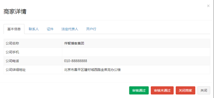
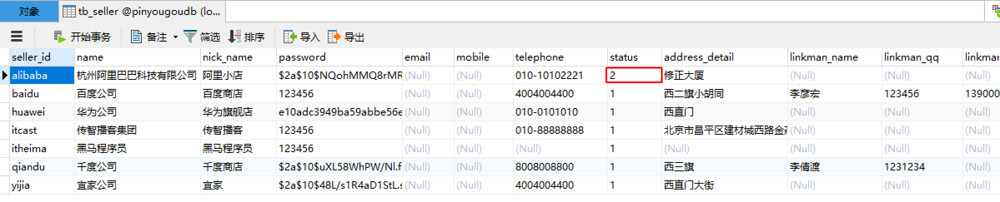

# DAY04

# 2.运营商系统登录与安全控制

## Spring Security安全框架

修改pinyougou-manager-web的pom.xml ，添加依赖

```xml
<!-- 身份验证 -->
<dependency>
    <groupId>org.springframework.security</groupId>
    <artifactId>spring-security-web</artifactId>
</dependency>
<dependency>
    <groupId>org.springframework.security</groupId>
    <artifactId>spring-security-config</artifactId>
</dependency>
```

修改web.xml 

```xml
<context-param>
    <param-name>contextConfigLocation</param-name>
    <param-value>classpath:spring/spring-security.xml</param-value>
</context-param>
<listener>
    <listener-class>
        org.springframework.web.context.ContextLoaderListener
    </listener-class>
</listener>

<filter>
    <filter-name>springSecurityFilterChain</filter-name>
    <filter-class>org.springframework.web.filter.DelegatingFilterProxy</filter-class>
</filter>
<filter-mapping>
    <filter-name>springSecurityFilterChain</filter-name>
    <url-pattern>/*</url-pattern>
</filter-mapping>
```

pinyougou-manager-web的spring目录下添加配置文件spring-security.xml

```xml
<?xml version="1.0" encoding="UTF-8"?>
<beans:beans xmlns="http://www.springframework.org/schema/security"
   xmlns:beans="http://www.springframework.org/schema/beans" xmlns:xsi="http://www.w3.org/2001/XMLSchema-instance"
   xsi:schemaLocation="http://www.springframework.org/schema/beans http://www.springframework.org/schema/beans/spring-beans.xsd
                  http://www.springframework.org/schema/security http://www.springframework.org/schema/security/spring-security.xsd">
   
   <!-- 设置页面不登陆也可以访问 -->
   <http pattern="/*.html" security="none"></http>
   <http pattern="/css/**" security="none"></http>
   <http pattern="/img/**" security="none"></http>
   <http pattern="/js/**" security="none"></http>
   <http pattern="/plugins/**" security="none"></http>

   <!-- 页面的拦截规则    use-expressions:是否启动SPEL表达式 默认是true -->
   <http use-expressions="false">
      <!-- 当前用户必须有ROLE_USER的角色 才可以访问根目录及所属子目录的资源 -->
      <intercept-url pattern="/**" access="ROLE_ADMIN"/>
      <!-- 开启表单登陆功能 -->
      <form-login  login-page="/login.html" default-target-url="/admin/index.html" authentication-failure-url="/login.html" always-use-default-target="true"/>
      <csrf disabled="true"/>
      <headers>
         <frame-options policy="SAMEORIGIN"/>
      </headers>
      <logout/>
   </http>
   
   <!-- 认证管理器 -->
   <authentication-manager>
      <authentication-provider>
         <user-service>
            <user name="admin" password="123456" authorities="ROLE_ADMIN"/>
            <user name="sunwukong" password="dasheng" authorities="ROLE_ADMIN"/>
         </user-service>
      </authentication-provider> 
   </authentication-manager>
      
</beans:beans>
```

修改pinyougou-manager-web的 login.html 

```html
<form class="sui-form" action="/login" method="post" id="loginform">

   <div class="input-prepend"><span class="add-on loginname"></span>
      <input id="prependedInput" name="username" type="text" placeholder="邮箱/用户名/手机号" class="span2 input-xfat">
   </div>
   <div class="input-prepend"><span class="add-on loginpwd"></span>
      <input id="prependedInput" name="password" type="password" placeholder="请输入密码" class="span2 input-xfat">
   </div>
   <div class="setting">
       <div id="slider">
         <div id="slider_bg"></div>
         <span id="label">>></span> <span id="labelTip">拖动滑块验证</span>
         </div>
   </div>
   <div class="logined">

      <a class="sui-btn btn-block btn-xlarge btn-danger" onclick="document:loginform.submit()" target="_blank">登&nbsp;&nbsp;录</a>
   </div>

</form>

```

测试


## 主界面显示登陆人

在pinyougou-manager-web新建LoginController.java

```java
package com.pinyougou.manager.controller;

import org.springframework.security.core.context.SecurityContextHolder;
import org.springframework.web.bind.annotation.RequestMapping;
import org.springframework.web.bind.annotation.RestController;

import java.util.HashMap;
import java.util.Map;

@RestController
@RequestMapping("/login")
public class LoginController {
    @RequestMapping("name")
    public Map name() {
        String name = SecurityContextHolder.getContext().getAuthentication().getName();
        Map map = new HashMap();
        map.put("loginName", name);
        return map;
    }
}
```

（1）新建loginService.js

```javascript
//登陆服务层
app.service('loginService',function($http){
    //读取登录人名称
    this.loginName=function(){
        return $http.get('../login/name.do');
    }
});
```

（2）新建indexController.js

```javascript
app.controller('indexController' ,function($scope,$controller   ,loginService){
    //读取当前登录人
    $scope.showLoginName=function(){
        loginService.loginName().success(
            function(response){
                $scope.loginName=response.loginName;
            }
        );
    }
});
```

修改index.html

```html
<script type="text/javascript" src="../plugins/angularjs/angular.min.js"></script>
<script type="text/javascript" src="../js/base.js"></script>
<script type="text/javascript" src="../js/service/loginService.js"></script>
<script type="text/javascript" src="../js/controller/indexController.js"></script>

<body class="hold-transition skin-green sidebar-mini" ng-app="pinyougou" ng-controller="indexController" ng-init="showLoginName ()">>


<a href="#" class="dropdown-toggle" data-toggle="dropdown">
    
    <span class="hidden-xs">{{loginName}}</span>
</a>
<p>
    {{loginName}}
    <small>最后登录 11:20AM</small>
</p>
<div class="pull-left info">
    <p> {{loginName}}</p>
    <a href="#"><i class="fa fa-circle text-success"></i> 在线</a>
</div>

```

测试


## 退出登录

spring-security.xml

```xml
<logout/>
```

index.html

```html
<div class="pull-right">
    <a href="../logout" class="btn btn-default btn-flat">注销</a>
</div>
```

测试


# 3.商家申请入驻

## 3.1需求分析

商家申请入驻，需要填写商家相关的信息。待运营商平台审核通过后即可使用使用。

## 3.2准备工作

（1）拷贝资源： 将“资源/静态原型/商家管理后台”下的页面拷贝到pinyougou-shop-web工程


（2）参照“运营商后台”构建js 


（3）拷贝后端控制层代码


## 3.3前端代码

修改register.html 引入JS

```html
<script type="text/javascript" src="plugins/angularjs/angular.min.js">  </script>
<script type="text/javascript" src="js/base.js">  </script>
<script type="text/javascript" src="js/service/sellerService.js">  </script>
<script type="text/javascript" src="js/controller/baseController.js">  </script>
<script type="text/javascript" src="js/controller/sellerController.js">  </script>
```

指令

```html
<body ng-app="pinyougou" ng-controller="sellerController">
```

绑定表单
```html
<div class="control-group">
   <label class="control-label">登陆名（不可修改）：</label>
   <div class="controls">
      <input type="text" placeholder="登陆名" ng-model="entity.sellerId" class="input-xfat input-xlarge">
   </div>
</div>

<div class="control-group">
   <label class="control-label">登陆密码：</label>
   <div class="controls">
      <input type="password" placeholder="登陆密码" ng-model="entity.password" class="input-xfat input-xlarge">
   </div>
</div>

<div class="control-group">
   <label class="control-label">店铺名称：</label>
   <div class="controls">
      <input type="text" placeholder="店铺名称" ng-model="entity.nickName" class="input-xfat input-xlarge">
   </div>
</div>

<div class="control-group">
   <label class="control-label">公司名称：</label>
   <div class="controls">
      <input type="text" placeholder="公司名称" ng-model="entity.name" class="input-xfat input-xlarge">
   </div>
</div>

<div class="control-group">
   <label class="control-label">公司电话：</label>
   <div class="controls">
      <input type="text" placeholder="公司电话" ng-model="entity.telephone" class="input-xfat input-xlarge">
   </div>
</div>

<div class="control-group">
   <label class="control-label">公司详细地址：</label>
   <div class="controls">
      <input type="text" placeholder="公司详细地址" ng-model="entity.addressDetail" class="input-xfat input-xlarge">
   </div>
</div>

<div class="control-group">
   <label class="control-label">联系人姓名：</label>
   <div class="controls">
      <input type="text" placeholder="联系人姓名" class="input-xfat input-xlarge">
   </div>
</div>

<div class="control-group">
   <label class="control-label">联系人QQ：</label>
   <div class="controls">
      <input type="text" placeholder="联系人QQ" class="input-xfat input-xlarge">
   </div>
</div>

<div class="control-group">
   <label class="control-label">联系人手机：</label>
   <div class="controls">
      <input type="text" placeholder="联系人手机" class="input-xfat input-xlarge">
   </div>
</div>

<div class="control-group">
   <label class="control-label">联系人EMAIL：</label>
   <div class="controls">
      <input type="text" placeholder="联系人EMAIL" class="input-xfat input-xlarge">
   </div>
</div>

<div class="control-group">
   <label class="control-label">营业执照号：</label>
   <div class="controls">
      <input type="text" placeholder="营业执照号" class="input-xfat input-xlarge">
   </div>
</div>

<div class="control-group">
   <label class="control-label">税务登记证号：</label>
   <div class="controls">
      <input type="text" placeholder="税务登记证号" class="input-xfat input-xlarge">
   </div>
</div>

<div class="control-group">
   <label class="control-label">组织机构代码证：</label>
   <div class="controls">
      <input type="text" placeholder="组织机构代码证" class="input-xfat input-xlarge">
   </div>
</div>

<div class="control-group">
   <label class="control-label">法定代表人：</label>
   <div class="controls">
      <input type="text" placeholder="法定代表人" class="input-xfat input-xlarge">
   </div>
</div>

<div class="control-group">
   <label class="control-label">法定代表人身份证号：</label>
   <div class="controls">
      <input type="text" placeholder="法定代表人身份证号" class="input-xfat input-xlarge">
   </div>
</div>

<div class="control-group">
   <label class="control-label">开户行名称：</label>
   <div class="controls">
      <input type="text" placeholder="开户行名称" class="input-xfat input-xlarge">
   </div>
</div>

<div class="control-group">
   <label class="control-label">开户行支行：</label>
   <div class="controls">
      <input type="text" placeholder="开户行支行" class="input-xfat input-xlarge">
   </div>
</div>

<div class="control-group">
   <label class="control-label">银行账号：</label>
   <div class="controls">
      <input type="text" placeholder="银行账号" class="input-xfat input-xlarge">
   </div>
</div>
```

修改sellerController.js ，在保存成功后跳转到登陆页

```javascript
//新增 
$scope.add=function(){
   sellerService.add( $scope.entity  ).success(
      function(response){
         if(response.success){
            //如果注册成功，跳转到登录页
              location.href="shoplogin.html";
         }else{
            alert(response.message);
         }
      }     
   );          
}
```

绑定“申请入驻”按钮

```html
<a class="sui-btn btn-block btn-xlarge btn-danger" ng-click="add()" target="_blank">申请入驻</a>
```

## 3.4后端代码

修改后端代码pinyougou-sellergoods-service的SellerServiceImpl类的add方法，设置默认状态为0

```java
/**
 * 增加
 * @param seller
 * @return
 */
@RequestMapping("/add")
public Result add(@RequestBody TbSeller seller){
   try {
      sellerService.add(seller);
      return new Result(true, "增加成功");
   } catch (Exception e) {
      e.printStackTrace();
      return new Result(false, "增加失败");
   }
}
```

测试


# 4.商家审核

## 4.1需求分析

商家申请入驻后，需要网站运营人员在运营商后台进行审核，审核后商家才可以登陆系统。

 

**状态值：**  0：未审核   1：已审核   2：审核未通过   3：关闭

## 4.2商家待审核列表

修改seller_1.html

引入JS

```html
<script type="text/javascript" src="../plugins/angularjs/angular.min.js">  </script>
<!-- 分页组件开始 -->
<script src="../plugins/angularjs/pagination.js"></script>
<link rel="stylesheet" href="../plugins/angularjs/pagination.css">
<!-- 分页组件结束 -->
<script type="text/javascript" src="../js/base_pagination.js">  </script>
<script type="text/javascript" src="../js/service/sellerService.js">  </script>
<script type="text/javascript" src="../js/controller/baseController.js">  </script>
<script type="text/javascript" src="../js/controller/sellerController.js">  </script>
```

指令

```html
<body class="hold-transition skin-red sidebar-mini"  ng-app="pinyougou" ng-controller="sellerController" ng-init="searchEntity={status:'0'}">
```

加入分页控件

```html
<tm-pagination conf="paginationConf"></tm-pagination>
```

循环

```html
<tr ng-repeat="entity in list">
    <td><input  type="checkbox"></td>
    <td>{{entity.sellerId}}</td>
    <td>{{entity.name}}</td>
    <td>{{entity.nickName}}</td>
    <td>{{entity.linkmanName}}</td>
    <td>{{entity.telephone}}</td>
    <td class="text-center">
        <button type="button" class="btn bg-olive btn-xs" data-toggle="modal" data-target="#sellerModal" >详情</button>
    </td>
</tr>
```

测试


## 4.3商家详情



（1）绑定页面弹出窗口

```html
<table class="table table-bordered table-striped"  width="800px">
   <tr>
      <td>公司名称</td>
      <td>{{entity.name}}</td>
   </tr>
   <tr>
      <td>公司手机</td>
      <td>{{entity.mobile}}</td>
   </tr>
   <tr>
      <td>公司电话</td>
      <td>{{entity.telephone}}</td>
   </tr>
   <tr>
      <td>公司详细地址</td>
      <td>{{entity.addressDetail}}</td>
   </tr>
</table>
```

（2）列表的“详情”按钮

```html
<button type="button" class="btn bg-olive btn-xs" data-toggle="modal" data-target="#sellerModal" ng-click="findOne(entity.sellerId)">详情</button>
```

测试


## 4.4商家审核

### 4.4.1 后端代码

（1）在pinyougou-sellergoods-interface工程的SellerService.java服务接口新增方法定义

```java
/**
 * 更改状态
 * @param id
 * @param status
 */
public void updateStatus(String sellerId,String status);
```

（2）在pinyougou-sellergoods-service的SellerServiceImpl.java新增方法

```java
@Override
public void updateStatus(String sellerId, String status) {
   TbSeller seller = sellerMapper.selectByPrimaryKey(sellerId);
   seller.setStatus(status);
   sellerMapper.updateByPrimaryKey(seller);
}
```

（3）在pinyougou-manager-web的SellerController.java新增方法

```java
/**
 * 更改状态
 * @param sellerId 商家ID
 * @param status 状态
 */
@RequestMapping("/updateStatus")
public Result updateStatus(String sellerId, String status){
   try {
      sellerService.updateStatus(sellerId, status);
      return new Result(true, "成功");
   } catch (Exception e) {
      e.printStackTrace();
      return new Result(false, "失败");
   }
}
```

### 4.4.2 前端代码

修改pinyougou-manager-web的sellerService.js

```javascript
//更改状态
this.updateStatus=function(sellerId,status){
   return $http.get('../seller/updateStatus.do?sellerId='+sellerId+'&status='+status);
}
```

修改pinyougou-manager-web的sellerController.js

```javascript
$scope.updateStatus=function(sellerId,status){
   sellerService.updateStatus(sellerId,status).success(
      function(response){
         if(response.success){
            $scope.reloadList();//刷新列表
         }else{
            alert("失败");
         }
      }
   );
}
```

修改按钮，调用方法

```html
<div class="modal-footer">
   <button class="btn btn-success" data-dismiss="modal" aria-hidden="true" ng-click="updateStatus(entity.sellerId,'1')">审核通过</button>
   <button class="btn btn-danger"  data-dismiss="modal" aria-hidden="true" ng-click="updateStatus(entity.sellerId,'2')">审核未通过</button>
   <button class="btn btn-danger" data-dismiss="modal" aria-hidden="true"  ng-click="updateStatus(entity.sellerId,'3')">关闭商家</button>
   <button class="btn btn-default" data-dismiss="modal" aria-hidden="true">关闭</button>
</div>
```

测试，审核不通过，数据库改变



# 5.商家系统登录与安全控制

## 5.1需求分析

完成商家系统登陆与安全控制，商家账号来自数据库，并实现密码加密

## 5.2自定义认证类

（1）pom.xml、web.xml  、shopLogin.html  参照运营商管理后台

```xml
<dependency>
    <groupId>org.springframework.security</groupId>
    <artifactId>spring-security-web</artifactId>
</dependency>
<dependency>
    <groupId>org.springframework.security</groupId>
    <artifactId>spring-security-config</artifactId>
</dependency>
```

```xml
<context-param>
    <param-name>contextConfigLocation</param-name>
    <param-value>classpath:spring/spring-security.xml</param-value>
</context-param>
<listener>
    <listener-class>
        org.springframework.web.context.ContextLoaderListener
    </listener-class>
</listener>

<filter>
    <filter-name>springSecurityFilterChain</filter-name>
    <filter-class>org.springframework.web.filter.DelegatingFilterProxy</filter-class>
</filter>
<filter-mapping>
    <filter-name>springSecurityFilterChain</filter-name>
    <url-pattern>/*</url-pattern>
</filter-mapping>
```

```html
<form class="sui-form" action="/login" method="post" id="loginform">
   <div class="input-prepend"><span class="add-on loginname"></span>
      <input id="prependedInput" type="text" name="username" placeholder="邮箱/用户名/手机号" class="span2 input-xfat">
   </div>
   <div class="input-prepend"><span class="add-on loginpwd"></span>
      <input id="prependedInput" type="password" name="password" placeholder="请输入密码" class="span2 input-xfat">
   </div>
    
    									<a class="sui-btn btn-block btn-xlarge btn-danger" onclick="document:loginform.submit()" target="_blank">登&nbsp;&nbsp;录</a>

```

（2）在pinyougou-shop-web创建com.pinyougou.service包，包下创建类UserDetailsServiceImpl.java 实现UserDetailsService接口

```java
package com.pinyougou.service;
import org.springframework.security.core.GrantedAuthority;
import org.springframework.security.core.authority.SimpleGrantedAuthority;
import org.springframework.security.core.userdetails.User;
import org.springframework.security.core.userdetails.UserDetails;
import org.springframework.security.core.userdetails.UserDetailsService;
import org.springframework.security.core.userdetails.UsernameNotFoundException;

import java.util.ArrayList;
import java.util.List;
/**
 * 认证类
 * @author Administrator
 *
 */
public class UserDetailsServiceImpl implements UserDetailsService {
   @Override
   public UserDetails loadUserByUsername(String username) throws UsernameNotFoundException {
      List<GrantedAuthority> grantedAuths = new ArrayList<GrantedAuthority>();
      grantedAuths.add(new SimpleGrantedAuthority("ROLE_SELLER"));
      return new User(username,"123456", grantedAuths);
   }
}
```

（3）在pinyougou-shop-web的spring目录下创建spring-security.xml

经过上述配置，用户在输入密码123456时就会通过（用户名随意）

```java
<?xml version="1.0" encoding="UTF-8"?>
<beans:beans xmlns="http://www.springframework.org/schema/security"
             xmlns:beans="http://www.springframework.org/schema/beans"
             xmlns:xsi="http://www.w3.org/2001/XMLSchema-instance"
             xsi:schemaLocation="http://www.springframework.org/schema/beans http://www.springframework.org/schema/beans/spring-beans.xsd
                  http://www.springframework.org/schema/security http://www.springframework.org/schema/security/spring-security.xsd">

    <!-- 以下页面不被拦截 -->
    <http pattern="/*.html" security="none"></http>
    <http pattern="/css/**" security="none"></http>
    <http pattern="/img/**" security="none"></http>
    <http pattern="/js/**" security="none"></http>
    <http pattern="/plugins/**" security="none"></http>
    <http pattern="/seller/add.do" security="none"></http>
    <!-- 页面拦截规则 -->
    <http use-expressions="false">
        <intercept-url pattern="/**" access="ROLE_SELLER"/>
        <form-login login-page="/shoplogin.html" default-target-url="/admin/index.html"
                    authentication-failure-url="/shoplogin.html" always-use-default-target="true"/>
        <csrf disabled="true"/>
        <headers>
            <frame-options policy="SAMEORIGIN"/>
        </headers>
        <logout/>
    </http>
    <!-- 认证管理器 -->
    <authentication-manager>
        <authentication-provider user-service-ref="userDetailService">
        </authentication-provider>
    </authentication-manager>
    <beans:bean id="userDetailService"
                class="com.pinyougou.service.UserDetailsServiceImpl"></beans:bean>


</beans:beans>
```

测试


## 5.3认证类调用服务方法

修改UserDetailsServiceImpl.java ，添加属性和setter方法 ，修改loadUserByUsername方法

```java
/**
 * 认证类
 * @author Administrator
 *
 */
public class UserDetailsServiceImpl implements UserDetailsService {
   private SellerService sellerService;
   public void setSellerService(SellerService sellerService) {
      this.sellerService = sellerService;
   }
   @Override
   public UserDetails loadUserByUsername(String username) throws UsernameNotFoundException {
      System.out.println("经过了UserDetailsServiceImpl");
      //构建角色列表
      List<GrantedAuthority> grantAuths=new ArrayList();
      grantAuths.add(new SimpleGrantedAuthority("ROLE_SELLER"));
      //得到商家对象
      TbSeller seller = sellerService.findOne(username);
      if(seller!=null){
         if(seller.getStatus().equals("1")){
            return new User(username,seller.getPassword(),grantAuths);
         }else{
            return null;
         }
      }else{
         return null;
      }
   }
}
```

修改pinyougou-shop-web的spring-security.xml，添加如下配置

```xml
<beans:bean id="userDetailService" class="com.pinyougou.service.UserDetailsServiceImpl">
    <beans:property name="sellerService" ref="sellerService"></beans:property>
</beans:bean>

<!-- 引用dubbo 服务 -->
<dubbo:application name="pinyougou-shop-web" />
<dubbo:registry address="zookeeper://192.168.25.134:2181"/>
<dubbo:reference id="sellerService"  interface="com.pinyougou.sellergoods.service.SellerService" >
</dubbo:reference>
```

经过上述修改后，在登陆页输入用户名和密码与数据库一致即可登陆。


## 5.4密码加密

### 5.4.1 BCrypt加密算法

用户表的密码通常使用MD5等不可逆算法加密后存储，为防止彩虹表破解更会先使用一个特定的字符串（如域名）加密，然后再使用一个随机的salt（盐值）加密。 特定字符串是程序代码中固定的，salt是每个密码单独随机，一般给用户表加一个字段单独存储，比较麻烦。 BCrypt算法将salt随机并混入最终加密后的密码，验证时也无需单独提供之前的salt，从而无需单独处理salt问题。

### 5.4.2商家入驻密码加密

商家申请入驻的密码要使用BCrypt算法进行加密存储，修改SellerController.java的add方法

```java
/**
 * 增加
 * @param seller
 * @return
 */
@RequestMapping("/add")
public Result add(@RequestBody TbSeller seller){
   //密码加密
   BCryptPasswordEncoder passwordEncoder = new BCryptPasswordEncoder();
   String password = passwordEncoder.encode(seller.getPassword());
   seller.setPassword(password);
   try {
      sellerService.add(seller);
      return new Result(true, "增加成功");
   } catch (Exception e) {
      e.printStackTrace();
      return new Result(false, "增加失败");
   }
}
```

### 5.4.3加密配置

修改pinyougou-shop-web的spring-security.xml ，添加如下配置

```xml
<!-- 认证管理器 -->
<authentication-manager>
    <authentication-provider user-service-ref="userDetailService">
        <password-encoder ref="bcryptEncoder"></password-encoder>
    </authentication-provider>
</authentication-manager>

<beans:bean id="bcryptEncoder" class="org.springframework.security.crypto.bcrypt.BCryptPasswordEncoder" />
```

修改认证管理器的配置


> 接口报404。原因：dubbo扫描接口namespace出错


登录 测试


