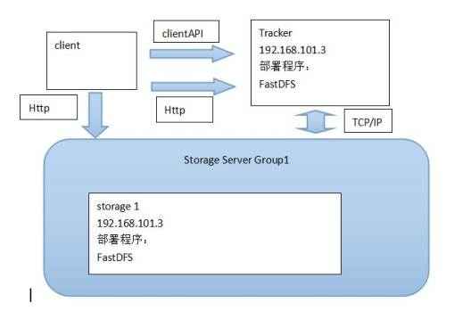

# Day5 商品管理1

## 1.2列表实现

### 1.2.1后端代码

修改pinyougou-sellergoods-interface工程ItemCatService接口，新增方法定义

```java
/**
 * 根据上级ID返回列表
 * @return
 */
public List<TbItemCat> findByParentId(Long parentId);
```

修改pinyougou-sellergoods-interface工程ItemCatServiceImpl ，实现方法

```java
/**
 * 根据上级ID查询列表
 */
@Override
public List<TbItemCat> findByParentId(Long parentId) {
   TbItemCatExample example1=new TbItemCatExample();
   Criteria criteria1 = example1.createCriteria();
   criteria1.andParentIdEqualTo(parentId);
   return  itemCatMapper.selectByExample(example1);
}
```

修改pinyougou-manager-web的ItemCatController.java

```java
/**
 * 根据上级ID查询列表
 *
 * @param parentId
 * @return
 */
@RequestMapping("/findByParentId")
public List<TbItemCat> findByParentId(Long parentId) {
    return itemCatService.findByParentId(parentId);
}
```

### 1.2.2前端代码

（1）修改itemCatService.js

```javascript
//根据上级ID查询下级列表
this.findByParentId=function(parentId){
    return $http.get('../itemCat/findByParentId.do?parentId='+parentId);
}
```

（2）修改itemCatController.js

```javascript
//根据上级ID显示下级列表
$scope.findByParentId=function(parentId){
    itemCatService.findByParentId(parentId).success(
        function(response){
            $scope.list=response;
        }
    );
}
```

（3）修改item_cat.html

引入JS

```html
<script type="text/javascript" src="../plugins/angularjs/angular.min.js">  </script>
<script type="text/javascript" src="../js/base.js">  </script>
<script type="text/javascript" src="../js/service/itemCatService.js">  </script>
<script type="text/javascript" src="../js/controller/baseController.js">  </script>
<script type="text/javascript" src="../js/controller/itemCatController.js">  </script>
```

指令定义

```html
<body class="hold-transition skin-red sidebar-mini" ng-app="pinyougou" ng-controller="itemCatController" ng-init="findByParentId(0)">
```

循环列表

```html
<tr ng-repeat="entity in list">
    <td><input type="checkbox" ></td>
    <td>{{entity.id}}</td>
    <td>{{entity.name}}</td>
    <td>{{entity.typeId}}</td>
    <td class="text-center">
        <button type="button" class="btn bg-olive btn-xs" ng-click="findByParentId(entity.id)">查询下级</button>
        <button type="button" class="btn bg-olive btn-xs" data-toggle="modal" data-target="#editModal" >修改</button>
    </td>
</tr>
```

测试


测试查询下级


## 1.3面包屑导航

我们需要返回上级列表，需要通过点击面包屑来实现

修改itemCatController.js 

```javascript
$scope.grade=1;//默认为1级
//设置级别
$scope.setGrade=function(value){
    $scope.grade=value;
}
//读取列表
$scope.selectList=function(p_entity){
    if($scope.grade==1){//如果为1级
        $scope.entity_1=null;
        $scope.entity_2=null;
    }
    if($scope.grade==2){//如果为2级
        $scope.entity_1=p_entity;
        $scope.entity_2=null;
    }
    if($scope.grade==3){//如果为3级
        $scope.entity_2=p_entity;
    }
    $scope.findByParentId(p_entity.id);    //查询此级下级列表
}
```

item_cat.html

修改列表的查询下级按钮，设定级别值后 显示列表

```html
<span ng-if="grade!=3">
  <button type="button" class="btn bg-olive btn-xs" ng-click="setGrade(grade+1);selectList(entity)">查询下级</button>
</span>
```

这里我们使用了ng-if指令，用于条件判断，当级别不等于3的时候才显示“查询下级”按钮

绑定面包屑：

```html
<ol class="breadcrumb">
    <li><a href="#" ng-click="grade=1;selectList({id:0})">顶级分类列表</a></li>
    <li><a href="#" ng-click="grade=2;selectList(entity_1)">{{entity_1.name}}</a></li>
    <li><a href="#" ng-click="grade=3;selectList(entity_2)">{{entity_2.name}}</a></li>
</ol>
```

测试


## 1.4新增商品分类

实现商品分类，如下图:


当前显示的是哪一分类的列表，我们就将这个商品分类新增到这个分类下。

实现思路：我们需要一个变量去记住上级ID，在保存的时候再根据这个ID来新增分类

修改itemCatController.js,  定义变量

```javascript
//根据上级ID显示下级列表
$scope.findByParentId=function(parentId){

    $scope.parentId=parentId;//记住上级ID

    itemCatService.findByParentId(parentId).success(
        function(response){
            $scope.list=response;
        }
    );
}
```


```javascript
//保存 
$scope.save=function(){             
   var serviceObject;//服务层对象               
   if($scope.entity.id!=null){//如果有ID
      serviceObject=itemCatService.update( $scope.entity ); //修改  
   }else{

           $scope.entity.parentId=$scope.parentId;//赋予上级ID

      serviceObject=itemCatService.add( $scope.entity  );//增加 
   }           
   serviceObject.success(
      function(response){
         if(response.success){

                   //重新查询
                   $scope.findByParentId($scope.parentId);//重新加载

               }else{
            alert(response.message);
         }
      }     
   );          
}
```

修改页面item_cat.html

```html
<div class="modal-body">
    <table class="table table-bordered table-striped"  width="800px">
        <tr>
            <td>上级商品分类</td>
            <td>
                {{entity_1.name}} >>  {{entity_2.name}}
            </td>
        </tr>
        <tr>
            <td>商品分类名称</td>
            <td><input  class="form-control" ng-model="entity.name" placeholder="商品分类名称">  </td>
        </tr>
        <tr>
            <td>类型模板</td>
            <td>
                <input ng-model="entity.typeId" placeholder="商品类型模板" class="form-control" type="text"/>
            </td>
        </tr>
    </table>
</div>
<div class="modal-footer">
    <button class="btn btn-success" data-dismiss="modal" aria-hidden="true" ng-click="save()">保存</button>
    <button class="btn btn-default" data-dismiss="modal" aria-hidden="true">关闭</button>
</div>
```

测试


## 1.5修改商品分类

修改item_cat.html的修改按钮

```html
<button type="button" class="btn bg-olive btn-xs" data-toggle="modal" data-target="#editModal" ng-click="findOne(entity.id)">修改</button>
```

测试


# 3.商家后台-商品录入【基本功能】

## 3.1需求分析

在商家后台实现商品录入功能。包括商品名称、副标题、价格、包装列表、售后服务


## 3.2后端代码

### 3.2.1实体类

创建组合实体类goods

```java
package com.pinyougou.pojogroup;

import com.pinyougou.pojo.TbGoods;
import com.pinyougou.pojo.TbGoodsDesc;
import com.pinyougou.pojo.TbItem;

import java.io.Serializable;
import java.util.List;

public class Goods implements Serializable {
    private TbGoods goods;//商品SPU
    private TbGoodsDesc goodsDesc;//商品扩展
    private List<TbItem> itemList;//商品SKU列表

    public TbGoods getGoods() {
        return goods;
    }

    public void setGoods(TbGoods goods) {
        this.goods = goods;
    }

    public TbGoodsDesc getGoodsDesc() {
        return goodsDesc;
    }

    public void setGoodsDesc(TbGoodsDesc goodsDesc) {
        this.goodsDesc = goodsDesc;
    }

    public List<TbItem> getItemList() {
        return itemList;
    }

    public void setItemList(List<TbItem> itemList) {
        this.itemList = itemList;
    }

    @Override
    public String toString() {
        return "Goods{" +
                "goods=" + goods +
                ", goodsDesc=" + goodsDesc +
                ", itemList=" + itemList +
                '}';
    }
}
```

### 3.2.2数据访问层

由于我们需要在商品表添加数据后可以得到自增的ID,所以我们需要在TbGoodsMapper.xml中的insert配置中添加如下配置

```xml
<insert id="insert" parameterType="com.pinyougou.pojo.TbGoods" >

  <selectKey resultType="java.lang.Long" order="AFTER" keyProperty="id">
    SELECT LAST_INSERT_ID() AS id
  </selectKey>

  insert into tb_goods (id, seller_id, goods_name, 
    default_item_id, audit_status, is_marketable, 
    brand_id, caption, category1_id, 
    category2_id, category3_id, small_pic, 
    price, type_template_id, is_enable_spec, 
    is_delete)
  values (#{id,jdbcType=BIGINT}, #{sellerId,jdbcType=VARCHAR}, #{goodsName,jdbcType=VARCHAR}, 
    #{defaultItemId,jdbcType=BIGINT}, #{auditStatus,jdbcType=VARCHAR}, #{isMarketable,jdbcType=VARCHAR}, 
    #{brandId,jdbcType=BIGINT}, #{caption,jdbcType=VARCHAR}, #{category1Id,jdbcType=BIGINT}, 
    #{category2Id,jdbcType=BIGINT}, #{category3Id,jdbcType=BIGINT}, #{smallPic,jdbcType=VARCHAR}, 
    #{price,jdbcType=DECIMAL}, #{typeTemplateId,jdbcType=BIGINT}, #{isEnableSpec,jdbcType=VARCHAR}, 
    #{isDelete,jdbcType=VARCHAR})
</insert>
```

### 3.2.3服务接口层

修改pinyougou-sellergoods-interface 的GoodsService接口 add方法

```java
/**
 * 增加
 */
public void add(Goods goods);
```

### 3.2.4服务实现层

修改pinyougou-sellergoods-service的GoodsServiceImpl.java 

```java
@Autowired
private TbGoodsDescMapper goodsDescMapper;

/**
 * 增加
 */
@Override
public void add(Goods goods) {
    goods.getGoods().setAuditStatus("0");//设置未申请状态
    goodsMapper.insert(goods.getGoods());
    goods.getGoodsDesc().setGoodsId(goods.getGoods().getId());//设置ID
    goodsDescMapper.insert(goods.getGoodsDesc());//插入商品扩展数据
}
```

### 3.2.5控制层

修改pinyougou-shop-web工程的GoodsController的add方法

```java
/**
 * 增加
 * @param goods
 * @return
 */
@RequestMapping("/add")
public Result add(@RequestBody Goods goods){
   //获取登录名
   String sellerId = SecurityContextHolder.getContext().getAuthentication().getName();
   goods.getGoods().setSellerId(sellerId);//设置商家ID
   try {
      goodsService.add(goods);
      return new Result(true, "增加成功");
   } catch (Exception e) {
      e.printStackTrace();
      return new Result(false, "增加失败");
   }
}
```

## 3.3前端代码

### 3.3.1控制层

修改goodsController.js ，在增加成功后弹出提示，并清空实体（因为编辑页面无列表）

```javascript
//保存
$scope.add=function(){
    goodsService.add( $scope.entity  ).success(
        function(response){
            if(response.success){
                alert('保存成功');
                $scope.entity={};
            }else{
                alert(response.message);
            }
        }
    );
}
```

### 3.3.2页面

修改goods_edit.html  

引入JS:

```html
<script type="text/javascript" src="../plugins/angularjs/angular.min.js">  </script>
<script type="text/javascript" src="../js/base.js">  </script>
<script type="text/javascript" src="../js/service/goodsService.js">  </script>
<script type="text/javascript" src="../js/controller/baseController.js">  </script>
<script type="text/javascript" src="../js/controller/goodsController.js">  </script>
```

定义控制器：

```html
<body class="hold-transition skin-red sidebar-mini" ng-app="pinyougou" ng-controller="goodsController">
```

表单部分代码：

```html
<div class="col-md-10 data">
   <input type="text" class="form-control"  ng-model="entity.goods.goodsName"  placeholder="商品名称" value="">
</div>

<div class="col-md-2 title">品牌</div>
<div class="col-md-10 data">
   <select class="form-control" ></select>
</div>

<div class="col-md-2 title">副标题</div>
<div class="col-md-10 data">
   <input type="text" class="form-control" ng-model="entity.goods.caption"   placeholder="副标题" value="">
</div>

<div class="col-md-2 title">价格</div>
<div class="col-md-10 data">
   <div class="input-group">
      <span class="input-group-addon">¥</span>
      <input type="text" class="form-control" ng-model="entity.goods.price" placeholder="价格" value="">
   </div>
</div>

<div class="col-md-2 title editer">商品介绍</div>
<div class="col-md-10 data editer">
   <textarea name="content" style="width:800px;height:400px;visibility:hidden;" ></textarea>
</div>

<div class="col-md-2 title rowHeight2x">包装列表</div>
<div class="col-md-10 data rowHeight2x">

   <textarea rows="4"  class="form-control" ng-model="entity.goodsDesc.packageList"  placeholder="包装列表"></textarea>
</div>

<div class="col-md-2 title rowHeight2x">售后服务</div>
<div class="col-md-10 data rowHeight2x">
   <textarea rows="4"  class="form-control"  ng-model="entity.goodsDesc.saleService"  placeholder="售后服务"></textarea>
</div>
```

保存按钮

```html
<button class="btn btn-primary" ng-click="add()"><i class="fa fa-save"></i>保存</button>
```

测试


# 4.商家后台-商品录入【商品介绍】

## 4.1需求分析

实现商品介绍的录入，要求使用富文本编辑器


## 4.2富文本编辑器介绍

富文本编辑器，Rich Text Editor, 简称 RTE, 它提供类似于 Microsoft Word 的编辑功能。常用的富文本编辑器：

KindEditor    http://kindeditor.net/

UEditor      http://ueditor.baidu.com/website/

CKEditor     http://ckeditor.com/

## 4.3使用kindeditor完成商品介绍的录入

### 4.3.1初始化kindeditor编辑器

在页面中添加JS代码，用于初始化kindeditor


测试


# 5.分布式文件服务器FastDFS

## 5.1什么是FastDFS

FastDFS 是用 c 语言编写的一款开源的分布式文件系统。FastDFS 为互联网量身定制，充分考虑了冗余备份、负载均衡、线性扩容等机制，并注重高可用、高性能等指标，使用 FastDFS很容易搭建一套高性能的文件服务器集群提供文件上传、下载等服务。

FastDFS 架构包括 Tracker server 和 Storage server。客户端请求 Tracker server 进行文件上传、下载，通过 Tracker server 调度最终由 Storage server 完成文件上传和下载。

Tracker server 作用是负载均衡和调度，通过 Tracker server 在文件上传时可以根据一些策略找到 Storage server 提供文件上传服务。可以将 tracker 称为追踪服务器或调度服务器。

Storage server 作用是文件存储，客户端上传的文件最终存储在 Storage 服务器上，Storageserver 没有实现自己的文件系统而是利用操作系统 的文件系统来管理文件。可以将storage称为存储服务器。


服务端两个角色：

Tracker：管理集群，tracker 也可以实现集群。每个 tracker 节点地位平等。收集 Storage 集群的状态。

Storage：实际保存文件   Storage 分为多个组，每个组之间保存的文件是不同的。每个组内部可以有多个成员，组成员内部保存的内容是一样的，组成员的地位是一致的，没有主从的概念。

## 5.2文件上传及下载的流程

### 5.2.1 文件上传流程


客户端上传文件后存储服务器将文件 ID 返回给客户端，此文件 ID 用于以后访问该文件的索引信息。文件索引信息包括：组名，虚拟磁盘路径，数据两级目录，文件名。


 **组名**：文件上传后所在的 storage 组名称，在文件上传成功后有 storage 服务器返回，需要客户端自行保存。

 **虚拟磁盘路径**：storage 配置的虚拟路径，与磁盘选项 store_path*对应。如果配置了

store_path0 则是 M00，如果配置了 store_path1 则是 M01，以此类推。

 **数据两级目录**：storage 服务器在每个虚拟磁盘路径下创建的两级目录，用于存储数据

文件。

 **文件名**：与文件上传时不同。是由存储服务器根据特定信息生成，文件名包含：源存储

服务器 IP 地址、文件创建时间戳、文件大小、随机数和文件拓展名等信息。

### 5.2.2 文件下载流程

 


## 5.3最简单的 FastDFS 架构



## 5.4 FastDFS安装

FastDFS 安装步骤非常繁琐，我们在课程中不做要求。已经提供单独的《FastDFS安装部署文档》供学员们课后阅读。

为了能够快速的搭建FastDFS环境进行代码开发，我们这里提供了安装好的镜像。

解压“资源/Linux镜像/fastDFS/pinyougou-image-server.zip”,双击vmx文件，然后启动。

注意：遇到下列提示选择“我已**移动**该虚拟机”！


IP地址已经固定为192.168.25.133  ，请设置你的仅主机网段为25。

登录名为root  密码为itcast

# 6.商家后台-商品录入【商品图片上传】

## 6.1需求分析

在商品录入界面实现多图片上传


当用户点击新建按钮，弹出上传窗口


## 6.2后端代码

### 6.2.1 工具类

（1）pinyougou-common工程pom.xml引入依赖

```xml
<dependencies>
    <!-- 文件上传组件 -->
    <dependency>
        <groupId>org.csource.fastdfs</groupId>
        <artifactId>fastdfs</artifactId>
    </dependency>
    <dependency>
        <groupId>commons-fileupload</groupId>
        <artifactId>commons-fileupload</artifactId>
    </dependency>
</dependencies>
```

（2）将“资源/fastDFS/工具类”的FastDFSClient.java
拷贝到pinyougou-common工程

```java
package util;

import org.csource.common.NameValuePair;
import org.csource.fastdfs.ClientGlobal;
import org.csource.fastdfs.StorageClient1;
import org.csource.fastdfs.StorageServer;
import org.csource.fastdfs.TrackerClient;
import org.csource.fastdfs.TrackerServer;

public class FastDFSClient {

   private TrackerClient trackerClient = null;
   private TrackerServer trackerServer = null;
   private StorageServer storageServer = null;
   private StorageClient1 storageClient = null;
   
   public FastDFSClient(String conf) throws Exception {
      if (conf.contains("classpath:")) {
         conf = conf.replace("classpath:", this.getClass().getResource("/").getPath());
      }
      ClientGlobal.init(conf);
      trackerClient = new TrackerClient();
      trackerServer = trackerClient.getConnection();
      storageServer = null;
      storageClient = new StorageClient1(trackerServer, storageServer);
   }
   
   /**
    * 上传文件方法
    * <p>Title: uploadFile</p>
    * <p>Description: </p>
    * @param fileName 文件全路径
    * @param extName 文件扩展名，不包含（.）
    * @param metas 文件扩展信息
    * @return
    * @throws Exception
    */
   public String uploadFile(String fileName, String extName, NameValuePair[] metas) throws Exception {
      String result = storageClient.upload_file1(fileName, extName, metas);
      return result;
   }
   
   public String uploadFile(String fileName) throws Exception {
      return uploadFile(fileName, null, null);
   }
   
   public String uploadFile(String fileName, String extName) throws Exception {
      return uploadFile(fileName, extName, null);
   }
   
   /**
    * 上传文件方法
    * <p>Title: uploadFile</p>
    * <p>Description: </p>
    * @param fileContent 文件的内容，字节数组
    * @param extName 文件扩展名
    * @param metas 文件扩展信息
    * @return
    * @throws Exception
    */
   public String uploadFile(byte[] fileContent, String extName, NameValuePair[] metas) throws Exception {
      
      String result = storageClient.upload_file1(fileContent, extName, metas);
      return result;
   }
   
   public String uploadFile(byte[] fileContent) throws Exception {
      return uploadFile(fileContent, null, null);
   }
   
   public String uploadFile(byte[] fileContent, String extName) throws Exception {
      return uploadFile(fileContent, extName, null);
   }
}
```

### 6.2.2 配置文件

（1）将“资源/fastDFS/配置文件”文件夹中的 fdfs_client.conf 拷贝到pinyougou-shop-web工程config文件夹

```properties
# connect timeout in seconds
# default value is 30s
connect_timeout=30

# network timeout in seconds
# default value is 30s
network_timeout=60

# the base path to store log files
base_path=/home/fastdfs

# tracker_server can ocur more than once, and tracker_server format is
#  "host:port", host can be hostname or ip address
tracker_server=192.168.25.133:22122

#standard log level as syslog, case insensitive, value list:
### emerg for emergency
### alert
### crit for critical
### error
### warn for warning
### notice
### info
### debug
log_level=info

# if use connection pool
# default value is false
# since V4.05
use_connection_pool = false

# connections whose the idle time exceeds this time will be closed
# unit: second
# default value is 3600
# since V4.05
connection_pool_max_idle_time = 3600

# if load FastDFS parameters from tracker server
# since V4.05
# default value is false
load_fdfs_parameters_from_tracker=false

# if use storage ID instead of IP address
# same as tracker.conf
# valid only when load_fdfs_parameters_from_tracker is false
# default value is false
# since V4.05
use_storage_id = false

# specify storage ids filename, can use relative or absolute path
# same as tracker.conf
# valid only when load_fdfs_parameters_from_tracker is false
# since V4.05
storage_ids_filename = storage_ids.conf


#HTTP settings
http.tracker_server_port=80

#use "#include" directive to include HTTP other settiongs
##include http.conf
```

（2）在pinyougou-shop-web工程application.properties添加配置

```properties
FILE_SERVER_URL=http://192.168.25.133/
```

（3）在pinyougou-shop-web工程springmvc.xml添加配置：

```xml
<!-- 配置多媒体解析器 -->
<bean id="multipartResolver" class="org.springframework.web.multipart.commons.CommonsMultipartResolver">
   <property name="defaultEncoding" value="UTF-8"></property>
   <!-- 设定文件上传的最大值5MB，5*1024*1024 -->
   <property name="maxUploadSize" value="5242880"></property>
</bean>
```

### 6.2.3 控制层

在pinyougou-shop-web新建UploadController.java

```java
package com.pinyougou.controller;

import org.springframework.beans.factory.annotation.Value;
import org.springframework.web.bind.annotation.RequestMapping;
import org.springframework.web.bind.annotation.RestController;
import org.springframework.web.multipart.MultipartFile;

import entity.Result;
import util.FastDFSClient;

@RestController
public class UploadController {

    @Value("${FILE_SERVER_URL}")
    private String file_server_url;

    @RequestMapping("/upload")
    public Result upload(MultipartFile file){

        String originalFilename = file.getOriginalFilename();//获取文件名
        String extName=originalFilename.substring( originalFilename.lastIndexOf(".")+1);//得到扩展名

        try {
            util.FastDFSClient client=new FastDFSClient("classpath:config/fdfs_client.conf");
            String fileId = client.uploadFile(file.getBytes(), extName);
            String url=file_server_url+fileId;//图片完整地址
            return new Result(true, url);

        } catch (Exception e) {
            e.printStackTrace();
            return new Result(false, "上传失败");
        }

    }


}
```

## 6.3前端代码

### 6.3.1 服务层

（1）在pinyougou-shop-web工程创建uploadService.js

```javascript
app.service('uploadService',function($http){
   
   //上传文件
   this.uploadFile=function(){
      var formdata=new FormData();
      formdata.append('file',file.files[0]);//file 文件上传框的name
      
      return $http({
         url:'../upload.do',       
         method:'post',
         data:formdata,
         headers:{ 'Content-Type':undefined },
         transformRequest: angular.identity       
      });
   }
});
```

anjularjs对于post和get请求默认的Content-Type header 是application/json。通过设置‘Content-Type’: undefined，这样浏览器会帮我们把Content-Type 设置为 multipart/form-data. 

通过设置 transformRequest: angular.identity ，anjularjs transformRequest function 将序列化我们的formdata object. 

（2）将uploadService服务注入到goodsController.js 中

```javascript
//商品控制层（商家后台）
app.controller('goodsController' ,function($scope,$controller   ,goodsService,itemCatService,uploadService){
```

（3）在goods_edit.html引入js

```html
<script type="text/javascript" src="../js/service/uploadService.js">  </script>
```

### 6.3.2 上传图片

（1）goodsController编写代码

```java
/**
 * 上传图片
 */
$scope.uploadFile=function(){	  
    uploadService.uploadFile().success(function(response) {        	
        if(response.success){//如果上传成功，取出url
            $scope.image_entity.url=response.message;//设置文件地址
        }else{
            alert(response.message);
        }
    }).error(function() {           
        alert("上传发生错误");
    });        
};    
```

（2）修改图片上传窗口，调用上传方法，回显上传图片

```html
<td>颜色</td>
		      		<td><input  class="form-control" placeholder="颜色" ng-model="image_entity.color">  </td>


<button class="btn btn-primary" type="button" ng-click="uploadFile()">
    

```

（3）修改新建按钮

```html
<button type="button" class="btn btn-default" title="新建" data-target="#uploadModal"  data-toggle="modal" ng-click="image_entity={}" ><i class="fa fa-file-o"></i> 新建</button> 
```

测试


### 6.3.3 图片列表

（1）在goodsController.js增加方法

```javascript
$scope.entity={goods:{},goodsDesc:{itemImages:[]}};//定义页面实体结构
//添加图片列表
$scope.add_image_entity=function(){    	
    $scope.entity.goodsDesc.itemImages.push($scope.image_entity);
}
```

（2）修改上传窗口的保存按钮

```html
<button class="btn btn-success" ng-click="add_image_entity()" data-dismiss="modal" aria-hidden="true">保存</button>
```

（3）遍历图片列表

```html
<tr ng-repeat="pojo in entity.goodsDesc.itemImages">
	 <td>{{pojo.color}}</td>
	 <td></td>
	<td><button type="button" class="btn btn-default" title="删除" ><i class="fa fa-trash-o"></i> 删除</button></td>
</tr>
```


测试


### 6.3.4 移除图片

在goodsController.js增加代码

```javascript
//列表中移除图片
$scope.remove_image_entity=function(index){
    $scope.entity.goodsDesc.itemImages.splice(index,1);
}
```

修改列表中的删除按钮

```html
<button type="button" class="btn btn-default" title="删除" ng-click="remove_image_entity($index)"><i class="fa fa-trash-o"></i> 删除</button>
```

测试


