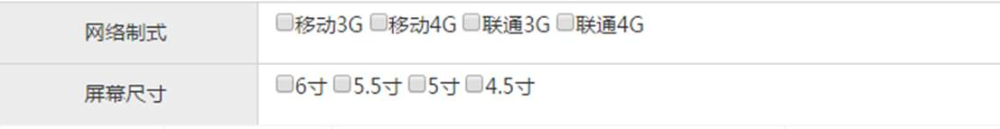

# 1.商品录入【选择商品分类】

## 1.1需求分析

在商品录入界面实现商品分类的选择（三级分类）效果如下：


当用户选择一级分类后，二级分类列表要相应更新，当用户选择二级分类后，三级列表要相应更新。

## 1.2准备工作

（1）在pinyougou-shop-web工程中创建ItemCatController.（可拷贝运营商后台的代码）

```java
package com.pinyougou.controller;
import com.alibaba.dubbo.config.annotation.Reference;
import com.pinyougou.pojo.TbItemCat;
import com.pinyougou.sellergoods.service.ItemCatService;
import entity.PageResult;
import entity.Result;
import org.springframework.web.bind.annotation.RequestBody;
import org.springframework.web.bind.annotation.RequestMapping;
import org.springframework.web.bind.annotation.RestController;

import java.util.List;
/**
 * controller
 * @author Administrator
 *
 */
@RestController
@RequestMapping("/itemCat")
public class ItemCatController {

   @Reference
   private ItemCatService itemCatService;
   
   /**
    * 返回全部列表
    * @return
    */
   @RequestMapping("/findAll")
   public List<TbItemCat> findAll(){        
      return itemCatService.findAll();
   }
   
   
   /**
    * 返回全部列表
    * @return
    */
   @RequestMapping("/findPage")
   public PageResult  findPage(int page,int rows){          
      return itemCatService.findPage(page, rows);
   }
   
   /**
    * 增加
    * @param itemCat
    * @return
    */
   @RequestMapping("/add")
   public Result add(@RequestBody TbItemCat itemCat){
      try {
         itemCatService.add(itemCat);
         return new Result(true, "增加成功");
      } catch (Exception e) {
         e.printStackTrace();
         return new Result(false, "增加失败");
      }
   }
   
   /**
    * 修改
    * @param itemCat
    * @return
    */
   @RequestMapping("/update")
   public Result update(@RequestBody TbItemCat itemCat){
      try {
         itemCatService.update(itemCat);
         return new Result(true, "修改成功");
      } catch (Exception e) {
         e.printStackTrace();
         return new Result(false, "修改失败");
      }
   }  
   
   /**
    * 获取实体
    * @param id
    * @return
    */
   @RequestMapping("/findOne")
   public TbItemCat findOne(Long id){
      return itemCatService.findOne(id);    
   }
   
   /**
    * 批量删除
    * @param ids
    * @return
    */
   @RequestMapping("/delete")
   public Result delete(Long [] ids){
      try {
         itemCatService.delete(ids);
         return new Result(true, "删除成功"); 
      } catch (Exception e) {
         e.printStackTrace();
         return new Result(false, "删除失败");
      }
   }
   
   /**
    * 查询+分页
    * @param brand
    * @param page
    * @param rows
    * @return
    */
   @RequestMapping("/search")
   public PageResult search(@RequestBody TbItemCat itemCat, int page, int rows  ){
      return itemCatService.findPage(itemCat, page, rows);      
   }

   /**
    * 根据上级ID查询列表
    *
    * @param parentId
    * @return
    */
   @RequestMapping("/findByParentId")
   public List<TbItemCat> findByParentId(Long parentId) {
      return itemCatService.findByParentId(parentId);
   }
   
}
```

（2）创建item_catService.js  （可拷贝运营商后台的代码）

```javascript
//服务层
app.service('itemCatService',function($http){

    //读取列表数据绑定到表单中
    this.findAll=function(){
        return $http.get('../itemCat/findAll.do');
    }
    //分页
    this.findPage=function(page,rows){
        return $http.get('../itemCat/findPage.do?page='+page+'&rows='+rows);
    }
    //查询实体
    this.findOne=function(id){
        return $http.get('../itemCat/findOne.do?id='+id);
    }
    //增加
    this.add=function(entity){
        return  $http.post('../itemCat/add.do',entity );
    }
    //修改
    this.update=function(entity){
        return  $http.post('../itemCat/update.do',entity );
    }
    //删除
    this.dele=function(ids){
        return $http.get('../itemCat/delete.do?ids='+ids);
    }
    //搜索
    this.search=function(page,rows,searchEntity){
        return $http.post('../itemCat/search.do?page='+page+"&rows="+rows, searchEntity);
    }

    //根据上级ID查询下级列表
    this.findByParentId=function(parentId){
        return $http.get('../itemCat/findByParentId.do?parentId='+parentId);
    }


});
```

（3）修改goodsController.js，引入itemCatService

```javascript
 //控制层 
app.controller('goodsController' ,function($scope,$controller,goodsService,uploadService,itemCatService){
```

（4）修改goods_edit.html，添加引用

```html
<script type="text/javascript" src="../js/service/itemCatService.js"></script>
```

## 1.3代码实现

### 1.3.1一级分类下拉选择框

在goodsController增加代码

```javascript
//读取一级分类
$scope.selectItemCat1List=function(){
   itemCatService.findByParentId(0).success(
      function(response){
         $scope.itemCat1List=response;
      }
   );
}
```

页面加载调用该方法

```html
<body class="hold-transition skin-red sidebar-mini" ng-app="pinyougou" ng-controller="goodsController" ng-init="selectItemCat1List()">
```

修改goods_edit.html一级分类下拉选择框

```html
<td>
    <select class="form-control" ng-model="entity.goods.category1Id" ng-options="item.id as item.name for item in itemCat1List">
    </select>
</td>
```

ng-options属性可以在表达式中使用数组或对象来自动生成一个select中的option列表。ng-options与ng-repeat很相似，很多时候可以用ng-repeat来代替ng-options。但是ng-options提供了一些好处，例如减少内存提高速度，以及提供选择框的选项来让用户选择。

运行效果如下：


### 1.3.2二级分类下拉选择框

在goodsController增加代码：

```javascript
//读取二级分类
$scope.$watch('entity.goods.category1Id', function(newValue, oldValue) {
   //根据选择的值，查询二级分类
   itemCatService.findByParentId(newValue).success(
      function(response){
         $scope.itemCat2List=response;
      }
   );
});
```

$watch方法用于监控某个变量的值，当被监控的值发生变化，就自动执行相应的函数。

修改goods_edit.html中二级分类下拉框

```html
<td>
    <select class="form-control select-sm" ng-model="entity.goods.category2Id" ng-options="item.id as item.name for item in itemCat2List"></select>
</td>
```

测试


### 1.3.3三级分类下拉选择框

在goodsController增加代码：

```javascript
//读取三级分类
$scope.$watch('entity.goods.category2Id', function(newValue, oldValue) {
   //根据选择的值，查询二级分类
   itemCatService.findByParentId(newValue).success(
      function(response){
         $scope.itemCat3List=response;
      }
   );
});
```

修改goods_edit.html中三级分类下拉框

```html
<td>
    <select class="form-control select-sm" ng-model="entity.goods.category3Id" ng-options="item.id as item.name for item in itemCat3List"></select>
</td>
```

测试


### 1.3.4读取模板ID

在goodsController增加代码：

```javascript
//三级分类选择后  读取模板ID
$scope.$watch('entity.goods.category3Id', function(newValue, oldValue) {
   itemCatService.findOne(newValue).success(
      function(response){
         $scope.entity.goods.typeTemplateId=response.typeId; //更新模板ID    
      }
   );
});
```


在goods_edit.html显示模板ID


```html
<td>
    模板ID:{{entity.goods.typeTemplateId}}
</td>
```

测试


# 2.商品录入【品牌选择】

## 2.1需求分析

在用户选择商品分类后，品牌列表要根据用户所选择的分类进行更新。具体的逻辑是根据用户选择的三级分类找到对应的商品类型模板，商品类型模板中存储了品牌的列表json数据。


## 2.2代码实现

（1）在pinyougou-shop-web工程创建TypeTemplateController  （可从运营商后台拷贝）

（2）在pinyougou-shop-web工程创建typeTemplateService.js  （可从运营商后台拷贝）

（3）在goodsController引入typeTemplateService  并新增代码

```javascript
app.controller('goodsController' ,function($scope,$controller,goodsService,uploadService,itemCatService,typeTemplateService){
```

```javascript
//模板ID选择后  更新品牌列表
$scope.$watch('entity.goods.typeTemplateId', function(newValue, oldValue) {
   typeTemplateService.findOne(newValue).success(
      function(response){
         $scope.typeTemplate=response;//获取类型模板
         $scope.typeTemplate.brandIds= JSON.parse( $scope.typeTemplate.brandIds);//品牌列表
      }
   );
});
```

在页面goods_edit.html 引入js

```javascript
<script type="text/javascript" src="../js/service/typeTemplateService.js">  </script>
```

添加品牌选择框

```html
<div class="col-md-2 title">品牌</div>
<div class="col-md-10 data">

    <select class="form-control" ng-model="entity.goods.brandId" ng-options="item.id as item.text for item in typeTemplate.brandIds"></select>
</div>
```

测试


# 3.商品录入【扩展属性】

## 3.1需求分析

在商品录入实现扩展属性的录入。


## 3.2代码实现

修改goodsController.js  ，在用户更新模板ID时，读取模板中的扩展属性赋给商品的扩展属性。

```javascript
//模板ID选择后  更新模板对象
$scope.$watch('entity.goods.typeTemplateId', function(newValue, oldValue) {
   typeTemplateService.findOne(newValue).success(
      function(response){
         $scope.typeTemplate=response;//获取类型模板
         $scope.typeTemplate.brandIds= JSON.parse( $scope.typeTemplate.brandIds);//品牌列表
         $scope.entity.goodsDesc.customAttributeItems=JSON.parse( $scope.typeTemplate.customAttributeItems);//扩展属性
      }
   );
});
```

修改goods_edit.html 

```html
<!--扩展属性-->
<div class="tab-pane" id="customAttribute">
    <div class="row data-type">
        <div ng-repeat="pojo in entity.goodsDesc.customAttributeItems">
            <div class="col-md-2 title">{{pojo.text}}</div>
            <div class="col-md-10 data">
                <input class="form-control" ng-model="pojo.value" placeholder="{{pojo.text}}">             </div>
        </div>
    </div>
</div>
```

测试


# 4.商品录入【规格选择】

## 4.1需求分析

显示规格及选项列表（复选框）如下图，并保存用户选择的结果



## 4.2代码实现

### 4.2.1 显示规格选项列表

由于我们的模板中只记录了规格名称，而我们除了显示规格名称还是显示规格下的规格选项，所以我们需要在后端扩充方法。

（1）在pinyougou-sellergoods-interface的TypeTemplateService.java新增方法定义

```java
/**
 * 返回规格列表
 * @return
 */
public List<Map> findSpecList(Long id);
```

（2）在pinyougou-sellergoods-service的TypeTemplateServiceImpl.java新增方法

```java
@Autowired
private TbSpecificationOptionMapper specificationOptionMapper;

@Override
public List<Map> findSpecList(Long id) {
   //查询模板
   TbTypeTemplate typeTemplate = typeTemplateMapper.selectByPrimaryKey(id);

   List<Map> list = JSON.parseArray(typeTemplate.getSpecIds(), Map.class)  ;
   for(Map map:list){
      //查询规格选项列表
      TbSpecificationOptionExample example=new TbSpecificationOptionExample();
      com.pinyougou.pojo.TbSpecificationOptionExample.Criteria criteria = example.createCriteria();
      criteria.andSpecIdEqualTo( new Long( (Integer)map.get("id") ) );
      List<TbSpecificationOption> options = specificationOptionMapper.selectByExample(example);
      map.put("options", options);
   }
   return list;
}
```

（3）在pinyougou-shop-web的TypeTemplateController.java新增方法

```java
@RequestMapping("/findSpecList")
public List<Map> findSpecList(Long id){
   return typeTemplateService.findSpecList(id);
}
```

测试后端代码：

http://localhost:9102/typeTemplate/findSpecList.do?id=35


（4）前端代码：修改pinyougou-shop-web的typeTemplateService.js

```javascript
//查询规格列表
this.findSpecList=function(id){
   return $http.get('../typeTemplate/findSpecList.do?id='+id);
}
```

（4）修改pinyougou-shop-web的goodsController.js

```javascript
//模板ID选择后  更新模板对象
$scope.$watch('entity.goods.typeTemplateId', function(newValue, oldValue) {
   typeTemplateService.findOne(newValue).success(
      function(response){
         $scope.typeTemplate=response;//获取类型模板
         $scope.typeTemplate.brandIds= JSON.parse( $scope.typeTemplate.brandIds);//品牌列表
         $scope.entity.goodsDesc.customAttributeItems=JSON.parse( $scope.typeTemplate.customAttributeItems);//扩展属性
      }
   );
   //查询规格列表
   typeTemplateService.findSpecList(newValue).success(
      function(response){
         $scope.specList=response;
      }
   );
});
```

（4）修改goods_edit.html页面

```html
<div class="row data-type">

    <div ng-repeat="pojo in specList">
        <div class="col-md-2 title">{{pojo.text}}
    </div>
    <div class="col-md-10 data">
      <span ng-repeat="option in pojo.options">
        <input type="checkbox">{{option.optionName}}
      </span>
    </div>
        
        
</div>
```

测试


### 4.2.2 保存选中规格选项

我们需要将用户选中的选项保存在tb_goods_desc表的specification_items字段中，定义json格式如下：

[{“attributeName”:”规格名称”,”attributeValue”:[“规格选项1”,“规格选项2”.... ]  } , ....  ]

（1）在baseController.js增加代码 

```javascript
//从集合中按照key查询对象
$scope.searchObjectByKey=function(list,key,keyValue){
   for(var i=0;i<list.length;i++){
      if(list[i][key]==keyValue){
         return list[i];
      }
   }
   return null;
}
```

（2）在goodsController.js增加代码

```javascript
	$scope.entity={ goodsDesc:{itemImages:[],specificationItems:[]}  };

	$scope.updateSpecAttribute=function($event,name,value){
		var object= $scope.searchObjectByKey($scope.entity.goodsDesc.specificationItems ,'attributeName', name);
		if(object!=null){
			if($event.target.checked ){
				object.attributeValue.push(value);
			}else{//取消勾选
				object.attributeValue.splice( object.attributeValue.indexOf(value ) ,1);//移除选项
				//如果选项都取消了，将此条记录移除
				if(object.attributeValue.length==0){
					$scope.entity.goodsDesc.specificationItems.splice(
						$scope.entity.goodsDesc.specificationItems.indexOf(object),1);
				}
			}
		}else{
			$scope.entity.goodsDesc.specificationItems.push(
				{"attributeName":name,"attributeValue":[value]});
		}
	}
```

（3）在goods_edit.html调用方法

```html
<span ng-repeat="option in pojo.options">
  <input type="checkbox" ng-click="updateSpecAttribute($event,pojo.text,option.optionName)">{{option.optionName}}
</span>
```

为了方便测试，我们可以在页面上某个区域临时添加表达式，以便观测测试结果

```html
</div>
{{entity.goodsDesc.specificationItems}}
```

测试


# 5.商品录入【SKU商品信息】

## 5.1需求分析

基于上一步我们完成的规格选择，根据选择的规格录入商品的SKU信息，当用户选择相应的规格，下面的SKU列表就会自动生成，如下图：


实现思路：实现思路：

（1）我们先定义一个初始的不带规格名称的集合，只有一条记录。

（2）循环用户选择的规格，根据规格名称和已选择的规格选项对原集合进行扩充，添加规格名称和值，新增的记录数与选择的规格选项个数相同

生成的顺序如下图：


## 5.2前端代码

### 5.2.1 生成SKU列表(深克隆)

（1）在goodsController.js实现创建sku列表的方法

```javascript
//创建SKU列表
$scope.createItemList=function(){
   $scope.entity.itemList=[{spec:{},price:0,num:99999,status:'0',isDefault:'0' } ];//初始
   var items=  $scope.entity.goodsDesc.specificationItems;
   for(var i=0;i< items.length;i++){
      $scope.entity.itemList = addColumn( $scope.entity.itemList,items[i].attributeName,items[i].attributeValue );
   }
}

//添加列值 
addColumn=function(list,columnName,conlumnValues){
   var newList=[];//新的集合
   for(var i=0;i<list.length;i++){
      var oldRow= list[i];
      for(var j=0;j<conlumnValues.length;j++){
         var newRow= JSON.parse( JSON.stringify( oldRow )  );//深克隆
         newRow.spec[columnName]=conlumnValues[j];
         newList.push(newRow);
      }
   }
   return newList;
}
```

（2）在更新规格属性后调用生成SKU列表的方法

（3）在页面上添加表达式，进行测试

```html
<div class="row data-type">

    <div ng-repeat="pojo in specList">
        <div class="col-md-2 title">{{pojo.text}}
        </div>
        <div class="col-md-10 data">
            <span ng-repeat="option in pojo.options">
                <input type="checkbox" ng-click="updateSpecAttribute($event,pojo.text,option.optionName);createItemList()">{{option.optionName}}
            </span>
        </div>

    </div>
{{entity.itemList}}
```

测试


### 5.2.2 显示SKU列表

goods_edit.html页面上绑定SKU列表

```html
<table class="table table-bordered table-striped table-hover dataTable">
    <thead>
    <tr>
        <th class="sorting" ng-repeat="item in entity.goodsDesc.specificationItems">{{item.attributeName}}</th>
        <th class="sorting">价格</th>
        <th class="sorting">库存</th>
        <th class="sorting">是否启用</th>
        <th class="sorting">是否默认</th>
    </tr>
    </thead>
    <tbody>
    <tr ng-repeat="pojo in entity.itemList">
        <td ng-repeat="item in entity.goodsDesc.specificationItems">
            {{pojo.spec[item.attributeName]}}
        </td>
        <td>
            <input class="form-control" ng-model="pojo.price"  placeholder="价格">
        </td>
        <td>
            <input class="form-control" ng-model="pojo.num" placeholder="库存数量">
        </td>
        <td>
            <input type="checkbox" ng-model="pojo.status" ng-true-value="1" ng-false-value="0" >
        </td>
        <td>
            <input type="checkbox" ng-model="pojo.isDefault" ng-true-value="1" ng-false-value="0">
        </td>
    </tr>
    </tbody>
</table>
```

删除掉原来的测试用的表达式

## 5.3后端代码

（1）在GoodsServiceImpl添加属性

```java
@Autowired
private TbItemMapper itemMapper;

@Autowired
private TbBrandMapper brandMapper;

@Autowired
private TbItemCatMapper itemCatMapper;

@Autowired
private TbSellerMapper sellerMapper;
```

（2）修改GoodsServiceImpl的add方法，增加代码，实现对SKU商品信息的保存

```java
/**
 * 增加
 */
@Override
public void add(Goods goods) {
   goods.getGoods().setAuditStatus("0");
   goodsMapper.insert(goods.getGoods());  //插入商品表
   goods.getGoodsDesc().setGoodsId(goods.getGoods().getId());
   goodsDescMapper.insert(goods.getGoodsDesc());//插入商品扩展数据
   for(TbItem item :goods.getItemList()){
      //标题
      String title= goods.getGoods().getGoodsName();
      Map<String,Object> specMap = JSON.parseObject(item.getSpec());
      for(String key:specMap.keySet()){
         title+=" "+ specMap.get(key);
      }
      item.setTitle(title);
      item.setGoodsId(goods.getGoods().getId());//商品SPU编号
      item.setSellerId(goods.getGoods().getSellerId());//商家编号
      item.setCategoryid(goods.getGoods().getCategory3Id());//商品分类编号（3级）
      item.setCreateTime(new Date());//创建日期
      item.setUpdateTime(new Date());//修改日期 
      //品牌名称
      TbBrand brand = brandMapper.selectByPrimaryKey(goods.getGoods().getBrandId());
      item.setBrand(brand.getName());
      //分类名称
      TbItemCat itemCat = itemCatMapper.selectByPrimaryKey(goods.getGoods().getCategory3Id());
      item.setCategory(itemCat.getName());
      //商家名称
      TbSeller seller = sellerMapper.selectByPrimaryKey(goods.getGoods().getSellerId());
      item.setSeller(seller.getNickName());
      //图片地址（取spu的第一个图片）
      List<Map> imageList = JSON.parseArray(goods.getGoodsDesc().getItemImages(), Map.class) ;
      if(imageList.size()>0){
         item.setImage ( (String)imageList.get(0).get("url"));
      }
      itemMapper.insert(item);
   }
}
```


# 6.商品录入【是否启用规格】

## 6.1需求分析

在规格面板添加是否启用规格，当用户没有选择该项，将原来的规格面板和SKU列表隐藏，用户保存商品后只生成一个SKU.


## 6.2前端代码

goods_add.html添加复选框

```html
<div class="row data-type">
    <div class="col-md-2 title">是否启用规格</div>
    <div class="col-md-10 data">
        <input type="checkbox"  ng-model="entity.goods.isEnableSpec" ng-true-value="1" ng-false-value="0">
    </div>
</div>
```

用if指令控制规格面板与SKU列表的显示与隐藏

```html
<div ng-if="entity.goods.isEnableSpec==1">

    <div class="row data-type">

        <div ng-repeat="pojo in specList">
            <div class="col-md-2 title">{{pojo.text}}
        </div>
```

测试


## 6.3后端代码

修改GoodsServiceImpl的add方法

```java
/**
 * 增加
 */
@Override
public void add(Goods goods) {
   goods.getGoods().setAuditStatus("0");
   goodsMapper.insert(goods.getGoods());  //插入商品表
   goods.getGoodsDesc().setGoodsId(goods.getGoods().getId());
   goodsDescMapper.insert(goods.getGoodsDesc());//插入商品扩展数据
   if("1".equals(goods.getGoods().getIsEnableSpec())){
      for(TbItem item :goods.getItemList()){
         //标题
         String title= goods.getGoods().getGoodsName();
         Map<String,Object> specMap = JSON.parseObject(item.getSpec());
         for(String key:specMap.keySet()){
            title+=" "+ specMap.get(key);
         }
         item.setTitle(title);
         setItemValus(goods,item);
         itemMapper.insert(item);
      }
   }else{
      TbItem item=new TbItem();
      item.setTitle(goods.getGoods().getGoodsName());//商品KPU+规格描述串作为SKU名称
      item.setPrice( goods.getGoods().getPrice() );//价格        
      item.setStatus("1");//状态
      item.setIsDefault("1");//是否默认        
      item.setNum(99999);//库存数量
      item.setSpec("{}");
      setItemValus(goods,item);
      itemMapper.insert(item);
   }
}

private void setItemValus(Goods goods,TbItem item) {
   item.setGoodsId(goods.getGoods().getId());//商品SPU编号
   item.setSellerId(goods.getGoods().getSellerId());//商家编号
   item.setCategoryid(goods.getGoods().getCategory3Id());//商品分类编号（3级）
   item.setCreateTime(new Date());//创建日期
   item.setUpdateTime(new Date());//修改日期 

   //品牌名称
   TbBrand brand = brandMapper.selectByPrimaryKey(goods.getGoods().getBrandId());
   item.setBrand(brand.getName());
   //分类名称
   TbItemCat itemCat = itemCatMapper.selectByPrimaryKey(goods.getGoods().getCategory3Id());
   item.setCategory(itemCat.getName());

   //商家名称
   TbSeller seller = sellerMapper.selectByPrimaryKey(goods.getGoods().getSellerId());
   item.setSeller(seller.getNickName());

   //图片地址（取spu的第一个图片）
   List<Map> imageList = JSON.parseArray(goods.getGoodsDesc().getItemImages(), Map.class) ;
   if(imageList.size()>0){
      item.setImage ( (String)imageList.get(0).get("url"));
   }
}
```


测试


