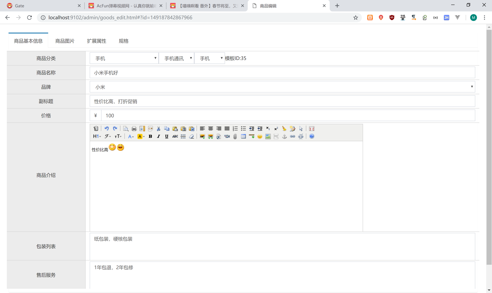

# 1.商家后台-商品管理【商品列表】

## 1.1需求分析

在商家后台，显示该商家的商品列表信息，如下图：


## 1.2查询商家商品列表

### 1.2.1后端代码

修改pinyougou-shop-web工程的GoodsController.java的search方法

```java
/**
 * 查询+分页
 * @param brand
 * @param page
 * @param rows
 * @return
 */
@RequestMapping("/search")
public PageResult search(@RequestBody TbGoods goods, int page, int rows  ){
   //获取商家ID
   String sellerId = SecurityContextHolder.getContext().getAuthentication().getName();
   //添加查询条件
   goods.setSellerId(sellerId);
   return goodsService.findPage(goods, page, rows);
}
```

修改pinyougou-sellergoods-service
工程com.pinyougou.sellergoods.service.impl 的findPage方法，修改条件构建部分代码，将原来的模糊匹配修改为精确匹配

```java
@Override
public PageResult findPage(TbGoods goods, int pageNum, int pageSize) {
   PageHelper.startPage(pageNum, pageSize);
   
   TbGoodsExample example=new TbGoodsExample();
   Criteria criteria = example.createCriteria();
   
   if(goods!=null){
      if(goods.getSellerId()!=null && goods.getSellerId().length()>0){
         //criteria.andSellerIdLike("%"+goods.getSellerId()+"%");
         criteria.andSellerIdEqualTo(goods.getSellerId());
      }
```

### 1.2.2前端代码

修改goods.html. 引入js

```html
<script type="text/javascript" src="../plugins/angularjs/angular.min.js"></script>
<!-- 分页组件开始 -->
<script src="../plugins/angularjs/pagination.js"></script>
<link rel="stylesheet" href="../plugins/angularjs/pagination.css">
<!-- 分页组件结束 -->
<script type="text/javascript" src="../js/base_pagination.js"></script>
<script type="text/javascript" src="../js/service/goodsService.js"></script>
<script type="text/javascript" src="../js/service/itemCatService.js"></script>
<script type="text/javascript" src="../js/service/uploadService.js"></script>
<script type="text/javascript" src="../js/service/typeTemplateService.js"></script>
<script type="text/javascript" src="../js/controller/baseController.js"></script>
<script type="text/javascript" src="../js/controller/goodsController.js"></script>
```

添加指令

```html
<body class="hold-transition skin-red sidebar-mini" ng-app="pinyougou" ng-controller="goodsController">
```

在页面上放置分页控件

```html
</table>
<!--数据列表/-->
<tm-pagination conf="paginationConf"></tm-pagination>
```

循环列表

```html
<tbody>
  <tr ng-repeat="entity in list">
     <td><input  type="checkbox"></td>
     <td>{{entity.id}}</td>
     <td>{{entity.goodsName}}</td>
     <td>{{entity.price}}</td>
     <td>{{entity.category1Id}}</td>
     <td>{{entity.category2Id}}</td>
     <td>{{entity.category3Id}}</td>
     <td>
        {{entity.auditStatus}}
     </td>
     <td class="text-center">
        <button type="button" class="btn bg-olive btn-xs">修改</button>
     </td>
  </tr>

</tbody>
```

测试


## 1.3显示状态

修改goodsController.js，添加state数组

```javascript
$scope.status=['未审核','已审核','审核未通过','关闭'];//商品状态
```

修改列表显示

```html
<td>
 {{status[entity.auditStatus]}}
</td>
```

测试


## 1.4显示分类

我们现在的列表中的分类仍然显示ID

 

如何才能显示分类的名称呢？

方案一：在后端代码写关联查询语句，返回的数据中直接有分类名称。

方案二：在前端代码用ID去查询后端，异步返回商品分类名称。

我们目前采用方案二：

（1）修改goodsController .js

```javascript
$scope.itemCatList=[];//商品分类列表
//加载商品分类列表
$scope.findItemCatList=function(){
   itemCatService.findAll().success(
      function(response){
         for(var i=0;i<response.length;i++){
            $scope.itemCatList[response[i].id]=response[i].name;
         }
      }
   );
}
```

代码解释：因为我们需要根据分类ID得到分类名称，所以我们将返回的分页结果以数组形式再次封装。

（2）修改goods.html ,增加初始化调用

```html
<body class="hold-transition skin-red sidebar-mini" ng-app="pinyougou" ng-controller="goodsController" ng-init="findItemCatList()">
```

（3）修改goods.html , 修改列表

```html
<tr ng-repeat="entity in list">
 <td><input  type="checkbox"></td>
 <td>{{entity.id}}</td>
 <td>{{entity.goodsName}}</td>
 <td>{{entity.price}}</td>
 <td>{{itemCatList[entity.category1Id]}}</td>
 <td>{{itemCatList[entity.category2Id]}}</td>
 <td>{{itemCatList[entity.category3Id]}}</td>

 <td>
  {{status[entity.auditStatus]}}
 </td>
 <td class="text-center">
  <button type="button" class="btn bg-olive btn-xs">修改</button>
 </td>
</tr>
```

测试


## 1.5条件查询

根据状态和商品名称进行查询

修改goods.html 


```html
<div class="has-feedback">
   状态：<select ng-model="searchEntity.auditStatus">
   <option value="">全部</option>
   <option value="0">未审核</option>
   <option value="1">已审核</option>
   <option value="2">审核未通过</option>
   <option value="3">关闭</option>
   </select>
   商品名称：<input ng-model="searchEntity.goodsName">
   <button class="btn btn-default" ng-click="reloadList()">查询</button>
</div>
```

测试


# 2.商家后台-商品管理【商品修改】

## 2.1需求分析

在商品列表页面点击修改，进入商品编辑页面，并传递参数商品ID，商品编辑页面接受该参数后从数据库中读取商品信息，用户修改后保存信息。

 

## 2.2基本信息读取

我们首选读取商品分类、商品名称、品牌，副标题，价格等信息


### 2.2.1后端代码

（1）修改pinyougou-sellergoods-interface的GoodsService.java

```java
/**
 * 根据ID获取实体
 * @param id
 * @return
 */
public Goods   findOne(Long id);
```

（1）修改pinyougou-sellergoods-service的GoodsServiceImpl.java

```java
/**
 * 根据ID获取实体
 * @param id
 * @return
 */
@Override
public Goods findOne(Long id) {
   Goods goods=new Goods();
   TbGoods tbGoods = goodsMapper.selectByPrimaryKey(id);
   goods.setGoods(tbGoods);
   TbGoodsDesc tbGoodsDesc = goodsDescMapper.selectByPrimaryKey(id);
   goods.setGoodsDesc(tbGoodsDesc);
   return goods;
}
```

（1）修改pinyougou-shop-web（和pinyougou-manager-web）的GoodsController.java

```java
/**
 * 获取实体
 * @param id
 * @return
 */
@RequestMapping("/findOne")
public Goods findOne(Long id){
   return goodsService.findOne(id);
}
```

### 2.2.2前端代码

（1）在goodsController.js中引入$location服务

```javascript
app.controller('goodsController' ,function($scope,$controller,$location,goodsService,uploadService,itemCatService,typeTemplateService){
```

（2）修改goodsController 添加代码：

```js
//查询实体 
$scope.findOne=function(){
   var id= $location.search()['id'];//获取参数值
   if(id==null){
      return ;
   }
   goodsService.findOne(id).success(
      function(response){
         $scope.entity= response;
      }
   );
}
```

在goods_edit.html页面上添加指令

```html
<body class="hold-transition skin-red sidebar-mini" ng-app="pinyougou" ng-controller="goodsController"
      ng-init="selectItemCat1List();findOne()">
```

测试


## 2.3读取商品介绍（富文本编辑器）

修改前端代码 goodsController.js

```js
//查询实体
$scope.findOne=function(){
   var id= $location.search()['id'];//获取参数值
   // alert(id);
   if(id==null){
      return ;
   }
   goodsService.findOne(id).success(
      function(response){
         $scope.entity= response;
         //向富文本编辑器添加商品介绍
         editor.html($scope.entity.goodsDesc.introduction);

      }
   );
}
```

测试


## 2.4显示商品图片列表

修改goodsController.js ，在dataLogic方法添加代码，将图片列表由字符串转换为json集合对象

```js
//查询实体
$scope.findOne=function(){
   var id= $location.search()['id'];//获取参数值
   // alert(id);
   if(id==null){
      return ;
   }
   goodsService.findOne(id).success(
      function(response){
         $scope.entity= response;
         //向富文本编辑器添加商品介绍
         editor.html($scope.entity.goodsDesc.introduction);
         //显示图片列表
         $scope.entity.goodsDesc.itemImages=
            JSON.parse($scope.entity.goodsDesc.itemImages);

      }
   );
}
```

测试


## 2.5读取商品扩展属性

修改goodsController.js 

```js
//查询实体
$scope.findOne=function(){
   var id= $location.search()['id'];//获取参数值
   // alert(id);
   if(id==null){
      return ;
   }
   goodsService.findOne(id).success(
      function(response){
         $scope.entity= response;
         //向富文本编辑器添加商品介绍
         editor.html($scope.entity.goodsDesc.introduction);
         //显示图片列表
         $scope.entity.goodsDesc.itemImages=
            JSON.parse($scope.entity.goodsDesc.itemImages);
         //扩展属性列表
         $scope.entity.goodsDesc.customAttributeItems =JSON.parse($scope.entity.goodsDesc.customAttributeItems);
         //规格
         $scope.entity.goodsDesc.specificationItems=JSON.parse($scope.entity.goodsDesc.specificationItems);

      }
   );
}
```


```js
	//读取模板ID后，读取品牌列表 扩展属性  规格列表
	$scope.$watch('entity.goods.typeTemplateId',function(newValue,oldValue){
		typeTemplateService.findOne(newValue).success(
			function(response){
				$scope.typeTemplate=response;// 模板对象 

				$scope.typeTemplate.brandIds= JSON.parse($scope.typeTemplate.brandIds);//品牌列表类型转换
				//扩展属性
				if( $location.search()['id']==null ){//如果是增加商品
					$scope.entity.goodsDesc.customAttributeItems= JSON.parse($scope.typeTemplate.customAttributeItems);
				}

			}
		);
		//读取规格
		typeTemplateService.findSpecList(newValue).success(
			function(response){
				$scope.specList=response;
			}
		);

	});
```

测试


## 2.6读取商品规格属性

修改goodsController.js

修改页面上规格面板的复选框,运用 ng-checked指令控制复选框的勾选状态

```js
//查询实体
$scope.findOne=function(){
   var id= $location.search()['id'];//获取参数值
   // alert(id);
   if(id==null){
      return ;
   }
   goodsService.findOne(id).success(
      function(response){
         $scope.entity= response;
         //向富文本编辑器添加商品介绍
         editor.html($scope.entity.goodsDesc.introduction);
         //显示图片列表
         $scope.entity.goodsDesc.itemImages=
            JSON.parse($scope.entity.goodsDesc.itemImages);
         //扩展属性列表
         $scope.entity.goodsDesc.customAttributeItems =JSON.parse($scope.entity.goodsDesc.customAttributeItems);
         //规格
         $scope.entity.goodsDesc.specificationItems=JSON.parse($scope.entity.goodsDesc.specificationItems);

      }
   );
}

//根据规格名称和选项名称返回是否被勾选
$scope.checkAttributeValue=function(specName,optionName){
   var items= $scope.entity.goodsDesc.specificationItems;
   var object= $scope.searchObjectByKey(items,'attributeName',specName);
   if(object==null){
      return false;
   }else{
      if(object.attributeValue.indexOf(optionName)>=0){
         return true;
      }else{
         return false;
      }
   }
}
```

```html
<span ng-repeat="option in pojo.options">
                                <input type="checkbox"
                                       ng-click="updateSpecAttribute($event,pojo.text,option.optionName);createItemList()"
                                       ng-checked="checkAttributeValue(pojo.text,option.optionName)">{{option.optionName}}
                              </span>
```

测试


## 2.7读取SKU数据

显示SKU商品列表，并自动读取价格、库存等数据加载到列表中


### 2.7.1后端代码

在GoodsServiceImpl的findOne方法中加载SKU商品数据

```java
/**
 * 根据ID获取实体
 * @param id
 * @return
 */
@Override
public Goods findOne(Long id) {
   Goods goods=new Goods();
   TbGoods tbGoods = goodsMapper.selectByPrimaryKey(id);
   goods.setGoods(tbGoods);
   TbGoodsDesc tbGoodsDesc = goodsDescMapper.selectByPrimaryKey(id);
   goods.setGoodsDesc(tbGoodsDesc);

   //查询SKU商品列表
   TbItemExample example=new TbItemExample();
   com.pinyougou.pojo.TbItemExample.Criteria criteria = example.createCriteria();
   criteria.andGoodsIdEqualTo(id);//查询条件：商品ID
   List<TbItem> itemList = itemMapper.selectByExample(example);
   goods.setItemList(itemList);


   return goods;
}
```

### 2.7.2前端代码

在goodsController.js修改findOne方法的代码

```js
//查询实体
$scope.findOne=function(){
   var id=$location.search()['id'];
   if(id==null){
      return ;
   }
   goodsService.findOne(id).success(
      function(response){
         $scope.entity= response;

         editor.html($scope.entity.goodsDesc.introduction );//商品介绍
         //商品图片
         $scope.entity.goodsDesc.itemImages=JSON.parse($scope.entity.goodsDesc.itemImages);
         //扩展属性
         $scope.entity.goodsDesc.customAttributeItems=JSON.parse($scope.entity.goodsDesc.customAttributeItems);
         //规格选择
         $scope.entity.goodsDesc.specificationItems= JSON.parse($scope.entity.goodsDesc.specificationItems);
         //SKU列表规格列转换            
         for( var i=0;i<$scope.entity.itemList.length;i++ ){
            $scope.entity.itemList[i].spec =
               JSON.parse( $scope.entity.itemList[i].spec);
         }
      }
   );
}
```


测试


## 2.8保存数据

### 2.8.1后端代码

修改 pinyougou-sellergoods-interface 的 GoodsService.java

```java
/**
 * 修改
 */
public void update(Goods goods);
```

修改pinyougou-sellergoods-service的GoodsServiceImpl ,将SKU列表插入的代码提取出来，封装到私有方法中

```java
private void setItemValues(TbItem item,Goods goods){
   //商品分类
   item.setCategoryid(goods.getGoods().getCategory3Id());//三级分类ID
   item.setCreateTime(new Date());//创建日期
   item.setUpdateTime(new Date());//更新日期

   item.setGoodsId(goods.getGoods().getId());//商品ID
   item.setSellerId(goods.getGoods().getSellerId());//商家ID

   //分类名称
   TbItemCat itemCat = itemCatMapper.selectByPrimaryKey(goods.getGoods().getCategory3Id());
   item.setCategory(itemCat.getName());
   //品牌名称
   TbBrand brand = brandMapper.selectByPrimaryKey(goods.getGoods().getBrandId());
   item.setBrand(brand.getName());
   //商家名称(店铺名称)
   TbSeller seller = sellerMapper.selectByPrimaryKey(goods.getGoods().getSellerId());
   item.setSeller(seller.getNickName());

   //图片
   List<Map> imageList = JSON.parseArray( goods.getGoodsDesc().getItemImages(), Map.class) ;
   if(imageList.size()>0){
      item.setImage( (String)imageList.get(0).get("url"));
   }

}

//插入sku列表数据
private void saveItemList(Goods goods){

   if("1".equals(goods.getGoods().getIsEnableSpec())){
      for(TbItem item:   goods.getItemList()){
         //构建标题  SPU名称+ 规格选项值
         String title=goods.getGoods().getGoodsName();//SPU名称
         Map<String,Object> map=  JSON.parseObject(item.getSpec());
         for(String key:map.keySet()) {
            title+=" "+map.get(key);
         }
         item.setTitle(title);

         setItemValues(item,goods);

         itemMapper.insert(item);
      }
   }else{//没有启用规格

      TbItem item=new TbItem();
      item.setTitle(goods.getGoods().getGoodsName());//标题
      item.setPrice(goods.getGoods().getPrice());//价格
      item.setNum(99999);//库存数量
      item.setStatus("1");//状态
      item.setIsDefault("1");//默认
      item.setSpec("{}");//规格

      setItemValues(item,goods);

      itemMapper.insert(item);
   }

}


/**
 * 修改
 */
@Override
public void update(Goods goods){
   //更新基本表数据
   goodsMapper.updateByPrimaryKey(goods.getGoods());
   //更新扩展表数据
   goodsDescMapper.updateByPrimaryKey(goods.getGoodsDesc());

   //删除原有的SKU列表数据
   TbItemExample example=new TbItemExample();
   com.pinyougou.pojo.TbItemExample.Criteria criteria = example.createCriteria();
   criteria.andGoodsIdEqualTo(goods.getGoods().getId());
   itemMapper.deleteByExample(example);

   //插入新的SKU列表数据
   saveItemList(goods);//插入SKU商品数据

}
```

 修改manager-web

```java
/**
 * 修改
 * @param goods
 * @return
 */
@RequestMapping("/update")
public Result update(@RequestBody Goods goods){
   try {
      goodsService.update(goods);
      return new Result(true, "修改成功");
   } catch (Exception e) {
      e.printStackTrace();
      return new Result(false, "修改失败");
   }
}  
```

修改pinyougou-shop-web工程的GoodsController.java

```java
/**
 * 修改
 * @param goods
 * @return
 */
@RequestMapping("/update")
public Result update(@RequestBody Goods goods){
   //校验是否是当前商家的id    
   Goods goods2 = goodsService.findOne(goods.getGoods().getId());
   //获取当前登录的商家ID
   String sellerId = SecurityContextHolder.getContext().getAuthentication().getName();
   //如果传递过来的商家ID并不是当前登录的用户的ID,则属于非法操作
   if(!goods2.getGoods().getSellerId().equals(sellerId) ||  !goods.getGoods().getSellerId().equals(sellerId) ){
      return new Result(false, "操作非法");
   }
   try {
      goodsService.update(goods);
      return new Result(true, "修改成功");
   } catch (Exception e) {
      e.printStackTrace();
      return new Result(false, "修改失败");
   }
}
```

代码解释：出于安全考虑，在商户后台执行的商品修改，必须要校验提交的商品属于该商户

### 2.8.2前端代码

（1）修改pinyougou-shop-web的goodsController.js ,新增保存的方法

```js
//保存 
$scope.save=function(){
   //提取文本编辑器的值
   $scope.entity.goodsDesc.introduction=editor.html();
   var serviceObject;//服务层对象               
   if($scope.entity.goods.id!=null){//如果有ID
      serviceObject=goodsService.update( $scope.entity ); //修改  
   }else{
      serviceObject=goodsService.add( $scope.entity  );//增加 
   }
   serviceObject.success(
      function(response){
         if(response.success){
            alert('保存成功');
            $scope.entity={};
            editor.html("");//清空富文本编辑器
         }else{
            alert(response.message);
         }
      }
   );
}
```

（2）修改goods_edit.html 调用

```html
<div class="btn-toolbar list-toolbar">
    <button class="btn btn-primary" ng-click="save()"><i class="fa fa-save"></i>保存</button>
    <button class="btn btn-default" >返回列表</button>
</div>
```


测试修改商品详情


## 2.9页面跳转

（1）由商品列表页跳转到商品编辑页

修改goods.html表格行的修改按钮

```html
<a href="goods_edit.html" class="btn btn-default">新建</a>


<a href="goods_edit.html#?id={{entity.id}}" class="btn bg-olive btn-xs">修改</a></td>
```

（2）由商品编辑页跳转到商品列表

修改goods_edit.html 的返回列表按钮

```html
<a href="goods.html" class="btn btn-default">返回列表</a>
```

（3）保存成功后返回列表页面

```javascript
//保存
$scope.save=function(){
   //提取文本编辑器的值
   $scope.entity.goodsDesc.introduction=editor.html();
   var serviceObject;//服务层对象
   if($scope.entity.goods.id!=null){//如果有ID
      serviceObject=goodsService.update( $scope.entity ); //修改
   }else{
      serviceObject=goodsService.add( $scope.entity  );//增加
   }
   serviceObject.success(
      function(response){
         if(response.success){
            alert('保存成功');
            location.href="goods.html";//跳转到商品列表页
         }else{
            alert(response.message);
         }
      }
   );
}
```

测试




# 3.运营商后台-商品管理【商品审核】

## 3.1待审核商品列表

需求：参照商家后台商品列表。代码：

（1）修改pinyougou-manager-web的goodsController.js，注入itemCatService，添加代码

```javascript
$scope.status=['未审核','已审核','审核未通过','关闭'];//商品状态
$scope.itemCatList=[];//商品分类列表
//查询商品分类
$scope.findItemCatList=function(){
   itemCatService.findAll().success(
      function(response){
         for(var i=0;i<response.length;i++){
            $scope.itemCatList[response[i].id ]=response[i].name;
         }
      }
   );
}

app.controller('goodsController' ,function($scope,$controller,goodsService,itemCatService){

```

（2）修改goods.html ,引入js

```javascript
<script type="text/javascript" src="../plugins/angularjs/angular.min.js"></script>
<!-- 分页组件开始 -->
<script src="../plugins/angularjs/pagination.js"></script>
<link rel="stylesheet" href="../plugins/angularjs/pagination.css">
<!-- 分页组件结束 -->
<script type="text/javascript" src="../js/base_pagination.js"></script>
<script type="text/javascript" src="../js/service/goodsService.js"></script>
<script type="text/javascript" src="../js/service/itemCatService.js"></script>
<script type="text/javascript" src="../js/controller/baseController.js"></script>
<script type="text/javascript" src="../js/controller/goodsController.js"></script>
```

（3）指令，完成初始调用

```html
<body class="hold-transition skin-red sidebar-mini" ng-app="pinyougou" ng-controller="goodsController" ng-init="searchEntity={auditStatus:'0'};findItemCatList()">
```

（4）循环列表

```html
<tbody>
 <tr ng-repeat="entity in list">
  <td><input  type="checkbox"></td>
  <td>{{entity.id}}</td>
  <td>{{entity.goodsName}}</td>
  <td>{{entity.price}}</td>
  <td>{{itemCatList[entity.category1Id]}}</td>
  <td>{{itemCatList[entity.category2Id]}}</td>
  <td>{{itemCatList[entity.category3Id]}}</td>
  <td>{{status[entity.auditStatus]}}</td>
  <td class="text-center"> </td>
 </tr>
</tbody>
```

（5）分页控件

```html
</table>
<!--数据列表/-->
<tm-pagination conf="paginationConf"></tm-pagination>
```

测试


## 3.2商品详情展示(学员实现)

需求：点击列表右侧的“详情”按钮，弹出窗口显示商品信息。

修改manager-web的goods.html

```html
<td class="text-center">
    <a href="goods_edit.html#?id={{entity.id}}" class="btn bg-olive btn-xs">详情</a>
</td>
```

未实现

## 3.3商品审核与驳回

需求：商品审核的状态值为1，驳回的状态值为2 。用户在列表中选中ID后，点击审核或驳回，修改商品状态，并刷新列表。

### 3.3.1后端代码

（1）在pinyougou-sellergoods-interface的GoodsService.java新增方法定义

```java
/**
 * 批量修改状态
 * @param ids
 * @param status
 */
public void updateStatus(Long []ids,String status);
```

（2）在pinyougou-sellergoods-service的GoodsServiceImpl.java实现该方法

```java
@Override
public void updateStatus(Long[] ids, String status) {
   for(Long id:ids){
      TbGoods goods = goodsMapper.selectByPrimaryKey(id);
      goods.setAuditStatus(status);
      goodsMapper.updateByPrimaryKey(goods);
   }
}
```

（3）在pinyougou-manager-web的GoodsController.java新增方法

```java
/**
 * 更新状态
 * @param ids
 * @param status
 */
@RequestMapping("/updateStatus")
public Result updateStatus(Long[] ids, String status){
   try {
      goodsService.updateStatus(ids, status);
      return new Result(true, "成功");
   } catch (Exception e) {
      e.printStackTrace();
      return new Result(false, "失败");
   }
}
```

### 3.3.2前端代码

（1）修改pinyougou-manager-web的goodsService.js  ，增加方法

```js
//更改状态
this.updateStatus=function(ids,status){
   return $http.get('../goods/updateStatus.do?ids='+ids+"&status="+status);
}
```

（2）修改pinyougou-manager-web的goodsController.js  ，增加方法

```js
//更改状态
$scope.updateStatus=function(status){
   goodsService.updateStatus($scope.selectIds,status).success(
      function(response){
         if(response.success){//成功
            $scope.reloadList();//刷新列表
            $scope.selectIds=[];//清空ID集合
         }else{
            alert(response.message);
         }
      }
   );
}
```

（3）修改pinyougou-manager-web的goods.html 页面，为复选框绑定事件指令

```html
<td><input  type="checkbox" ng-click="updateSelection($event,entity.id)" ></td>
```

（4）修改页面上的审核通过和驳回按钮

```html
<button type="button" class="btn btn-default" title="审核通过" ng-click="updateStatus('1')"><i class="fa fa-check"></i> 审核通过</button>
<button type="button" class="btn btn-default" title="驳回" ng-click="updateStatus('2')"><i class="fa fa-ban"></i> 驳回</button>
```

测试


# 4.运营商后台-商品管理【商品删除】

## 4.1需求分析

我们为商品管理提供商品删除功能，用户选中部分商品，点击删除按钮即可实现商品删除。注意，这里的删除并非是物理删除，而是修改tb_goods表的is_delete字段为1 ，我们可以称之为“逻辑删除”

## 4.2逻辑删除的实现

### 4.2.1后端代码

修改pinyougou-sellergoods-service工程的GoodsServiceImpl.java的delete方法

```java
/**
 * 批量删除
 */
@Override
public void delete(Long[] ids) {
   for(Long id:ids){
      TbGoods goods = goodsMapper.selectByPrimaryKey(id);
      goods.setIsDelete("1");//表示逻辑删除
      goodsMapper.updateByPrimaryKey(goods);
   }
}
```

### 4.2.2前端代码

修改pinyougou-manager-web的goods.html上的删除按钮

```html
<button type="button" class="btn btn-default" title="删除" ng-click="dele()"><i class="fa fa-trash-o" ></i> 删除</button>
```

## 4.3排除已删除记录

修改pinyougou-sellergoods-service工程GoodsServiceImpl.java的findPage方法，添加以下代码：

```java
criteria.andIsDeleteIsNull();//指定条件为未逻辑删除记录
```

测试


# 5.商家后台-【商品上下架】（学员实现）

## 5.1需求分析

什么是商品上下架？其实上下架也是商品的一个状态，但是不同于审核状态。审核状态的控制权在运营商手中，而上下架的控制权在商户手中。商户可以随时将一个已审核状态的商品上架或下架。上架表示正常销售，而下架则表示暂停销售。

## 5.2实现思路提示

其实商品的上下架就是对上下架状态的修改。字段为tb_goods表的is_marketable字段。1表示上架、0表示下架。

# 6.注解式事务配置

## 6.1事务异常测试

我们修改pinyougou-sellergoods-service工程GoodsServiceImpl.java的add方法

```java
/**
 * 增加
 */
@Override
public void add(Goods goods) {
   goods.getGoods().setAuditStatus("0");
   goodsMapper.insert(goods.getGoods());  //插入商品表
   int x=1/0;
   goods.getGoodsDesc().setGoodsId(goods.getGoods().getId());
   goodsDescMapper.insert(goods.getGoodsDesc());//插入商品扩展数据
   saveItemList(goods);//插入商品SKU列表数据
}
```

在插入商品表后，人为制造一个异常。我们运行程序，新增商品数据，观察运行结果。

通过观察，我们发现，程序发生异常 ，商品表仍然会存储记录，这是不符合我们要求的。这是因为我们目前的系统还没有配置事务。

## 6.2注解式事务解决方案

### 6.2.1配置文件

在pinyougou-sellergoods-service工程的spring目录下创建applicationContext-tx.xml

```xml
<?xml version="1.0" encoding="UTF-8"?>
<beans xmlns="http://www.springframework.org/schema/beans"
   xmlns:xsi="http://www.w3.org/2001/XMLSchema-instance" xmlns:p="http://www.springframework.org/schema/p"
   xmlns:context="http://www.springframework.org/schema/context"
   xmlns:tx="http://www.springframework.org/schema/tx"
   xmlns:mvc="http://www.springframework.org/schema/mvc"
   xsi:schemaLocation="http://www.springframework.org/schema/beans http://www.springframework.org/schema/beans/spring-beans.xsd
        http://www.springframework.org/schema/mvc http://www.springframework.org/schema/mvc/spring-mvc.xsd
      http://www.springframework.org/schema/tx http://www.springframework.org/schema/tx/spring-tx.xsd
        http://www.springframework.org/schema/context http://www.springframework.org/schema/context/spring-context.xsd">
 

    <!-- 事务管理器  -->  
    <bean id="transactionManager" class="org.springframework.jdbc.datasource.DataSourceTransactionManager">  
        <property name="dataSource" ref="dataSource" />  
    </bean>  
      
    <!-- 开启事务控制的注解支持 -->  
    <tx:annotation-driven transaction-manager="transactionManager"/>
   
</beans>
```

### 6.2.2在方法上添加注解

```java
/**
 * 服务实现层
 * @author Administrator
 *
 */
@Service
@Transactional
public class GoodsServiceImpl implements GoodsService {
```

经过测试，我们发现，系统发生异常，商品表不会新增记录，事务配置成功。

删除掉测试代码int x=1/0 

我们需要将所有涉及多表操作的服务类添加事务注解，例如SpecificationServiceImpl类

测试


没有添加进去，成功。

