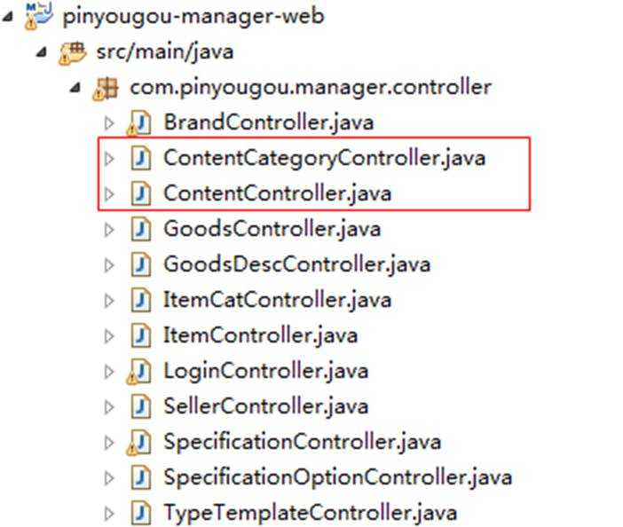
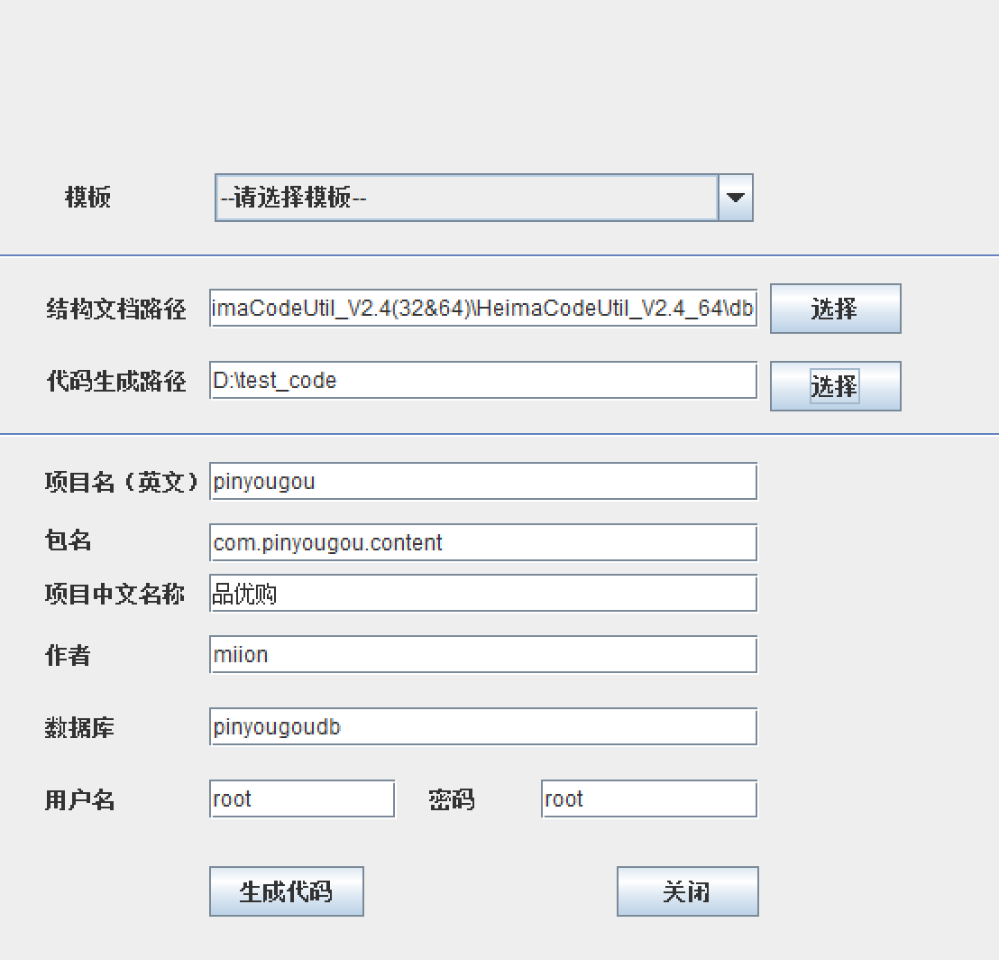
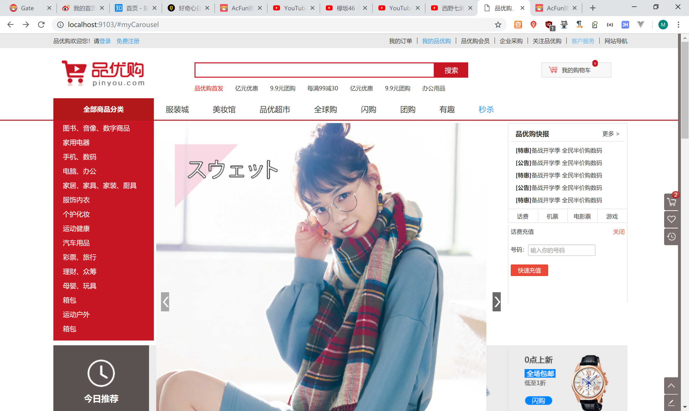

# 2.运营商后台-广告类型及广告管理

## 2.1需求分析

实现广告类型表与广告表的增删改查

## 2.2准备工作

### 2.2.1构建工程

构建工程

（1）pinyougou-content-interface   

引入依赖pinyougou-pojo

创建包com.pinyougou.content.service


```xml
<dependencies>
    <dependency>
        <groupId>com.pinyougou</groupId>
        <artifactId>pinyougou-pojo</artifactId>
        <version>0.0.5-SNAPSHOT</version>
    </dependency>
</dependencies>
```

（2）pinyougou-content-service （WAR）   

引入依赖参见pinyougou-sellergoods-service  

引入tomcat插件配置 ，指定tomcat的运行端口为9002

为pinyougou-content-service 工程添加web.xml   


```xml
<?xml version="1.0" encoding="UTF-8"?>
<project xmlns="http://maven.apache.org/POM/4.0.0"
         xmlns:xsi="http://www.w3.org/2001/XMLSchema-instance"
         xsi:schemaLocation="http://maven.apache.org/POM/4.0.0 http://maven.apache.org/xsd/maven-4.0.0.xsd">
    <parent>
        <artifactId>pinyougou-parent</artifactId>
        <groupId>com.pinyougou</groupId>
        <version>0.0.5-SNAPSHOT</version>
    </parent>
    <modelVersion>4.0.0</modelVersion>
    <artifactId>pinyougou-content-service</artifactId>
    <version>0.0.5-SNAPSHOT</version>
    <packaging>war</packaging>

    <dependencies>
        <!-- Spring -->
        <dependency>
            <groupId>org.springframework</groupId>
            <artifactId>spring-context</artifactId>
        </dependency>
        <dependency>
            <groupId>org.springframework</groupId>
            <artifactId>spring-beans</artifactId>
        </dependency>
        <dependency>
            <groupId>org.springframework</groupId>
            <artifactId>spring-webmvc</artifactId>
        </dependency>
        <dependency>
            <groupId>org.springframework</groupId>
            <artifactId>spring-jdbc</artifactId>
        </dependency>
        <dependency>
            <groupId>org.springframework</groupId>
            <artifactId>spring-aspects</artifactId>
        </dependency>
        <dependency>
            <groupId>org.springframework</groupId>
            <artifactId>spring-jms</artifactId>
        </dependency>
        <dependency>
            <groupId>org.springframework</groupId>
            <artifactId>spring-context-support</artifactId>
        </dependency>
        <dependency>
            <groupId>org.springframework</groupId>
            <artifactId>spring-test</artifactId>
        </dependency>
        <!-- dubbo相关 -->
        <dependency>
            <groupId>com.alibaba</groupId>
            <artifactId>dubbo</artifactId>
        </dependency>
        <dependency>
            <groupId>org.apache.zookeeper</groupId>
            <artifactId>zookeeper</artifactId>
        </dependency>
        <dependency>
            <groupId>com.github.sgroschupf</groupId>
            <artifactId>zkclient</artifactId>
        </dependency>
        <dependency>
            <groupId>junit</groupId>
            <artifactId>junit</artifactId>
        </dependency>
        <dependency>
            <groupId>com.alibaba</groupId>
            <artifactId>fastjson</artifactId>
        </dependency>
        <dependency>
            <groupId>javassist</groupId>
            <artifactId>javassist</artifactId>
        </dependency>
        <dependency>
            <groupId>commons-codec</groupId>
            <artifactId>commons-codec</artifactId>
        </dependency>
        <dependency>
            <groupId>javax.servlet</groupId>
            <artifactId>servlet-api</artifactId>
            <scope>provided</scope>
        </dependency>
        <dependency>
            <groupId>com.pinyougou</groupId>
            <artifactId>pinyougou-content-interface</artifactId>
            <version>0.0.5-SNAPSHOT</version>
        </dependency>
        <dependency>
            <groupId>com.pinyougou</groupId>
            <artifactId>pinyougou-dao</artifactId>
            <version>0.0.5-SNAPSHOT</version>
        </dependency>
        <dependency>
            <groupId>com.github.pagehelper</groupId>
            <artifactId>pagehelper</artifactId>
        </dependency>
    </dependencies>

    <build>
        <plugins>
            <plugin>
                <groupId>org.apache.tomcat.maven</groupId>
                <artifactId>tomcat7-maven-plugin</artifactId>
                <version>2.2</version>
                <configuration>
                    <!-- 指定端口 -->
                    <port>9002</port>
                    <!-- 请求路径 -->
                    <path>/</path>
                </configuration>
            </plugin>
        </plugins>
    </build>
</project>
```

```xml
<?xml version="1.0" encoding="UTF-8"?>
<web-app xmlns:xsi="http://www.w3.org/2001/XMLSchema-instance"
         xmlns="http://java.sun.com/xml/ns/javaee"
         xsi:schemaLocation="http://java.sun.com/xml/ns/javaee http://java.sun.com/xml/ns/javaee/web-app_2_5.xsd"
         version="2.5">

    <!-- 加载spring容器 -->
    <context-param>
        <param-name>contextConfigLocation</param-name>
        <param-value>classpath*:spring/applicationContext*.xml</param-value>
    </context-param>
    <listener>
        <listener-class>org.springframework.web.context.ContextLoaderListener</listener-class>
    </listener>


</web-app>
```

创建包 com.pinyougou.content.service.impl  

添加spring相关配置文件


applicationContext-service.xml 

```xml
<?xml version="1.0" encoding="UTF-8"?>
<beans xmlns="http://www.springframework.org/schema/beans"
	xmlns:xsi="http://www.w3.org/2001/XMLSchema-instance" xmlns:p="http://www.springframework.org/schema/p"
	xmlns:context="http://www.springframework.org/schema/context"
	xmlns:dubbo="http://code.alibabatech.com/schema/dubbo" xmlns:mvc="http://www.springframework.org/schema/mvc"
	xsi:schemaLocation="http://www.springframework.org/schema/beans http://www.springframework.org/schema/beans/spring-beans.xsd
        http://www.springframework.org/schema/mvc http://www.springframework.org/schema/mvc/spring-mvc.xsd
        http://code.alibabatech.com/schema/dubbo http://code.alibabatech.com/schema/dubbo/dubbo.xsd
        http://www.springframework.org/schema/context http://www.springframework.org/schema/context/spring-context.xsd">

    <dubbo:protocol name="dubbo" port="20882"></dubbo:protocol>
	<dubbo:application name="pinyougou-content-service"/>
    <dubbo:registry address="zookeeper://192.168.25.139:2181"/>
    <dubbo:annotation package="com.pinyougou.content.service.impl" />
   
   
</beans>
```

注意：我们目前有两个服务工程，当两个工程同时启动时会发生端口冲突，因为连接dubbox注册中心的端口默认是20880。所以我们需要配置一下pinyougou-content-service工程的dubbox端口   

applicationContext-tx.xml 

```xml
<?xml version="1.0" encoding="UTF-8"?>
<beans xmlns="http://www.springframework.org/schema/beans"
   xmlns:xsi="http://www.w3.org/2001/XMLSchema-instance" xmlns:p="http://www.springframework.org/schema/p"
   xmlns:context="http://www.springframework.org/schema/context"
   xmlns:tx="http://www.springframework.org/schema/tx"
   xmlns:mvc="http://www.springframework.org/schema/mvc"
   xsi:schemaLocation="http://www.springframework.org/schema/beans http://www.springframework.org/schema/beans/spring-beans.xsd
        http://www.springframework.org/schema/mvc http://www.springframework.org/schema/mvc/spring-mvc.xsd
      http://www.springframework.org/schema/tx http://www.springframework.org/schema/tx/spring-tx.xsd
        http://www.springframework.org/schema/context http://www.springframework.org/schema/context/spring-context.xsd">
 

    <!-- 事务管理器  -->  
    <bean id="transactionManager" class="org.springframework.jdbc.datasource.DataSourceTransactionManager">  
        <property name="dataSource" ref="dataSource" />  
    </bean>  
      
    <!-- 开启事务控制的注解支持 -->  
    <tx:annotation-driven transaction-manager="transactionManager"/>
   
</beans>
```

（3）pinyougou-manager-web工程引入依赖pinyougou-content-interface

```xml
<dependency>
    <groupId>com.pinyougou</groupId>
    <artifactId>pinyougou-content-interface</artifactId>
    <version>0.0.5-SNAPSHOT</version>
</dependency>
```

### 2.2.2生成代码拷入工程




拷贝JS代码到pinyougou-manager-web


测试运行广告分类管理 和广告管理页面





```html
<a href="contentCategory.html" target="iframe">
    <i class="fa fa-circle-o"></i>广告类型管理
</a>
```

测试

启动sellergoods-service，content-service，manager-web服务


## 2.3广告管理

### 2.3.1广告图片上传

将pinyougou-shop-web的以下资源拷贝到pinyougou-manager-web

（1）UploadController.java 

（2）uploadService.js 

（3）application.properties

（4）fdfs_client.conf


在pinyougou-manager-web 的springmvc.xml中添加配置

```xml
<!-- 配置多媒体解析器 -->
<bean id="multipartResolver"
      class="org.springframework.web.multipart.commons.CommonsMultipartResolver">
    <property name="defaultEncoding" value="UTF-8"></property>
    <!-- 设定文件上传的最大值 5MB，5*1024*1024 -->
    <property name="maxUploadSize" value="5242880"></property>
</bean>
```

在contentController.js引入uploadService

```js
app.controller('contentController' ,function($scope,$controller   ,contentService,uploadService){   
```

在content.html 引入JS

```html
<script type="text/javascript" src="../js/service/uploadService.js">  </script>
```

在contentController.js编写代码

```js
//上传广告图
$scope.uploadFile=function(){
   uploadService.uploadFile().success(
      function(response){
         if(response.success){
            $scope.entity.pic=response.message;
         }else{
            alert("上传失败！");
         }
      }
   ).error(
      function(){
         alert("上传出错！");
      }
   );
}
```

修改content.html实现上传功能

```html
<tr>
    <td>图片</td>
    <td>
        <input type="file" id="file">
        <button ng-click="uploadFile()">上传</button>
        
    </td>
</tr>
```

测试


列表中显示图片

```html
<td>{{entity.categoryId}}</td>        
<td>{{entity.title}}</td>        
<td>{{entity.url}}</td>
<td> </td>
<td>{{entity.status}}</td>       
<td>{{entity.sortOrder}}</td>  
```

### 2.3.2广告类目选择

将contentCategoryService引入contentController

```js
app.controller('contentController' ,function($scope,$controller   ,contentService,uploadService,contentCategoryService){
```


在content.html 引入contentCategoryService.js

```html
<script type="text/javascript" src="../js/service/contentCategoryService.js">  </script>
```

在contentController.js中添加代码

```js
//加载广告分类列表
$scope.findContentCategoryList=function(){
   contentCategoryService.findAll().success(
      function(response){
         $scope.contentCategoryList=response;
      }
   );
}
```

在content.html 初始化调用此方法

```html
<body class="hold-transition skin-red sidebar-mini" ng-app="pinyougou" ng-controller="contentController" ng-init="findContentCategoryList()">
```

将广告分类改为下拉列表

```html
<td>内容类目</td>

<td><select  class="form-control" ng-model="entity.categoryId" ng-options="item.id as item.name  for item in contentCategoryList"></select>  </td>
```

测试


### 2.3.3广告状态

修改content.html 

```html
<td><input  type="checkbox" ng-model="entity.status" placeholder="状态" ng-true-value="1" ng-false-value="0"></td>
```

修改contentController.js

```js
$scope.status=["无效","有效"];
```

修改content.html的列表

```html
<td>{{status[entity.status]}}</td>
```

测试


# 3.网站首页-广告展示

## 3.1需求分析

修改首页，当其轮播广告图根据后台设置的广告列表动态产生。

## 3.2准备工作

### 3.2.1工程搭建

创建war模块pinyougou-portal-web ，此工程为网站前台的入口，参照其它war模块编写配置文件。不需要添加SpringSecurity框架

```xml
<?xml version="1.0" encoding="UTF-8"?>
<project xmlns="http://maven.apache.org/POM/4.0.0"
         xmlns:xsi="http://www.w3.org/2001/XMLSchema-instance"
         xsi:schemaLocation="http://maven.apache.org/POM/4.0.0 http://maven.apache.org/xsd/maven-4.0.0.xsd">
    <parent>
        <artifactId>pinyougou-parent</artifactId>
        <groupId>com.pinyougou</groupId>
        <version>0.0.5-SNAPSHOT</version>
    </parent>
    <modelVersion>4.0.0</modelVersion>

    <artifactId>pinyougou-portal-web</artifactId>
    <version>0.0.5-SNAPSHOT</version>
    <packaging>war</packaging>

    <dependencies>
        <!-- Spring -->
        <dependency>
            <groupId>org.springframework</groupId>
            <artifactId>spring-context</artifactId>
        </dependency>
        <dependency>
            <groupId>org.springframework</groupId>
            <artifactId>spring-beans</artifactId>
        </dependency>
        <dependency>
            <groupId>org.springframework</groupId>
            <artifactId>spring-webmvc</artifactId>
        </dependency>
        <dependency>
            <groupId>org.springframework</groupId>
            <artifactId>spring-jdbc</artifactId>
        </dependency>
        <dependency>
            <groupId>org.springframework</groupId>
            <artifactId>spring-aspects</artifactId>
        </dependency>
        <dependency>
            <groupId>org.springframework</groupId>
            <artifactId>spring-jms</artifactId>
        </dependency>
        <dependency>
            <groupId>org.springframework</groupId>
            <artifactId>spring-context-support</artifactId>
        </dependency>
        <dependency>
            <groupId>org.springframework</groupId>
            <artifactId>spring-test</artifactId>
        </dependency>
        <!-- dubbo相关 -->
        <dependency>
            <groupId>com.alibaba</groupId>
            <artifactId>dubbo</artifactId>
        </dependency>
        <dependency>
            <groupId>org.apache.zookeeper</groupId>
            <artifactId>zookeeper</artifactId>
        </dependency>
        <dependency>
            <groupId>com.github.sgroschupf</groupId>
            <artifactId>zkclient</artifactId>
        </dependency>
        <dependency>
            <groupId>junit</groupId>
            <artifactId>junit</artifactId>
        </dependency>
        <dependency>
            <groupId>com.alibaba</groupId>
            <artifactId>fastjson</artifactId>
        </dependency>
        <dependency>
            <groupId>javassist</groupId>
            <artifactId>javassist</artifactId>
        </dependency>
        <dependency>
            <groupId>commons-codec</groupId>
            <artifactId>commons-codec</artifactId>
        </dependency>
        <dependency>
            <groupId>javax.servlet</groupId>
            <artifactId>servlet-api</artifactId>
            <scope>provided</scope>
        </dependency>


        <dependency>
            <groupId>com.pinyougou</groupId>
            <artifactId>pinyougou-common</artifactId>
            <version>0.0.5-SNAPSHOT</version>
            <scope>compile</scope>
        </dependency>

        <dependency>
            <groupId>com.pinyougou</groupId>
            <artifactId>pinyougou-content-interface</artifactId>
            <version>0.0.5-SNAPSHOT</version>
        </dependency>
    </dependencies>


    <build>
        <plugins>
            <plugin>
                <groupId>org.apache.tomcat.maven</groupId>
                <artifactId>tomcat7-maven-plugin</artifactId>
                <version>2.2</version>
                <configuration>
                    <!-- 指定端口 -->
                    <port>9103</port>
                    <!-- 请求路径 -->
                    <path>/</path>
                </configuration>
            </plugin>
        </plugins>
    </build>

</project>
```


pom.xml中配置tomcat启动端口为9103

### 3.2.2前端

（1）拷贝资源：资源文件夹中 “前台页面”目录下的index.html以及相关目录拷贝到pinyougou-portal-web


（2）添加angularJS库


（2）在js文件夹创建base.js 和 base_pagination.js  ，创建service 和controller文件夹


## 3.3后端代码

### 3.3.1服务接口层

在pinyougou-content-interface工程ContentService接口增加方法定义

```java
/**
 * 根据广告类型ID查询列表
 * @param categoryId
 * @return
 */
public List<TbContent> findByCategoryId(Long categoryId);
```

### 3.3.2服务实现层

在pinyougou-content-service工程ContentServiceImpl类增加方法

```java
@Override
public List<TbContent> findByCategoryId(Long categoryId) {
   //根据广告分类ID查询广告列表      
   TbContentExample contentExample=new TbContentExample();
   Criteria criteria2 = contentExample.createCriteria();
   criteria2.andCategoryIdEqualTo(categoryId);
   criteria2.andStatusEqualTo("1");//开启状态    
   contentExample.setOrderByClause("sort_order");//排序    
   return  contentMapper.selectByExample(contentExample);
}
```

### 3.3.3控制层

在pinyougou-portal-web创建控制器类 ContentController 

```java
package com.pinyougou.portal.controller;

import com.alibaba.dubbo.config.annotation.Reference;
import com.pinyougou.content.service.ContentService;
import com.pinyougou.pojo.TbContent;
import org.springframework.web.bind.annotation.RequestMapping;
import org.springframework.web.bind.annotation.RestController;

import java.util.List;

@RestController
@RequestMapping("/content")
public class ContentController {

    @Reference
    private ContentService contentService;

    /**
     * 根据广告分类ID查询广告列表
     * @param categoryId
     * @return
     */
    @RequestMapping("/findByCategoryId")
    public List<TbContent> findByCategoryId(Long categoryId) {
        return contentService.findByCategoryId(categoryId);
    }
}
```

## 3.4前端代码

### 3.4.1服务层

在pinyougou-portal-web工程创建contentService.js

```js
app.service("contentService",function($http){
    //根据分类ID查询广告列表
    this.findByCategoryId=function(categoryId){
        return $http.get("content/findByCategoryId.do?categoryId="+categoryId);
    }
});
```

### 3.4.2控制层

在pinyougou-portal-web创建contentController.js

```js
//广告控制层（运营商后台）
app.controller("contentController",function($scope,contentService){
    $scope.contentList=[];//广告集合   
    $scope.findByCategoryId=function(categoryId){
        contentService.findByCategoryId(categoryId).success(
            function(response){
                $scope.contentList[categoryId]=response;
            }
        );
    }
});
```

### 3.4.3页面

（1）修改pinyougou-portal-web工程的index.html   引入JS

```html
<script type="text/javascript" src="plugins/angularjs/angular.min.js">  </script>
<script type="text/javascript" src="js/base.js">  </script>
<script type="text/javascript" src="js/service/contentService.js">  </script>
<script type="text/javascript" src="js/controller/contentController.js">  </script>
```

在body上添加指令

```html
<body ng-app="pinyougou" ng-controller="contentController" ng-init="findByCategoryId(1)">
```

（2）修改首页轮播图

```html
<div class="yui3-u Center banerArea">
   <!--banner轮播-->
   <div id="myCarousel" data-ride="carousel" data-interval="4000" class="sui-carousel slide">
      <ol class="carousel-indicators">
         <li data-target="#myCarousel" data-slide-to="{{$index}}" class="{{$index==0?'active':''}}" ng-repeat="item in contentList[1]" ></li>
      </ol>
      <div class="carousel-inner">
         <div class="{{$index==0?'active':''}} item" ng-repeat="item in contentList[1]">
            <a href="{{item.url}}">
               
            </a>
         </div>
      </div>
      <a href="#myCarousel" data-slide="prev" class="carousel-control left">
         ‹</a><a href="#myCarousel" data-slide="next" class="carousel-control right">›</a>
   </div>

</div>
```

启动后地址栏输入  <http://localhost:9103/index.html>  即可看到首页效果



# 5.网站首页-缓存广告数据 

## 5.1需求分析

现在我们首页的广告每次都是从数据库读取，这样当网站访问量达到高峰时段，对数据库压力很大，并且影响执行效率。我们需要将这部分广告数据缓存起来。

## 5.2读取缓存

### 5.2.1公共组件层

因为缓存对于我们整个的系统来说是通用功能。广告需要用，其它数据可能也会用到，所以我们将配置放在公共组件层（pinyougou-common）中较为合理。

（1）pinyougou-common 引入依赖

```xml
<!-- 缓存 -->
<dependency>
    <groupId>redis.clients</groupId>
    <artifactId>jedis</artifactId>
</dependency>
<dependency>
    <groupId>org.springframework.data</groupId>
    <artifactId>spring-data-redis</artifactId>
</dependency>
```

（2）创建配置文件

将资源中的redis-config.properties 和applicationContext-redis.xml 拷贝至pinyougou-common

（3）pinyougou-content-service依赖pinyougou-common

### 5.2.2后端服务实现层

修改 pinyougou-content-service的ContentServiceImpl

```java
@Autowired
private RedisTemplate redisTemplate;

@Override
public List<TbContent> findByCategoryId(Long categoryId) {
   List<TbContent> contentList= (List<TbContent>) redisTemplate.boundHashOps("content").get(categoryId);
   if(contentList==null){
      System.out.println("从数据库读取数据放入缓存");
      //根据广告分类ID查询广告列表
      TbContentExample contentExample=new TbContentExample();
      Criteria criteria2 = contentExample.createCriteria();
      criteria2.andCategoryIdEqualTo(categoryId);
      criteria2.andStatusEqualTo("1");//开启状态
      contentExample.setOrderByClause("sort_order");//排序
      contentList = contentMapper.selectByExample(contentExample);//获取广告列表
      redisTemplate.boundHashOps("content").put(categoryId, contentList);//存入缓存
   }else{
      System.out.println("从缓存读取数据");
   }
   return  contentList;
}
```

## 5.3更新缓存

当广告数据发生变更时，需要将缓存数据清除，这样再次查询才能获取最新的数据

测试


### 5.3.1新增广告后清除缓存

修改pinyougou-content-service工程ContentServiceImpl.java 的add方法

```java
/**
 * 增加
 */
@Override
public void add(TbContent content) {
   contentMapper.insert(content);
   //清除缓存
   redisTemplate.boundHashOps("content").delete(content.getCategoryId());
}
```

### 5.3.2修改广告后清除缓存

考虑到用户可能会修改广告的分类，这样需要把原分类的缓存和新分类的缓存都清除掉。

```java
/**
 * 修改
 */
@Override
public void update(TbContent content){
   //查询修改前的分类Id
   Long categoryId = contentMapper.selectByPrimaryKey(content.getId()).getCategoryId();
   redisTemplate.boundHashOps("content").delete(categoryId);
   contentMapper.updateByPrimaryKey(content);
   //如果分类ID发生了修改,清除修改后的分类ID的缓存
   if(categoryId.longValue()!=content.getCategoryId().longValue()){
      redisTemplate.boundHashOps("content").delete(content.getCategoryId());
   }
}
```

### 5.3.3删除广告后清除缓存

```java
/**
 * 批量删除
 */
@Override
public void delete(Long[] ids) {
   for(Long id:ids){
      //清除缓存
      Long categoryId = contentMapper.selectByPrimaryKey(id).getCategoryId();//广告分类ID
      redisTemplate.boundHashOps("content").delete(categoryId);
      contentMapper.deleteByPrimaryKey(id);
   }
}
```

测试


