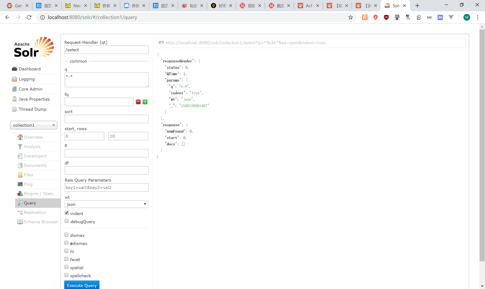
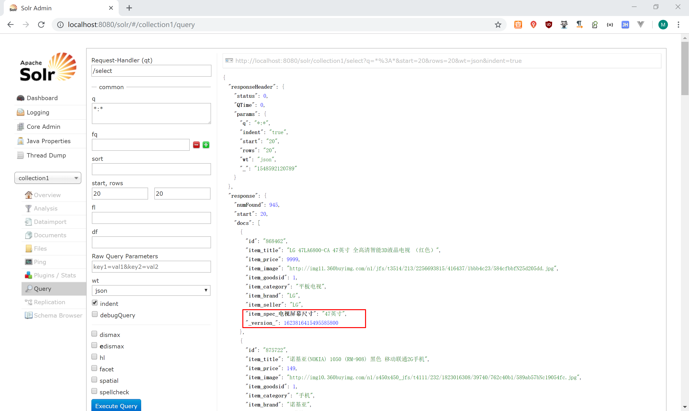

# 1.Solr安装与配置

## 1.1什么是Solr

大多数搜索引擎应用都必须具有某种搜索功能，问题是搜索功能往往是巨大的资源消耗并且它们由于沉重的数据库加载而拖垮你的应用的性能。

这就是为什么转移负载到一个外部的搜索服务器是一个不错的主意，Apache Solr是一个流行的开源搜索服务器，它通过使用类似REST的HTTP API，这就确保你能从几乎任何编程语言来使用solr。

Solr是一个开源搜索平台，用于构建搜索应用程序。 它建立在[Lucene](http://www.yiibai.com/lucene/)(全文搜索引擎)之上。 Solr是企业级的，快速的和高度可扩展的。 使用Solr构建的应用程序非常复杂，可提供高性能。

为了在CNET网络的公司网站上添加搜索功能，Yonik Seely于2004年创建了Solr。并在2006年1月，它成为Apache软件基金会下的一个开源项目。并于2016年发布最新版本Solr 6.0，支持并行SQL查询的执行。

Solr可以和[Hadoop](http://www.yiibai.com/hadoop/)一起使用。由于Hadoop处理大量数据，Solr帮助我们从这么大的源中找到所需的信息。不仅限于搜索，Solr也可以用于存储目的。像其他NoSQL数据库一样，它是一种非关系数据存储和处理技术。

总之，Solr是一个可扩展的，可部署，搜索/存储引擎，优化搜索大量以文本为中心的数据。

## 1.2 Solr安装

1：安装 Tomcat，解压缩即可。

2：解压 solr。

3：把 solr 下的dist目录solr-4.10.3.war部署到 Tomcat\webapps下(去掉版本号)。

4：启动 Tomcat解压缩 war 包

5：把solr下example/lib/ext 目录下的所有的 jar 包，添加到 solr 的工程中(\WEB-INF\lib目录下)。

6：创建一个 solrhome 。solr 下的/example/solr 目录就是一个 solrhome。复制此目录到D盘改名为solrhome  

7：关联 solr 及 solrhome。需要修改 solr 工程的 web.xml 文件。

```xml
<env-entry>
   <env-entry-name>solr/home</env-entry-name>
   <env-entry-value>c:\solrhome</env-entry-value>
   <env-entry-type>java.lang.String</env-entry-type>
</env-entry>
```
8：启动 Tomcat

http://IP:8080/solr/


## 1.3中文分析器IK Analyzer

### 1.3.1 IK Analyzer简介

IK Analyzer 是一个开源的，基亍 java 语言开发的轻量级的中文分词工具包。从 2006年 12 月推出 1.0 版开始， IKAnalyzer 已经推出了 4 个大版本。最初，它是以开源项目Luence 为应用主体的，结合词典分词和文法分析算法的中文分词组件。从 3.0 版本开始，IK 发展为面向 Java 的公用分词组件，独立亍 Lucene 项目，同时提供了对 Lucene 的默认优化实现。在 2012 版本中，IK 实现了简单的分词歧义排除算法，标志着 IK 分词器从单纯的词典分词向模拟语义分词衍化。

### 1.3.2 IK Analyzer配置

步骤：

1、把IKAnalyzer2012FF_u1.jar 添加到 solr 工程的 lib 目录下

2、创建WEB-INF/classes文件夹  把扩展词典、停用词词典、配置文件放到 solr 工程的 WEB-INF/classes 目录下。

3、修改 Solrhome 的 schema.xml 文件，配置一个 FieldType，使用 IKAnalyzer

```xml
<fieldType name="text_ik" class="solr.TextField">
 <analyzer class="org.wltea.analyzer.lucene.IKAnalyzer"/>
</fieldType>
```
测试


## 1.4配置域

域相当于数据库的表字段，用户存放数据，因此用户根据业务需要去定义相关的Field（域），一般来说，每一种对应着一种数据，用户对同一种数据进行相同的操作。

域的常用属性：

- name：指定域的名称
- type：指定域的类型
- indexed：是否索引
- stored：是否存储
- required：是否必须
- multiValued：是否多值

 

### 1.4.1域

修改solrhome的schema.xml 文件  设置业务系统 Field

```xml
<field name="item_goodsid" type="long" indexed="true" stored="true"/>
<field name="item_title" type="text_ik" indexed="true" stored="true"/>
<field name="item_price" type="double" indexed="true" stored="true"/>
<field name="item_image" type="string" indexed="false" stored="true" />
<field name="item_category" type="string" indexed="true" stored="true" />
<field name="item_seller" type="text_ik" indexed="true" stored="true" />
<field name="item_brand" type="string" indexed="true" stored="true" />
```
### 1.4.2复制域

复制域的作用在于将某一个Field中的数据复制到另一个域中

```xml
<field name="item_keywords" type="text_ik" indexed="true" stored="false" multiValued="true"/>
<copyField source="item_title" dest="item_keywords"/>
<copyField source="item_category" dest="item_keywords"/>
<copyField source="item_seller" dest="item_keywords"/>
<copyField source="item_brand" dest="item_keywords"/>	
```
### 1.4.3动态域

当我们需要动态扩充字段时，我们需要使用动态域。对于品优购，规格的值是不确定的，所以我们需要使用动态域来实现。需要实现的效果如下：

   

配置：

```xml
<dynamicField name="item_spec_*" type="string" indexed="true" stored="true" />	
```

测试




# 3.品优购-批量数据导入

## 3.1需求分析

编写专门的导入程序，将商品数据导入到Solr系统中

## 3.2查询商品数据列表

### 3.2.1 工程搭建

（1）创建pinyougou-solr-util（jar） ,引入pinyougou-dao  以及spring 相关依赖

（2）创建spring 配置文件


内容为：

```xml
<context:component-scan base-package="com.pinyougou.solrutil">
</context:component-scan>
```

### 3.2.2 代码编写

创建com.pinyougou.solrutil包，创建类SolrUtil ,实现商品数据的查询(已审核商品)

```java
package com.pinyougou.solrutil;

import com.pinyougou.mapper.TbItemMapper;
import com.pinyougou.pojo.TbItem;
import com.pinyougou.pojo.TbItemExample;
import org.springframework.beans.factory.annotation.Autowired;
import org.springframework.context.ApplicationContext;
import org.springframework.context.support.ClassPathXmlApplicationContext;
import org.springframework.stereotype.Component;

import java.util.List;

/**
 * @author miion
 * @create 2019-01-27
 */
@Component
public class SolrUtil {
    @Autowired
    private TbItemMapper itemMapper;

    /**
     * 导入商品数据
     */
    public void importItemData(){
        TbItemExample example=new TbItemExample();
        TbItemExample.Criteria criteria = example.createCriteria();
        criteria.andStatusEqualTo("1");//已审核
        List<TbItem> itemList = itemMapper.selectByExample(example);
        System.out.println("===商品列表===");
        for(TbItem item:itemList){
            System.out.println(item.getTitle());
        }
        System.out.println("===结束===");
    }

    public static void main(String[] args) {
        ApplicationContext context=new ClassPathXmlApplicationContext("classpath*:spring/applicationContext*.xml");
        SolrUtil solrUtil=  (SolrUtil) context.getBean("solrUtil");
        solrUtil.importItemData();
    }
}
```

测试


## 3.3数据导入Solr索引库

### 3.3.1实体类

（1）将demo工程中添加了@Field注解的实体类拷贝到pinyougou-pojo中

```java
package com.pinyougou.pojo;

import org.apache.solr.client.solrj.beans.Field;
import org.springframework.data.solr.core.mapping.Dynamic;

import java.io.Serializable;
import java.math.BigDecimal;
import java.util.Date;
import java.util.Map;

public class TbItem implements Serializable{
   
   @Field
    private Long id;

   @Field("item_title")
    private String title;

    private String sellPoint;

    @Field("item_price")
    private BigDecimal price;

    private Integer stockCount;

    private Integer num;

    private String barcode;

    @Field("item_image")
    private String image;

    private Long categoryid;

    private String status;

    private Date createTime;

    private Date updateTime;

    private String itemSn;

    private BigDecimal costPirce;

    private BigDecimal marketPrice;

    private String isDefault;

    @Field("item_goodsid")
    private Long goodsId;

    private String sellerId;

    private String cartThumbnail;

    @Field("item_category")
    private String category;

    @Field("item_brand")
    private String brand;

    private String spec;

    @Field("item_seller")
    private String seller;
    
    @Dynamic
    @Field("item_spec_*")
    private Map<String,String> specMap;
    
    public Map<String, String> getSpecMap() {
      return specMap;
   }

   public void setSpecMap(Map<String, String> specMap) {
      this.specMap = specMap;
   }
   
   

   public Long getId() {
        return id;
    }

    public void setId(Long id) {
        this.id = id;
    }

    public String getTitle() {
        return title;
    }

    public void setTitle(String title) {
        this.title = title == null ? null : title.trim();
    }

    public String getSellPoint() {
        return sellPoint;
    }

    public void setSellPoint(String sellPoint) {
        this.sellPoint = sellPoint == null ? null : sellPoint.trim();
    }

    public BigDecimal getPrice() {
        return price;
    }

    public void setPrice(BigDecimal price) {
        this.price = price;
    }

    public Integer getStockCount() {
        return stockCount;
    }

    public void setStockCount(Integer stockCount) {
        this.stockCount = stockCount;
    }

    public Integer getNum() {
        return num;
    }

    public void setNum(Integer num) {
        this.num = num;
    }

    public String getBarcode() {
        return barcode;
    }

    public void setBarcode(String barcode) {
        this.barcode = barcode == null ? null : barcode.trim();
    }

    public String getImage() {
        return image;
    }

    public void setImage(String image) {
        this.image = image == null ? null : image.trim();
    }

    public Long getCategoryid() {
        return categoryid;
    }

    public void setCategoryid(Long categoryid) {
        this.categoryid = categoryid;
    }

    public String getStatus() {
        return status;
    }

    public void setStatus(String status) {
        this.status = status == null ? null : status.trim();
    }

    public Date getCreateTime() {
        return createTime;
    }

    public void setCreateTime(Date createTime) {
        this.createTime = createTime;
    }

    public Date getUpdateTime() {
        return updateTime;
    }

    public void setUpdateTime(Date updateTime) {
        this.updateTime = updateTime;
    }

    public String getItemSn() {
        return itemSn;
    }

    public void setItemSn(String itemSn) {
        this.itemSn = itemSn == null ? null : itemSn.trim();
    }

    public BigDecimal getCostPirce() {
        return costPirce;
    }

    public void setCostPirce(BigDecimal costPirce) {
        this.costPirce = costPirce;
    }

    public BigDecimal getMarketPrice() {
        return marketPrice;
    }

    public void setMarketPrice(BigDecimal marketPrice) {
        this.marketPrice = marketPrice;
    }

    public String getIsDefault() {
        return isDefault;
    }

    public void setIsDefault(String isDefault) {
        this.isDefault = isDefault == null ? null : isDefault.trim();
    }

    public Long getGoodsId() {
        return goodsId;
    }

    public void setGoodsId(Long goodsId) {
        this.goodsId = goodsId;
    }

    public String getSellerId() {
        return sellerId;
    }

    public void setSellerId(String sellerId) {
        this.sellerId = sellerId == null ? null : sellerId.trim();
    }

    public String getCartThumbnail() {
        return cartThumbnail;
    }

    public void setCartThumbnail(String cartThumbnail) {
        this.cartThumbnail = cartThumbnail == null ? null : cartThumbnail.trim();
    }

    public String getCategory() {
        return category;
    }

    public void setCategory(String category) {
        this.category = category == null ? null : category.trim();
    }

    public String getBrand() {
        return brand;
    }

    public void setBrand(String brand) {
        this.brand = brand == null ? null : brand.trim();
    }

    public String getSpec() {
        return spec;
    }

    public void setSpec(String spec) {
        this.spec = spec == null ? null : spec.trim();
    }

    public String getSeller() {
        return seller;
    }

    public void setSeller(String seller) {
        this.seller = seller == null ? null : seller.trim();
    }
}
```

（2）在pinyougou-pojo中引入依赖

```xml
<dependencies>
    <dependency>
        <groupId>org.springframework.data</groupId>
        <artifactId>spring-data-solr</artifactId>
        <version>1.5.5.RELEASE</version>
    </dependency>
</dependencies>
```

### 3.3.2添加Solr配置文件

添加applicationContext-solr.xml到spring目录

```xml
<?xml version="1.0" encoding="UTF-8"?>
<beans xmlns="http://www.springframework.org/schema/beans"
   xmlns:xsi="http://www.w3.org/2001/XMLSchema-instance" xmlns:p="http://www.springframework.org/schema/p"
   xmlns:context="http://www.springframework.org/schema/context"
   xmlns:solr="http://www.springframework.org/schema/data/solr"
   xsi:schemaLocation="http://www.springframework.org/schema/data/solr 
      http://www.springframework.org/schema/data/solr/spring-solr-1.0.xsd
      http://www.springframework.org/schema/beans 
      http://www.springframework.org/schema/beans/spring-beans.xsd
      http://www.springframework.org/schema/context 
      http://www.springframework.org/schema/context/spring-context.xsd">
   
   <!-- solr服务器地址 -->
   <solr:solr-server id="solrServer" url="http://127.0.0.1:8080/solr" />

   
   <!-- solr模板，使用solr模板可对索引库进行CRUD的操作 -->
   <bean id="solrTemplate" class="org.springframework.data.solr.core.SolrTemplate">
      <constructor-arg ref="solrServer" />
   </bean>
</beans>
```

### 3.2.3调用模板类导入solr

修改pinyougou-solr-util的SolrUtil.java

```java
@Autowired
private SolrTemplate solrTemplate;

/**
 * 导入商品数据
 */
public void importItemData(){

    TbItemExample example=new TbItemExample();
    TbItemExample.Criteria criteria = example.createCriteria();
    criteria.andStatusEqualTo("1");//已审核
    List<TbItem> itemList = itemMapper.selectByExample(example);
    System.out.println("===商品列表===");
    for(TbItem item:itemList){
        System.out.println(item.getTitle());
    }
    solrTemplate.saveBeans(itemList);
    solrTemplate.commit();
    System.out.println("===结束===");
}
```

测试


## 3.4规格导入动态域

### 3.4.1@Dynamic注解

修改TbItem.java ，添加属性

```java
@Dynamic
@Field("item_spec_*")
private Map<String,String> specMap;

public String getSpec() {
    return spec;
}

public void setSpec(String spec) {
    this.spec = spec == null ? null : spec.trim();
}
```

  3.4.2修改导入工具

修改pinyougou-solr-util的SolrUtil.java   ,引入fastJSON依赖

```java
/**
 * 导入商品数据
 */
public void importItemData(){
    TbItemExample example=new TbItemExample();
    TbItemExample.Criteria criteria = example.createCriteria();
    criteria.andStatusEqualTo("1");//已审核
    List<TbItem> itemList = itemMapper.selectByExample(example);
    System.out.println("===商品列表===");
    for(TbItem item:itemList){
        Map specMap= JSON.parseObject(item.getSpec());//将spec字段中的json字符串转换为map
        item.setSpecMap(specMap);//给带注解的字段赋值
        System.out.println(item.getTitle());
    }
    solrTemplate.saveBeans(itemList);
    solrTemplate.commit();
    System.out.println("===结束===");
}
```

测试



# 4.品优购-关键字搜索

## 4.1需求分析

打开搜索页面，在搜索框输入要搜索的关键字，点击搜索按钮即可进行搜索，展示搜索结果 


## 4.2后端代码

### 4.2.1服务接口层

（1）创建pinyougou-search-interface模块（搜索服务接口），依赖pinyougou-pojo

（2）创建com.pinyougou.search.service包，创建业务接口

```java
package com.pinyougou.search.service;

import java.util.List;
import java.util.Map;

public interface ItemSearchService {

   
   /**
    * 搜索方法
    * @param searchMap
    * @return
    */
   public Map search(Map searchMap);
   
   
}
```

### 4.2.2服务实现层

（1）创建war工程pinyougou-search-service ，引入pinyougou-search-interface spring dubbox 等相关依赖（参加其它服务工程）Tomcat运行端口9004

（2）添加web.xml （参加其它服务工程）

（3）在src/main/resources/spring 下applicationContext-service.xml （参见其它服务工程）dubbo端口20884

（4）在src/main/resources/spring 下创建spring 配置文件applicationContext-solr.xml（同demo工程）

（5）编写服务实现类ItemSearchServiceImpl.java

```java
package com.pinyougou.search.service.impl;

import com.alibaba.dubbo.config.annotation.Service;
import com.pinyougou.pojo.TbItem;
import com.pinyougou.search.service.ItemSearchService;
import org.springframework.beans.factory.annotation.Autowired;
import org.springframework.data.solr.core.SolrTemplate;
import org.springframework.data.solr.core.query.Criteria;
import org.springframework.data.solr.core.query.Query;
import org.springframework.data.solr.core.query.SimpleQuery;
import org.springframework.data.solr.core.query.result.ScoredPage;

import java.util.HashMap;
import java.util.Map;
@Service(timeout=5000)
public class ItemSearchServiceImpl implements ItemSearchService {

   @Autowired
   private SolrTemplate solrTemplate;
   
   @Override
   public Map search(Map searchMap) {
      Map map=new HashMap();
      
      Query query=new SimpleQuery("*:*");
      Criteria criteria=new Criteria("item_keywords").is(searchMap.get("keywords"));
      query.addCriteria(criteria);
      
      ScoredPage<TbItem> page = solrTemplate.queryForPage(query, TbItem.class);
      
      map.put("rows", page.getContent());
      
      return map;
   }

}
```

### 4.2.3控制层

（1）创建pinyougou-search-web 工程 ，引入依赖（参见其它web模块），tomcat运行端口9104

```xml
<project xmlns="http://maven.apache.org/POM/4.0.0" xmlns:xsi="http://www.w3.org/2001/XMLSchema-instance" xsi:schemaLocation="http://maven.apache.org/POM/4.0.0 http://maven.apache.org/xsd/maven-4.0.0.xsd">
    <modelVersion>4.0.0</modelVersion>
    <parent>
        <groupId>com.pinyougou</groupId>
        <artifactId>pinyougou-parent</artifactId>
        <version>0.0.5-SNAPSHOT</version>
    </parent>
    <artifactId>pinyougou-search-web</artifactId>
    <packaging>war</packaging>


    <dependencies>
        <!-- Spring -->
        <dependency>
            <groupId>org.springframework</groupId>
            <artifactId>spring-context</artifactId>
        </dependency>
        <dependency>
            <groupId>org.springframework</groupId>
            <artifactId>spring-beans</artifactId>
        </dependency>
        <dependency>
            <groupId>org.springframework</groupId>
            <artifactId>spring-webmvc</artifactId>
        </dependency>
        <dependency>
            <groupId>org.springframework</groupId>
            <artifactId>spring-jdbc</artifactId>
        </dependency>
        <dependency>
            <groupId>org.springframework</groupId>
            <artifactId>spring-aspects</artifactId>
        </dependency>
        <dependency>
            <groupId>org.springframework</groupId>
            <artifactId>spring-jms</artifactId>
        </dependency>
        <dependency>
            <groupId>org.springframework</groupId>
            <artifactId>spring-context-support</artifactId>
        </dependency>
        <dependency>
            <groupId>org.springframework</groupId>
            <artifactId>spring-test</artifactId>
        </dependency>
        <!-- dubbo相关 -->
        <dependency>
            <groupId>com.alibaba</groupId>
            <artifactId>dubbo</artifactId>
        </dependency>
        <dependency>
            <groupId>org.apache.zookeeper</groupId>
            <artifactId>zookeeper</artifactId>
        </dependency>
        <dependency>
            <groupId>com.github.sgroschupf</groupId>
            <artifactId>zkclient</artifactId>
        </dependency>
        <dependency>
            <groupId>junit</groupId>
            <artifactId>junit</artifactId>
        </dependency>
        <dependency>
            <groupId>com.alibaba</groupId>
            <artifactId>fastjson</artifactId>
        </dependency>
        <dependency>
            <groupId>javassist</groupId>
            <artifactId>javassist</artifactId>
        </dependency>
        <dependency>
            <groupId>commons-codec</groupId>
            <artifactId>commons-codec</artifactId>
        </dependency>
        <dependency>
            <groupId>javax.servlet</groupId>
            <artifactId>servlet-api</artifactId>
            <scope>provided</scope>
        </dependency>


        <dependency>
            <groupId>com.pinyougou</groupId>
            <artifactId>pinyougou-search-interface</artifactId>
            <version>0.0.5-SNAPSHOT</version>
        </dependency>
    </dependencies>


    <build>
        <plugins>
            <plugin>
                <groupId>org.apache.tomcat.maven</groupId>
                <artifactId>tomcat7-maven-plugin</artifactId>
                <version>2.2</version>
                <configuration>
                    <!-- 指定端口 -->
                    <port>9104</port>
                    <!-- 请求路径 -->
                    <path>/</path>
                </configuration>
            </plugin>
        </plugins>
    </build>


</project>
```

（2）添加web.xml   （参加其它web工程）

```xml
<?xml version="1.0" encoding="UTF-8"?>
<web-app xmlns:xsi="http://www.w3.org/2001/XMLSchema-instance"
         xmlns="http://java.sun.com/xml/ns/javaee"
         xsi:schemaLocation="http://java.sun.com/xml/ns/javaee http://java.sun.com/xml/ns/javaee/web-app_2_5.xsd"
         version="2.5">
    <!-- 解决post乱码 -->
    <filter>
        <filter-name>CharacterEncodingFilter</filter-name>
        <filter-class>org.springframework.web.filter.CharacterEncodingFilter</filter-class>
        <init-param>
            <param-name>encoding</param-name>
            <param-value>utf-8</param-value>
        </init-param>
        <init-param>
            <param-name>forceEncoding</param-name>
            <param-value>true</param-value>
        </init-param>
    </filter>
    <filter-mapping>
        <filter-name>CharacterEncodingFilter</filter-name>
        <url-pattern>/*</url-pattern>
    </filter-mapping>
    <servlet>
        <servlet-name>springmvc</servlet-name>
        <servlet-class>org.springframework.web.servlet.DispatcherServlet</servlet-class>
        <!-- 指定加载的配置文件 ，通过参数contextConfigLocation加载-->
        <init-param>
            <param-name>contextConfigLocation</param-name>
            <param-value>classpath:spring/springmvc.xml</param-value>
        </init-param>
    </servlet>
    <servlet-mapping>
        <servlet-name>springmvc</servlet-name>
        <url-pattern>*.do</url-pattern>
    </servlet-mapping>

</web-app>
```

（3）添加配置文件  （内容参加其它web工程）

（4）创建包com.pinyougou.search.controller 编写控制器类  

```java
package com.pinyougou.search.controller;

import com.alibaba.dubbo.config.annotation.Reference;
import com.pinyougou.search.service.ItemSearchService;
import org.springframework.web.bind.annotation.RequestBody;
import org.springframework.web.bind.annotation.RequestMapping;
import org.springframework.web.bind.annotation.RestController;

import java.util.Map;

/**
 * @author miion
 * @create 2019-01-28
 */
@RestController
@RequestMapping("/itemsearch")
public class ItemSearchController {
    @Reference
    private ItemSearchService itemSearchService;

    @RequestMapping("/search")
    public Map<String, Object> search(@RequestBody Map searchMap ){
        return  itemSearchService.search(searchMap);
    }
}
```

## 4.3前端代码

### 4.3.1拷贝资源

将下列资源拷贝至pinyougou-search-web


将angularJS拷贝到插件文件夹

拷贝base.js到js文件夹

### 4.3.2服务层

pinyougou-search-web工程创建searchService.js

```js
//搜索服务层
app.service("searchService",function($http){
    this.search=function(searchMap){
        return $http.post('itemsearch/search.do',searchMap);
    }
});
```

### 4.3.3控制层

pinyougou-search-web工程searchController.js  

```js
app.controller('searchController',function($scope,searchService){
    //搜索
    $scope.search=function(){
        searchService.search( $scope.searchMap ).success(
            function(response){
                $scope.resultMap=response;//搜索返回的结果
            }
        );
    }
});
```

### 4.3.4页面

pinyougou-search-web工程search.html

引入js

```html
<script type="text/javascript" src="plugins/angularjs/angular.min.js">  </script>
<script type="text/javascript" src="js/base.js">  </script>
<script type="text/javascript" src="js/service/searchService.js">  </script>
<script type="text/javascript" src="js/controller/searchController.js">  </script>
```

指定控制器

```html
<body ng-app="pinyougou" ng-controller="searchController">
```

绑定搜索框

```html
<div class="input-append">
   <input type="text" id="autocomplete" ng-model="searchMap.keywords" type="text" class="input-error input-xxlarge" />
   <button class="sui-btn btn-xlarge btn-danger" ng-click="search()" type="button">搜索</button>
</div>
```

循环显示数据

```html
<div class="goods-list">
   <ul class="yui3-g">
      <li class="yui3-u-1-5" ng-repeat="item in resultMap.rows">
         <div class="list-wrap">
            <div class="p-img">
               <a href="item.html" target="_blank"></a>
            </div>
            <div class="price">
               <strong>
                  <em>¥</em>
                  <i>{{item.price}}</i>
               </strong>
            </div>
            <div class="attr">
               <em>{{item.title}}</em>
            </div>
            <div class="cu">
               <em><span>促</span>满一件可参加超值换购</em>
            </div>
            <div class="commit">
               <i class="command">已有2000人评价</i>
            </div>
            <div class="operate">
               <a href="success-cart.html" target="_blank" class="sui-btn btn-bordered btn-danger">加入购物车</a>
               <a href="javascript:void(0);" class="sui-btn btn-bordered">对比</a>
               <a href="javascript:void(0);" class="sui-btn btn-bordered">关注</a>
            </div>
         </div>
      </li>

   </ul>
</div>
```

测试


