# 课程目标

目标1：说出什么是集群以及与分布式的区别

目标2：能够搭建Zookeeper集群

目标3：能够搭建SolrCloud集群

目标4：能够搭建RedisCluster集群

# 1.集群概述

## 1.1什么是集群

### 1.1.1集群概念

集群是一种计算机系统， 它通过一组松散集成的计算机软件和/或硬件连接起来高度紧密地协作完成计算工作。在某种意义上，他们可以被看作是一台计算机。集群系统中的单个计算机通常称为节点，通常通过局域网连接，但也有其它的可能连接方式。集群计算机通常用来改进单个计算机的计算速度和/或可靠性。一般情况下集群计算机比单个计算机，比如工作站或超级计算机性能价格比要高得多。

 

### 1.1.2集群的特点

集群拥有以下两个特点：

\1.   可扩展性：集群的性能不限制于单一的服务实体，新的服务实体可以动态的添加到集群，从而增强集群的性能。

\2.   高可用性：集群当其中一个节点发生故障时，这台节点上面所运行的应用程序将在另一台节点被自动接管，消除单点故障对于增强数据可用性、可达性和可靠性是非常重要的。

### 1.1.3集群的两大能力

集群必须拥有以下两大能力：

\1.     负载均衡：负载均衡把任务比较均匀的分布到集群环境下的计算和网络资源，以提高数据吞吐量。

\2.     错误恢复：如果集群中的某一台服务器由于故障或者维护需要无法使用，资源和应用程序将转移到可用的集群节点上。这种由于某个节点的资源不能工作，另一个可用节点中的资源能够透明的接管并继续完成任务的过程，叫做错误恢复。

负载均衡和错误恢复要求各服务实体中有执行同一任务的资源存在，而且对于同一任务的各个资源来说，执行任务所需的信息视图必须是相同的。

## 1.2集群与分布式的区别

说到集群，可能大家会立刻联想到另一个和它很相近的一个词----“分布式”。那么集群和分布式是一回事吗？有什么联系和区别呢?

相同点：

分布式和集群都是需要有很多节点服务器通过网络协同工作完成整体的任务目标。

不同点：

分布式是指将业务系统进行拆分，即分布式的每一个节点都是实现不同的功能。而集群每个节点做的是同一件事情。

如下图，每个人都有不同的分工，一起协作干一件事，叫做“分布式”

 

再看下图：每个划桨人干的都是一样的活，叫做集群。

分布式的每一个节点也可以做成集群。其实这个赛龙舟的图，总整体来看属于分布式,包括打鼓和划桨两个分布式节点，而划桨的节点又是集群的形态。

现实生活中例子还有很多，例如，这样古代乐队的图就属于集群

而现代乐队这样图就是分布式啦

# 2.Zookeeper集群

## 2.1 Zookeeper集群简介

### 2.1.1为什么搭建Zookeeper集群

大部分分布式应用需要一个主控、协调器或者控制器来管理物理分布的子进程。目前，大多数都要开发私有的协调程序，缺乏一个通用机制，协调程序的反复编写浪费，且难以形成通用、伸缩性好的协调器，zookeeper提供通用的分布式锁服务，用以协调分布式应用。所以说zookeeper是分布式应用的协作服务。

zookeeper作为注册中心，服务器和客户端都要访问，如果有大量的并发，肯定会有等待。所以可以通过zookeeper集群解决。

下面是zookeeper集群部署结构图：

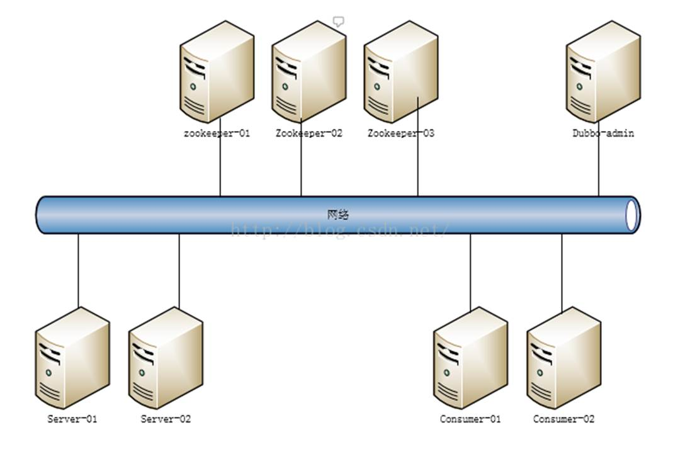

### 2.1.2了解Leader选举

Zookeeper的启动过程中leader选举是非常重要而且最复杂的一个环节。那么什么是leader选举呢？zookeeper为什么需要leader选举呢？zookeeper的leader选举的过程又是什么样子的？

首先我们来看看什么是leader选举。其实这个很好理解，leader选举就像总统选举一样，每人一票，获得多数票的人就当选为总统了。在zookeeper集群中也是一样，每个节点都会投票，如果某个节点获得超过半数以上的节点的投票，则该节点就是leader节点了。

以一个简单的例子来说明整个选举的过程. 
​          假设有[五台](http://www.cfanz.cn/index.php?c=search&key=%E4%BA%94%E5%8F%B0)服务器组成的zookeeper集群,它们的id从1-5,同时它们都是最新启动的,也就是没有历史数据,在存放数据量这一点上,都是一样的.假设这些服务器依序启动,来看看会发生什么 。
​          1) 服务器1启动,此时只有它一台服务器启动了,它发出去的报没有任何响应,所以它的选举状态一直是LOOKING状态  
​          2) 服务器2启动,它与最开始启动的服务器1进行通信,互相交换自己的选举结果,由于两者都没有历史数据,所以id值较大的服务器2胜出,但是由于没有达到超过半数以上的服务器都同意选举它(这个例子中的半数以上是3),所以服务器1,2还是继续保持LOOKING状态.  
​          3) 服务器3启动,根据前面的理论分析,服务器3成为服务器1,2,3中的老大,而与上面不同的是,此时有三台服务器选举了它,所以它成为了这次选举的leader.  
​          4) 服务器4启动,根据前面的分析,理论上服务器4应该是服务器1,2,3,4中最大的,但是由于前面已经有半数以上的服务器选举了服务器3,所以它只能接收当[小弟](http://www.cfanz.cn/index.php?c=search&key=%E5%B0%8F%E5%BC%9F)的命了.  
​          5) 服务器5启动,同4一样,当小弟

## 2.2搭建Zookeeper集群

### 2.2.1搭建要求

真实的集群是需要部署在不同的服务器上的，但是在我们测试时同时启动十几个虚拟机内存会吃不消，所以我们通常会搭建**伪集群**，也就是把所有的服务都搭建在一台虚拟机上，用端口进行区分。

我们这里要求搭建一个三个节点的Zookeeper集群（伪集群）。

### 2.2.2准备工作

重新部署一台虚拟机作为我们搭建集群的测试服务器。

（1）安装JDK  【此步骤省略】。

（2）Zookeeper压缩包上传到服务器

（3）将Zookeeper解压 ，创建data目录 ，将 conf下zoo_sample.cfg 文件改名为 zoo.cfg

（4）建立/usr/local/zookeeper-cluster目录，将解压后的Zookeeper复制到以下三个目录

/usr/local/zookeeper-cluster/zookeeper-1

/usr/local/zookeeper-cluster/zookeeper-2

/usr/local/zookeeper-cluster/zookeeper-3

   [root@localhost ~]# mkdir /usr/local/zookeeper-cluster   [root@localhost ~]# cp -r    zookeeper-3.4.6 /usr/local/zookeeper-cluster/zookeeper-1   [root@localhost ~]# cp -r    zookeeper-3.4.6 /usr/local/zookeeper-cluster/zookeeper-2   [root@localhost ~]# cp -r    zookeeper-3.4.6 /usr/local/zookeeper-cluster/zookeeper-3   

 

（5） 配置每一个Zookeeper 的dataDir（zoo.cfg） clientPort 分别为2181  2182  2183

修改/usr/local/zookeeper-cluster/zookeeper-1/conf/zoo.cfg

   clientPort=2181   dataDir=/usr/local/zookeeper-cluster/zookeeper-1/data   

修改/usr/local/zookeeper-cluster/zookeeper-2/conf/zoo.cfg

   clientPort=2182   dataDir=/usr/local/zookeeper-cluster/zookeeper-2/data   

修改/usr/local/zookeeper-cluster/zookeeper-3/conf/zoo.cfg

   clientPort=2183   dataDir=/usr/local/zookeeper-cluster/zookeeper-3/data   

### 2.2.3配置集群

（1）在每个zookeeper的 data 目录下创建一个 myid 文件，内容分别是1、2、3 。这个文件就是记录每个服务器的ID

   **-------****知识点小贴士****------**   如果你要创建的文本文件内容比较简单，我们可以通过echo 命令快速创建文件   格式为：    echo 内容 >文件名   例如我们为第一个zookeeper指定ID为1，则输入命令      

（2）在每一个zookeeper 的 zoo.cfg配置客户端访问端口（clientPort）和集群服务器IP列表。

集群服务器IP列表如下

   server.1=192.168.25.140:2881:3881   server.2=192.168.25.140:2882:3882   server.3=192.168.25.140:2883:3883   

解释：server.服务器ID=服务器IP地址：服务器之间通信端口：服务器之间投票选举端口

   **-----****知识点小贴士****-----**   我们可以使用EditPlus远程修改服务器的文本文件的内容，更加便捷   （1）在菜单选择FTP Settings       （2）点击ADD按钮      （3）输入服务器信息      （4）点击高级选项按钮      （5）选择SFTP    端口22      （6）OK    。完成配置      连接：            哈哈，无敌啦~~~~   你可能要问，老师，你为啥不早告诉我有这一招  ！   

 

### 2.2.4启动集群

启动集群就是分别启动每个实例。

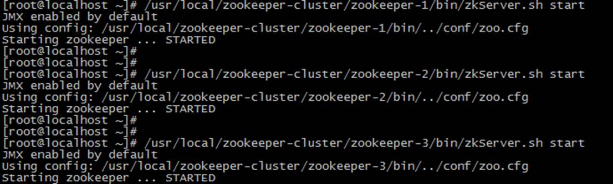

启动后我们查询一下每个实例的运行状态

先查询第一个服务

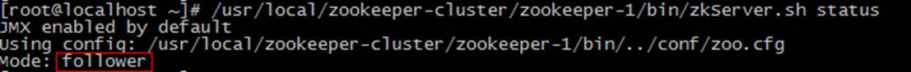

Mode为follower表示是**跟随者**（从）

再查询第二个服务Mod 为leader表示是**领导者**（主）

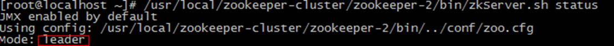

查询第三个为跟随者（从）

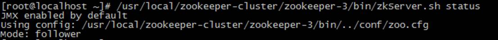

### 2.2.5模拟集群异常

（1）首先我们先测试如果是从服务器挂掉，会怎么样

把3号服务器停掉，观察1号和2号，发现状态并没有变化

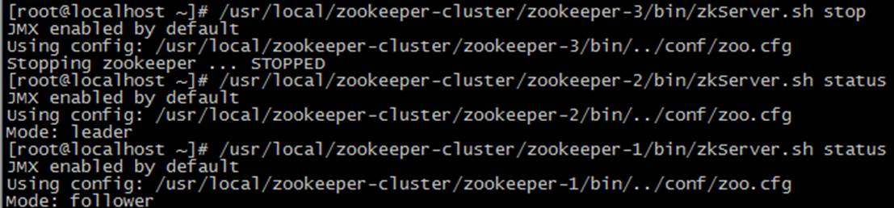

由此得出结论，3个节点的集群，从服务器挂掉，集群正常

（2）我们再把1号服务器（从服务器）也停掉，查看2号（主服务器）的状态，发现已经停止运行了。

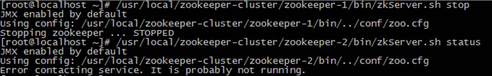

由此得出结论，3个节点的集群，2个从服务器都挂掉，主服务器也无法运行。因为可运行的机器没有超过集群总数量的半数。

（3）我们再次把1号服务器启动起来，发现2号服务器又开始正常工作了。而且依然是领导者。

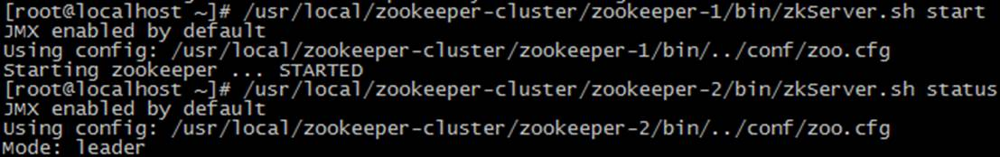

（4）我们把3号服务器也启动起来，把2号服务器停掉（汗~~干嘛？领导挂了？）停掉后观察1号和3号的状态。

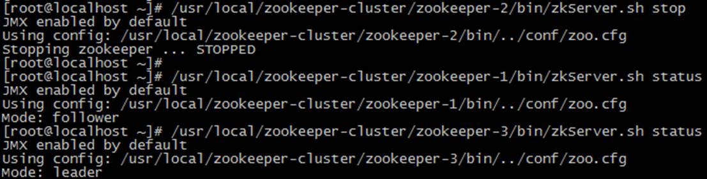

发现新的leader产生了~  

由此我们得出结论，当集群中的主服务器挂了，集群中的其他服务器会自动进行选举状态，然后产生新得leader 

（5）我们再次测试，当我们把2号服务器重新启动起来（汗~~这是诈尸啊!）启动后，会发生什么？2号服务器会再次成为新的领导吗？我们看结果

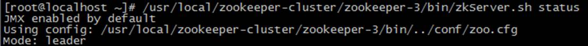

我们会发现，2号服务器启动后依然是跟随者（从服务器），3号服务器依然是领导者（主服务器），没有撼动3号服务器的领导地位。哎~退休了就是退休了，说了不算了，哈哈。

由此我们得出结论，当领导者产生后，再次有新服务器加入集群，不会影响到现任领导者。

## 2.3 Dubbox连接zookeeper集群

修改服务提供者和服务调用者的spring 配置文件

   <!-- 指定注册中心地址   -->   <dubbo:registry   protocol=*"zookeeper"* address=*"**192.168.25.140**:2181,**192.168.25.140**:2182,**192.168.25.140**:2183"*>   </dubbo:registry>   

 

# 3.SolrCloud

## 3.1 SolrCloud简介

### 3.1.1什么是SolrCloud

SolrCloud(solr 云)是 Solr 提供的分布式搜索方案，当你需要大规模，容错，分布式索引和检索能力时使用 SolrCloud。当一个系统的索引数据量少的时候是不需要使用 SolrCloud的，当索引量很大，搜索请求并发很高，这时需要使用 SolrCloud 来满足这些需求。

SolrCloud 是基于 Solr 和Zookeeper的分布式搜索方案，它的主要思想是使用 Zookeeper作为集群的配置信息中心。

它有几个特色功能：

1）集中式的配置信息

2）自动容错

3）近实时搜索

4）查询时自动负载均衡

### 3.1.2 SolrCloud系统架构

 

、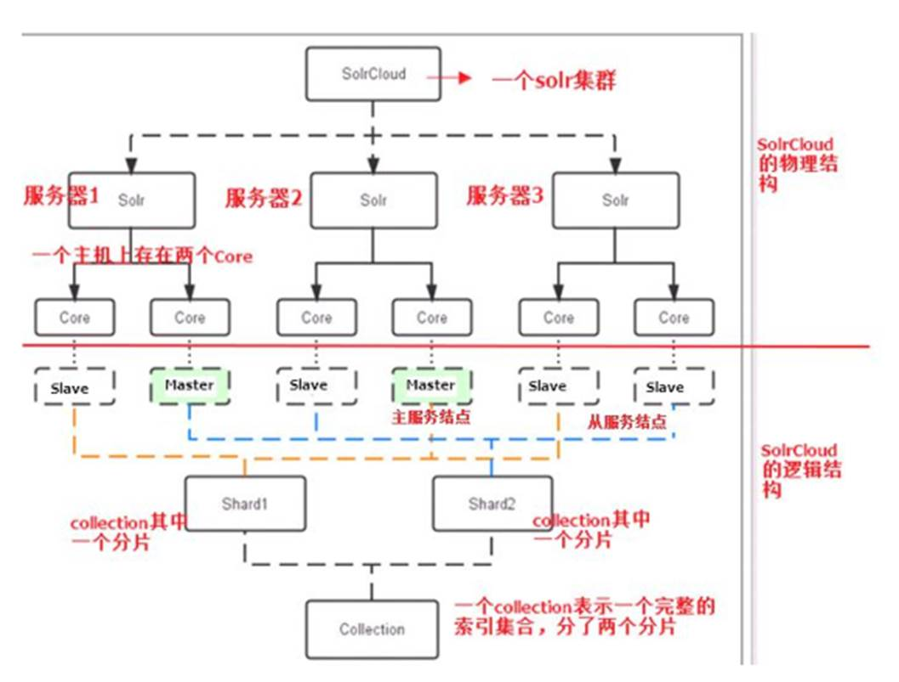

【1】物理结构

三个 Solr 实例（ 每个实例包括两个 Core），组成一个 SolrCloud。

【2】逻辑结构

索引集合包括两个 Shard（shard1 和 shard2），shard1 和 shard2 分别由三个 Core 组成，其中一个 Leader 两个 Replication，Leader 是由 zookeeper 选举产生，zookeeper 控制每个shard上三个 Core 的索引数据一致，解决高可用问题。

用户发起索引请求分别从 shard1 和 shard2 上获取，解决高并发问题。

**（1****）Collection**  

Collection 在 SolrCloud 集群中是一个逻辑意义上的完整的索引结构。它常常被划分为一个或多个 Shard（分片），它们使用相同的配置信息。

比如：针对商品信息搜索可以创建一个 collection。

collection=shard1+shard2+....+shardX

**（2****） Core** 

每个 Core 是 Solr 中一个独立运行单位，提供 索引和搜索服务。一个 shard 需要由一个Core 或多个 Core 组成。由于 collection 由多个 shard 组成所以 collection 一般由多个 core 组成。

**（3****）Master** **或 Slave**

Master 是 master-slave 结构中的主结点（通常说主服务器），Slave 是 master-slave 结构中的从结点（通常说从服务器或备服务器）。同一个 Shard 下 master 和 slave 存储的数据是一致的，这是为了达到高可用目的。

**（4****）Shard**

Collection 的逻辑分片。每个 Shard 被化成一个或者多个 replication，通过选举确定哪个是 Leader。

## 3.2 搭建SolrCloud

### 3.2.1搭建要求

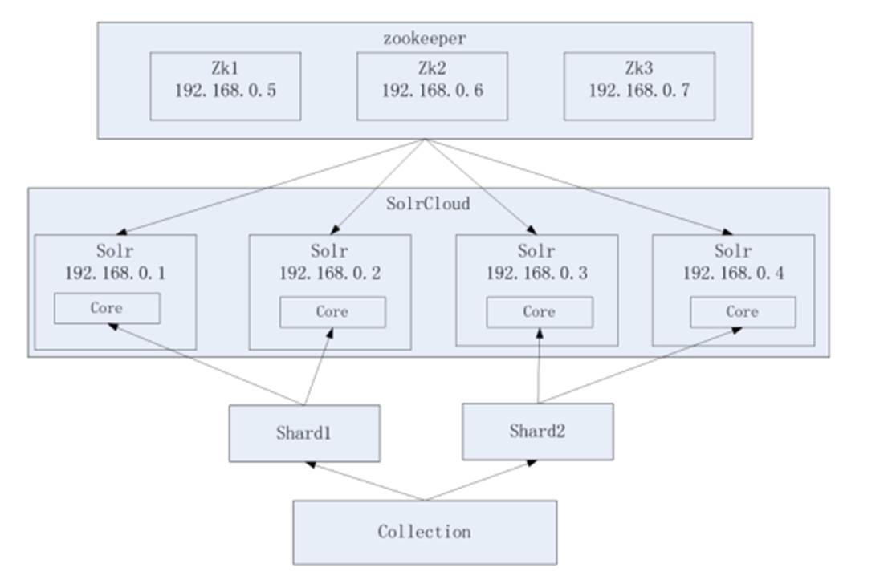

Zookeeper 作为集群的管理工具

1、集群管理：容错、负载均衡。

2、配置文件的集中管理

3、集群的入口

需要实现 zookeeper 高可用，需要搭建zookeeper集群。建议是奇数节点。需要三个 zookeeper 服务器。

搭建 solr 集群需要 7 台服务器（搭建伪分布式，建议虚拟机的内存 1G 以上）：

需要三个 zookeeper 节点

需要四个 tomcat 节点。

### 3.2.2准备工作

**环境准备**

CentOS-6.5-i386-bin-DVD1.iso

jdk-7u72-linux-i586.tar.gz

apache-tomcat-7.0.47.tar.gz

zookeeper-3.4.6.tar.gz

solr-4.10.3.tgz

**步骤：**

（1）搭建Zookeeper集群（我们在上一小节已经完成）

（2）将已经部署完solr 的tomcat的上传到linux

（3）在linux中创建文件夹 /usr/local/solr-cloud  创建4个tomcat实例

   [root@localhost ~]# mkdir /usr/local/solr-cloud   [root@localhost ~]# cp -r tomcat-solr /usr/local/solr-cloud/tomcat-1   [root@localhost ~]# cp -r tomcat-solr   /usr/local/solr-cloud/tomcat-2   [root@localhost ~]# cp -r tomcat-solr   /usr/local/solr-cloud/tomcat-3   [root@localhost ~]# cp -r tomcat-solr   /usr/local/solr-cloud/tomcat-4   

（4）将本地的solrhome上传到linux

（5）在linux中创建文件夹 /usr/local/solrhomes ,将solrhome复制4份

   [root@localhost ~]# mkdir /usr/local/solrhomes   [root@localhost ~]# cp -r solrhome   /usr/local/solrhomes/solrhome-1   [root@localhost ~]# cp -r solrhome   /usr/local/solrhomes/solrhome-2   [root@localhost ~]# cp -r solrhome   /usr/local/solrhomes/solrhome-3   [root@localhost ~]# cp -r solrhome   /usr/local/solrhomes/solrhome-4   

（6）修改每个solr的 web.xml 文件, 关联solrhome

​       <env-entry>            <env-entry-name>solr/home</env-entry-name>          **<env-entry-value>****/usr/local/solrhomes/solrhome-****1****</env-entry-value>**            <env-entry-type>java.lang.String</env-entry-type>       </env-entry>   

（7）修改每个tomcat的原运行端口8085 8080 8009  ，分别为

8185  8180  8109 

8285  8280  8209 

8385  8380  8309 

8485  8480  8409 

   **------**  **知识点小贴士**  **------**   8005端口是用来关闭TOMCAT服务的端口。　　   8080端口，负责建立HTTP连接。在通过浏览器访问Tomcat服务器的Web应用时，使用的就是这个连接器。   8009端口，负责和其他的HTTP服务器建立连接。在把Tomcat与其他HTTP服务器集成时，就需要用到这个连接器。   

 

### 3.2.3配置集群

（1）修改每个 tomcat实例 bin 目录下的 catalina.sh 文件

把此配置添加到catalina.sh中( 第234行 ) ：

   JAVA_OPTS="-DzkHost=192.168.25.140:2181,192.168.25.140:2182,192.168.25.140:2183"   

JAVA_OPTS ,顾名思义,是用来设置JVM相关运行参数的变量 .  此配置用于在tomcat启动时找到 zookeeper集群。

（2）配置 solrCloud 相关的配置。每个 solrhome 下都有一个 solr.xml，把其中的 ip 及端口号配置好（是对应的tomcat的IP和端口）。

solrhomes/solrhome-1/solr.xml

​     <solrcloud>       <str   name="host">192.168.25.140</str>       <int   name="hostPort">8180</int>       <str   name="hostContext">${hostContext:solr}</str>       <int   name="zkClientTimeout">${zkClientTimeout:30000}</int>       <bool   name="genericCoreNodeNames">${genericCoreNodeNames:true}</bool>     </solrcloud>   

solrhomes/solrhome-2/solr.xml

​     <solrcloud>       <str   name="host">192.168.25.140</str>       <int   name="hostPort">8280</int>       <str   name="hostContext">${hostContext:solr}</str>       <int   name="zkClientTimeout">${zkClientTimeout:30000}</int>       <bool   name="genericCoreNodeNames">${genericCoreNodeNames:true}</bool>     </solrcloud>   

solrhomes/solrhome-3/solr.xml

​     <solrcloud>       <str   name="host">192.168.25.140</str>       <int   name="hostPort">8380</int>       <str   name="hostContext">${hostContext:solr}</str>       <int   name="zkClientTimeout">${zkClientTimeout:30000}</int>       <bool   name="genericCoreNodeNames">${genericCoreNodeNames:true}</bool>     </solrcloud>   

solrhomes/solrhome-4/solr.xml

​     <solrcloud>       <str   name="host">192.168.25.140</str>       <int   name="hostPort">8480</int>       <str   name="hostContext">${hostContext:solr}</str>       <int   name="zkClientTimeout">${zkClientTimeout:30000}</int>       <bool   name="genericCoreNodeNames">${genericCoreNodeNames:true}</bool>     </solrcloud>   

（3）让 zookeeper 统一管理配置文件。需要把 solrhome下collection1/conf 目录上传到

zookeeper。上传任意 solrhome 中的配置文件即可。

我们需要使用solr给我们提供的工具上传配置文件：

solr-4.10.3/example/scripts/cloud-scripts/zkcli.sh

将solr-4.10.3压缩包上传到linux，解压，然后进入solr-4.10.3/example/scripts/cloud-scripts目录 ，执行下列命令

   ./zkcli.sh -zkhost   192.168.25.140:2181,192.168.25.140:2182,192.168.25.140:2183 -cmd upconfig   -confdir /usr/local/solrhomes/solrhome-1/collection1/conf   -confname myconf   

参数解释

-zkhost  ：指定zookeeper地址列表

-cmd    ：指定命令。upconfig 为上传配置的命令

-confdir  : 配置文件所在目录

-confname : 配置名称

### 3.2.4启动集群

（1）启动每个 tomcat 实例。要保证 zookeeper 集群是启动状态。

   ----    知识点小贴士 -----   如果你想让某个文件夹下都可以执行，使用以下命令实现   chmod -R 777 solr-cloud   

（2）访问集群

地址栏输入 [http://192.168.25.140:8180/solr](http://192.168.25.134:8180/solr)   ，可以看到Solr集群版的界面

下图表示的是，一个主节点 ，三个从节点。 

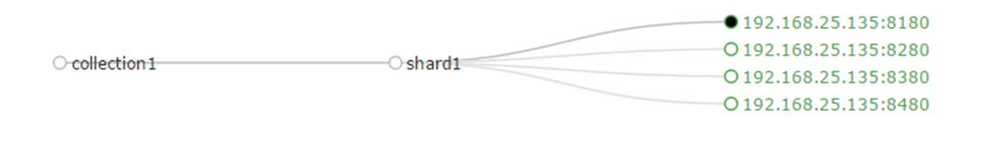

## 3.3 SpringDataSolr连接SolrCloud

在SolrJ中提供一个叫做CloudSolrServer的类，它是SolrServer的子类，用于连接solrCloud 

它的构造参数就是zookeeper的地址列表，另外它要求要指定defaultCollection属性（默认的 collection名称）

我们现在修改springDataSolrDemo工程的配置文件 ，把原来的solr-server注销，替换为CloudSolrServer .指定构造参数为地址列表，设置默认 collection名称

​       <!-- solr服务器地址       <solr:solr-server   id="solrServer" url="http://192.168.25.129:8080/solr"   />        -->        <bean id=*"solrServer"*   class=*"org.apache.solr.client.solrj.impl.CloudSolrServer"*>            <constructor-arg value=*"**192.168.25.140**:2181,**192.168.25.140**:2182,**192.168.25.140**:2183"* />            <property name=*"defaultCollection"*   value=*"collection1"*></property>       </bean>   

## 3.4分片配置

（1）创建新的 Collection 进行分片处理。

在浏览器输入以下地址，可以按照我们的要求  创建新的Collection 

   http://192.168.25.140:8180/solr/admin/collections?action=CREATE&name=*collection**2*&numShards=2&replicationFactor=2   

**参数：**

**name**:将被创建的集合的名字
 **numShard**s:集合创建时需要创建逻辑碎片的个数
 **replicationFactor**:分片的副本数。

看到这个提示表示成功

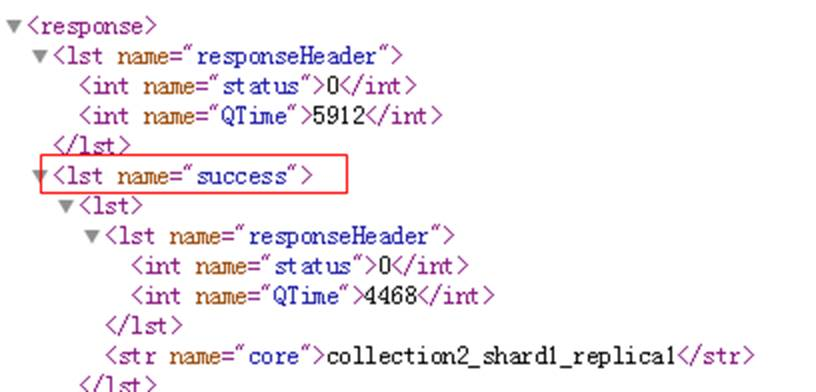

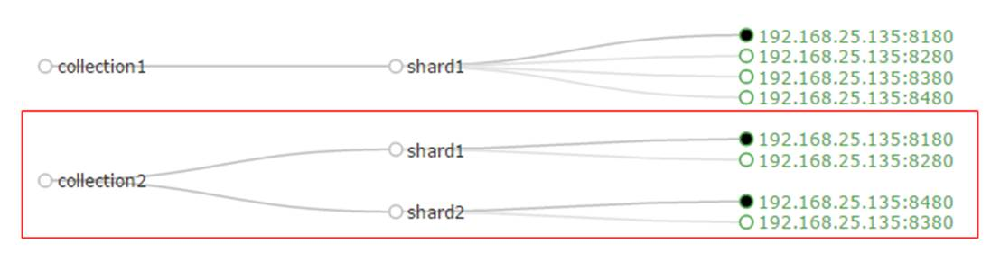

（2）删除不用的 Collection。执行以下命令

   http://192.168.25.140:8480/solr/admin/collections?action=DELETE&name=collection1   

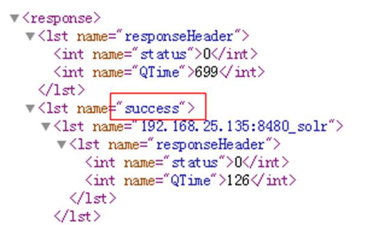

## 3.5模拟集群异常测试

（1）停止第一个tomcat节点，看查询是否能正常工作  -- 能！因为还有从节点

（2）停止第三个tomcat节点，看看查询能够正常工作  -- 不能，因为整个一片数据全没了，无法正常工作。

（3）恢复第三个tomcat节点，看看能否正常工作。恢复时间会比较长，大概2分半到3分钟之间。请耐心等待。

# 4.Redis Cluster

## 4.1 Redis-Cluster简介

### 4.1.1 什么是Redis-Cluster

为何要搭建Redis集群。Redis是在内存中保存数据的，而我们的电脑一般内存都不大，这也就意味着Redis不适合存储大数据，适合存储大数据的是Hadoop生态系统的Hbase或者是MogoDB。Redis更适合处理高并发，一台设备的存储能力是很有限的，但是多台设备协同合作，就可以让内存增大很多倍，这就需要用到集群。

Redis集群搭建的方式有多种，例如使用客户端分片、Twemproxy、Codis等，但从redis 3.0之后版本支持redis-cluster集群，它是Redis官方提出的解决方案，Redis-Cluster采用无中心结构，每个节点保存数据和整个集群状态,每个节点都和其他所有节点连接。其redis-cluster架构图如下：

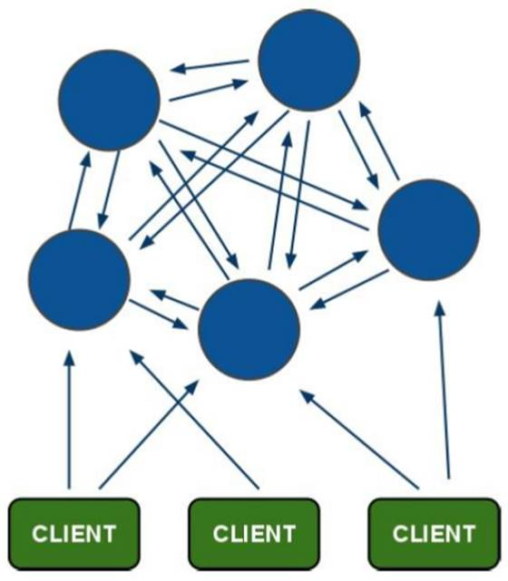

客户端与 redis 节点直连,不需要中间 proxy 层.客户端不需要连接集群所有节点连接集群中任何一个可用节点即可。

所有的 redis 节点彼此互联(PING-PONG 机制),内部使用二进制协议优化传输速度和带宽.

### 4.1.2分布存储机制-槽

（1）redis-cluster 把所有的物理节点映射到[0-16383]slot 上,cluster 负责维护

node<->slot<->value

（2）Redis 集群中内置了 16384 个哈希槽，当需要在 Redis 集群中放置一个 key-value 时，redis 先对 key 使用 crc16 算法算出一个结果，然后把结果对 16384 求余数，这样每个key 都会对应一个编号在 0-16383 之间的哈希槽，redis 会根据节点数量大致均等的将哈希槽映射到不同的节点。

​    例如三个节点：槽分布的值如下：

SERVER1:  0-5460

SERVER2:  5461-10922

SERVER3:  10923-16383

 

### 4.1.3容错机制-投票

（1）选举过程是集群中所有master参与,如果半数以上master节点与故障节点通信超过(cluster-node-timeout),认为该节点故障，自动触发故障转移操作.  故障节点对应的从节点自动升级为主节点

（2）什么时候整个集群不可用(cluster_state:fail)? 

如果集群任意master挂掉,且当前master没有slave.集群进入fail状态,也可以理解成集群的slot映射[0-16383]不完成时进入fail状态. 

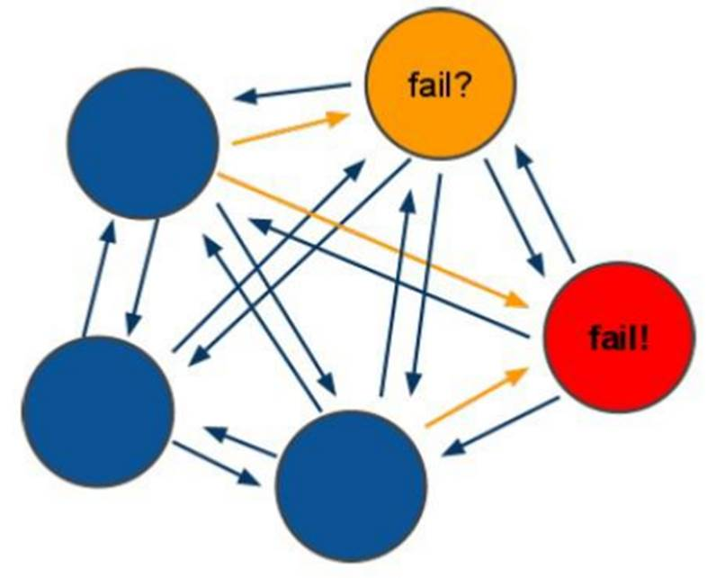

## 4.2搭建Redis-Cluster

### 4.2.1搭建要求

需要 6 台 redis 服务器。搭建伪集群。

需要 6 个 redis 实例。

需要运行在不同的端口 7001-7006

### 4.2.2准备工作

（1）安装gcc 【此步省略】

Redis 是 c 语言开发的。安装 redis 需要 c 语言的编译环境。如果没有 gcc 需要在线安装。

   yum install gcc-c++   

（2）使用yum命令安装 ruby  （我们需要使用ruby脚本来实现集群搭建）【此步省略】

   yum install ruby   yum install rubygems   

 

   **-----** **知识点小贴士** **-----**   Ruby，一种简单快捷的[面向对象](https://baike.baidu.com/item/%E9%9D%A2%E5%90%91%E5%AF%B9%E8%B1%A1)（[面向对象程序设计](https://baike.baidu.com/item/%E9%9D%A2%E5%90%91%E5%AF%B9%E8%B1%A1%E7%A8%8B%E5%BA%8F%E8%AE%BE%E8%AE%A1)）[脚本语言](https://baike.baidu.com/item/%E8%84%9A%E6%9C%AC%E8%AF%AD%E8%A8%80)，在20世纪90年代由日本人松本行弘([Yukihiro   Matsumoto](https://baike.baidu.com/item/Yukihiro%20Matsumoto))开发，遵守[GPL](https://baike.baidu.com/item/GPL)协议和Ruby License。它的灵感与特性来自于 [Perl](https://baike.baidu.com/item/Perl)、[Smalltalk](https://baike.baidu.com/item/Smalltalk)、[Eiffel](https://baike.baidu.com/item/Eiffel)、[Ada](https://baike.baidu.com/item/Ada/5606819)以及 [Lisp](https://baike.baidu.com/item/Lisp/22083) 语言。由 Ruby 语言本身还发展出了JRuby（[Java平台](https://baike.baidu.com/item/Java%E5%B9%B3%E5%8F%B0)）、IronRuby（[.NET](https://baike.baidu.com/item/.NET)平台）等其他平台的 Ruby 语言[替代品](https://baike.baidu.com/item/%E6%9B%BF%E4%BB%A3%E5%93%81)。Ruby的作者于1993年2月24日开始编写Ruby，直至1995年12月才正式[公开发布](https://baike.baidu.com/item/%E5%85%AC%E5%BC%80%E5%8F%91%E5%B8%83)于fj（[新闻组](https://baike.baidu.com/item/%E6%96%B0%E9%97%BB%E7%BB%84)）。因为Perl发音与6月诞生石pearl（[珍珠](https://baike.baidu.com/item/%E7%8F%8D%E7%8F%A0/33579)）相同，因此Ruby以7月诞生石ruby（[红宝石](https://baike.baidu.com/item/%E7%BA%A2%E5%AE%9D%E7%9F%B3/24242)）命名   *RubyGems*简称gems，是一个用于对 Ruby组件进行打包的 Ruby 打包系统   

（3）将redis源码包上传到 linux 系统  ，解压redis源码包

（4）编译redis源码  ，进入redis源码文件夹

   make   

看到以下输出结果，表示编译成功

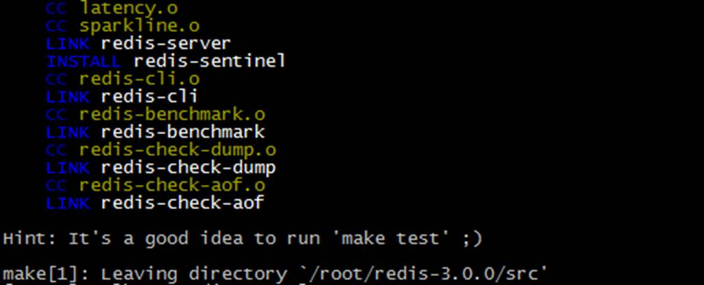

（5）创建目录/usr/local/redis-cluster目录，  安装6个redis实例，分别安装在以下目录

/usr/local/redis-cluster/redis-1

/usr/local/redis-cluster/redis-2

/usr/local/redis-cluster/redis-3

/usr/local/redis-cluster/redis-4

/usr/local/redis-cluster/redis-5

/usr/local/redis-cluster/redis-6

以第一个redis实例为例，命令如下

   make install PREFIX=/usr/local/redis-cluster/redis-1   

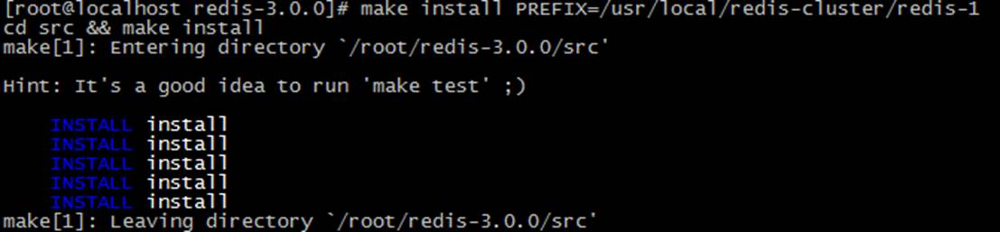

出现此提示表示成功，按此方法安装其余5个redis实例

（6）复制配置文件  将 /redis-3.0.0/redis.conf 复制到redis下的bin目录下

   [root@localhost   redis-3.0.0]# cp redis.conf /usr/local/redis-cluster/redis-1/bin   [root@localhost   redis-3.0.0]# cp redis.conf /usr/local/redis-cluster/redis-2/bin   [root@localhost   redis-3.0.0]# cp redis.conf /usr/local/redis-cluster/redis-3/bin   [root@localhost   redis-3.0.0]# cp redis.conf /usr/local/redis-cluster/redis-4/bin   [root@localhost   redis-3.0.0]# cp redis.conf /usr/local/redis-cluster/redis-5/bin   [root@localhost   redis-3.0.0]# cp redis.conf /usr/local/redis-cluster/redis-6/bin   

 

### 3.2.3配置集群

（1）修改每个redis节点的配置文件redis.conf

修改运行端口为7001 （7002 7003 .....）

将cluster-enabled yes 前的注释去掉(632行)

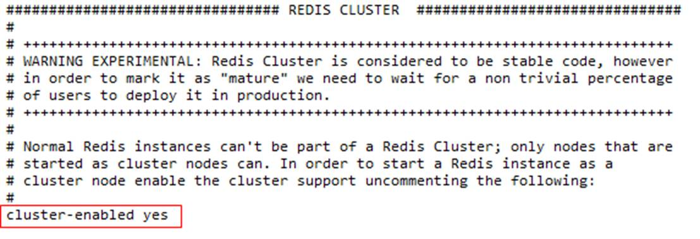

（2）启动每个redis实例

以第一个实例为例，命令如下

   cd /usr/local/redis-cluster/redis-1/bin/   ./redis-server redis.conf   

 

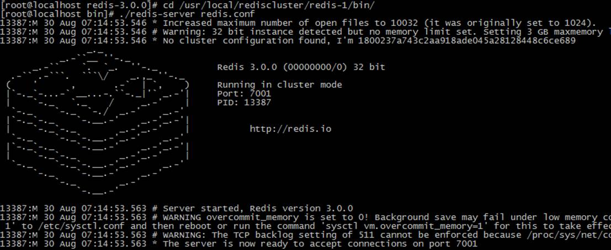

把其余的5个也启动起来，然后查看一下是不是都启动起来了

   [root@localhost ~]# ps   -ef | grep redis   root     15776 15775  0 08:19 pts/1    00:00:00 ./redis-server *:7001 [cluster]   root     15810 15784  0 08:22 pts/2    00:00:00 ./redis-server *:7002 [cluster]   root     15831 15813  0 08:23 pts/3    00:00:00 ./redis-server *:7003 [cluster]   root     15852 15834  0 08:23 pts/4    00:00:00 ./redis-server *:7004 [cluster]   root     15872 15856  0 08:24 pts/5    00:00:00 ./redis-server *:7005 [cluster]   root     15891 15875  0 08:24 pts/6    00:00:00 ./redis-server *:7006 [cluster]   root     15926 15895  0 08:24 pts/7    00:00:00 grep redis   

 

（3）上传redis-3.0.0.gem ，安装 ruby用于搭建redis集群的脚本。

   [root@localhost   ~]# gem install redis-3.0.0.gem   Successfully   installed redis-3.0.0   1 gem   installed   Installing ri   documentation for redis-3.0.0...   Installing   RDoc documentation for redis-3.0.0...   

（4）使用 ruby 脚本搭建集群。

进入redis源码目录中的src目录  执行下面的命令

   ./redis-trib.rb create --replicas 1 192.168.25.140:7001 192.168.25.140:7002   192.168.25.140:7003   192.168.25.140:7004 192.168.25.140:7005   192.168.25.140:7006   

出现下列提示信息

   >>>   Creating cluster   Connecting   to node 192.168.25.140:7001: OK   Connecting   to node 192.168.25.140:7002: OK   Connecting   to node 192.168.25.140:7003: OK   Connecting   to node 192.168.25.140:7004: OK   Connecting   to node 192.168.25.140:7005: OK   Connecting   to node 192.168.25.140:7006: OK   >>>   Performing hash slots allocation on 6 nodes...   Using   3 masters:   192.168.25.140:7001   192.168.25.140:7002   192.168.25.140:7003   Adding   replica 192.168.25.140:7004 to 192.168.25.140:7001   Adding   replica 192.168.25.140:7005 to 192.168.25.140:7002   Adding   replica 192.168.25.140:7006 to 192.168.25.140:7003   M:   1800237a743c2aa918ade045a28128448c6ce689 192.168.25.140:7001      slots:0-5460 (5461 slots) master   M:   7cb3f7d5c60bfbd3ab28800f8fd3bf6de005bf0d 192.168.25.140:7002      slots:5461-10922 (5462 slots) master   M:   436e88ec323a2f8bb08bf09f7df07cc7909fcf81 192.168.25.140:7003      slots:10923-16383 (5461 slots) master   S:   c2a39a94b5f41532cd83bf6643e98fc277c2f441 192.168.25.140:7004      replicates   1800237a743c2aa918ade045a28128448c6ce689   S:   b0e38d80273515c84b1a01820d8ecee04547d776 192.168.25.140:7005      replicates 7cb3f7d5c60bfbd3ab28800f8fd3bf6de005bf0d   S:   03bf6bd7e3e6eece5a02043224497c2c8e185132 192.168.25.140:7006      replicates   436e88ec323a2f8bb08bf09f7df07cc7909fcf81   Can   I set the above configuration? (type 'yes' to accept): yes   >>>   Nodes configuration updated   >>>   Assign a different config epoch to each node   >>>   Sending CLUSTER MEET messages to join the cluster   Waiting   for the cluster to join....   >>>   Performing Cluster Check (using node 192.168.25.140:7001)   M:   1800237a743c2aa918ade045a28128448c6ce689 192.168.25.140:7001      slots:0-5460 (5461 slots) master   M:   7cb3f7d5c60bfbd3ab28800f8fd3bf6de005bf0d 192.168.25.140:7002      slots:5461-10922 (5462 slots) master   M:   436e88ec323a2f8bb08bf09f7df07cc7909fcf81 192.168.25.140:7003      slots:10923-16383 (5461 slots) master   M:   c2a39a94b5f41532cd83bf6643e98fc277c2f441 192.168.25.140:7004      slots: (0 slots) master      replicates   1800237a743c2aa918ade045a28128448c6ce689   M:   b0e38d80273515c84b1a01820d8ecee04547d776 192.168.25.140:7005      slots: (0 slots) master      replicates   7cb3f7d5c60bfbd3ab28800f8fd3bf6de005bf0d   M:   03bf6bd7e3e6eece5a02043224497c2c8e185132 192.168.25.140:7006      slots: (0 slots) master      replicates   436e88ec323a2f8bb08bf09f7df07cc7909fcf81   [OK]   All nodes agree about slots configuration.   >>>   Check for open slots...   >>>   Check slots coverage...   [OK]   All 16384 slots covered.   

 

## 4.3连接Redis-Cluster

### 4.3.1客户端工具连接

Redis-cli 连接集群：

   redis-cli -p 主机ip -p 端口（集群中任意端口） -c   

-c：代表连接的是 redis 集群

测试值的存取:

（1）从本地连接到集群redis  使用7001端口 加 -c 参数

（2）存入name值为abc ，系统提示此值被存入到了7002端口所在的redis （槽是5798）

（3）提取name的值，可以提取。

（4）退出（quit）

（5）再次以7001端口进入 ，不带-c

（6）查询name值，无法获取，因为值在7002端口的redis上

（7）我们以7002端口进入，获取name值发现是可以获取的,而以其它端口进入均不能获取

 

### 4.3.2 SpringDataRedis连接Redis集群

修改品优购工程  在pinyougou-common工程添加spring 配置文件 

applicationContext-redis-cluster.xml

   <?xml version=*"1.0"*   encoding=*"UTF-8"*?>    <beans xmlns=*"http://www.springframework.org/schema/beans"*      xmlns:xsi=*"http://www.w3.org/2001/XMLSchema-instance"* xmlns:p=*"http://www.springframework.org/schema/p"*      xmlns:context=*"http://www.springframework.org/schema/context"*      xsi:schemaLocation=*"http://www.springframework.org/schema/beans*                    *http://www.springframework.org/schema/beans/spring-beans.xsd*                  *http://www.springframework.org/schema/context*                    *http://www.springframework.org/schema/context/spring-context.xsd"*>         <!-- 加载配置属性文件 -->     <context:property-placeholder ignore-unresolvable=*"true"*   location=*"classpath:properties/redis-cluster-config.properties"*   />     <bean id=*"**redis-cluster**Configuration"* class=*"org.springframework.data.redis.connection.**redis-cluster**Configuration"*>         <property name=*"maxRedirects"*   value=*"${redis.maxRedirects}"*></property>         <property name=*"clusterNodes"*>         <set>              <bean class=*"org.springframework.data.redis.connection.**redis-cluster**Node"*>                  <constructor-arg name=*"host"* value=*"${redis.host1}"*></constructor-arg>                  <constructor-arg name=*"port"* value=*"${redis.port1}"*></constructor-arg>              </bean>              <bean class=*"org.springframework.data.redis.connection.**redis-cluster**Node"*>                  <constructor-arg name=*"host"* value=*"${redis.host2}"*></constructor-arg>                  <constructor-arg name=*"port"* value=*"${redis.port2}"*></constructor-arg>              </bean>              <bean class=*"org.springframework.data.redis.connection.**redis-cluster**Node"*>                  <constructor-arg name=*"host"* value=*"${redis.host3}"*></constructor-arg>                  <constructor-arg name=*"port"* value=*"${redis.port3}"*></constructor-arg>              </bean>              <bean class=*"org.springframework.data.redis.connection.**redis-cluster**Node"*>                  <constructor-arg name=*"host"* value=*"${redis.host4}"*></constructor-arg>                  <constructor-arg name=*"port"* value=*"${redis.port4}"*></constructor-arg>               </bean>               <bean class=*"org.springframework.data.redis.connection.**redis-cluster**Node"*>                  <constructor-arg name=*"host"* value=*"${redis.host5}"*></constructor-arg>                  <constructor-arg name=*"port"* value=*"${redis.port5}"*></constructor-arg>               </bean>               <bean class=*"org.springframework.data.redis.connection.**redis-cluster**Node"*>                  <constructor-arg name=*"host"* value=*"${redis.host6}"*></constructor-arg>                  <constructor-arg name=*"port"* value=*"${redis.port6}"*></constructor-arg>               </bean>            </set>          </property>     </bean>     <bean id=*"jedisPoolConfig"*   class=*"redis.clients.jedis.JedisPoolConfig"*>            <property name=*"maxIdle"* value=*"${redis.maxIdle}"*   />             <property name=*"maxTotal"* value=*"${redis.maxTotal}"*   />      </bean>     <bean id=*"jeidsConnectionFactory"*   class=*"org.springframework.data.redis.connection.jedis.JedisConnectionFactory"*  >              <constructor-arg ref=*"**redis-cluster**Configuration"* />              <constructor-arg ref=*"jedisPoolConfig"*   />     </bean>       <bean id=*"redisTemplate"*   class=*"org.springframework.data.redis.core.RedisTemplate"*>              <property name=*"connectionFactory"*   ref=*"jeidsConnectionFactory"*   />     </bean>     </beans>   

添加属性文件redis-cluster-config.properties

   #cluster configuration   redis.host1=192.168.25.140   redis.port1=7001       redis.host2=192.168.25.140   redis.port2=7002       redis.host3=192.168.25.140   redis.port3=7003       redis.host4=192.168.25.140   redis.port4=7004       redis.host5=192.168.25.140   redis.port5=7005       redis.host6=192.168.25.140   redis.port6=7006       redis.maxRedirects=3   redis.maxIdle=100   redis.maxTotal=600   

## 4.4模拟集群异常测试

关闭节点命令

   ./redis-cli -p 端口 shutdown    

（1）测试关闭7001 和7004, 看看会发生什么。

（2）测试关闭7001、7002、7003 会发生什么。